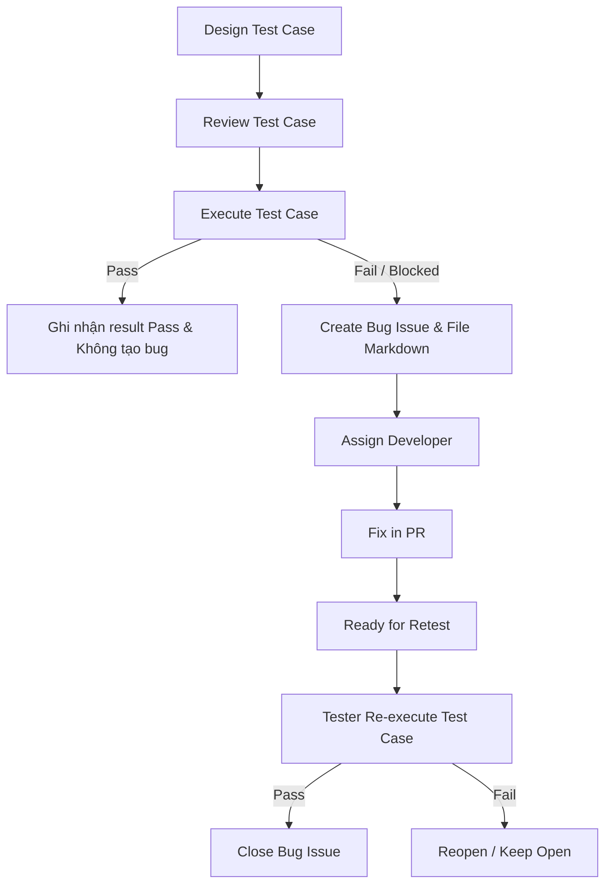

# Kỹ năng Kiểm thử Miền & Giá trị Biên (Domain & Boundary Testing Skill) cho EShop

Kỹ năng này hướng dẫn Agent cách thực hiện quy trình kiểm thử toàn diện cho hệ thống EShop theo phương pháp Phân vùng tương đương (EP) và Phân tích giá trị biên (BVA). Đồng thời tích hợp đầy đủ các quy định về quản lý test case, test run, bug report, ma trận truy vết (traceability matrix), quy trình Git/GitHub và báo cáo AI Audit theo tài liệu môn học.

---

## 1. Quy trình Áp dụng Kỹ thuật Kiểm thử

Khi nhận được yêu cầu thiết kế test case cho một FR cụ thể, Agent phải tuân thủ nghiêm ngặt quy trình 4 bước sau:

### Bước 1: Xác định các Tham số đầu vào & Trạng thái (Inputs & States)
* Xác định tất cả các trường dữ liệu người dùng nhập (ví dụ: Email, Mật khẩu, Số lượng, Mã giảm giá).
* Xác định các trạng thái hệ thống cần thiết (ví dụ: Người dùng đã đăng nhập/chưa đăng nhập, giỏ hàng trống/có sản phẩm, trạng thái đơn hàng hiện tại).

### Bước 2: Phân tích Phân vùng tương đương (Equivalence Partitioning - EP)
* Phân chia mỗi tham số đầu vào hoặc điều kiện thành các phân vùng tương đương:
  * **Phân vùng hợp lệ (Valid Partitions):** Các giá trị được hệ thống chấp nhận và xử lý bình thường.
  * **Phân vùng không hợp lệ (Invalid Partitions):** Các giá trị bị hệ thống từ chối hoặc báo lỗi.
* Lập bảng phân vùng tương đương để tiện theo dõi.

### Bước 3: Phân tích Giá trị biên (Boundary Value Analysis - BVA)
* Đối với các tham số có tính chất số học, độ dài chuỗi, hoặc giới hạn số lượng, xác định các giá trị biên:
  * **Biên dưới (Min):** Giá trị nhỏ nhất hợp lệ.
  * **Ngay dưới biên dưới (Min - 1):** Giá trị không hợp lệ.
  * **Ngay trên biên dưới (Min + 1):** Giá trị hợp lệ.
  * **Biên trên (Max):** Giá trị lớn nhất hợp lệ.
  * **Ngay dưới biên trên (Max - 1):** Giá trị hợp lệ.
  * **Ngay trên biên trên (Max + 1):** Giá trị không hợp lệ.
  * **Giá trị danh nghĩa (Nominal):** Một giá trị bình thường nằm giữa khoảng Min và Max.

### Bước 4: Thiết kế Test Cases & Ghi nhận
* Ghép các phân vùng và giá trị biên để tạo thành danh sách test case.
* Đảm bảo bao phủ tối thiểu:
  * Tất cả các phân vùng hợp lệ ít nhất một lần.
  * Mỗi phân vùng không hợp lệ được kiểm thử bằng một test case riêng biệt (để tránh lỗi này che lấp lỗi khác).
  * Tất cả các giá trị biên đã xác định.

---

## 2. Quy tắc Kiểm soát Phiên bản & Nhánh Git (Git Branching & Commit Rules)

* **Không sửa test case trực tiếp trên nhánh `main`:** Tất cả các hoạt động thêm mới hoặc cập nhật test case đều phải được thực hiện trên một nhánh riêng biệt được tạo từ `main`.
* **Quy trình Pull Request:** Sau khi hoàn thành việc thiết kế hoặc thực thi test case trên nhánh phụ, phải mở một Pull Request (PR) để review và thảo luận trước khi merge vào nhánh `main`.
* **Tạo Git Commit cho mỗi bước kiểm thử:** Người thực hiện cần tạo một git commit mới cho mỗi bước kiểm thử của từng tính năng để đảm bảo tính minh bạch và lịch sử rõ ràng (ví dụ: commit thiết kế test case, commit kết quả chạy test run, commit cập nhật traceability matrix).

---

## 3. Quy ước Đặt mã và Cấu trúc Thư mục Lưu trữ

Hệ thống thư mục và mã số phải được tổ chức nhất quán để phục vụ việc kiểm tra, chấm điểm và traceability:

### Cấu trúc Thư mục trong Repository:
```text
project-root/
├── tests/
│   ├── test-cases/             # Chứa tài liệu thiết kế test case chính thức
│   │   ├── login/
│   │   │   ├── TC-LOGIN-001.md
│   │   │   └── TC-LOGIN-002.md
│   │   ├── register/
│   │   └── [tên-module]/
│   ├── test-runs/              # Chứa kết quả chạy test theo sprint hoặc regression
│   │   ├── sprint-1-test-run.md
│   │   └── sprint-2-regression.md
│   ├── test-summary/           # Báo cáo tổng hợp và ma trận truy vết
│   │   └── traceability-matrix.md
│   └── bug/                    # Lưu trữ các file báo cáo lỗi chi tiết dưới dạng Markdown
│       ├── login/
│       │   ├── BUG-FR02-A-01.md
│       │   └── BUG-FR02-A-02.md
│       └── [tên-feature]/
```

### Quy ước Đặt mã Test Case:
* **Định dạng:** `TC-[MODULE]-[NUMBER]` (với số thứ tự gồm 3 chữ số).
* **Ví dụ:** `TC-LOGIN-001`, `TC-REGISTER-005`, `TC-CART-003`, `TC-CHECKOUT-010`.
* *Lưu ý:* Tránh đặt tên chung chung như `test1`, `check-login`, `case-a`.

### Quy ước Đặt mã và Tên file Bug:
* **Định dạng:** `BUG-[Mã FR]-[Ký tự Pool]-[Số thứ tự]` (không chứa khoảng trắng).
* **Ký tự Pool:** Được tra cứu từ phân nhóm tính năng trong `Requirements.pdf`:
  * **Pool A** (FR-01 đến FR-06): Ký tự Pool là `A`.
  * **Pool B** (FR-07 đến FR-11): Ký tự Pool là `B`.
  * **Pool C** (FR-12 đến FR-19): Ký tự Pool là `C`.
  * **Pool D** (FR-20): Ký tự Pool là `D`.
* **Ví dụ:** `BUG-FR02-A-01.md` (lỗi thuộc FR-02 thuộc Pool A, lỗi thứ 1).

---

## 4. Các Template Tài liệu Kiểm thử chuẩn Markdown

### 4.1. Template Test Case File (`tests/test-cases/[module]/TC-[MODULE]-[NUMBER].md`)

```markdown
# TC-[MODULE]-[NUMBER]: [Tiêu đề ngắn gọn mô tả mục đích test]

## Requirement ID
[Mã FR liên quan, ví dụ: FR-02]

## Module / Test type / Technique
[Tên Module] / [Loại kiểm thử, vd: Functional] / [Kỹ thuật áp dụng, vd: Equivalence Partitioning hoặc Boundary Value Analysis]

## Preconditions
- [Điều kiện tiền quyết 1]
- [Điều kiện tiền quyết 2]

## Test data
| Tham số | Giá trị thử nghiệm |
| :--- | :--- |
| [Tên tham số 1] | [Giá trị] |
| [Tên tham số 2] | [Giá trị] |

## Test steps
1. [Bước thực hiện 1]
2. [Bước thực hiện 2]
3. [Bước thực hiện 3]

## Expected result
- [Kết quả mong đợi 1]
- [Kết quả mong đợi 2]

## Status / Related bugs
Not Run / None
```

### 4.2. Template Test Run File (`tests/test-runs/[tên-run].md`)

Dùng để ghi nhận bằng chứng và kết quả thực thi các test case trong một lượt chạy (sprint hoặc regression):

```markdown
# Test Run: [Tên Sprint/Lượt Chạy, Ví dụ: Sprint 1]

- **Tester:** [Tên người thực hiện, ví dụ: Nguyễn Văn A]
- **Ngày thực hiện:** [YYYY-MM-DD]
- **Môi trường:** [Ví dụ: Chrome v125, Localhost, Commit hash abc1234]

## Bảng kết quả thực thi (Test Run Table)

| Test Case ID | Module | Tester | Result | Related Bug | Note |
| :--- | :--- | :--- | :--- | :--- | :--- |
| TC-LOGIN-001 | Login | An | Pass | | |
| TC-LOGIN-002 | Login | Bình | Fail | #18 | Không validate password |
| TC-REG-001 | Register | Chi | Blocked | #19 | Không mở được form đăng ký |
| TC-CART-003 | Cart | Dũng | Pass | | |

*Lưu ý về Trạng thái Test Run:*
* Giá trị tại cột **Result** phải là một trong các trạng thái: `Pass`, `Fail`, `Blocked`, `Not Run`.
* Khi kết quả là `Fail` hoặc `Blocked`, bắt buộc phải điền thông tin lỗi tại cột **Related Bug** (ví dụ: `#18` liên kết GitHub Issue) hoặc lý do cụ thể tại cột **Note**.
```

### 4.3. Quy trình Tự động Đẩy Lỗi lên GitHub & Template Bug Report (`tests/bug/[feature]/BUG-[Mã FR]-[Pool]-[STT].md`)

Khi một test case bị `Fail` hoặc `Blocked`, Agent bắt buộc phải **tự động tạo báo cáo lỗi dưới dạng file Markdown trong repository** và **tự động đẩy báo cáo này lên GitHub Issues** bằng công cụ GitHub CLI (`gh`).

#### A. Yêu cầu về Ảnh chụp Màn hình Minh chứng (Evidence Screenshots)
Báo cáo lỗi bắt buộc phải đính kèm ít nhất một ảnh chụp màn hình chứng minh lỗi thực tế:
1. **Đối với Kiểm thử Tự động (Selenium/Playwright/Cypress):** Thiết lập cấu hình test runner hoặc viết khối lệnh `try/catch` để tự động chụp ảnh màn hình khi test case thất bại. Ảnh phải được lưu vào thư mục `tests/bug/evidence/[Mã Bug]_screenshot.png` (Ví dụ: `tests/bug/evidence/BUG-FR02-A-01_screenshot.png`).
2. **Đối với Kiểm thử Thủ công:** Agent yêu cầu người dùng cung cấp ảnh chụp màn hình hoặc sử dụng các công cụ chụp ảnh màn hình tự động nếu có quyền truy cập trình duyệt, lưu vào thư mục `tests/bug/evidence/` và nhúng link ảnh tương ứng vào tệp Markdown báo cáo lỗi.

#### B. Câu lệnh Tự động Tạo GitHub Issue bằng CLI
Sau khi tạo file Markdown báo cáo lỗi, Agent chạy lệnh sau để tự động tạo Issue trên GitHub:
```powershell
gh issue create --title "[BUG][[Tên Module]] [Tóm tắt ngắn gọn lỗi]" --body-file "tests/bug/[feature]/BUG-[Mã FR]-[Ký tự Pool]-[Số thứ tự].md" --label "type: bug,module: [tên-module],severity: [mức-độ],priority: [độ-ưu-tiên],status: new,found-by: test-case"
```
*Sau khi lệnh thành công, Agent cần trích xuất mã Issue (ví dụ: `#18`) từ kết quả trả về của GitHub CLI để cập nhật vào cột `Related Bug` trong file test run và file test case tương ứng.*

#### C. Nội dung tệp Bug Report mẫu (Markdown & Issue body):

```markdown
# BUG-FR[XX]-[POOL]-[STT]: [Tóm tắt ngắn gọn lỗi]

## Found by Test Case
[Mã Test Case phát hiện ra lỗi này, ví dụ: TC-LOGIN-002]

## Requirement liên quan
[Mã FR bị lỗi, ví dụ: FR-02 Đăng nhập & Khóa tài khoản]

## Severity / Priority
[Mức độ nghiêm trọng: Critical / Major / Minor] / [Độ ưu tiên: P0 / P1 / P2]

## Environment
- **Browser/OS:** Chrome v125 / Windows 11
- **URL:** http://localhost:3000/login
- **Build/Commit:** [Commit hash của phiên bản bị lỗi]

## Steps to reproduce
1. Truy cập vào trang...
2. Điền thông tin...
3. Bấm vào nút...

## Expected result
[Mô tả kết quả mong đợi đúng theo đặc tả yêu cầu]

## Actual result
[Mô tả hành vi thực tế bị lỗi của hệ thống]

## Evidence
- **Ảnh chụp màn hình (Bắt buộc):** 
- **Video/Console log (Nếu có):** [Đường dẫn đến file đính kèm nếu có]

---
*Thông tin hành chính:*
- **Date:** [YYYY-MM-DD]
- **Reporter:** AI Tester (Antigravity)
- **Status:** New
```

#### D. Các Labels bắt buộc phải gán cho Bug Issue trên GitHub:
* **Type:** `type: bug`
* **Module:** `module: [tên-module]` (ví dụ: `module: login`, `module: register`, `module: cart`)
* **Technique:** `technique: EP` hoặc `technique: BVA`
* **Result/Status:** `status: new`
* **Priority/Severity:** `severity: major` hoặc `severity: critical`, `priority: P1`
* **Found-by:** `found-by: test-case`

### 4.4. Template Ma trận Truy vết (`tests/test-summary/traceability-matrix.md`)

Bảng này giúp quản lý tính toàn vẹn, chứng minh độ bao phủ kiểm thử (coverage) và không bỏ sót yêu cầu:

```markdown
# Ma trận Truy vết Yêu cầu - Kiểm thử - Lỗi (Traceability Matrix)

| Requirement | Test Case | Result | Bug Issue | Status |
| :--- | :--- | :--- | :--- | :--- |
| FR-01 Đăng ký | TC-REGISTER-001 | Pass | | Done |
| FR-02 Đăng nhập | TC-LOGIN-001 | Pass | | Done |
| FR-02 Đăng nhập | TC-LOGIN-002 | Fail | #18 | Ready for Retest |
| FR-02 Đăng nhập | TC-LOGIN-003 | Fail | BUG-FR02-A-02 | Open |
| FR-07 Giỏ hàng | TC-CART-001 | Blocked | #27 | Blocked |
```

---

## 5. Quy trình Quản lý Vòng đời Lỗi (Bug Lifecycle & Workflow)

Khi quản lý lỗi trên GitHub và Repository, Agent và Tester phải thực hiện theo đúng workflow chuẩn sau:



### Checkpoint bắt buộc trước khi Đóng Bug (Close Issue):
Một lỗi chỉ được phép đóng (Close) trên GitHub khi thỏa mãn cả 4 điều kiện sau:
1. **Pull Request (PR) sửa lỗi đã được merge** thành công vào nhánh chính (`main`).
2. **Tester đã thực hiện Retest** trên phiên bản mới và xác nhận kết quả là **Pass**.
3. **Có comment ghi nhận kết quả retest** cụ thể bên trong Bug Issue (đính kèm bằng chứng nếu cần).
4. **Không phát sinh lỗi regression nghiêm trọng** ảnh hưởng đến các chức năng liên quan khác.

### Quy tắc xử lý khi Kiểm thử Tự động (GitHub Actions) Thất bại:
1. Kiểm tra log và test report bên trong GitHub Actions để xác định nguyên nhân.
2. Phân tích xem test case nào hoặc đoạn script kiểm thử nào bị lỗi.
3. Nếu lỗi do hệ thống (SUT) chứ không phải do code kiểm thử, hãy tạo một Bug Issue mới.
4. Ghi rõ nguồn gốc phát hiện trong Bug Issue: `Found by: GitHub Actions + workflow run + [mã test case/test script]`.
5. Pull Request sửa lỗi phải vượt qua toàn bộ workflow kiểm thử tự động (pass CI) trước khi thực hiện đóng Bug.

---

## 6. Hướng dẫn Tương tác & Tạo báo cáo AI Audit Report + AI Critique

### 6.1. Hướng dẫn Tương tác cho Agent (Prompt Guidelines)
1. **Hỏi thông tin:** Khi bắt đầu kiểm thử một module, hãy yêu cầu người dùng cung cấp tài liệu đặc tả, danh sách FR, hoặc các thông tin thiết kế cần thiết.
2. **Lập bảng phân tích EP & BVA:** Đưa ra các bảng phân tích phân vùng tương đương và giá trị biên, sau đó yêu cầu người dùng xác nhận các khoảng dữ liệu trước khi sinh test case.
3. **Tạo file tự động:** Sau khi người dùng đồng ý, tự động sinh các file test case Markdown lưu vào đúng thư mục cấu trúc quy định.
4. **Cập nhật báo cáo liên tục:** Đảm bảo cập nhật đồng bộ các file `test-run.md` và `traceability-matrix.md`.
5. **Tự động đăng ký lỗi (Bắt buộc):** Khi phát hiện lỗi trong quá trình chạy test (kết quả `Fail` hoặc `Blocked`), Agent phải:
   - Tự động chụp/thu thập ảnh chụp màn hình minh chứng lỗi (lưu vào `tests/bug/evidence/[Mã Bug]_screenshot.png`).
   - Tự động tạo tệp Markdown báo cáo lỗi theo chuẩn.
   - Tự động chạy lệnh `gh issue create` để đẩy lỗi lên GitHub Issues, nhận về mã issue và cập nhật ngược lại vào các báo cáo và ma trận.

### 6.2. Nhật ký Tương tác AI (AI Audit Report - Bắt buộc)
Để tự động hóa và đơn giản hóa việc chuẩn bị báo cáo AI Audit Report làm phụ lục bắt buộc khi nộp bài, Agent phải **tự động khởi tạo và cập nhật tệp `tests/test-summary/ai-audit-report.md`** sau mỗi lượt làm việc chính với người dùng.

#### Cấu trúc tệp AI Audit Report mẫu:
```markdown
# Phụ lục: Báo cáo tương tác AI (AI Audit Report)

I use AI tools for the following tasks.

## Chi tiết các lượt tương tác (Interactions)

### Lượt tương tác [STT]
- **Tên công cụ AI:** [Tên mô hình/AI Tool, ví dụ: Gemini 3.5 Flash (High)]
- **Thời gian thực hiện:** [YYYY-MM-DD HH:MM]
- **Nhiệm vụ:** [Mô tả ngắn gọn công việc, ví dụ: Phân tích EP/BVA và sinh test case cho FR-02]
- **Prompt đầu vào:**
  ```text
  [Nội dung Prompt chi tiết mà người dùng hoặc agent đã nhập]
  ```
- **Kết quả AI sinh ra:**
  - [Tóm tắt ngắn gọn kết quả sinh ra]
  - [Link liên kết đến file test case hoặc bug report được tạo, ví dụ: file:///tests/test-cases/login/TC-LOGIN-001.md]
```

*Quy tắc tự động thực hiện:* Sau khi hoàn thành bất kỳ nhiệm vụ phân tích, sinh test case hoặc tạo báo cáo bug nào, Agent phải tự động trích xuất Prompt đã dùng và Output được sinh ra để append (ghi thêm) vào tệp `tests/test-summary/ai-audit-report.md` theo định dạng mẫu ở trên.

### 6.3. Báo cáo Tự phê bình AI (AI Critique - 200 đến 300 từ)
Khi hoàn thành toàn bộ công việc kiểm thử cho một module, Agent có trách nhiệm hỗ trợ người dùng viết phần tự phê bình đánh giá (AI Critique) dài khoảng 200-300 từ bên trong báo cáo chính, trả lời các câu hỏi sau:
* AI đã thiết kế sai hoặc thiếu sót ở những điểm nào? (Ví dụ: bỏ qua các ràng buộc logic phức tạp giữa các trường, không nhận diện được lỗi giao diện đặc thù).
* Tại sao AI lại bỏ sót hoặc đưa ra kết quả không chính xác? (Do chất lượng prompt chưa đủ chi tiết, hay do giới hạn ngữ cảnh của mô hình).
* Bài học kinh nghiệm rút ra khi hợp tác với AI trong bài tập này là gì?

---

## 7. Hướng dẫn Sử dụng Công cụ Tự động hóa (Automation Script)

Để tăng tốc độ tạo khung test case, Agent nên sử dụng script Python tích hợp sẵn:

### Các bước thực hiện:
1. **Tạo file cấu hình JSON tạm thời:** Mô tả các trường đầu vào của form/chức năng cần test (Tham khảo [register_config.json](file:///c:/My%20Workspace/HCMUS/Test/Week%203/Hw2/.agents/skills/domain_and_boundary_testing/examples/register_config.json)). File JSON bao gồm: `feature_name`, `module_name` và danh sách `inputs` kèm các thuộc tính `type`, `required`, `min_length`, `max_length`, `min_value`, `max_value`.
2. **Chạy script tự động hóa:**
   ```powershell
   python ".agents/skills/domain_and_boundary_testing/scripts/generate_test_cases.py" --config "[đường-dẫn-đến-file-json-cấu-hình]"
   ```
3. **Hậu xử lý bằng tay (Post-processing):**
   * Script chỉ tạo ra các test case biên cơ bản. Agent bắt buộc phải đọc lại các file test case được tạo trong thư mục `tests/test-cases/[module_name]/` và bổ sung thêm các kiểm thử logic phức tạp (ví dụ: email đúng định dạng regex, so khớp mật khẩu xác nhận, hoặc kiểm thử trạng thái đơn hàng).
   * Xóa file cấu hình JSON tạm thời sau khi hoàn tất để đảm bảo thư mục dự án sạch sẽ.
