# EShop Domain & BVA Testing Skill (eshop-domain-bva-testing-skill)

Kỹ năng này được thiết kế để dẫn dắt AI Agent thực hiện phân tích kiểm thử, thiết kế test case, chạy test, báo cáo lỗi và lập tài liệu nghiệm thu cho bài tập HW02 – Domain Testing trên EShop. Quy trình tuân thủ nghiêm ngặt kỹ thuật Phân vùng tương đương (Equivalence Partitioning) và Phân tích giá trị biên (Boundary Value Analysis), đồng thời tích hợp các yêu cầu AI-first nâng cao (G9.2 Apply và G9.3 Analyse).

---

## 1. MỤC TIÊU & PHẠM VI ÁP DỤNG

### Mục tiêu
* Hệ thống hóa quy trình kiểm thử miền (Domain Testing) và kiểm thử giá trị biên (BVA) cho các tính năng của EShop.
* Hướng dẫn chi tiết từng bước (step-by-step) để Agent không sinh test case vội vã, thiếu sót hoặc chung chung.
* Tạo ra các deliverables chuẩn chỉnh: Báo cáo test case, Bug reports, GitHub Issues, AI Gap Analysis, AI Audit Report, AI Critique, Test Summary và README.md theo yêu cầu của Requirements.pdf.

### Khi nào sử dụng skill
* Khi cần thực hiện phân tích và thiết kế test case cho 4 tính năng được lựa chọn từ 4 pool (Authentication, Shopping Cart, Web Admin, Mobile App) của EShop.
* Khi cần thực thi kiểm thử (thủ công hoặc tự động), phát hiện lỗi, lập báo cáo lỗi và đồng bộ hóa với GitHub Issues.
* Khi chuẩn bị hồ sơ nộp bài để đảm bảo không bỏ sót bất kỳ tài liệu hay bằng chứng (evidence) nào.

### Phạm vi áp dụng
* Áp dụng cho toàn bộ dự án EShop (Web, Admin, Mobile, API, Database).

### Giới hạn của skill
* Agent không tự ý chạy test trên trình duyệt/thiết bị vật lý nếu không có môi trường chạy automation. Do đó, phần chạy test thủ công và chụp ảnh màn hình bằng chứng (evidence) bắt buộc phải do con người thực hiện hoặc hỗ trợ.
* Agent không tự tạo GitHub Issues nếu không được cung cấp token/quyền CLI thích hợp hoặc không được người dùng phê duyệt chạy lệnh `gh`.

### Vai trò của Human Review (Bắt buộc)
* Sinh viên (Human) phải đóng vai trò là "chốt chặn chất lượng". Mọi bảng phân vùng, test case, gap analysis do AI gợi ý phải được review, sửa đổi, bổ sung dữ liệu thực tế trước khi ghi nhận.
* Sinh viên chịu trách nhiệm thực thi trực tiếp trên hệ thống SUT để chụp ảnh màn hình làm bằng chứng thực tế cho lỗi (không dùng ảnh giả lập).

---

## 2. ĐIỀU KIỆN KÍCH HOẠT (TRIGGER CONDITIONS)

Skill này được kích hoạt khi:
* Người dùng yêu cầu thực hiện Domain Testing hoặc BVA cho một tính năng của EShop.
* Người dùng cung cấp tệp mô tả tính năng dựa trên `feature-input-template.md`.
* Người dùng nhắc đến việc làm bài tập "HW02", "Domain Testing HW", hoặc muốn sinh tài liệu cho các tính năng thuộc các Pool A, B, C, D của EShop.

---

## 3. INPUT YÊU CẦU & TÙY CHỌN

### Inputs bắt buộc (Required Inputs)
1. **Thông tin tính năng (Feature Specifications):** Điền đầy đủ vào `templates/feature-input-template.md`.
2. **Môi trường thử nghiệm (Test Environment):** URL ứng dụng, phiên bản trình duyệt, commit hash hiện tại của SUT.

### Inputs tùy chọn (Optional Inputs)
1. **API Specifications / Swagger:** Phục vụ kiểm thử các endpoint API nếu tính năng có gọi API.
2. **Mã nguồn liên quan (Source Code):** Để phân tích logic kiểm tra dữ liệu đầu vào phía backend hoặc frontend.

---

## 4. QUY TRÌNH THỰC HIỆN TỪNG BƯỚC (STEP-BY-STEP WORKFLOW)

Agent phải tuân thủ nghiêm ngặt 20 bước sau đây để đảm bảo chất lượng Bloom-AI Level G9.2 & G9.3. KHÔNG ĐƯỢC NHẢY BƯỚC.

```mermaid
flowchart TD
    Start([Bắt đầu]) --> Step1[Bước 1: Nhận feature-input]
    Step1 --> Step2[Bước 2: Phân tích actors, rules, UI/API]
    Step2 --> Step3[Bước 3: Xác định input/output domain & partitions]
    Step3 --> Step4[Bước 4: Thiết lập bảng Domain Model]
    Step4 --> Step5[Bước 5: Tạo test cases Domain Testing]
    Step5 --> Step6[Bước 6: Xác định boundary variables]
    Step6 --> Step7[Bước 7: Tạo bảng Boundary Values]
    Step7 --> Step8[Bước 8: Tạo test cases BVA]
    Step8 --> Step9[Bước 9: Ma trận Traceability mapping]
    Step9 --> Step10[Bước 10: Phân loại test case theo Types]
    Step10 --> Step11[Bước 11: Hướng dẫn chạy test chi tiết]
    Step11 --> Step12[Bước 12: Nhận kết quả chạy test thực tế]
    Step12 --> Step13[Bước 13: Tạo Bug Report Markdown nếu có lỗi]
    Step13 --> Step14[Bước 14: Tạo GitHub Issue template cho Bug]
    Step14 --> Step15[Bước 15: Phân tích AI Gap Analysis]
    Step15 --> Step16[Bước 16: Điền nhật ký AI Audit Log entry]
    Step16 --> Step17[Bước 17: Soạn thảo bản nháp AI Critique]
    Step17 --> Step18[Bước 18: Tổng hợp Test Summary]
    Step18 --> Step19[Bước 19: Kiểm tra Submission Checklist]
    Step19 --> Step20[Bước 20: Nhắc nhở review, commit & quay video]
    Step20 --> End([Hoàn thành])
```



### Chi tiết các bước hành động:

* **Bước 1 (Nhận thông tin feature):** Yêu cầu người dùng cung cấp thông tin đã điền theo file `templates/feature-input-template.md`. Nếu thiếu thông tin quan trọng, Agent phải hỏi lại trước khi làm.
* **Bước 2 (Phân tích chi tiết):** Xác định rõ: Actor là ai? Điều kiện tiền quyết (Preconditions) là gì? Luật nghiệp vụ (Business Rules) thế nào? Có UI flow hay API endpoints nào liên quan?
* **Bước 3 (Xác định Phân vùng):** Xác định miền đầu vào (Input Domain), miền đầu ra (Output Domain). Chia nhỏ các trường đầu vào thành các phân vùng tương đương hợp lệ (Valid) và không hợp lệ (Invalid).
* **Bước 4 (Tạo bảng Domain Model):** Tổng hợp các phân vùng vào một bảng phân tích rõ ràng.
* **Bước 5 (Tạo test cases Domain Testing):** Sử dụng các tổ hợp phân vùng để thiết kế test case theo định dạng chuẩn. Đảm bảo bao phủ 100% các phân vùng đã liệt kê.
* **Bước 6 (Xác định Boundary Variables):** Lọc ra các biến có tính giới hạn (độ dài, số lượng, khoảng giá trị, định dạng số).
* **Bước 7 (Tạo bảng Boundary Values):** Liệt kê các giá trị biên đặc thù: `min-1`, `min`, `min+1`, `max-1`, `max`, `max+1`, và các giá trị đặc biệt (`empty`, `null`, `wrong type`).
* **Bước 8 (Tạo test cases BVA):** Thiết kế test case dựa trên các giá trị biên đã xác định.
* **Bước 9 (Traceability Mapping):** Đảm bảo mỗi test case được ánh xạ trực tiếp đến một hành vi hoặc nghiệp vụ cụ thể của FR để tránh test dư thừa hoặc thiếu sót.
* **Bước 10 (Phân loại Test Case):** Gán nhãn cho từng test case (Positive, Negative, Edge, Security, UI/UX, API, Regression).
* **Bước 11 (Hướng dẫn chạy test):** Viết chỉ dẫn từng bước cực kỳ rõ ràng để tester có thể thực hiện kiểm thử trên giao diện hoặc qua API một cách dễ dàng.
* **Bước 12 (Ghi nhận kết quả):** Đợi người dùng chạy thử và điền kết quả (`Passed`, `Failed`, `Blocked`). Đối với ví dụ minh họa, đánh dấu rõ là "Sample".
* **Bước 13 (Tạo Bug Report):** Với mỗi test case có status `Failed`, tự động tạo file bug report Markdown theo template `bug-report-template.md`.
* **Bước 14 (Tạo GitHub Issue):** Chuyển đổi bug report thành nội dung hoàn chỉnh để người dùng tạo Issue trên GitHub, đề xuất sẵn command `gh issue create`.
* **Bước 15 (AI Gap Analysis):** So sánh các test case / bugs do AI gợi ý ban đầu với các test case / bugs thực tế phát hiện được sau khi có sự tham gia của con người. Ghi nhận các khoảng trống (gaps).
* **Bước 16 (Tạo AI Audit Log):** Điền thông tin tương tác hiện tại vào tệp nhật ký `ai-audit-report.md`.
* **Bước 17 (Tạo AI Critique):** Dự thảo phần tự phê bình (AI Critique) dài 200–300 từ đánh giá sự hỗ trợ của AI.
* **Bước 18 (Tổng hợp Test Summary):** Cập nhật dữ liệu vào bảng thống kê tổng hợp của cả bài tập.
* **Bước 19 (Kiểm tra Submission Checklist):** Rà soát lại tất cả các tài liệu cần nộp theo đúng yêu cầu của Requirements.pdf.
* **Bước 20 (Nhắc nhở người dùng):** Hướng dẫn người dùng các bước tiếp theo bao gồm review thủ công, thực hiện commit git từng phần, quay video demo giới thiệu quá trình thực hiện kiểm thử.

---

## 4.1. FR COMPLETION SYNC – ĐỒNG BỘ TÀI LIỆU SAU MỖI FEATURE

Sau khi hoàn tất một feature/FR, Agent BẮT BUỘC phải tạo hoặc cập nhật các file tổng hợp liên quan trước khi chuyển sang feature tiếp theo.

### Mục tiêu

Đảm bảo mỗi feature sau khi làm xong đều có đầy đủ bằng chứng tài liệu, tránh tình trạng cuối bài mới tổng hợp và bị thiếu report, bug, AI audit hoặc test summary.

### Điều kiện kích hoạt

Kích hoạt khi một feature đã hoàn tất các bước:

* Domain Testing report.
* Boundary Value Analysis report.
* Test case table.
* Test execution result.
* Bug report nếu có test case Failed.
* AI Gap Analysis.
* Human review notes.

### Các file phải được cập nhật sau mỗi FR

#### 1. Cập nhật `main-report.md`

Agent phải thêm hoặc cập nhật section tương ứng với feature hiện tại trong `main-report.md`.

Format bắt buộc:

```markdown
# <FEATURE_ID> – <FEATURE_NAME>

## 1. Feature Overview
- Pool:
- Actor:
- Related UI:
- Related API:
- Preconditions:
- Business Rules:

## 2. Domain Testing Summary
- Link/detail: `reports/<FEATURE_ID>/domain-testing.md`
- Number of Domain Test Cases:
- Main valid partitions:
- Main invalid partitions:
- Human review notes:

## 3. Boundary Value Analysis Summary
- Link/detail: `reports/<FEATURE_ID>/boundary-value-analysis.md`
- Boundary variables:
- Number of BVA Test Cases:
- Important boundary values:
- Human review notes:

## 4. Test Execution Summary
| Total TC | Executed | Passed | Failed | Blocked | Not Executed |
|---|---:|---:|---:|---:|---:|
| ... | ... | ... | ... | ... | ... |

## 5. Bugs Found
| Bug ID | Title | Related Test Case | Severity | Priority | GitHub Issue | Evidence |
|---|---|---|---|---|---|---|

Nếu không có bug, ghi rõ:
> No bugs were found for this feature after execution.

## 6. AI Gap Analysis Summary
- What AI missed:
- What human corrected:
- Why the gap happened:
- Lesson learned:

## 7. Evidence
- Screenshot folder:
- Video/demo link nếu có:
- GitHub Issue links:
```

#### 2. Cập nhật hoặc tạo `bug-report.md`

Nếu có test case Failed, Agent phải tạo bug report cho từng bug trong:

```text
reports/<FEATURE_ID>/bug-report.md
```

Mỗi bug phải có format:

```markdown
# <BUG_ID>: <Bug Title>

## Feature
<FEATURE_ID> – <FEATURE_NAME>

## Found by Test Case
<TC-ID>

## Severity / Priority
<Severity> / <Priority>

## Environment
- OS:
- Browser:
- App URL:
- Backend/API URL:
- Commit hash:

## Preconditions
...

## Steps to Reproduce
1. ...
2. ...
3. ...

## Expected Result
...

## Actual Result
...

## Evidence
- Screenshot:
- Video:
- Console/API log nếu có:

## GitHub Issue
- Link:
- Labels:
```

Nếu không có bug, vẫn tạo file:

```markdown
# Bug Report – <FEATURE_ID>

No bugs were found for this feature after test execution.

## Execution Evidence
- Test run file:
- Date:
- Tester:
```

#### 3. Cập nhật `ai-audit-report.md`

Agent phải thêm ít nhất một dòng audit cho feature hiện tại. Nếu trong quá trình làm feature có nhiều prompt, phải ghi nhiều dòng.

Format:

```markdown
| Interaction ID | Feature ID | AI Tool | Date Time | Task Purpose | Prompt Used | AI Output Summary | Human Review / Correction | Final Use |
|---|---|---|---|---|---|---|---|---|
| AI-XXX | FR-XX | Gemini/ChatGPT/... | YYYY-MM-DD HH:mm | Generate domain partitions / Generate BVA / Review bug report | ... | ... | ... | Used in main-report.md / domain-testing.md / bug-report.md |
```

Agent không được ghi chung chung như “AI generated test cases”. Phải nêu rõ AI đã làm gì, output được dùng ở đâu, và human đã chỉnh gì.

#### 4. Cập nhật `README.md` hoặc `test-summary.md`

Sau mỗi FR, Agent phải cập nhật số liệu tổng:

```markdown
| Feature | Designed TC | Executed TC | Passed | Failed | Blocked | Not Executed | Bugs | Demo Link |
|---|---:|---:|---:|---:|---:|---:|---:|---|
| FR-XX | ... | ... | ... | ... | ... | ... | ... | ... |
```

#### 5. Tạo danh sách file cần commit

Sau khi đồng bộ xong, Agent phải in ra danh sách file cần commit:

```text
Files to commit for <FEATURE_ID>:
- main-report.md
- reports/<FEATURE_ID>/domain-testing.md
- reports/<FEATURE_ID>/boundary-value-analysis.md
- reports/<FEATURE_ID>/ai-gap-analysis.md
- reports/<FEATURE_ID>/bug-report.md
- ai-audit-report.md
- README.md hoặc test-summary.md
- screenshots/<FEATURE_ID>/ nếu có
```

Gợi ý commit message:

```bash
git add main-report.md reports/<FEATURE_ID>/ ai-audit-report.md README.md screenshots/<FEATURE_ID>/
git commit -m "Complete <FEATURE_ID> domain BVA testing reports"
```

### Quality Gate

Agent KHÔNG ĐƯỢC chuyển sang feature tiếp theo nếu chưa xác nhận đủ:

```text
[ ] main-report.md đã có section của feature hiện tại
[ ] domain-testing.md đã hoàn tất
[ ] boundary-value-analysis.md đã hoàn tất
[ ] test-run/result đã được cập nhật
[ ] bug-report.md đã tạo, kể cả khi không có bug
[ ] GitHub Issue link đã cập nhật cho bug failed nếu có
[ ] Screenshot/evidence đã liên kết nếu có bug
[ ] ai-gap-analysis.md đã hoàn tất
[ ] ai-audit-report.md đã cập nhật interaction của feature này
[ ] README/test-summary đã cập nhật số liệu
[ ] Danh sách file cần commit đã được tạo
```

---

## 5. QUY TRÌNH KỸ THUẬT CHI TIẾT (TECHNICAL PROCEDURES)

### 5.1. Quy trình Domain Testing (Equivalence Partitioning)
1. **Xác định miền giá trị:** Với mỗi trường dữ liệu đầu vào (ví dụ: `Username`), xác định loại dữ liệu (chuỗi, số, boolean) và các ràng buộc.
2. **Chia phân vùng:**
   * *Valid Partitions:* Chuỗi hợp lệ (chữ và số), độ dài trong khoảng cho phép.
   * *Invalid Partitions:* Quá ngắn, quá dài, chứa ký tự đặc biệt không cho phép, để trống, sai kiểu dữ liệu.
3. **Thiết lập ma trận tổ hợp:** Kết hợp các phân vùng hợp lệ để kiểm thử luồng chính (Happy Path). Kiểm thử mỗi phân vùng không hợp lệ bằng một test case riêng lẻ (Single Fault Assumption).

### 5.2. Quy trình Boundary Value Analysis (BVA)
1. **Xác định các biến biên:** Tập trung vào độ dài chuỗi đầu vào, giới hạn giá trị số (ví dụ: số lượng sản phẩm trong giỏ từ 1 đến 100), hoặc các mốc thời gian.
2. **Chọn giá trị biên:** Áp dụng quy tắc kiểm thử biên 3-giá-trị (3-point boundary value testing) cho mỗi biên (biên dưới và biên trên):
   * Với biên dưới (ví dụ: `Min = 1`): Kiểm thử `0` (Min-1, invalid), `1` (Min, valid), `2` (Min+1, valid).
   * Với biên trên (ví dụ: `Max = 100`): Kiểm thử `99` (Max-1, valid), `100` (Max, valid), `101` (Max+1, invalid).
3. **Các biên đặc biệt:** Kiểm tra giá trị cực đoan như chuỗi rỗng (`""`), giá trị `null`, hoặc ký tự có kích thước byte lớn (UTF-8) nếu hệ thống có nguy cơ tràn bộ đệm.

### 5.3. Quy trình AI Gap Analysis
1. Phân tích các test case ban đầu do AI sinh ra so với các test case mà sinh viên phải bổ sung sau khi trực tiếp khám phá SUT (Exploratory Testing).
2. Liệt kê các bug thực tế tìm thấy trên EShop mà AI không thể dự đoán được chỉ từ việc đọc spec (ví dụ: lỗi giao diện bị lệch, nút bấm không phản hồi, lỗi logic tích hợp giữa API và Frontend).
3. Điền vào bảng Gap Analysis giải trình nguyên nhân (do thiếu ngữ cảnh hệ thống, hay do AI không thể trải nghiệm trực quan giao diện).

### 5.4. Quy trình Bug Reporting & GitHub Issues
1. **Tạo Bug Report Markdown:** Lưu vào thư mục `tests/bug/[feature]/` với tên file `BUG-[Mã FR]-[Pool]-[STT].md`.
2. **Chụp screenshot:** Đặt tên ảnh trùng khớp với mã lỗi, ví dụ: `BUG-FR07-B-01_screenshot.png` lưu trong thư mục bằng chứng.
3. **Đẩy lên GitHub:** Hướng dẫn người dùng chạy command tạo issue hoặc tự tạo nếu được cấp quyền CLI. Lấy link Issue cập nhật ngược lại vào báo cáo.

### 5.5. Quy trình AI Audit Logging & Critique
1. Mỗi khi sinh test case hoặc phân tích bug, Agent phải tự động định dạng thông tin tương tác (Prompt/Output) để cập nhật vào `ai-audit-report.md`.
2. Hỗ trợ người dùng viết AI Critique từ 200-300 từ với góc nhìn phê phán khách quan, thể hiện tư duy phân tích của sinh viên (Bloom G9.3).

---

## 6. QUY TẮC ĐỊNH DẠNG (FORMATTING RULES)

### Định dạng Test Case
Tất cả các test case bắt buộc phải trình bày dưới dạng bảng Markdown sau:

| Test Case ID | Type | Objective | Preconditions | Test Data | Steps | Expected Result | Actual Result | Status | Notes |
| :--- | :--- | :--- | :--- | :--- | :--- | :--- | :--- | :--- | :--- |

* **Test Case ID:**
  * `TC-<FEATURE_ID>-DT-001` (cho Domain Testing)
  * `TC-<FEATURE_ID>-BVA-001` (cho Boundary Value Analysis)
* **Type:** `Positive` / `Negative` / `Edge` / `Security` / `UI/UX` / `API` / `Regression`.
* **Status:** `Not Executed` / `Passed` / `Failed` / `Blocked`.

### Định dạng Bug ID & Tên file
* **Bug ID:** `BUG-[Mã FR]-[Ký tự Pool]-[Số thứ tự]` (Ví dụ: `BUG-FR07-B-01`).
* **Severity:** `Critical` / `Major` / `Minor` / `Trivial`.
* **Priority:** `High` / `Medium` / `Low`.

---

## 7. CHẤT LƯỢNG CẦN ĐẠT & ANTI-PATTERNS CẦN TRÁNH

### Tiêu chí chất lượng (G9.2 & G9.3)
* **Tính cụ thể (Specific):** Dữ liệu test phải rõ ràng (ví dụ: nhập `"abc@gmail.com"` thay vì ghi `"email hợp lệ"`).
* **Tính độc lập:** Mỗi test case tập trung kiểm tra một mục tiêu duy nhất.
* **Tính minh bạch AI:** Phải ghi nhận trung thực mọi thay đổi, hiệu chỉnh của con người đối với dữ liệu do AI sinh ra.

### Anti-patterns cần tránh (Tuyệt đối không mắc phải)
1. **Sinh test case chung chung (Generic Test Cases):** Ghi các bước kiểu "Nhập thông tin hợp lệ -> Nhấn Submit -> Hệ thống xử lý đúng". Đây là lỗi nặng nhất khiến bài làm bị trừ điểm.
2. **Bịa đặt kết quả test thực tế (Fabricated Results):** Điền trạng thái `Passed` hoặc `Failed` kèm theo mô tả lỗi hư cấu khi chưa thực chạy trên SUT. Khi chưa chạy, trạng thái bắt buộc phải là `Not Executed`.
3. **Thiếu bằng chứng (Missing Evidence):** Báo cáo bug nhưng không có đường dẫn ảnh screenshot thực tế, hoặc link screenshot bị lỗi.
4. **Bỏ qua AI Audit:** Làm bài bằng AI nhưng không lưu lại prompt và kết quả gốc để đối chứng, dẫn đến việc thiếu phụ lục AI Audit Report.
5. **Critique hời hợt:** Viết đánh giá AI chung chung như "AI rất tốt, giúp tôi làm bài nhanh" mà không chỉ ra được điểm sai sót logic hoặc giới hạn thực tế của mô hình.

---

## 8. LƯU Ý CHO HUMAN REVIEWER

* Bạn (Sinh viên) hãy nhớ rằng AI chỉ là một trợ lý hỗ trợ tăng tốc. Trách nhiệm chất lượng cuối cùng thuộc về bạn.
* Hãy luôn chạy thử các test case do AI thiết kế trên môi trường EShop thực tế (localhost hoặc staging) để phát hiện các bug thực tế của hệ thống.
* Hãy chụp ảnh màn hình cẩn thận khi phát hiện lỗi, vẽ khoanh tròn đỏ vào chỗ lỗi và lưu đúng thư mục quy định để đính kèm vào báo cáo.
