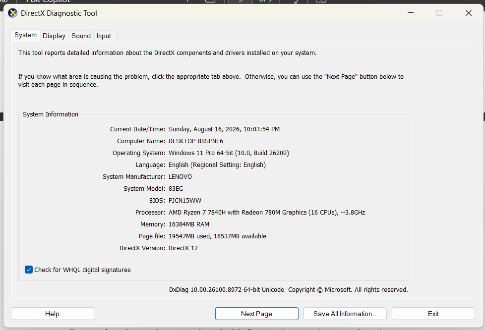
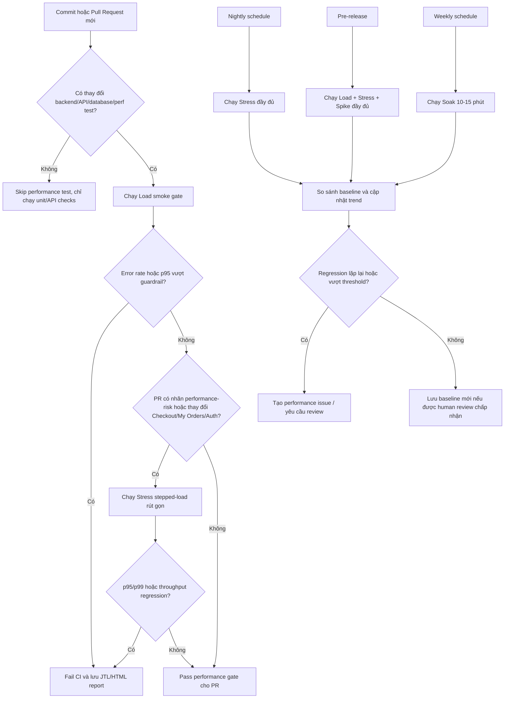

# HW05 Performance Testing Report

## 1. Introduction

Báo cáo được thực hiện cho bài tập HW05 Performance Testing với thông tin sinh viên như sau:

| Mục | Thông tin |
|---|---|
| Họ tên | `Nguyễn Thanh Gia Bảo` |
| Mã số sinh viên | `23127158` |
| GitHub repository | `<Điền link GitHub repository của bài nộp>` |

Báo cáo này trình bày quá trình thiết kế kiểm thử hiệu năng cho hệ thống EShop, một ứng dụng thương mại điện tử demo gồm backend API Node.js/Express, cơ sở dữ liệu SQLite và các frontend web/admin/mobile. Phạm vi HW05 tập trung vào backend REST API tại `http://localhost:3000`, với mục tiêu thiết kế và thực thi các kịch bản Load, Stress và Spike bằng JMeter.

Workflow được chọn cho cả ba scenario là `Buy-then-history`:

`Login -> browse product list -> view product detail -> add to cart -> checkout -> read My Orders`

Workflow này được chọn vì nó mô phỏng một luồng mua hàng hoàn chỉnh và bao phủ đủ ba nhóm endpoint chính theo yêu cầu HW05:

| Nhóm endpoint | Endpoint trong workflow | Vai trò trong test |
|---|---|---|
| Auth-heavy | `POST /api/login` | Xác thực người dùng, lấy JWT token và kiểm tra rủi ro account lockout nếu dữ liệu đăng nhập sai. |
| Read-heavy | `GET /api/products`, `GET /api/products/:id` | Đọc danh sách sản phẩm, tìm kiếm/đọc chi tiết sản phẩm. |
| Transactional | `POST /api/cart`, `POST /api/checkout`, `GET /api/orders/my-orders` | Tạo trạng thái giỏ hàng, tạo đơn hàng và xác nhận đơn mới trong lịch sử đơn hàng. |

Quá trình làm bài áp dụng AI-first strategy: AI được dùng để đề xuất thiết kế, sinh JMeter test plan, chỉnh sửa cấu hình sau human review và ghi lại audit log. Tuy nhiên, các test plan cuối cùng không được xem là output thô của AI; chúng đã được review và chỉnh sửa thủ công để phù hợp hơn với giới hạn máy local, semantics của JMeter Ultimate Thread Group, dữ liệu đăng nhập theo từng scenario và yêu cầu evidence của HW05.

Student ID sử dụng trong tên test plan là `23127158`. Các test plan hiện tại gồm:

| Scenario | Test plan | Listener/report view |
|---|---|---|
| Load | `test-plans/23127158_Load_20260815.jmx` | Summary Report |
| Stress | `test-plans/23127158_Stress_20260816.jmx` | Aggregate Report |
| Spike | `test-plans/23127158_Spike_20260816.jmx` | View Results Tree |

## 2. Test Environment

Môi trường kiểm thử là máy local Windows, chạy backend EShop tại `http://localhost:3000` và dùng Apache JMeter để phát tải vào REST API. Thông tin phần cứng được ghi nhận từ ảnh chụp DirectX Diagnostic Tool (`dxdiag`) tại `screenshots/hardware-report.png`.

| Hardware / OS item | Value |
|---|---|
| Evidence source |  |
| Evidence timestamp | Sunday, August 16, 2026, 10:03:54 PM |
| Computer name | `DESKTOP-8PSPNF6` |
| Operating system | Windows 11 Pro 64-bit, version 10.0, build 26200 |
| Language / regional setting | English / English |
| System manufacturer | LENOVO |
| System model | 83EG |
| BIOS | PJCN15WW |
| Processor | AMD Ryzen 7 7840H with Radeon 780M Graphics |
| CPU logical processors | 16 CPUs |
| Approximate CPU clock | ~3.8 GHz |
| Memory | 16384 MB RAM |
| Page file | 19547 MB used, 18537 MB available |
| DirectX version | DirectX 12 |

| Software / SUT item | Value |
|---|---|
| SUT backend | Node.js + Express + SQLite |
| Backend base URL | `http://localhost:3000` |
| Backend start command | `npm start` in `backend/` |
| Node.js runtime observed on test machine | `v22.17.1` |
| Backend package engine declaration | Node `20.x` in `backend/package.json` |
| Java runtime observed on test machine | OpenJDK Temurin `25.0.2` |
| Performance test tool | Apache JMeter |
| JMeter version | Apache JMeter `5.6.3` |
| Test plan format | `.jmx` |
| Raw result format | `.jtl` |
| Backend dependencies relevant to SUT | `express`, `sqlite3`, `jsonwebtoken`, `cors`, `body-parser` |

| Scenario | Raw JTL | HTML report | Execution/resource evidence |
|---|---|---|---|
| Load | `results/load_result.jtl` | `reports/html-report/load-profile/index.html` | `screenshots/load-test-and-resource-usage.png` |
| Stress | `results/stress_result.jtl` | `reports/html-report/stress-profile/index.html` | `screenshots/stress-test-and-resource-usage.png` |
| Spike | `results/spike_result.jtl` | `reports/html-report/spike-profile/index.html` | `screenshots/spike-test-and-resource-usage.png` |

## 3. Test Design

### 3.1 Load

Load Test đo khả năng duy trì workflow `Buy-then-history` ở mức tải ổn định. Profile cuối cùng sử dụng 50 users, think time thực tế và cùng dữ liệu CSV/correlation như các scenario còn lại.

| Thuộc tính | Cấu hình |
|---|---|
| Tool | Apache JMeter |
| Thread group | Ultimate Thread Group |
| Workload profile | 50 users |
| Startup / ramp-up | 60 giây |
| Hold load | 360 giây |
| Shutdown | 60 giây |
| Think time | Uniform random 750-1750 ms |
| Auth CSV | `data/load_auth_users.csv` |
| Product CSV | `data/product_inputs.csv` |
| Checkout CSV | `data/checkout_inputs.csv` |
| Listener | Summary Report |
| Test plan | `test-plans/23127158_Load_20260815.jmx` |

Workflow gồm 6 request theo thứ tự: login, browse product list, view product detail, add to cart, checkout và read My Orders để verify order mới. Test plan dùng JWT `${token}` sau login và `${orderId}` sau checkout để kiểm tra đúng business flow.

### 3.2 Stress

Stress Test dùng cùng workflow nhưng tăng tải theo bậc để quan sát degradation hoặc breakpoint. Các row trong Ultimate Thread Group được cấu hình cộng dồn để tải tăng liên tục đến 500 users.

| Thuộc tính | Cấu hình |
|---|---|
| Tool | Apache JMeter |
| Thread group | Ultimate Thread Group |
| Workload profile | 50 -> 150 -> 300 -> 500 users |
| Schedule row 1 | +50 users, delay 0 giây, startup 60 giây, hold 420 giây, shutdown 60 giây |
| Schedule row 2 | +100 users, delay 120 giây, startup 60 giây, hold 360 giây, shutdown 60 giây |
| Schedule row 3 | +150 users, delay 240 giây, startup 60 giây, hold 240 giây, shutdown 60 giây |
| Schedule row 4 | +200 users, delay 360 giây, startup 60 giây, hold 60 giây, shutdown 60 giây |
| Think time | Uniform random 750-1750 ms |
| Auth CSV | `data/stress_auth_users.csv` |
| Product CSV | `data/product_inputs.csv` |
| Checkout CSV | `data/checkout_inputs.csv` |
| Listener | Aggregate Report |
| Test plan | `test-plans/23127158_Stress_20260816.jmx` |

Stress giữ cùng request sequence, CSV product/checkout, JWT/orderId correlation và assertions với Load Test. Điểm khác biệt chính là workload profile tăng dần và listener Aggregate Report.

Các level chính cần được tách riêng khi báo cáo Stress là 50 users steady, 150 users steady, 300 users steady và 500 users peak hold. Số liệu kết quả theo từng level được trình bày ở mục 4.2.

### 3.3 Spike

Spike Test dùng cùng workflow để kiểm tra phản ứng khi tải tăng đột ngột rồi giảm về baseline. Profile cuối cùng dùng baseline 50 users, spike lên peak 500 users và có recovery window sau peak.

| Thuộc tính | Cấu hình |
|---|---|
| Tool | Apache JMeter |
| Thread group | Ultimate Thread Group |
| Workload profile | Baseline 50 users, spike lên peak 500 users |
| Baseline row | 50 users, delay 0 giây, startup 30 giây, hold 390 giây, shutdown 60 giây |
| Spike row | +450 users, delay 120 giây, startup 30 giây, hold 90 giây, shutdown 90 giây |
| Think time | Uniform random 500-1500 ms |
| Auth CSV | `data/spike_auth_users.csv` |
| Product CSV | `data/product_inputs.csv` |
| Checkout CSV | `data/checkout_inputs.csv` |
| Listener | View Results Tree |
| Test plan | `test-plans/23127158_Spike_20260816.jmx` |

Spike giữ cùng request sequence, CSV product/checkout, JWT/orderId correlation và assertions với Load/Stress. Listener View Results Tree được dùng để đảm bảo ba scenario có ba report/listener view khác nhau.

Các window chính cần được tách riêng khi báo cáo Spike là baseline before spike, spike ramp-up, peak 500 users hold, spike ramp-down và recovery baseline. Số liệu kết quả theo từng window được trình bày ở mục 4.3.

## 4. Test Execution and Results

### 4.1 Load

Nguồn kết quả chính thức: JMeter HTML report `reports/html-report/load-profile/index.html`, dữ liệu trong `reports/html-report/load-profile/statistics.json`.

| Metric | Value |
|---|---:|
| Sample count | 16.714 |
| Error count | 0 |
| Error rate | 0,0% |
| Mean response time | 2,671 ms |
| Median response time | 2,0 ms |
| Min response time | 0,0 ms |
| Max response time | 44,0 ms |
| 90th percentile | 5,0 ms |
| 95th percentile | 6,0 ms |
| 99th percentile | 9,0 ms |
| Throughput | 35,061 req/s |
| Received throughput | 39,599 KB/s |
| Sent throughput | 10,696 KB/s |

| Sampler / endpoint | Samples | Error % | Avg ms | p90 ms | p95 ms | p99 ms | Throughput req/s |
|---|---:|---:|---:|---:|---:|---:|---:|
| 01 Login | 2.805 | 0,0% | 3,040 | 4,0 | 5,0 | 9,940 | 5,895 |
| 02 Browse Product List | 2.801 | 0,0% | 1,568 | 2,0 | 3,0 | 6,980 | 5,891 |
| 03 View Product Detail | 2.789 | 0,0% | 1,573 | 2,0 | 3,0 | 7,0 | 5,897 |
| 04 Add To Cart | 2.779 | 0,0% | 1,740 | 2,0 | 3,0 | 3,0 | 5,929 |
| 05 Checkout | 2.775 | 0,0% | 5,730 | 8,0 | 9,0 | 11,0 | 5,914 |
| 06 My Orders Verify New Order | 2.765 | 0,0% | 2,388 | 3,0 | 4,0 | 7,0 | 5,892 |

### 4.2 Stress

Nguồn kết quả chính thức: JMeter HTML report `reports/html-report/stress-profile/index.html`, dữ liệu trong `reports/html-report/stress-profile/statistics.json`.

| Metric | Value |
|---|---:|
| Sample count | 107.203 |
| Error count | 0 |
| Error rate | 0,0% |
| Mean response time | 4,206 ms |
| Median response time | 2,0 ms |
| Min response time | 0,0 ms |
| Max response time | 277,0 ms |
| 90th percentile | 6,0 ms |
| 95th percentile | 8,0 ms |
| 99th percentile | 13,0 ms |
| Throughput | 179,655 req/s |
| Received throughput | 157,541 KB/s |
| Sent throughput | 55,024 KB/s |

| Sampler / endpoint | Samples | Error % | Avg ms | p90 ms | p95 ms | p99 ms | Throughput req/s |
|---|---:|---:|---:|---:|---:|---:|---:|
| 01 Login | 18.072 | 0,0% | 5,248 | 10,0 | 13,0 | 21,0 | 30,286 |
| 02 Browse Product List | 17.982 | 0,0% | 3,351 | 7,0 | 9,0 | 17,0 | 30,259 |
| 03 View Product Detail | 17.912 | 0,0% | 3,182 | 7,0 | 9,0 | 16,0 | 30,219 |
| 04 Add To Cart | 17.841 | 0,0% | 1,929 | 3,0 | 4,0 | 6,0 | 30,114 |
| 05 Checkout | 17.746 | 0,0% | 7,192 | 11,0 | 13,0 | 22,0 | 29,989 |
| 06 My Orders Verify New Order | 17.650 | 0,0% | 4,346 | 8,0 | 10,0 | 17,0 | 29,909 |

Kết quả theo từng Stress level từ `results/stress_result.jtl`:

| Stress level | Time window | Samples | Error % | p95 ms | p99 ms | Throughput req/s |
|---|---|---:|---:|---:|---:|---:|
| 50 users steady | 60-120s | 2.381 | 0,0% | 6,0 | 9,0 | 39,688 |
| 150 users steady | 180-240s | 7.113 | 0,0% | 11,0 | 16,0 | 118,592 |
| 300 users steady | 300-360s | 14.314 | 0,0% | 10,0 | 15,0 | 238,622 |
| 500 users peak hold | 420-480s | 23.907 | 0,0% | 12,0 | 30,0 | 398,477 |

### 4.3 Spike

Nguồn kết quả chính thức: JMeter HTML report `reports/html-report/spike-profile/index.html`, dữ liệu trong `reports/html-report/spike-profile/statistics.json`.

| Metric | Value |
|---|---:|
| Sample count | 88.157 |
| Error count | 0 |
| Error rate | 0,0% |
| Mean response time | 9,989 ms |
| Median response time | 3,0 ms |
| Min response time | 0,0 ms |
| Max response time | 464,0 ms |
| 90th percentile | 8,0 ms |
| 95th percentile | 10,0 ms |
| 99th percentile | 16,0 ms |
| Throughput | 184,866 req/s |
| Received throughput | 112,184 KB/s |
| Sent throughput | 56,633 KB/s |

| Sampler / endpoint | Samples | Error % | Avg ms | p90 ms | p95 ms | p99 ms | Throughput req/s |
|---|---:|---:|---:|---:|---:|---:|---:|
| 01 Login | 14.900 | 0,0% | 11,716 | 20,0 | 34,0 | 153,990 | 31,405 |
| 02 Browse Product List | 14.808 | 0,0% | 9,465 | 16,0 | 29,0 | 156,0 | 31,230 |
| 03 View Product Detail | 14.734 | 0,0% | 9,089 | 16,0 | 29,0 | 149,650 | 31,120 |
| 04 Add To Cart | 14.658 | 0,0% | 4,074 | 6,0 | 12,0 | 55,0 | 30,977 |
| 05 Checkout | 14.576 | 0,0% | 13,588 | 20,0 | 36,0 | 166,230 | 30,820 |
| 06 My Orders Verify New Order | 14.481 | 0,0% | 12,029 | 19,0 | 32,0 | 148,0 | 30,669 |

Kết quả theo từng Spike window từ `results/spike_result.jtl`:

| Spike window | Time window | Samples | Error % | p95 ms | p99 ms | Throughput req/s |
|---|---|---:|---:|---:|---:|---:|
| Baseline before spike | 60-120s | 2.982 | 0,0% | 6,0 | 9,0 | 49,718 |
| Spike ramp-up | 120-150s | 8.784 | 0,0% | 11,0 | 18,0 | 293,044 |
| Peak 500 users hold | 150-240s | 44.359 | 0,0% | 57,0 | 200,0 | 492,889 |
| Spike ramp-down | 240-330s | 23.859 | 0,0% | 13,0 | 23,0 | 265,153 |
| Recovery baseline | 330-420s | 4.475 | 0,0% | 10,0 | 15,0 | 49,745 |

## 5. Endurance / Soak Test

Theo yêu cầu trong `docs/HW05_Performance_Testing.md`, Soak Test cần chạy khoảng 10-15 phút ở sustained load để xác định endurance threshold của phần cứng local bằng số cụ thể, ví dụ maximum stable RPS và memory ceiling. Nguồn kết quả chính thức là JMeter HTML report `reports/html-report/soak-profile/index.html`, đọc qua `reports/html-report/soak-profile/statistics.json`; raw log tương ứng là `results/soak_result.jtl`.

### 5.1 Soak Workload

| Thông số | Giá trị |
|---|---|
| Test plan | `test-plans/23127158_Endurance_20260817.jmx` |
| Raw JTL | `results/soak_result.jtl` |
| HTML report | `reports/html-report/soak-profile/` |
| Workflow | `Buy-then-history`: Login -> browse product list -> view product detail -> add to cart -> checkout -> read My Orders |
| Sustained load | 300 concurrent users |
| Ramp-up / hold / ramp-down | 90 giây / 720 giây / 60 giây |
| Actual measured duration | 867,730 giây |
| Test time | 2026-08-17 01:12:46 -> 2026-08-17 01:27:14 +07:00 |
| Test data | Reuse `stress_auth_users.csv` đủ 500 tài khoản, cùng `product_inputs.csv` và `checkout_inputs.csv` |

### 5.2 Required Endurance Measurements

| Thông số cần đo theo yêu cầu | Kết quả ghi nhận | Nguồn |
|---|---:|---|
| Total samples | 189.818 | HTML report `statistics.json`, dòng `Total.sampleCount` |
| Error count | 0 | HTML report `statistics.json`, dòng `Total.errorCount` |
| Error rate | 0,0% | HTML report `statistics.json`, dòng `Total.errorPct` |
| Overall throughput | 218,751 req/s | HTML report `statistics.json`, dòng `Total.throughput` |
| Maximum stable RPS trong sustained hold | Khoảng 238 req/s | `soak_result.jtl`, các cửa sổ 2 phút trong hold phase giữ khoảng 238,5-239,5 req/s |
| Avg response time | 5,076 ms | HTML report `statistics.json`, dòng `Total.meanResTime` |
| p95 response time | 40,0 ms | HTML report `statistics.json`, dòng `Total.pct2ResTime` |
| p99 response time | 71,0 ms | HTML report `statistics.json`, dòng `Total.pct3ResTime` |
| Max response time | 242,0 ms | HTML report `statistics.json`, dòng `Total.maxResTime` |
| Response codes | HTTP 200: 189.818 | `soak_result.jtl` và HTML report |
| CPU peak | 6,4% | Resource monitoring do người chạy test ghi nhận |
| Memory initial | 1,2 MB | Resource monitoring do người chạy test ghi nhận |
| Memory ceiling / peak | 73,0 MB | Resource monitoring do người chạy test ghi nhận |
| Memory end | 48,3 MB | Resource monitoring do người chạy test ghi nhận |

### 5.3 Endurance Threshold

Endurance threshold thực nghiệm trên phần cứng local hiện tại được ghi nhận ở mức 300 concurrent users với maximum stable RPS khoảng 238 req/s trong sustained hold 12 phút. Ở ngưỡng này, hệ thống hoàn thành 189.818 request, không có lỗi HTTP/assertion, error rate 0,0%, CPU peak chỉ 6,4% và memory ceiling là 73,0 MB.

Về correctness và resource usage, Soak Test đạt yêu cầu endurance ở mức 300 users. Tuy nhiên, p95/p99 tổng từ HTML report là 40,0 ms / 71,0 ms, cao hơn guardrail latency ở mục 7 cho stepped-load/soak. Vì vậy, ngưỡng bền nên được báo cáo là: **300 concurrent users, khoảng 238 stable RPS, memory ceiling 73,0 MB, error rate 0,0%**, kèm ghi chú rằng tail latency cần tiếp tục theo dõi nếu đưa vào continuous performance testing.

## 6. AI Analysis of Raw JTL Logs

### 6.1 Load

#### Objective Metrics From Raw JTL

| Metric | Value | Source |
|---|---:|---|
| Total samples | 16.714 | `results/load_result.jtl`, computed by `analyze_jtl.py` |
| Failures | 0 | `results/load_result.jtl`, computed by `analyze_jtl.py` |
| Error rate | 0,0% | `results/load_result.jtl`, computed by `analyze_jtl.py` |
| Duration | 476,709 s | `results/load_result.jtl`, computed by `analyze_jtl.py` |
| Throughput | 35,061 req/s | `results/load_result.jtl`, computed by `analyze_jtl.py` |
| Avg response time | 2,671 ms | `results/load_result.jtl`, computed by `analyze_jtl.py` |
| Median response time | 2,0 ms | `results/load_result.jtl`, computed by `analyze_jtl.py` |
| p90 response time | 5,0 ms | `results/load_result.jtl`, computed by `analyze_jtl.py` |
| p95 response time | 6,0 ms | `results/load_result.jtl`, computed by `analyze_jtl.py` |
| p99 response time | 9,0 ms | `results/load_result.jtl`, computed by `analyze_jtl.py` |
| Max response time | 44,0 ms | `results/load_result.jtl`, computed by `analyze_jtl.py` |
| Response codes | HTTP 200: 16.714 | `results/load_result.jtl`, computed by `analyze_jtl.py` |

#### Per-Sampler Metrics From Raw JTL

| Sampler / endpoint | Samples | Error % | Avg ms | p95 ms | p99 ms | Throughput req/s |
|---|---:|---:|---:|---:|---:|---:|
| 01 Login | 2.805 | 0,0% | 3,040 | 5,0 | 9,0 | 5,895 |
| 02 Browse Product List | 2.801 | 0,0% | 1,568 | 3,0 | 6,0 | 5,891 |
| 03 View Product Detail | 2.789 | 0,0% | 1,573 | 3,0 | 6,120 | 5,897 |
| 04 Add To Cart | 2.779 | 0,0% | 1,740 | 3,0 | 3,0 | 5,929 |
| 05 Checkout | 2.775 | 0,0% | 5,730 | 9,0 | 11,0 | 5,914 |
| 06 My Orders Verify New Order | 2.765 | 0,0% | 2,388 | 4,0 | 7,0 | 5,892 |

#### AI Interpretation

Raw JTL cho thấy Load Test 50 users chạy ổn định trong khoảng 476,709 giây với 16.714 request và không có lỗi. Error rate 0,0% và toàn bộ response code HTTP 200 cho thấy workflow `Buy-then-history` hoàn tất thành công ở mức tải steady-load này.

Overall latency rất thấp: avg 2,671 ms, p95 6,0 ms, p99 9,0 ms và max 44,0 ms. Điều này cho thấy trong môi trường local hiện tại, SUT chưa có dấu hiệu saturation ở profile Load 50 VU. Tuy nhiên, vì đây là môi trường local Node.js/Express + SQLite và không có APM/backend profiling đi kèm trong raw JTL, không nên suy luận rằng hệ thống sẽ giữ cùng mức latency khi deploy thật hoặc khi dữ liệu lớn hơn.

Sampler chậm nhất là `05 Checkout` với avg 5,730 ms, p95 9,0 ms, p99 11,0 ms và max 22,0 ms. Đây là kết quả hợp lý vì checkout là bước transactional có ghi dữ liệu, tạo order và cập nhật trạng thái liên quan. Các bước read-heavy như product list và product detail có p95 3,0 ms, thấp hơn checkout. `01 Login` có max 44,0 ms nhưng p95 chỉ 5,0 ms, nên đây là outlier nhỏ, chưa phải bằng chứng của degradation kéo dài.

#### AI-Proposed Thresholds

| Threshold | Proposed value | Rationale | Raw metric used |
|---|---:|---|---|
| Load p95 response-time threshold | <= 15 ms | Cao hơn 2,5 lần overall p95 hiện tại để có biên an toàn cho dao động local nhưng vẫn phát hiện regression rõ ràng. | Overall p95 = 6,0 ms |
| Load p99 response-time threshold | <= 25 ms | Cao hơn p99 hiện tại nhưng thấp hơn nhiều so với mức có thể làm người dùng cảm nhận chậm trong API local. | Overall p99 = 9,0 ms |
| Load error-rate threshold | <= 1,0% | Run hiện tại 0 lỗi; 1,0% là ngưỡng cảnh báo sớm cho workflow có login, cart và checkout. | Error rate = 0,0% |
| Load request-throughput target | >= 30 req/s | Run hiện tại đạt 35,061 req/s; đặt ngưỡng thấp hơn một chút để tránh fail do nhiễu nhỏ nhưng vẫn bắt được regression throughput. | Throughput = 35,061 req/s |
| Checkout p95 threshold | <= 20 ms | Checkout là bước transactional chậm nhất; ngưỡng này cao hơn p95 hiện tại nhưng vẫn đủ nhạy để bắt tail latency tăng. | Checkout p95 = 9,0 ms |

#### AI-Proposed Optimizations

| Recommendation | Evidence category | Metric / observation used | Expected effect |
|---|---|---|---|
| Giữ nguyên implementation hiện tại cho workload Load 50 VU, chưa tối ưu nóng khi chưa có regression. | Supported by raw evidence | 16.714 samples, 0 failures, p95 6,0 ms, throughput 35,061 req/s. | Tránh thay đổi không cần thiết khi hệ thống đang ổn định ở baseline Load. |
| Ưu tiên quan sát checkout trong Stress/Spike/Endurance trước khi tối ưu write path. | Plausible but not proven | Checkout là sampler chậm nhất trong Load: avg 5,730 ms, p95 9,0 ms. | Nếu các scenario mạnh hơn cho thấy checkout tail latency tăng, có thể tối ưu transaction/order write path đúng trọng tâm hơn. |
| Cân nhắc pagination hoặc giới hạn số bản ghi cho `My Orders` khi dữ liệu order của mỗi user tăng lớn. | Plausible but not proven | `My Orders` hiện p95 4,0 ms, chưa chậm trong Load; rủi ro chủ yếu đến từ dữ liệu tăng theo thời gian. | Giảm latency đọc lịch sử đơn hàng khi số lượng order/user tăng trong endurance hoặc dữ liệu lâu dài. |
| Cân nhắc composite index cho truy vấn order-history theo `user_id` và thời gian tạo nếu Stress/Spike/Endurance cho thấy `My Orders` tăng latency. | Plausible but not proven | Load hiện chưa chứng minh bottleneck; `My Orders` p95 4,0 ms. | Tăng tốc truy vấn lịch sử đơn hàng trong dữ liệu lớn, giảm p95/p99 cho read-after-checkout. |
| Chỉ bật/tinh chỉnh SQLite WAL hoặc busy timeout nếu các run tải cao hơn xuất hiện lock contention hoặc lỗi ghi. | Plausible but not proven | Load hiện 0 lỗi, Checkout p95 9,0 ms, không có bằng chứng lock từ JTL. | Giảm lỗi/độ trễ do lock SQLite nếu stress/spike thật sự tạo contention ghi. |

Kết luận sau review: Load Test 50 VU được xem là ổn định trong môi trường local. HTML report xác nhận 16.714 samples, 0 lỗi, error rate 0,0%, throughput 35,061 req/s, overall p95 6,0 ms và p99 9,0 ms. Các correction nhỏ ở p99 per-sampler đã được ghi ở mục 8.2 và không làm thay đổi kết luận chính của Load Test.

### 6.2 Stress

#### Objective Metrics From Raw JTL

| Metric | Value | Source |
|---|---:|---|
| Total samples | 107.203 | `results/stress_result.jtl`, computed by `analyze_jtl.py` |
| Failures | 0 | `results/stress_result.jtl`, computed by `analyze_jtl.py` |
| Error rate | 0,0% | `results/stress_result.jtl`, computed by `analyze_jtl.py` |
| Duration | 596,713 s | `results/stress_result.jtl`, computed by `analyze_jtl.py` |
| Throughput | 179,656 req/s | `results/stress_result.jtl`, computed by `analyze_jtl.py` |
| Avg response time | 4,206 ms | `results/stress_result.jtl`, computed by `analyze_jtl.py` |
| Median response time | 3,0 ms | `results/stress_result.jtl`, computed by `analyze_jtl.py` |
| p90 response time | 8,0 ms | `results/stress_result.jtl`, computed by `analyze_jtl.py` |
| p95 response time | 11,0 ms | `results/stress_result.jtl`, computed by `analyze_jtl.py` |
| p99 response time | 18,0 ms | `results/stress_result.jtl`, computed by `analyze_jtl.py` |
| Max response time | 277,0 ms | `results/stress_result.jtl`, computed by `analyze_jtl.py` |
| Response codes | HTTP 200: 107.203 | `results/stress_result.jtl`, computed by `analyze_jtl.py` |

#### Per-Sampler Metrics From Raw JTL

| Sampler / endpoint | Samples | Error % | Avg ms | p95 ms | p99 ms | Throughput req/s |
|---|---:|---:|---:|---:|---:|---:|
| 01 Login | 18.072 | 0,0% | 5,248 | 12,450 | 21,0 | 30,286 |
| 02 Browse Product List | 17.982 | 0,0% | 3,351 | 9,0 | 17,0 | 30,259 |
| 03 View Product Detail | 17.912 | 0,0% | 3,182 | 9,0 | 16,0 | 30,219 |
| 04 Add To Cart | 17.841 | 0,0% | 1,929 | 4,0 | 6,0 | 30,114 |
| 05 Checkout | 17.746 | 0,0% | 7,192 | 13,0 | 22,0 | 29,989 |
| 06 My Orders Verify New Order | 17.650 | 0,0% | 4,346 | 10,0 | 17,0 | 29,909 |

#### Stress-Level Metrics From Raw JTL

Các mức dưới đây được tính từ các đoạn plateau ổn định của Ultimate Thread Group, bỏ qua ramp-up/ramp-down để không làm nhiễu số liệu từng level. Mốc thời gian được tính tương đối từ timestamp đầu tiên trong `results/stress_result.jtl`.

| Stress level | Time window | Samples | Error % | Avg ms | p90 ms | p95 ms | p99 ms | Max ms | Throughput req/s |
|---|---|---:|---:|---:|---:|---:|---:|---:|---:|
| 50 users steady | 60-120s | 2.381 | 0,0% | 2,580 | 5,0 | 6,0 | 9,0 | 31,0 | 39,688 |
| 150 users steady | 180-240s | 7.113 | 0,0% | 4,947 | 9,0 | 11,0 | 16,0 | 28,0 | 118,592 |
| 300 users steady | 300-360s | 14.314 | 0,0% | 3,573 | 7,0 | 10,0 | 15,0 | 75,0 | 238,622 |
| 500 users peak hold | 420-480s | 23.907 | 0,0% | 5,335 | 9,0 | 12,0 | 30,0 | 277,0 | 398,477 |

| Stress level | Login p95 / p99 ms | Checkout p95 / p99 ms | My Orders p95 / p99 ms | Main observation |
|---|---:|---:|---:|---|
| 50 users steady | 4,0 / 9,020 | 9,0 / 11,720 | 3,0 / 4,0 | Baseline stress level ổn định, latency thấp và không có lỗi. |
| 150 users steady | 13,0 / 18,0 | 13,0 / 18,0 | 11,0 / 15,0 | Latency tăng so với 50 users nhưng vẫn ổn định, không có failure. |
| 300 users steady | 11,0 / 17,0 | 12,0 / 18,0 | 9,0 / 14,0 | Throughput tăng mạnh; latency không tăng tuyến tính, có thể do cache/local scheduling. |
| 500 users peak hold | 14,0 / 30,0 | 15,0 / 40,280 | 12,0 / 37,140 | Peak 500 users tạo tail latency rõ nhất; Checkout, Login và My Orders cần theo dõi ở Spike/Endurance. |

#### AI Interpretation

Raw JTL cho thấy Stress Test chạy khoảng 596,713 giây với 107.203 request và không có lỗi. Toàn bộ response code là HTTP 200, error rate 0,0%, throughput đạt 179,656 req/s. So với Load Test, throughput tăng mạnh trong khi hệ thống vẫn không ghi nhận failure, cho thấy profile Stress 50 -> 150 -> 300 -> 500 users chưa làm SUT mất ổn định về mặt functional correctness.

Theo raw analyzer, overall latency tăng so với Load nhưng vẫn thấp: avg 4,206 ms, p95 11,0 ms, p99 18,0 ms và max 277,0 ms. Các giá trị max ở Login, Product Detail, My Orders và Checkout cao hơn p95/p99 khá nhiều, nên đây là outlier/tail latency cần theo dõi, chưa phải bằng chứng degradation kéo dài vì percentile chính vẫn thấp và error rate bằng 0.

`05 Checkout` là sampler có mean cao nhất với avg 7,192 ms, p95 13,0 ms, p99 22,0 ms và max 227,0 ms. Điều này phù hợp với bản chất transactional của checkout. `01 Login` cũng có tail latency đáng chú ý với p99 21,0 ms và max 262,0 ms. Các bước read-heavy vẫn ổn định ở p95 9,0 ms hoặc thấp hơn trong raw analyzer.

Theo từng stress level, throughput tăng gần tuyến tính khi tăng tải: khoảng 39,688 req/s ở 50 users, 118,592 req/s ở 150 users, 238,622 req/s ở 300 users và 398,477 req/s ở peak 500 users. Error rate vẫn giữ 0,0% ở tất cả các plateau ổn định. Latency không tăng tuyến tính ở mọi level: 150 users có avg/p95 cao hơn 300 users, có thể do nhiễu local scheduling hoặc trạng thái cache/runtime trong quá trình test. Tuy nhiên, peak 500 users là mức tạo tail latency rõ nhất, với overall p99 30,0 ms và max 277,0 ms; ở level này Checkout p99 lên 40,280 ms, My Orders p99 37,140 ms và Login p99 30,0 ms. Vì vậy, nếu cần tìm điểm bắt đầu degradation, 500 users là level đáng theo dõi tiếp trong Spike/Endurance hoặc profiling backend.

#### AI-Proposed Thresholds

| Threshold | Proposed value | Rationale | Raw metric used |
|---|---:|---|---|
| Stress p95 response-time threshold | <= 25 ms | Cao hơn khoảng 2,3 lần raw p95 hiện tại để có biên dao động nhưng vẫn bắt được regression rõ ràng dưới stress. | Overall p95 = 11,0 ms |
| Stress p99 response-time threshold | <= 50 ms | Raw p99 hiện là 18,0 ms, nhưng max outlier đã lên 277,0 ms; ngưỡng 50 ms giúp phát hiện tail latency tăng kéo dài thay vì phản ứng với vài outlier đơn lẻ. | Overall p99 = 18,0 ms; max = 277,0 ms |
| Stress error-rate threshold | <= 1,0% | Run hiện tại 0 lỗi; với workflow có login/cart/checkout, bất kỳ lỗi ổn định nào dưới stress đều cần được xem là cảnh báo. | Error rate = 0,0% |
| Stress request-throughput target | >= 150 req/s | Run hiện tại đạt 179,656 req/s; ngưỡng 150 req/s cho phép nhiễu local nhưng vẫn bảo vệ mức throughput của profile Stress. | Throughput = 179,656 req/s |
| Checkout p95 threshold | <= 30 ms | Checkout là sampler chậm nhất và transactional; ngưỡng này cao hơn raw Checkout p95 hiện tại nhưng đủ nhạy để bắt write-path regression. | Checkout p95 = 13,0 ms |

#### AI-Proposed Optimizations

| Recommendation | Evidence category | Metric / observation used | Expected effect |
|---|---|---|---|
| Chưa cần tối ưu nóng cho Stress profile hiện tại nếu chỉ dựa trên run này. | Supported by raw evidence | 107.203 samples, 0 failures, error rate 0,0%, throughput 179,656 req/s. | Tránh thay đổi hệ thống khi chưa có bottleneck rõ ràng trong Stress run. |
| Theo dõi riêng Checkout write path trong Spike/Endurance hoặc khi dữ liệu order lớn hơn. | Supported by raw evidence | Checkout có avg cao nhất 7,192 ms, p95 13,0 ms, p99 22,0 ms. | Nếu Checkout tiếp tục là điểm chậm nhất, có thể ưu tiên tối ưu transaction/order creation đúng vị trí. |
| Cân nhắc profiling Login nếu p99 hoặc max latency lặp lại ở các run sau. | Plausible but not proven | Login p99 21,0 ms, max 262,0 ms trong raw JTL. | Giảm tail latency cho auth path nếu outlier Login tái diễn dưới Spike/Endurance. |
| Cân nhắc pagination/LIMIT và composite index cho My Orders khi dữ liệu order tăng lớn. | Plausible but not proven | My Orders p95 10,0 ms, p99 17,0 ms; hiện chưa lỗi nhưng dữ liệu order có thể tăng theo test dài hơn. | Giữ read-after-checkout ổn định khi lịch sử đơn hàng/user lớn hơn. |
| Chỉ tinh chỉnh SQLite WAL/busy timeout nếu có bằng chứng lock contention, write timeout hoặc error ở test nặng hơn. | Plausible but not proven | Stress hiện 0 lỗi; raw JTL không chứa bằng chứng lock contention. | Giảm lỗi ghi/độ trễ do lock nếu Spike hoặc Endurance chứng minh contention thật sự. |

Kết luận sau review: Stress Test 50 -> 150 -> 300 -> 500 users được xem là ổn định trong môi trường local. HTML report xác nhận 107.203 samples, 0 lỗi, error rate 0,0%, throughput 179,655 req/s, overall p95 8,0 ms và p99 13,0 ms. Phân tích theo từng level cho thấy throughput tăng gần tuyến tính và peak 500 users tạo tail latency rõ nhất, nhưng chưa có bằng chứng lỗi chức năng hoặc saturation kéo dài.

### 6.3 Spike

#### Objective Metrics From Raw JTL

| Metric | Value | Source |
|---|---:|---|
| Total samples | 88.157 | `results/spike_result.jtl`, computed by `analyze_jtl.py` |
| Failures | 0 | `results/spike_result.jtl`, computed by `analyze_jtl.py` |
| Error rate | 0,0% | `results/spike_result.jtl`, computed by `analyze_jtl.py` |
| Duration | 476,863 s | `results/spike_result.jtl`, computed by `analyze_jtl.py` |
| Throughput | 184,869 req/s | `results/spike_result.jtl`, computed by `analyze_jtl.py` |
| Avg response time | 9,989 ms | `results/spike_result.jtl`, computed by `analyze_jtl.py` |
| Median response time | 4,0 ms | `results/spike_result.jtl`, computed by `analyze_jtl.py` |
| p90 response time | 17,0 ms | `results/spike_result.jtl`, computed by `analyze_jtl.py` |
| p95 response time | 29,0 ms | `results/spike_result.jtl`, computed by `analyze_jtl.py` |
| p99 response time | 141,0 ms | `results/spike_result.jtl`, computed by `analyze_jtl.py` |
| Max response time | 464,0 ms | `results/spike_result.jtl`, computed by `analyze_jtl.py` |
| Response codes | HTTP 200: 88.157 | `results/spike_result.jtl`, computed by `analyze_jtl.py` |

#### Per-Sampler Metrics From Raw JTL

| Sampler / endpoint | Samples | Error % | Avg ms | p95 ms | p99 ms | Throughput req/s |
|---|---:|---:|---:|---:|---:|---:|
| 01 Login | 14.900 | 0,0% | 11,716 | 34,0 | 153,010 | 31,405 |
| 02 Browse Product List | 14.808 | 0,0% | 9,465 | 29,0 | 155,930 | 31,230 |
| 03 View Product Detail | 14.734 | 0,0% | 9,089 | 29,0 | 149,0 | 31,120 |
| 04 Add To Cart | 14.658 | 0,0% | 4,074 | 12,0 | 54,430 | 30,977 |
| 05 Checkout | 14.576 | 0,0% | 13,588 | 36,0 | 166,0 | 30,820 |
| 06 My Orders Verify New Order | 14.481 | 0,0% | 12,029 | 32,0 | 148,0 | 30,669 |

#### Spike-Window Metrics From Raw JTL

Các window dưới đây được tính từ timestamp đầu tiên trong `results/spike_result.jtl` và bám theo lịch Ultimate Thread Group: baseline 50 users, spike thêm 450 users sau 120 giây, peak 500 users trong 90 giây, ramp-down spike group trong 90 giây, sau đó recovery về baseline.

| Spike window | Time window | Samples | Error % | Avg ms | p90 ms | p95 ms | p99 ms | Max ms | Throughput req/s |
|---|---|---:|---:|---:|---:|---:|---:|---:|---:|
| Baseline before spike | 60-120s | 2.982 | 0,0% | 2,749 | 5,0 | 6,0 | 9,0 | 24,0 | 49,718 |
| Spike ramp-up | 120-150s | 8.784 | 0,0% | 4,150 | 8,0 | 11,0 | 18,0 | 39,0 | 293,044 |
| Peak 500 users hold | 150-240s | 44.359 | 0,0% | 15,635 | 28,0 | 57,0 | 200,0 | 464,0 | 492,889 |
| Spike ramp-down | 240-330s | 23.859 | 0,0% | 4,640 | 9,0 | 13,0 | 23,0 | 56,0 | 265,153 |
| Recovery baseline | 330-420s | 4.475 | 0,0% | 4,157 | 8,0 | 10,0 | 15,0 | 25,0 | 49,745 |

| Spike window | Login p95 / p99 ms | Checkout p95 / p99 ms | My Orders p95 / p99 ms | Main observation |
|---|---:|---:|---:|---|
| Baseline before spike | 5,0 / 7,0 | 9,0 / 11,030 | 4,0 / 7,0 | Baseline trước spike ổn định, latency gần Load baseline. |
| Spike ramp-up | 13,0 / 19,660 | 14,0 / 21,0 | 10,0 / 18,0 | Latency bắt đầu tăng khi users tăng nhanh từ 50 lên 500. |
| Peak 500 users hold | 65,0 / 218,080 | 76,0 / 227,940 | 70,0 / 205,090 | Peak 500 users tạo tail latency rõ nhất nhưng vẫn 0 lỗi. |
| Spike ramp-down | 14,0 / 27,0 | 14,0 / 26,320 | 14,0 / 24,0 | Latency giảm nhanh khi spike group ramp-down. |
| Recovery baseline | 11,0 / 15,0 | 12,0 / 17,520 | 13,0 / 16,520 | Hệ thống phục hồi về gần baseline, không có lỗi tồn dư. |

#### AI Interpretation

Raw JTL cho thấy Spike Test chạy khoảng 476,863 giây với 88.157 request, 0 failures và toàn bộ response code HTTP 200. Overall throughput đạt 184,869 req/s. Về mặt functional correctness, SUT hấp thụ được spike 50 -> 500 users mà không tạo lỗi HTTP hoặc assertion failure.

Latency tổng của raw analyzer cao hơn Load/Stress do giai đoạn peak spike: avg 9,989 ms, p95 29,0 ms, p99 141,0 ms và max 464,0 ms. `05 Checkout` có mean cao nhất 13,588 ms và p99 166,0 ms; `01 Login`, `02 Browse Product List`, `03 View Product Detail` và `06 My Orders` cũng có p99 cao trong khoảng 148-156 ms. Điều này cho thấy spike tạo tail latency trên nhiều endpoint, không chỉ riêng checkout.

Phân tích theo window cho thấy nguyên nhân chính nằm ở peak 500 users hold: overall p95 tăng lên 57,0 ms, p99 200,0 ms và max 464,0 ms. Trong peak window, Checkout p99 đạt 227,940 ms, Login p99 218,080 ms và My Orders p99 205,090 ms. Sau khi spike group ramp-down, p99 giảm xuống 23,0 ms; ở recovery baseline, p95/p99 còn 10,0/15,0 ms và throughput quay về khoảng 49,745 req/s. Vì vậy, hệ thống có tail-latency spike rõ ràng ở peak nhưng phục hồi tốt sau spike, chưa có bằng chứng lỗi chức năng hoặc failure kéo dài.

#### AI-Proposed Thresholds

| Threshold | Proposed value | Rationale | Raw metric used |
|---|---:|---|---|
| Spike overall p95 threshold | <= 60 ms | Peak window raw p95 là 57,0 ms; ngưỡng 60 ms phản ánh yêu cầu hấp thụ spike mà không để p95 vượt xa mức peak hiện tại. | Peak 500 users p95 = 57,0 ms |
| Spike overall p99 threshold | <= 250 ms | Peak p99 là 200,0 ms và max 464,0 ms; ngưỡng 250 ms cho phép spike tail latency nhưng vẫn bắt regression rõ. | Peak 500 users p99 = 200,0 ms |
| Spike error-rate threshold | <= 1,0% | Run hiện tại 0 lỗi; spike có thể gây tail latency nhưng không nên gây lỗi chức năng ổn định. | Error rate = 0,0% |
| Recovery p95 threshold | <= 20 ms | Recovery baseline p95 là 10,0 ms; ngưỡng 20 ms xác nhận hệ thống hồi phục sau spike. | Recovery p95 = 10,0 ms |
| Checkout peak p99 threshold | <= 300 ms | Checkout peak p99 là 227,940 ms; ngưỡng 300 ms theo dõi transactional tail latency ở giai đoạn spike. | Checkout peak p99 = 227,940 ms |

#### AI-Proposed Optimizations

| Recommendation | Evidence category | Metric / observation used | Expected effect |
|---|---|---|---|
| Ưu tiên profiling giai đoạn peak spike 500 users thay vì chỉ nhìn toàn bài. | Supported by raw evidence | Peak window p99 200,0 ms, max 464,0 ms; recovery p99 giảm còn 15,0 ms. | Tập trung điều tra đúng thời điểm phát sinh tail latency. |
| Theo dõi và tối ưu Checkout write path nếu peak p99 tiếp tục cao ở run lặp lại. | Supported by raw evidence | Checkout peak p99 227,940 ms, max 440,0 ms. | Giảm tail latency cho bước transactional trong spike. |
| Kiểm tra auth/read path dưới spike vì tail latency không chỉ nằm ở checkout. | Supported by raw evidence | Login peak p99 218,080 ms; My Orders peak p99 205,090 ms; Browse/Product Detail cũng có p99 cao trong toàn bài. | Tránh tối ưu sai một endpoint khi spike ảnh hưởng nhiều nhóm request. |
| Cân nhắc database/index/pagination cho My Orders nếu dữ liệu order hoặc endurance làm read-after-checkout chậm hơn. | Plausible but not proven | My Orders peak p99 205,090 ms nhưng recovery p99 16,520 ms và không có lỗi. | Giữ truy vấn lịch sử đơn hàng ổn định khi dữ liệu tăng. |
| Chỉ tinh chỉnh SQLite WAL/busy timeout nếu log hoặc run sau có lock/write contention. | Plausible but not proven | Spike hiện 0 failures; JTL không chứng minh lock contention. | Giảm lỗi/độ trễ do lock nếu có bằng chứng contention thật. |

Kết luận sau review: Spike Test baseline 50 users -> peak 500 users được xem là đạt mục tiêu trong môi trường local. HTML report xác nhận 88.157 samples, 0 lỗi, error rate 0,0%, throughput 184,866 req/s, overall p95 10,0 ms và p99 16,0 ms. Window analysis từ raw JTL cho thấy peak 500 users tạo tail latency rõ nhất, nhưng hệ thống phục hồi về gần baseline sau spike và không có lỗi chức năng kéo dài.

## 7. Cross-Scenario Analysis and Final Thresholds

Phần này so sánh ba scenario đã được chạy lại và đã qua human review. Các metric tổng chính thức lấy từ JMeter HTML report ở mục 4; các nhận xét về peak/recovery lấy từ raw JTL window analysis ở mục 6.

| Scenario | Workload profile | Samples | Error % | Avg ms | p95 ms | p99 ms | Max ms | Throughput req/s | Tóm tắt kết quả |
|---|---|---:|---:|---:|---:|---:|---:|---:|---|
| Load | 50 users ổn định | 16.714 | 0,0% | 2,671 | 6,0 | 9,0 | 44,0 | 35,061 | Baseline ổn định. |
| Stress | 50 -> 150 -> 300 -> 500 users | 107.203 | 0,0% | 4,206 | 8,0 | 13,0 | 277,0 | 179,655 | Ổn định khi tải tăng theo bậc; peak 500 users tạo tail latency nhưng vẫn phục hồi được. |
| Spike | Baseline 50 users, spike lên 500 users | 88.157 | 0,0% | 9,989 | 10,0 | 16,0 | 464,0 | 184,866 | Không có lỗi chức năng; peak window tạo tail latency mạnh nhất nhưng recovery tốt. |

### 7.1 Phân tích xu hướng

Cả ba scenario đều hoàn thành cùng workflow `Buy-then-history` với error rate 0,0%. Điều này cho thấy các profile đã được chấp nhận không làm lộ lỗi chức năng, lỗi HTTP, lỗi assertion hoặc vấn đề dữ liệu/tài khoản trong môi trường local.

Throughput tăng từ 35,061 req/s ở Load lên 179,655 req/s ở Stress và 184,866 req/s ở Spike. Mức tăng này hợp lý vì Stress và Spike tạo áp lực concurrent users cao hơn nhiều so với Load baseline. Phân tích theo từng level của Stress cho thấy throughput tăng gần tuyến tính ở các đoạn ổn định, từ khoảng 39,688 req/s tại 50 users lên 398,477 req/s tại plateau 500 users.

Latency tổng trong HTML report vẫn thấp, nhưng tail latency bắt đầu rõ hơn khi workload mạnh hơn. Load có p95/p99 là 6,0/9,0 ms. Stress có p95/p99 chính thức là 8,0/13,0 ms, nhưng phân tích raw theo level cho thấy plateau 500 users đạt p99 30,0 ms. Spike có p95/p99 chính thức là 10,0/16,0 ms, nhưng phân tích raw theo window cho thấy giai đoạn peak 500 users đạt p95 57,0 ms và p99 200,0 ms. Vì vậy, rủi ro hiệu năng chính không nằm ở average latency, mà nằm ở tail latency ngắn hạn trong các cửa sổ tải cao đột ngột.

Checkout là sampler có mean response time cao nhất ở cả ba scenario: Load avg 5,730 ms, Stress avg 7,192 ms và Spike avg 13,588 ms. Tuy nhiên, ở peak của Spike, tail latency cũng xuất hiện ở Login và My Orders, nên hiện tượng này nên được xem là áp lực toàn workflow hoặc scheduling/contention ở môi trường local cho đến khi backend profiling chứng minh được bottleneck hẹp hơn.

### 7.2 Ngưỡng cuối đề xuất

Các threshold dưới đây được thiết kế như một bộ guardrail dùng lại được cho Continuous Performance Testing Proposal, không chỉ để mô tả riêng từng scenario đã chạy. Chúng được neo theo kết quả local đã được chấp nhận, nhưng khi áp dụng cho CI/CD hoặc môi trường khác cần hiệu chỉnh lại theo baseline mới.

| Guardrail | Threshold cuối | Áp dụng cho | Cơ sở từ bài test | Cách dùng trong continuous testing |
|---|---:|---|---|---|
| Functional error gate | Error rate <= 1,0% | Mọi performance run | Load/Stress/Spike đều có error rate 0,0% | Fail pipeline nếu error rate vượt 1,0% hoặc xuất hiện nhóm lỗi HTTP/assertion lặp lại. |
| Baseline latency gate | Overall p95 <= 15 ms; p99 <= 25 ms | Commit-level smoke/load test nhẹ | Load HTML p95 = 6,0 ms, p99 = 9,0 ms | Chạy thường xuyên để bắt regression latency ở workflow chính khi tải ổn định. |
| Baseline throughput gate | Throughput >= 30 req/s | Commit-level smoke/load test nhẹ | Load HTML throughput = 35,061 req/s | Cảnh báo nếu capacity baseline giảm rõ so với accepted run. |
| Stepped-load latency gate | Overall p95 <= 25 ms; p99 <= 50 ms | Nightly/weekly stepped-load test | Stress HTML p95 = 8,0 ms, p99 = 13,0 ms; raw 500-user plateau p99 = 30,0 ms | Phát hiện degradation khi tải tăng dần, đặc biệt ở mức gần 500 users. |
| Stepped-load throughput gate | Throughput >= 150 req/s | Nightly/weekly stepped-load test | Stress HTML throughput = 179,655 req/s | Cảnh báo nếu throughput dưới tải tăng theo bậc giảm quá nhiều. |
| Spike peak latency gate | Peak-window p95 <= 60 ms; p99 <= 250 ms | Spike/regression test trước release | Spike peak-window p95 = 57,0 ms, p99 = 200,0 ms | Đánh giá riêng giai đoạn peak spike thay vì chỉ nhìn aggregate toàn bài. |
| Spike recovery gate | Recovery-window p95 <= 20 ms và error rate = 0,0% | Spike/regression test trước release | Spike recovery-window p95 = 10,0 ms, p99 = 15,0 ms, 0 lỗi | Cảnh báo nếu hệ thống không hồi phục sau khi spike traffic giảm. |
| Transactional endpoint guardrail | Checkout p95 <= 30 ms dưới non-spike load | Load/Stress/Endurance | Load Checkout p95 = 9,0 ms; Stress Checkout p95 = 13,0 ms | Theo dõi bước transactional quan trọng nhất của workflow. |
| Spike transactional tail guardrail | Checkout peak-window p99 <= 300 ms | Spike peak window | Spike Checkout peak p99 = 227,940 ms | Cảnh báo tail latency checkout trong traffic burst. |
| Read-after-write guardrail | My Orders p95 <= 30 ms dưới non-spike load; recovery p95 <= 20 ms sau spike | Stress/Spike/Endurance | Stress My Orders p95 = 10,0 ms; Spike recovery My Orders p95 = 13,0 ms | Theo dõi bước verify order sau checkout, nhất là khi dữ liệu order tăng. |

Bộ threshold này có thể được ánh xạ vào continuous testing theo ba mức: smoke performance check cho mỗi commit, stepped-load test định kỳ, và spike/recovery test trước release. Các ngưỡng p95/p99 được giữ riêng cho baseline, stepped-load và spike peak vì chúng đo các rủi ro khác nhau, nhưng cách dùng trong pipeline là thống nhất: fail hoặc cảnh báo khi một guardrail vượt ngưỡng đã định.

### 7.3 Đánh giá cuối

SUT ổn định với các profile local đã được chấp nhận trong HW05: Load 50 users, Stress 50 -> 150 -> 300 -> 500 users và Spike 50 -> 500 users. Không scenario nào tạo lỗi, và cả ba đều hoàn thành cùng workflow có auth-heavy, read-heavy và transactional endpoint.

Rủi ro chính là tail latency trong các đợt tải cao đột ngột. Peak của Spike làm p95/p99 tăng cao hơn nhiều so với Load và Stress, nhưng hệ thống phục hồi sau spike window. Bước kiểm chứng tiếp theo nên là Endurance/Soak Test gần mức tải ổn định mạnh nhất để xem hệ thống local có duy trì throughput cao trong thời gian dài mà không tăng memory, không phát sinh SQLite contention, và không làm xấu thêm latency của Checkout/My Orders hay không.

## 8. AI Misinterpretation Hunt

### 8.1 Task 1 - AI Test Plan Review

Phần này ghi lại các điểm AI-generated test plan hoặc thiết kế ban đầu cần được human review chỉnh lại trước khi dùng làm bản cuối.

| Scenario | AI output / issue | Human correction | Final decision |
|---|---|---|---|
| Load | Profile ban đầu quá nhẹ, chưa tạo baseline đủ mạnh cho môi trường local. | Chỉnh Load profile thành 50 users, ramp-up 60 giây, hold 360 giây, shutdown 60 giây. | Đã hiệu chỉnh |
| Load | Cần tránh nhiều virtual users dùng chung credential. | Mở rộng `data/load_auth_users.csv` và seed data để có 50 tài khoản Load. | Đã hiệu chỉnh |
| Load | Test plan cần dùng workload profile rõ ràng và ổn định. | Dùng Ultimate Thread Group cho Load plan cuối cùng. | Đã hiệu chỉnh |
| Stress | Thiết kế ban đầu chưa đủ mạnh để quan sát breakpoint rõ ràng. | Chỉnh profile thành 50 -> 150 -> 300 -> 500 users. | Đã hiệu chỉnh |
| Stress | Có nguy cơ hiểu sai Ultimate Thread Group như các mức tải độc lập, làm tải rơi giữa các level. | Cấu hình các row cộng dồn để tải tăng liên tục đến peak 500 users. | Đã hiệu chỉnh |
| Stress | Dữ liệu đăng nhập ban đầu không đủ cho peak workload. | Mở rộng `data/stress_auth_users.csv` và seed data lên 500 tài khoản Stress. | Đã hiệu chỉnh |
| Spike | Profile 50 -> 1000 users quá aggressive cho máy local, có thể đo giới hạn JMeter/thiết bị thay vì SUT. | Loại bỏ kết quả Spike cũ và thiết kế lại workload. | Bị từ chối |
| Spike | Profile 20 -> 200 users sau đó chưa đủ mạnh so với mục tiêu spike. | Chỉnh profile cuối thành baseline 50 users, spike lên peak 500 users, có recovery window. | Đã hiệu chỉnh |
| Spike | Dữ liệu auth cần đủ cho peak 500 users. | Dùng `data/spike_auth_users.csv` với số lượng tài khoản đủ cho peak workload. | Đã hiệu chỉnh |

### 8.2 Task 2 - Load HTML Report Cross-Check

Nguồn đối chiếu là JMeter HTML dashboard tại `reports/html-report/load-profile/index.html`, đọc qua file dữ liệu `reports/html-report/load-profile/statistics.json`. Mục tiêu là kiểm tra lại phần AI analysis ở mục 6.1 so với số liệu do JMeter HTML report sinh ra.

| AI claim or recommendation | Raw evidence / correct value | Human decision | Reason |
|---|---|---|---|
| Total samples của Load Test là 16.714. | HTML report `Total.sampleCount = 16714`. | Đúng | Khớp với cả `statistics.json` và kết quả `analyze_jtl.py`. |
| Error rate là 0,0% và toàn bộ request không lỗi. | HTML report `Total.errorCount = 0`, `Total.errorPct = 0.0`. | Đúng | Không có sai khác giữa HTML report và raw JTL analysis. |
| Overall throughput là 35,061 req/s. | HTML report `Total.throughput = 35.06114828721864 req/s`. | Đúng | Giá trị AI làm tròn thành 35,061 req/s là đúng. |
| Overall avg/p95/p99/max lần lượt là 2,671 ms / 6,0 ms / 9,0 ms / 44,0 ms. | HTML report `meanResTime = 2.6711140361373675`, `pct2ResTime = 6.0`, `pct3ResTime = 9.0`, `maxResTime = 44.0`. | Đúng | Các metric tổng quan khớp với HTML dashboard. |
| `05 Checkout` là sampler chậm nhất với avg 5,730 ms, p95 9,0 ms, p99 11,0 ms. | HTML report cho Checkout: `meanResTime = 5.730450450450459`, `pct2ResTime = 9.0`, `pct3ResTime = 11.0`. | Đúng | Checkout có mean cao nhất trong các sampler và các percentile chính khớp HTML report. |
| `01 Login` p99 là 9,0 ms. | HTML report cho Login: `pct3ResTime = 9.940000000000055 ms`; custom analyzer trả 9,0 ms. | Đã hiệu chỉnh | Sai khác do cách tính/làm tròn percentile giữa JMeter HTML dashboard và script custom. Khi viết kết luận cuối, dùng p99 Login xấp xỉ 9,94 ms theo HTML report. |
| `02 Browse Product List` p99 là 6,0 ms. | HTML report cho Browse Product List: `pct3ResTime = 6.980000000000018 ms`; custom analyzer trả 6,0 ms. | Đã hiệu chỉnh | Sai khác do cách tính/làm tròn percentile giữa JMeter HTML dashboard và script custom. Khi viết kết luận cuối, dùng p99 Browse xấp xỉ 6,98 ms theo HTML report. |
| `03 View Product Detail` p99 là 6,120 ms. | HTML report cho View Product Detail: `pct3ResTime = 7.0 ms`; custom analyzer trả 6,120 ms. | Đã hiệu chỉnh | Sai khác percentile nhỏ giữa hai nguồn tính toán. Kết luận không đổi vì p99 vẫn rất thấp và không có lỗi. |
| Đề xuất giữ implementation hiện tại cho Load baseline. | HTML report xác nhận 16.714 samples, 0 lỗi, overall p95 6,0 ms, p99 9,0 ms. | Khả thi | Đề xuất có cơ sở từ raw evidence và HTML report; chưa cần tối ưu nóng cho riêng Load baseline. |
| Đề xuất pagination/index/WAL chỉ nên cân nhắc khi Stress/Spike/Endurance có bằng chứng thêm. | HTML report Load không cho thấy lỗi, lock contention hoặc My Orders bottleneck; My Orders p95 = 4,0 ms, p99 = 7,0 ms. | Có cơ sở nhưng chưa chứng minh | Đây là nhận định phòng ngừa, không phải kết luận bottleneck từ Load run. Cần scenario tải cao hoặc dữ liệu lớn hơn để chứng minh. |

Kết luận review cho Load Phase 4: phần AI analysis ở mục 6.1 không có sai lệch lớn về tổng quan. Các số liệu tổng như samples, error rate, throughput, overall p95/p99 và Checkout metrics khớp HTML report. Sai khác cần ghi nhận nằm ở một số p99 per-sampler (`Login`, `Browse Product List`, `View Product Detail`) vì JMeter HTML dashboard và script custom dùng cách tính percentile/làm tròn khác nhau. Các sai khác này không làm thay đổi kết luận rằng Load 50 VU đang ổn định, nhưng khi viết kết luận cuối nên ưu tiên số percentile từ HTML report cho các sampler bị lệch.

### 8.3 Task 2 - Stress HTML Report Cross-Check

Nguồn đối chiếu là JMeter HTML dashboard tại `reports/html-report/stress-profile/index.html`, đọc qua file dữ liệu `reports/html-report/stress-profile/statistics.json`. Mục tiêu là kiểm tra lại phần AI analysis ở mục 6.2 so với số liệu chính thức của HTML report.

| AI claim or recommendation | Raw evidence / correct value | Human decision | Reason |
|---|---|---|---|
| Total samples của Stress Test là 107.203. | HTML report `Total.sampleCount = 107203`. | Đúng | Khớp với `statistics.json` và kết quả `analyze_jtl.py`. |
| Error rate là 0,0% và toàn bộ request không lỗi. | HTML report `Total.errorCount = 0`, `Total.errorPct = 0.0`. | Đúng | Không có sai khác giữa HTML report và raw JTL analysis. |
| Overall throughput khoảng 179,656 req/s. | HTML report `Total.throughput = 179.65527932094886 req/s`; custom analyzer trả 179,656 req/s. | Đúng | Sai khác chỉ do làm tròn số thập phân. |
| Overall mean response time là 4,206 ms và max là 277,0 ms. | HTML report `meanResTime = 4.205759167187527`, `maxResTime = 277.0`. | Đúng | Khớp với raw JTL analysis sau khi làm tròn. |
| Raw analyzer ghi overall median/p90/p95/p99 lần lượt là 3,0 / 8,0 / 11,0 / 18,0 ms. | HTML report `medianResTime = 2.0`, `pct1ResTime = 6.0`, `pct2ResTime = 8.0`, `pct3ResTime = 13.0`. | Đã hiệu chỉnh | Mục 4.2 phải dùng số chính thức từ HTML report. Mục 6.2 vẫn giữ raw analyzer để phục vụ AI analysis, nhưng khi viết kết luận final nên ưu tiên percentile tổng từ HTML report. |
| `05 Checkout` là sampler chậm nhất với avg 7,192 ms, p95 13,0 ms, p99 22,0 ms. | HTML report cho Checkout: `meanResTime = 7.19198692663138`, `pct2ResTime = 13.0`, `pct3ResTime = 22.0`. | Đúng | Checkout có mean cao nhất và các percentile chính khớp HTML report. |
| `01 Login` p95 là 12,450 ms. | HTML report cho Login: `pct2ResTime = 13.0`; custom analyzer trả 12,450 ms. | Đã hiệu chỉnh | Sai khác nhỏ do cách tính/làm tròn percentile. Khi viết kết luận cuối, dùng Login p95 = 13,0 ms theo HTML report. |
| Stress Test chưa có bằng chứng lỗi chức năng hoặc saturation rõ ràng. | HTML report xác nhận 107.203 samples, 0 lỗi, p95 tổng 8,0 ms, p99 tổng 13,0 ms. | Đúng | HTML report củng cố kết luận Stress run ổn định về error rate và latency percentile tổng. |
| Threshold Stress p95 <= 25 ms đang dùng raw p95 = 11,0 ms làm metric gốc. | HTML report ghi p95 tổng chính thức = 8,0 ms. | Đã hiệu chỉnh | Threshold đề xuất vẫn hợp lý, nhưng rationale/kết luận final nên tham chiếu HTML p95 = 8,0 ms thay vì raw analyzer p95 = 11,0 ms. |
| Threshold Stress p99 <= 50 ms đang dùng raw p99 = 18,0 ms làm metric gốc. | HTML report ghi p99 tổng chính thức = 13,0 ms. | Đã hiệu chỉnh | Threshold đề xuất vẫn không đổi, nhưng khi báo cáo kết quả chính thức nên dùng HTML p99 = 13,0 ms. |
| AI analysis ban đầu chưa phân tích Stress theo từng workload level. | Đã bổ sung bảng level từ raw JTL cho các plateau 50, 150, 300 và 500 users. Peak 500 users có p99 tổng 30,0 ms, Checkout p99 40,280 ms, My Orders p99 37,140 ms. | Đã hiệu chỉnh | Stress Test cần quan sát degradation theo từng mức tải, không chỉ nhìn tổng toàn bài. |
| Đề xuất theo dõi Checkout/Login tail latency ở các run nặng hơn. | HTML report cho Checkout p99 22,0 ms, Login p99 21,0 ms, max toàn bài 277,0 ms. | Có cơ sở nhưng chưa chứng minh | Có tail latency/outlier nhưng chưa có lỗi hoặc degradation kéo dài; cần Spike/Endurance hoặc profiling để kết luận bottleneck. |

Kết luận review cho Stress Phase 4: số liệu samples, error rate, throughput, mean, max và per-sampler chính khớp giữa raw analyzer và HTML report. Sai khác quan trọng nhất nằm ở percentile tổng: HTML report ghi p95 = 8,0 ms và p99 = 13,0 ms, trong khi custom analyzer ghi p95 = 11,0 ms và p99 = 18,0 ms. Vì mục 4 là phần kết quả chính thức, báo cáo dùng percentile tổng từ HTML report ở mục 4.2; mục 6.2 giữ raw analyzer như bằng chứng AI analysis và đã nêu rõ nguồn.

### 8.4 Task 2 - Spike HTML Report Cross-Check

Nguồn đối chiếu là JMeter HTML dashboard tại `reports/html-report/spike-profile/index.html`, đọc qua file dữ liệu `reports/html-report/spike-profile/statistics.json`. Mục tiêu là kiểm tra lại phần AI analysis ở mục 6.3 so với số liệu chính thức của HTML report.

| AI claim or recommendation | Raw evidence / correct value | Human decision | Reason |
|---|---|---|---|
| Total samples của Spike Test là 88.157. | HTML report `Total.sampleCount = 88157`. | Đúng | Khớp với `statistics.json` và kết quả `analyze_jtl.py`. |
| Error rate là 0,0% và toàn bộ request không lỗi. | HTML report `Total.errorCount = 0`, `Total.errorPct = 0.0`. | Đúng | Không có sai khác giữa HTML report và raw JTL analysis. |
| Overall throughput khoảng 184,869 req/s. | HTML report `Total.throughput = 184.86628403188297 req/s`; custom analyzer trả 184,869 req/s. | Đúng | Sai khác chỉ do làm tròn số thập phân. |
| Overall mean response time là 9,989 ms và max là 464,0 ms. | HTML report `meanResTime = 9.989189741030193`, `maxResTime = 464.0`. | Đúng | Khớp với raw JTL analysis sau khi làm tròn. |
| Raw analyzer ghi overall median/p90/p95/p99 lần lượt là 4,0 / 17,0 / 29,0 / 141,0 ms. | HTML report `medianResTime = 3.0`, `pct1ResTime = 8.0`, `pct2ResTime = 10.0`, `pct3ResTime = 16.0`. | Đã hiệu chỉnh | Mục 4.3 dùng số chính thức từ HTML report. Mục 6.3 vẫn giữ raw analyzer và window analysis để giải thích tail latency trong spike peak. |
| `05 Checkout` là sampler chậm nhất với avg 13,588 ms, p95 36,0 ms, p99 khoảng 166 ms. | HTML report cho Checkout: `meanResTime = 13.588090010976982`, `pct2ResTime = 36.0`, `pct3ResTime = 166.22999999999956`. | Đúng | Checkout có mean cao nhất và các percentile chính khớp HTML report. |
| `01 Login` p99 là 153,010 ms. | HTML report cho Login: `pct3ResTime = 153.98999999999978`; custom analyzer trả 153,010 ms. | Đã hiệu chỉnh | Sai khác nhỏ do cách tính/làm tròn percentile. Khi viết kết luận cuối, dùng Login p99 xấp xỉ 153,99 ms theo HTML report. |
| Spike peak 500 users tạo tail latency rõ nhất nhưng recovery tốt. | Window analysis từ raw JTL: peak p99 200,0 ms, max 464,0 ms; recovery p95 10,0 ms, p99 15,0 ms, 0 lỗi. | Đúng | HTML report không tách theo window, nên raw JTL window analysis là bằng chứng phù hợp để đánh giá spike/recovery. |
| Threshold Spike p95 <= 60 ms và p99 <= 250 ms dựa trên peak-window raw metrics. | HTML report toàn bài ghi p95 10,0 ms và p99 16,0 ms, nhưng peak-window raw JTL ghi p95 57,0 ms và p99 200,0 ms. | Có cơ sở nhưng chưa chứng minh | Với Spike, threshold nên bám vào peak/recovery window hơn là percentile tổng toàn bài; cần human review xác nhận cách đặt threshold này. |

Kết luận review cho Spike Phase 4: samples, error rate, throughput, mean, max và per-sampler metrics khớp tốt giữa raw analyzer và HTML report. Sai khác lớn nhất nằm ở percentile tổng toàn bài: HTML report ghi p95 = 10,0 ms và p99 = 16,0 ms, trong khi custom analyzer ghi p95 = 29,0 ms và p99 = 141,0 ms. Vì Spike cần đánh giá theo thời điểm tải đột ngột, phần window analysis trong mục 6.3 là cần thiết để không bỏ qua peak tail latency; mục 4.3 vẫn dùng HTML report làm kết quả chính thức.

## 9. Optimization Recommendations

Các recommendation dưới đây được tổng hợp từ AI analysis ở mục 6, phần HTML cross-check ở mục 8 và kết quả Soak Test ở mục 5. Vì các run hiện tại đều có error rate 0,0%, mục tiêu tối ưu không phải sửa lỗi chức năng ngay lập tức, mà là giảm tail latency và chuẩn bị guardrail cho dữ liệu/tải lớn hơn.

| Priority | Recommendation | Evidence category | Evidence used | Expected effect |
|---:|---|---|---|---|
| 1 | Profiling backend trong các cửa sổ high-concurrency thay vì chỉ nhìn aggregate toàn bài. | Supported by raw evidence | Stress 500-user plateau có p99 30,0 ms; Spike peak window có p95 57,0 ms, p99 200,0 ms, max 464,0 ms; Soak 300 users có HTML p95 40,0 ms và p99 71,0 ms. | Xác định tail latency đến từ event loop, database write/read, endpoint cụ thể hay giới hạn local scheduling trước khi sửa code. |
| 2 | Theo dõi và tối ưu `Checkout` write path nếu tail latency lặp lại ở các run kế tiếp. | Supported by raw evidence | Checkout là sampler có mean cao nhất ở Load 5,730 ms, Stress 7,192 ms và Spike 13,588 ms; Spike peak Checkout p99 đạt 227,940 ms; Soak Checkout p95/p99 theo HTML là 19,0/45,0 ms. | Giảm latency của bước transactional quan trọng nhất, đặc biệt khi concurrency cao hoặc order data tăng. |
| 3 | Tối ưu `My Orders` bằng pagination/LIMIT và ordering rõ ràng khi dữ liệu order của mỗi user tăng. | Plausible but not proven | Load My Orders p95 4,0 ms; Stress p95 10,0 ms; Spike peak My Orders p99 205,090 ms; Soak My Orders p95/p99 theo HTML là 23,0/51,0 ms. Chưa có lỗi, nhưng endpoint này sẽ nhạy với dữ liệu tích lũy sau nhiều checkout. | Giữ read-after-write verification ổn định khi lịch sử đơn hàng dài hơn, giảm response size và giảm p95/p99 cho order history. |
| 4 | Cân nhắc composite index cho truy vấn order history theo `user_id` và thời gian tạo nếu profiling xác nhận bottleneck ở database read. | Plausible but not proven | AI analysis nhiều lần chỉ ra rủi ro ở `My Orders`, nhưng JTL/HTML hiện chỉ chứng minh tail latency chứ chưa chứng minh nguyên nhân là thiếu index. | Tăng tốc truy vấn lịch sử đơn hàng theo user, nhất là khi dữ liệu order tăng qua endurance hoặc regression runs. |
| 5 | Kiểm tra thêm auth/read path dưới Spike vì tail latency không chỉ nằm ở Checkout. | Supported by raw evidence | Spike peak Login p99 218,080 ms, My Orders p99 205,090 ms; Browse/Product Detail cũng tăng p99 trong toàn bài. | Tránh tối ưu sai một endpoint duy nhất; giúp xác định vấn đề nằm ở toàn hệ thống, request scheduling, database contention hay endpoint riêng. |
| 6 | Chỉ tinh chỉnh SQLite WAL/busy timeout khi có bằng chứng lock contention, write timeout hoặc lỗi ghi. | Plausible but not proven | Load/Stress/Spike/Soak đều có error rate 0,0% và không có evidence lock trong JTL/HTML. Tail latency có xuất hiện, nhưng chưa đủ để kết luận SQLite lock là nguyên nhân. | Nếu lock contention xuất hiện ở run sau, WAL/busy timeout có thể giảm lỗi ghi và giảm chờ lock; hiện tại chưa nên thay đổi chỉ dựa trên giả định. |
| 7 | Giữ implementation hiện tại cho baseline Load và dùng guardrails ở mục 7 để phát hiện regression trước khi tối ưu lớn. | Supported by raw evidence | Load 50 users có 16.714 samples, 0 lỗi, HTML p95 6,0 ms, p99 9,0 ms, throughput 35,061 req/s; Stress/Spike/Soak cũng không có lỗi chức năng. | Tránh tối ưu sớm khi baseline ổn định; tập trung thay đổi khi metric vượt ngưỡng hoặc profiling chỉ ra bottleneck cụ thể. |

Thứ tự hành động đề xuất là: trước hết profiling các giai đoạn tail latency cao, sau đó ưu tiên Checkout và My Orders nếu profiling xác nhận bottleneck. Các thay đổi database như index hoặc SQLite WAL/busy timeout không nên triển khai chỉ vì AI gợi ý; chúng cần bằng chứng bổ sung từ query profiling, log lock contention hoặc regression run có lỗi/latency lặp lại.

## 10. Performance Issues / Bugs

Các run Load, Stress, Spike và Soak hiện không phát hiện functional bug: error rate đều 0,0% và các response chính đều HTTP 200 theo JTL/HTML report. Tuy nhiên, có một số performance issues đáng ghi nhận vì tail latency tăng rõ ở tải cao hoặc vượt guardrail đã đề xuất.

| ID | Type | Summary | Severity / Priority | Evidence | Bug report |
|---|---|---|---|---|---|
| PERF-001 | Performance issue | Spike peak 500 users tạo tail latency mạnh trên toàn workflow. | Major / P1 | HTML report: Total max 464,0 ms, Login p99 153,990 ms, Checkout p99 166,230 ms, My Orders p99 148,0 ms. Raw window analysis: peak p95 57,0 ms, p99 200,0 ms. | `performance-issues-bugs/PERF-001-spike-peak-tail-latency.md` |
| PERF-002 | Performance issue | Soak 300 users vượt latency guardrail dù không có lỗi. | Major / P1 | Soak HTML report: 189.818 samples, error rate 0,0%, throughput 218,751 req/s, p95 40,0 ms, p99 71,0 ms; CPU peak 6,4%, RAM peak 73,0 MB. | `performance-issues-bugs/PERF-002-soak-latency-guardrail-exceeded.md` |
| PERF-003 | Performance issue | `My Orders` tail latency tăng dưới tải cao và cần profiling khi dữ liệu order tăng. | Minor / P2 | Spike peak My Orders p99 205,090 ms; Soak My Orders p95/p99 23,0 ms / 51,0 ms; chưa có lỗi chức năng. | `performance-issues-bugs/PERF-003-my-orders-tail-latency.md` |

Các issue trên chưa được xem là lỗi chức năng làm fail test, vì không có HTTP 4xx/5xx hoặc assertion failure trong evidence hiện tại. Chúng nên được đưa vào GitHub Issues như performance issues nếu cần theo đúng yêu cầu nộp bài, kèm các file report theo template trong thư mục `performance-issues-bugs/`.

## 11. Continuous Performance Testing Proposal

Mô hình continuous performance testing được đề xuất cho EShop là mô hình **tiered performance gate**: không chạy toàn bộ Load/Stress/Spike/Soak cho mọi commit, mà chọn mức test dựa trên loại thay đổi, lịch chạy và mức rủi ro. Cách này phù hợp với bài HW05 vì các test hiện tại chạy trên máy local, có chi phí thời gian/tài nguyên khác nhau và đã có bộ guardrail ở mục 7 để dùng lại.

### 11.1 Mục tiêu của mô hình

| Mục tiêu | Cách thực hiện |
|---|---|
| Theo dõi thay đổi của SUT | CI/CD lắng nghe commit/PR vào các nhánh chính như `main`, `develop` hoặc release branch. |
| Chỉ chạy performance test khi cần | Dựa trên file thay đổi, nhãn PR, lịch nightly/weekly và ngưỡng rủi ro. |
| Phát hiện p95 regression sớm | So sánh p95/p99 của run mới với baseline đã được chấp nhận và guardrail ở mục 7. |
| Giảm false alarm | Dùng warm-up, lặp lại run nghi ngờ, so sánh theo trend thay vì chỉ một datapoint. |
| Giữ bằng chứng có thể audit | Lưu `.jtl`, HTML report, summary JSON, commit SHA, môi trường chạy và quyết định pass/fail. |

### 11.2 Trigger và loại test cần chạy

| Trigger | Điều kiện kích hoạt | Test được chạy | Lý do |
|---|---|---|---|
| Commit/PR smoke gate | Có thay đổi trong `backend/`, API route, database schema, auth/cart/checkout/order logic, test data hoặc JMeter plan | Load smoke rút gọn dựa trên workflow `Buy-then-history` | Bắt regression nhanh ở workflow chính với chi phí thấp. |
| PR có nhãn `performance-risk` | Thay đổi lớn ở database query, checkout, order history, auth middleware hoặc dependency runtime | Load smoke + stepped-load Stress rút gọn | Các vùng này liên quan trực tiếp đến tail latency đã quan sát ở Stress/Spike/Soak. |
| Nightly run | Chạy tự động mỗi đêm trên nhánh chính | Stress stepped-load đầy đủ | Kiểm tra degradation theo mức tải 50 -> 150 -> 300 -> 500 users. |
| Pre-release run | Trước khi merge release hoặc tag version | Load + Stress + Spike đầy đủ | Đánh giá cả baseline, tải tăng dần và traffic burst trước release. |
| Weekly endurance check | Một lần mỗi tuần hoặc trước mốc nộp/release lớn | Soak 10-15 phút | Theo dõi stable RPS, p95/p99 dài hơn và memory ceiling. |
| Manual investigation | Khi issue PERF-001/PERF-002/PERF-003 tái diễn | Test tập trung theo endpoint/window liên quan | Xác minh nguyên nhân trước khi tối ưu backend/database. |

### 11.3 Flow chart

### 11.4 Regression rule và guardrail

Mỗi run cần sinh `.jtl`, HTML report và một file summary machine-readable. Pipeline đọc các metric chính: sample count, error rate, throughput, p95, p99, max response time và per-sampler p95/p99 cho `Login`, `Checkout`, `My Orders`.

| Gate | Điều kiện pass đề xuất | Hành động khi fail |
|---|---|---|
| Functional gate | Error rate <= 1,0% và không có nhóm HTTP/assertion failure lặp lại | Fail pipeline ngay vì đây không còn là regression hiệu năng đơn thuần. |
| Baseline p95 gate | Overall p95 <= 15 ms và không tăng quá 20% so với accepted baseline gần nhất | Đánh dấu p95 regression; rerun một lần để loại nhiễu môi trường. |
| Baseline throughput gate | Throughput >= 30 req/s cho Load smoke | Cảnh báo capacity regression nếu latency tăng cùng lúc. |
| Stepped-load gate | Overall p95 <= 25 ms, p99 <= 50 ms, throughput >= 150 req/s | Fail nightly hoặc yêu cầu review nếu regression lặp lại hai run liên tiếp. |
| Spike peak gate | Peak-window p95 <= 60 ms và p99 <= 250 ms | Tạo cảnh báo high-concurrency tail latency, liên hệ PERF-001 nếu lặp lại. |
| Spike recovery gate | Recovery-window p95 <= 20 ms và error rate = 0,0% | Fail pre-release nếu hệ thống không phục hồi sau spike. |
| Soak endurance gate | 300 users giữ khoảng 238 stable RPS, error rate <= 1,0%, memory peak không vượt baseline quá 25% | Tạo issue nếu memory ceiling tăng hoặc p95/p99 tiếp tục vượt guardrail. |
| Transactional gate | Checkout p95 <= 30 ms dưới non-spike load; Checkout peak-window p99 <= 300 ms | Yêu cầu profiling write path nếu fail. |
| Read-after-write gate | My Orders p95 <= 30 ms dưới non-spike load; recovery p95 <= 20 ms sau spike | Yêu cầu kiểm tra pagination/index nếu fail lặp lại. |

Một p95 regression nên được flag khi thỏa ít nhất một trong hai điều kiện: p95 vượt absolute guardrail ở mục 7, hoặc p95 tăng trên 20% so với accepted baseline gần nhất trong cùng loại test. Với môi trường local dễ nhiễu, kết quả fail nên được rerun một lần trước khi kết luận, trừ khi có lỗi HTTP/assertion rõ ràng.

### 11.5 Baseline management

Baseline không nên tự động cập nhật sau mọi run pass. Một baseline mới chỉ được chấp nhận khi commit đã ổn định, run có đủ evidence, error rate đạt yêu cầu và human review xác nhận thay đổi hiệu năng là hợp lý. Mỗi baseline cần lưu commit SHA, ngày chạy, test plan version, JMeter version, Node.js version, hardware/environment note, `.jtl`, HTML report và summary metric.

Khi có thay đổi môi trường lớn như đổi máy, đổi Node.js/JMeter, đổi database seed lớn hoặc thay đổi test data, pipeline cần tạo baseline mới thay vì so sánh trực tiếp với baseline cũ. Nếu không, p95 regression có thể là nhiễu môi trường chứ không phải lỗi của SUT.

### 11.6 Trade-offs

| Trade-off | Lợi ích | Rủi ro / chi phí | Cách giảm rủi ro |
|---|---|---|---|
| Chạy Load smoke trên PR | Phát hiện regression sớm, feedback nhanh | Tăng thời gian CI cho mọi PR backend | Chỉ trigger khi file backend/API/perf thay đổi. |
| Không chạy Stress/Spike cho mọi commit | Giảm chi phí máy và thời gian pipeline | Có thể bỏ sót regression chỉ xuất hiện ở tải cao | Chạy nightly và pre-release bắt buộc. |
| Dùng absolute guardrail + so sánh baseline | Bắt cả lỗi vượt ngưỡng và lỗi suy giảm tương đối | Dễ false alarm nếu môi trường local nhiễu | Rerun fail case, dùng cùng máy/seed, lưu trend nhiều run. |
| Flag p95/p99 thay vì chỉ average | Bắt tail latency đúng với PERF-001/PERF-002 | Percentile nhạy với outlier và cách tính của tool | Ưu tiên HTML report làm nguồn chính, raw JTL dùng để tách window. |
| Weekly soak test | Theo dõi memory ceiling và stable RPS dài hơn | Tốn 10-15 phút và tài nguyên local | Chạy ngoài giờ làm việc, chỉ fail release khi regression lặp lại. |

### 11.7 Kết luận đề xuất

Model phù hợp nhất cho EShop là pipeline nhiều tầng: **commit-level Load smoke**, **nightly Stress stepped-load**, **pre-release Spike**, và **weekly Soak**. Bộ guardrail ở mục 7 được dùng như contract hiệu năng ban đầu: error rate phải thấp, p95 không được vượt ngưỡng theo từng loại tải, throughput không được giảm mạnh, và các endpoint `Checkout`/`My Orders` được theo dõi riêng vì chúng liên quan trực tiếp đến các performance issues đã ghi nhận. Cách này đáp ứng yêu cầu Task 3 vì pipeline biết khi nào cần chạy test, biết cách phát hiện p95 regression và vẫn kiểm soát được chi phí/false alarm trong môi trường local.
