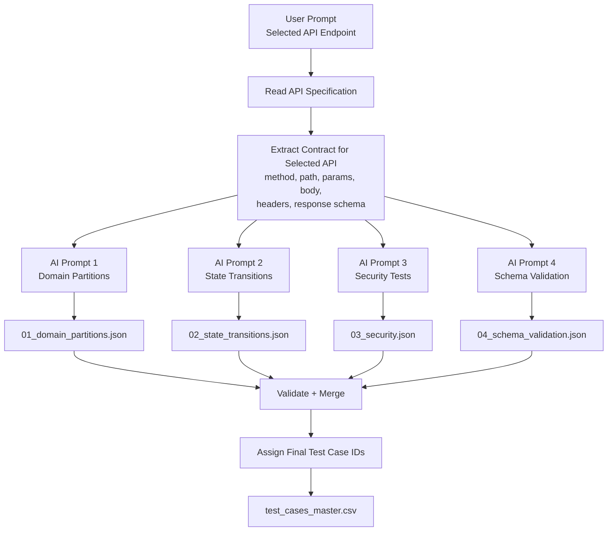

# G9.5 - AI-driven API Test Generator Design

## Goal

Design an AI-driven generator that reads the EShop API specification and automatically produces API test cases for a selected endpoint.

The key idea is to split generation into four focused AI prompts instead of asking AI to generate everything at once.

## Self-drawn Diagram



## Main Design

The generator has five main steps:

1. Receive the selected API endpoint from the user's prompt.
2. Read the API specification.
3. Extract only the contract of the selected endpoint: method, path, parameters, request body, headers, response schema, and related requirements.
4. Ask AI to generate test cases in four separated stages:
   - Domain partition tests
   - State transition tests
   - Security tests
   - Schema validation tests
5. Validate and merge all generated test cases into one CSV file.

## Pseudocode

```text
PROCEDURE GenerateApiTests(apiSpecification, selectedEndpoint)
    api <- selectedEndpoint
    spec <- Read(apiSpecification)
    contract <- ExtractContract(spec, api)

    domainTests <- AskAI(
        "Generate domain partition test cases from this API contract"
    )
    Save(domainTests, "01_domain_partitions.json")

    stateTests <- AskAI(
        "Generate state transition test cases from this API contract"
    )
    Save(stateTests, "02_state_transitions.json")

    securityTests <- AskAI(
        "Generate security test cases using SEC-01 to SEC-07 where applicable"
    )
    Save(securityTests, "03_security.json")

    schemaTests <- AskAI(
        "Generate schema validation test cases from the response specification"
    )
    Save(schemaTests, "04_schema_validation.json")

    allTests <- Merge(domainTests, stateTests, securityTests, schemaTests)
    allTests <- ValidateFormat(allTests)
    allTests <- AssignFinalIds(allTests)

    ExportCsv(allTests, "test_cases_master.csv")
END PROCEDURE
```

## Output

```text
API-testing/<api-slug>/
  01_domain_partitions.json
  02_state_transitions.json
  03_security.json
  04_schema_validation.json
  test_cases_master.csv
```

## Why This Satisfies Create Level

This is a Create-level design because the system does not manually list test cases. It uses the API specification as input, guides AI through multiple focused prompts, then validates and consolidates the generated results into an executable test case set.
