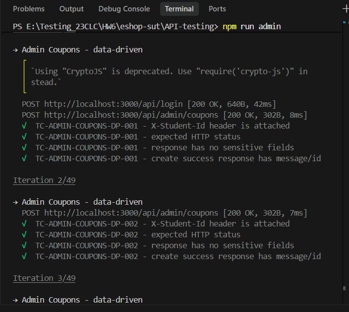
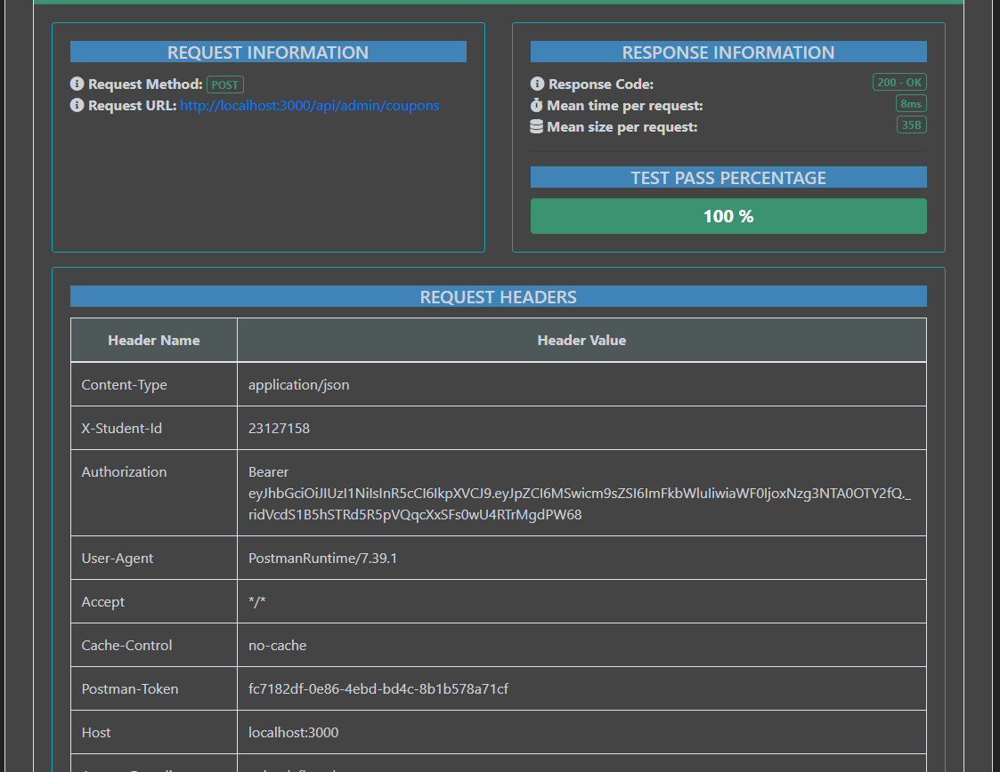
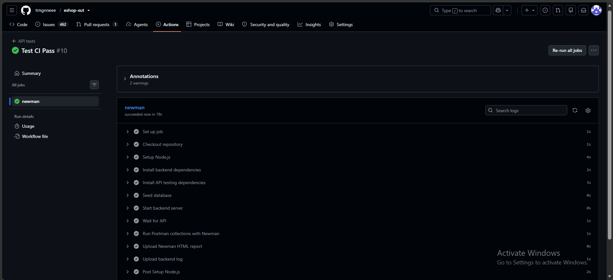
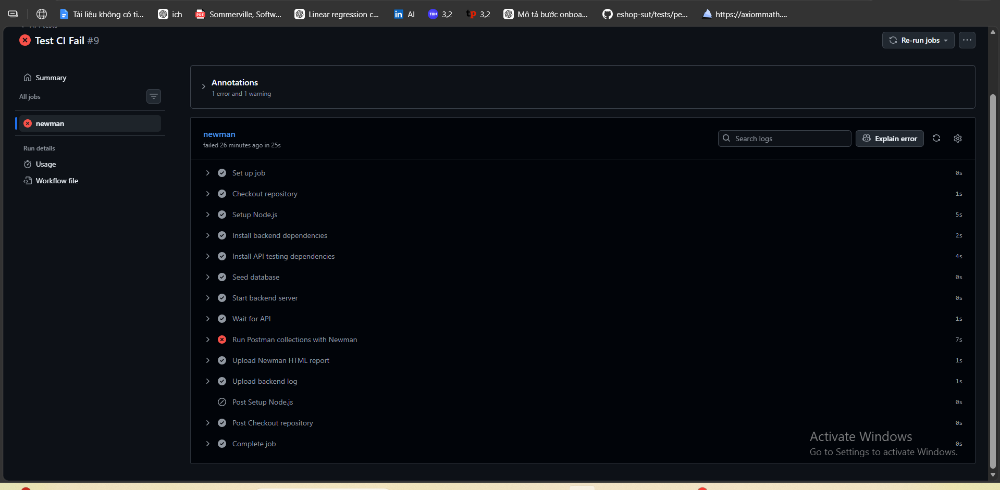
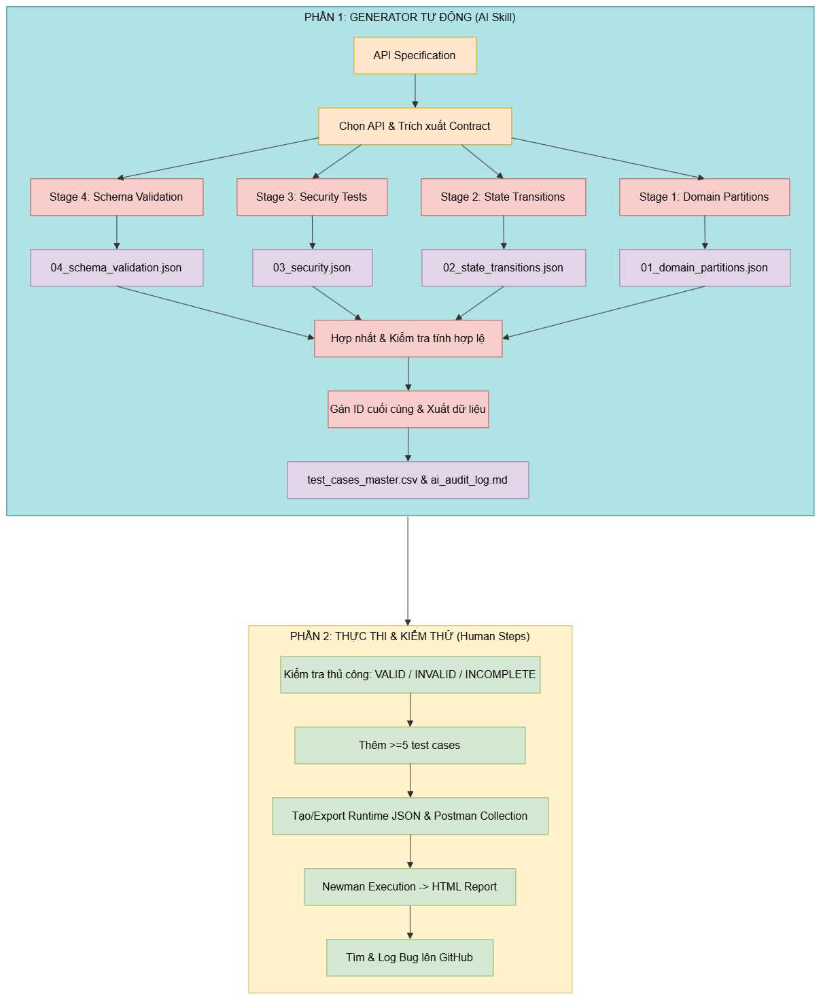

# Báo cáo chính HW06 - API Testing

> Phạm vi: chỉ viết Sections 1-5 theo template.  
> Nguồn bằng chứng: các artifact trong `API-testing/`, file `api_specification.md` ở root, và workflow `.github/workflows/api-tests.yml`.

---

# 1. Thông tin chung

## 1.1 Thông tin sinh viên

| Trường | Thông tin |
|---|---|
| Họ tên | Chưa có trong artifact |
| MSSV | `23127158` |
| Lớp | Chưa có trong artifact |
| Môn học | API Testing / Software Testing |
| Bài tập | `HW06 - API Testing` |
| Hình thức nộp | Bài cá nhân |
| GitHub Repository | `https://github.com/trngnneee/eshop-sut` |
| Ngày nộp | `2026-08-23` |

## 1.2 Hệ thống được kiểm thử

| Trường | Thông tin |
|---|---|
| System Under Test | `EShop` |
| Repository gốc | `https://github.com/ttbhanh/eshop-sut` |
| Repository kiểm thử | `https://github.com/trngnneee/eshop-sut` |
| Base URL | `http://localhost:3000` |
| Môi trường kiểm thử | Local Windows workspace; GitHub Actions dùng `ubuntu-latest`; backend chạy bằng Node.js |
| Công cụ API testing | Postman collection JSON |
| CLI runner | Newman với `newman-reporter-htmlextra` |
| CI/CD | GitHub Actions |

### Mục tiêu

Mục tiêu của HW06 là tạo, audit, mở rộng, thực thi và báo cáo test API cho ba feature được chọn của EShop. Ba API được chọn bao phủ đủ ba pool bắt buộc: Pool A authentication (`FR-03`), Pool B coupon application (`FR-09`), và Pool C admin coupon management (`FR-17`). Test case được sinh bằng quy trình AI-driven theo từng stage, sau đó được review thủ công, bổ sung các case người kiểm thử tự phát hiện, chạy bằng Postman/Newman và tổng hợp thành bug report.

## 1.3 Các API được chọn

| API | Pool | Functional Requirement | Endpoint(s) | Mô tả |
|---|---|---|---|---|
| API 1 | Pool A | `FR-03` | `POST /api/forgot-password`, liên quan `POST /api/reset-password` | Luồng quên mật khẩu và reset password bằng OTP/reset token |
| API 2 | Pool B | `FR-09` | `POST /api/apply-coupon`, liên quan `POST /api/coupon-usage` | Áp dụng coupon, kiểm công thức giảm giá, điều kiện dùng, quota và security |
| API 3 | Pool C | `FR-17` | `POST /api/admin/coupons`, `DELETE /api/admin/coupons/:id` | Admin tạo/xóa coupon, kiểm validation, role access và response schema |

---

# 2. API Testing

## 2.1 API 1 - Forgot Password (`FR-03`)

### 2.1.1 Tổng quan API

| Thuộc tính | Giá trị |
|---|---|
| Pool | Pool A |
| Functional Requirement | `FR-03 - Forgot password and password reset` |
| Endpoint(s) | `POST /api/forgot-password`, liên quan `POST /api/reset-password` |
| Authentication | `forgot-password` không yêu cầu token; `reset-password` dùng email/reset token |
| Security liên quan | `SEC-07`, validation, SQLi/XSS, user enumeration, cache-sensitive token response |
| Input chính | `email`; reset flow dùng thêm `email`, `resetToken`, `newPassword` |
| Response chính | Thành công trả JSON có message/reset token trong SUT này; lỗi validation/security nên trả JSON ổn định |

API này bắt đầu luồng reset password bằng cách nhận email và sinh reset token/OTP. Endpoint `POST /api/reset-password` được dùng như endpoint liên quan để kiểm tra vòng đời đầy đủ của token: token thuộc đúng email, không dùng lại, bị vô hiệu khi có token mới, và có kiểm password policy hay không.

### 2.1.2 Test case do AI sinh

| Loại bao phủ | Số test case | Ghi chú |
|---|---:|---|
| Domain Partition | 14 | Email format, thiếu/rỗng/null/sai kiểu, content type |
| State Transition | 9 | Vòng đời reset token và các flow forgot-password/reset-password lặp lại |
| Security | 15 | OTP entropy, rate limit, SQLi/XSS, user enumeration, token behavior |
| Schema Validation | 7 | Response body thành công/lỗi và kiểm dữ liệu nhạy cảm |
| **Tổng stage output ban đầu do AI sinh** | **45** | Các file `01_domain_partitions.json` đến `04_schema_validation.json` |
| **AI rows còn lại trong CSV cuối** | **38** | CSV cuối gồm AI rows đã review và human extensions |

AI generation được thực hiện bằng Codex/GPT-5 dựa trên API specification của EShop. Quy trình tách thành bốn stage: domain partitions, state transitions, security và schema validation. Prompt và output được ghi trong `API-testing/forgot-password/ai_audit_log.md`.

### 2.1.3 Human Audit

| Audit Status | Số lượng |
|---|---:|
| VALID | 33 |
| INVALID | 2 |
| INCOMPLETE | 3 |
| **Tổng AI rows được review** | **38** |

Các case invalid/incomplete đã được review và sửa trong `API-testing/forgot-password/test_cases_master.csv`. Các human-added rows không tính vào số lượng audit AI.

### 2.1.4 Test case người kiểm thử bổ sung

| TC ID | Mục tiêu kiểm thử | Lý do bổ sung | Vì sao AI có thể bỏ sót |
|---|---|---|---|
| `HT-FORGOT-EXT-001` | OTP của user A không reset được password user B | Kiểm ownership của token giữa các user | Prompt tập trung quá hẹp vào `POST /api/forgot-password` |
| `HT-FORGOT-EXT-002` | OTP đã dùng không được dùng lại | Kiểm trạng thái consumed token | AI mô tả lifecycle nhưng chưa chuyển thành flow execute cụ thể |
| `HT-FORGOT-EXT-003` | OTP mới vô hiệu OTP cũ | Kiểm state transition thay thế token | Prompt chưa ép test sequence nhiều bước A/B token |
| `HT-FORGOT-EXT-004` | Reset password phải kiểm password policy | Kiểm `newPassword` yếu | AI tập trung vào email và OTP, bỏ sót body của reset-password |
| `HT-FORGOT-EXT-005` | Hai request song song dùng cùng OTP không được cùng thành công | Kiểm race condition | AI thường sinh single-request tests |
| `HT-FORGOT-EXT-006` | GET không được tạo OTP | Kiểm method confusion | Prompt chưa yêu cầu method-level hardening |
| `HT-FORGOT-EXT-007` | Response chứa reset token không được cache | Kiểm security headers | AI kiểm response body nhiều hơn transport/header security |

### 2.1.5 Thực thi test

| Metric | Số lượng |
|---|---:|
| Final Test Cases | 45 |
| Executed | 45 |
| Passed | 22 |
| Failed | 23 |
| Blocked | 0 |
| Not Executed | 0 |

Các failure đáng chú ý gồm: invalid email/body vẫn trả response thành công hoặc không ổn định, OTP chỉ có 4 chữ số, thiếu rate limiting, có user enumeration, chấp nhận password yếu và thiếu cache-control cho reset token.

**Thiết lập thực thi**

- Collection: `API-testing/forgot_password.postman_collection.json`
- Environment: `API-testing/eshop_api.postman_environment.json`
- Data file: `API-testing/data/forgot-password.test-data.json`
- Pre-request script: chuẩn bị request body, lưu OTP/reset token khi flow cần, và xử lý các flow reset-password nhiều bước.
- Test script: kiểm HTTP status, JSON response shape, OTP format, sensitive field leakage và các assertion riêng của từng flow.
- `X-Student-Id`: gắn giá trị `23127158` qua collection/environment variables và request headers.
- Newman command: chạy `npm run forgot` trong thư mục `API-testing`.
- Bằng chứng thực thi: `API-testing/forgot-password--report.html`.

### 2.1.6 Bug tìm được

| Bug Report | Nhóm lỗi |
|---|---|
| `BUG-FORGOT-001-invalid-input-status.md` | Input forgot-password không hợp lệ trả status/behavior sai |
| `BUG-FORGOT-002-email-trim-normalization.md` | Lỗi trim/normalization email |
| `BUG-FORGOT-003-missing-otp-rate-limit.md` | Thiếu rate limit khi request OTP |
| `BUG-FORGOT-004-otp-only-four-digits.md` | OTP không đủ entropy/độ dài |
| `BUG-FORGOT-005-user-enumeration.md` | User enumeration qua response forgot-password |
| `BUG-FORGOT-006-weak-password-accepted.md` | Reset-password chấp nhận password yếu |
| `BUG-FORGOT-007-reset-token-cacheable.md` | Response chứa reset token thiếu cache protection |

### 2.1.7 Tổng kết API

| Metric | Kết quả |
|---|---:|
| Initial AI-generated stage output | 45 |
| AI rows retained after audit | 38 |
| VALID | 33 |
| INVALID | 2 |
| INCOMPLETE | 3 |
| Human-added | 7 |
| Final Test Cases | 45 |
| Executed | 45 |
| Passed | 22 |
| Failed | 23 |
| Blocked | 0 |
| Not Executed | 0 |
| Confirmed Bugs | 7 |

---

## 2.2 API 2 - Apply Coupon (`FR-09`)

### 2.2.1 Tổng quan API

| Thuộc tính | Giá trị |
|---|---|
| Pool | Pool B |
| Functional Requirement | `FR-09 - Discount coupons` |
| Endpoint(s) | `POST /api/apply-coupon`, liên quan `POST /api/coupon-usage` |
| Authentication | Collection hỗ trợ cả row không auth và row dùng user token |
| Security liên quan | JWT/user binding, SQLi/XSS, rate limit, input validation, monetary invariants |
| Input chính | `code`, `total_amount`, `user_id` |
| Response chính | Thành công nên có `discount_amount` và `final_amount`; lỗi nên là JSON |

API này preview hoặc áp dụng tính toán giảm giá dựa trên coupon seed data và request body. Test suite cũng kiểm việc API có vô tình thay đổi `coupon_usage` trong lúc preview hay không, và liệu `user_id` có thể bị spoof để áp dụng coupon thay user khác hay không.

### 2.2.2 Test case do AI sinh

| Loại bao phủ | Số test case | Ghi chú |
|---|---:|---|
| Domain Partition | 17 | Coupon code, total amount, user id, content type |
| State Transition | 8 | Active/expired/deleted coupon và usage-quota states |
| Security | 10 | Auth/user binding, SQLi/XSS, brute force, client-side tampering |
| Schema Validation | 7 | Response fields, money types, error schema |
| **Tổng stage output ban đầu do AI sinh** | **42** | Các file `01_domain_partitions.json` đến `04_schema_validation.json` |
| **AI rows còn lại trong CSV cuối** | **42** | Trước khi thêm 7 human extensions |

AI generation được thực hiện theo stage từ API specification, sau đó audit thủ công dựa trên seed data và Newman report thực tế. Audit log nằm ở `API-testing/apply-coupon/ai_audit_log.md`.

### 2.2.3 Human Audit

| Audit Status | Số lượng |
|---|---:|
| VALID | 32 |
| INVALID | 1 |
| INCOMPLETE | 9 |
| **Tổng AI rows được review** | **42** |

Một số case incomplete đã được sửa vì data ban đầu tham chiếu coupon không tồn tại trong seed data hoặc expected status còn mơ hồ.

### 2.2.4 Test case người kiểm thử bổ sung

| TC ID | Mục tiêu kiểm thử | Lý do bổ sung | Vì sao AI có thể bỏ sót |
|---|---|---|---|
| `HT-APPLY-EXT-001` | Coupon percent `SAVE10` phải tính đúng 10% | Kiểm công thức bằng seed data cụ thể | AI chỉ kiểm shape, chưa kiểm arithmetic cụ thể |
| `HT-APPLY-EXT-002` | Coupon fixed `BIGBUY` phải giảm đúng số tiền cố định | Tách nhánh fixed khỏi percent | AI tập trung vào valid coupon chung |
| `HT-APPLY-EXT-003` | Không được tạo final amount âm hoặc tăng tổng tiền | Kiểm invariant tiền tệ | AI chưa suy luận sâu về invariant giá tiền |
| `HT-APPLY-EXT-004` | `user_id=null` không được bypass quota | Kiểm falsy value edge case | AI bỏ sót null như một partition riêng |
| `HT-APPLY-EXT-005` | `user_id=0` không được bypass quota | Kiểm behavior kiểu implementation | AI không phân tích code path như `if (user_id)` |
| `HT-APPLY-EXT-006` | Preview không được tăng `coupon_usage` | Tách preview khỏi persisted usage | Hidden state nằm ở endpoint liên quan |
| `HT-APPLY-EXT-007` | Code có khoảng trắng đầu/cuối phải xử lý nhất quán | Kiểm normalization boundary | AI chỉ test code toàn khoảng trắng |

### 2.2.5 Thực thi test

| Metric | Số lượng |
|---|---:|
| Final Test Cases | 49 |
| Executed | 49 |
| Passed | 17 |
| Failed | 31 |
| Blocked | 1 |
| Not Executed | 0 |

Case blocked được đánh dấu `BLOCKED` trong CSV/report thay vì để fail như lỗi thông thường. Phần lớn failure tập trung vào tính sai discount, validation chưa đủ, thiếu auth/user binding, thiếu rate limit và lỗi quota/state.

**Thiết lập thực thi**

- Collection: `API-testing/apply_coupon.postman_collection.json`
- Environment: `API-testing/eshop_api.postman_environment.json`
- Data file: `API-testing/data/apply-coupon.test-data.json`
- Pre-request script: load row data động và lazy-login seed user khi row cần `{{userToken}}`.
- Test script: kiểm status, response schema, công thức tính tiền, money invariants, skipped/blocked behavior và error bodies.
- `X-Student-Id`: gắn giá trị `23127158` qua request headers.
- Newman command: chạy `npm run apply` trong thư mục `API-testing`.
- Bằng chứng thực thi: `API-testing/apply-coupon-report.html`.

### 2.2.6 Bug tìm được

| Bug Report | Nhóm lỗi |
|---|---|
| `BUG-APPLY-COUPON-001-negative-discount-calculation.md` | Tính `discount_amount/final_amount` sai hoặc không an toàn |
| `BUG-APPLY-COUPON-002-invalid-input-accepted.md` | Chấp nhận request fields không hợp lệ |
| `BUG-APPLY-COUPON-003-non-json-content-type-500.md` | Non-JSON content type gây server error không ổn định |
| `BUG-APPLY-COUPON-004-min-order-boundary-rejected.md` | Xử lý sai boundary tại minimum order amount |
| `BUG-APPLY-COUPON-005-usage-quota-not-enforced.md` | Không enforce coupon usage quota đúng |
| `BUG-APPLY-COUPON-006-malicious-code-bypasses-lookup.md` | Xử lý sai malicious coupon code payload |
| `BUG-APPLY-COUPON-007-missing-rate-limit.md` | Thiếu rate limit khi brute-force coupon code |
| `BUG-APPLY-COUPON-008-missing-auth-and-user-binding.md` | Thiếu authentication và user binding |

### 2.2.7 Tổng kết API

| Metric | Kết quả |
|---|---:|
| Initial AI-generated stage output | 42 |
| AI rows retained after audit | 42 |
| VALID | 32 |
| INVALID | 1 |
| INCOMPLETE | 9 |
| Human-added | 7 |
| Final Test Cases | 49 |
| Executed | 49 |
| Passed | 17 |
| Failed | 31 |
| Blocked | 1 |
| Not Executed | 0 |
| Confirmed Bugs | 8 |

---

## 2.3 API 3 - Admin Coupons (`FR-17`)

### 2.3.1 Tổng quan API

| Thuộc tính | Giá trị |
|---|---|
| Pool | Pool C |
| Functional Requirement | `FR-17 - Coupon management` |
| Endpoint(s) | `POST /api/admin/coupons`, `DELETE /api/admin/coupons/:id` |
| Authentication | Cần JWT; kỳ vọng role admin cho admin operations |
| Security liên quan | `SEC-02`, `SEC-03`, `SEC-04`, `SEC-05`, role escalation, forged JWT, validation |
| Input chính | `code`, `type`, `discount_value`, `min_order_amount`, `expired_at`, `max_uses_per_user`; DELETE path `id` |
| Response chính | Create success trả message/id; delete success trả message; lỗi nên dùng status code JSON ổn định |

API này quản lý coupon ở phía admin. Collection bao phủ cả create và delete vì `FR-17` là coupon CRUD. Các row ngoài scope `POST/DELETE /api/admin/coupons` được giữ trong CSV để traceability nhưng đánh dấu `NOT EXECUTED`.

### 2.3.2 Test case do AI sinh

| Loại bao phủ | Số test case | Ghi chú |
|---|---:|---|
| Domain Partition | 15 | Required fields, enum, numeric boundaries, date, extra fields |
| State Transition | 8 | Create active, duplicate, delete active/deleted và các state case apply-coupon ngoài scope |
| Security | 11 | JWT missing/invalid, role, SQLi/XSS, mass assignment, DELETE authorization |
| Schema Validation | 8 | Success/error schemas cho create/delete |
| **Tổng stage output ban đầu do AI sinh** | **42** | Các file `01_domain_partitions.json` đến `04_schema_validation.json` |
| **AI rows còn lại trong CSV cuối** | **42** | Trước khi thêm 7 human extensions |

Các case AI-generated được audit và sửa lại theo scope hiện tại. `DELETE /api/admin/coupons/:id` được chấp nhận là một phần của `FR-17`; các row `POST /api/apply-coupon` vẫn là ngoài scope thực thi hiện tại.

### 2.3.3 Human Audit

| Audit Status | Số lượng |
|---|---:|
| VALID | 37 |
| INVALID | 4 |
| INCOMPLETE | 1 |
| **Tổng AI rows được review** | **42** |

Các row invalid chủ yếu là apply-coupon ngoài scope hoặc case không áp dụng được vì SUT không có tenant/store scope. Các DELETE cases đã được chuyển thành data-driven fixture chạy được.

### 2.3.4 Test case người kiểm thử bổ sung

| TC ID | Mục tiêu kiểm thử | Lý do bổ sung | Vì sao AI có thể bỏ sót |
|---|---|---|---|
| `HT-ADMIN-EXT-001` | Duplicate race: chỉ một request cùng code được thắng | Kiểm concurrency/state transition | AI thường sinh request tuần tự |
| `HT-ADMIN-EXT-002` | Thiếu `max_uses_per_user` phải bị từ chối | Kiểm required field bị AI bỏ sót | AI chưa duyệt máy móc từng required field |
| `HT-ADMIN-EXT-003` | Fixed coupon không được vượt số tiền có thể áp dụng | Tránh downstream negative final amount | AI áp tư duy percent discount cho fixed coupon |
| `HT-ADMIN-EXT-004` | Code có khoảng trắng đầu/cuối không được lưu thành coupon khác | Kiểm canonicalization | AI chỉ test empty/whitespace code |
| `HT-ADMIN-EXT-005` | Duplicate khác hoa/thường phải bị từ chối | Kiểm uniqueness sau normalization | Prompt chưa yêu cầu canonical uniqueness |
| `HT-ADMIN-EXT-006` | `max_uses_per_user` thập phân phải bị từ chối | Kiểm integer constraint | AI test lower bound nhưng chưa test integer-vs-number |
| `HT-ADMIN-EXT-007` | JWT role payload bị chỉnh sửa phải bị từ chối | Kiểm forged token | AI có bad-token generic nhưng chưa kiểm role tampering |

### 2.3.5 Thực thi test

| Metric | Số lượng |
|---|---:|
| Final Test Cases | 49 |
| Executed | 45 |
| Passed | 14 |
| Failed | 31 |
| Blocked | 0 |
| Not Executed | 4 |

Bốn row `NOT EXECUTED` là các apply-coupon state cases được giữ trong master CSV để traceability nhưng nằm ngoài scope chạy admin-coupons hiện tại. Các failure đã chạy cho thấy thiếu validation, thiếu enforce role admin, phân biệt sai `401/403`, duplicate trả raw SQLite error, và DELETE không phân biệt resource không tồn tại.

**Thiết lập thực thi**

- Collection: `API-testing/admin_coupons.postman_collection.json`
- Environment: `API-testing/eshop_api.postman_environment.json`
- Data file: `API-testing/data/admin-coupons.test-data.json`
- Pre-request script: auto-login admin/user token, tạo coupon fixture tạm cho DELETE cases, và chuẩn bị forged/expired token variables.
- Test script: kiểm status, success create/delete schemas, error-only responses, no sensitive fields, SQL/XSS leakage và normalization assertions.
- `X-Student-Id`: gắn giá trị `23127158` qua request headers.
- Newman command: chạy `npm run admin` trong thư mục `API-testing`.
- Bằng chứng thực thi: `API-testing/admin-coupons-report.html`.

### 2.3.6 Bug tìm được

| Bug Report | Nhóm lỗi |
|---|---|
| `BUG-ADMIN-COUPONS-001-invalid-fields-accepted.md` | Chấp nhận coupon fields không hợp lệ/không an toàn |
| `BUG-ADMIN-COUPONS-002-duplicate-returns-500-sqlite-leak.md` | Duplicate coupon trả `500` và lộ SQLite error |
| `BUG-ADMIN-COUPONS-003-user-role-can-create-coupon.md` | User role có thể tạo/xóa admin coupons |
| `BUG-ADMIN-COUPONS-004-invalid-token-status-code.md` | Invalid/tampered token trả `403` thay vì `401` |
| `BUG-ADMIN-COUPONS-005-code-normalization-uniqueness.md` | Thiếu normalization/uniqueness cho coupon code |
| `BUG-ADMIN-COUPONS-006-dangerous-code-payload-not-rejected.md` | SQLi/XSS-like code payload không được từ chối an toàn |
| `BUG-ADMIN-COUPONS-007-delete-nonexistent-returns-200.md` | DELETE coupon không tồn tại/đã xóa vẫn trả `200` |

### 2.3.7 Tổng kết API

| Metric | Kết quả |
|---|---:|
| Initial AI-generated stage output | 42 |
| AI rows retained after audit | 42 |
| VALID | 37 |
| INVALID | 4 |
| INCOMPLETE | 1 |
| Human-added | 7 |
| Final Test Cases | 49 |
| Executed | 45 |
| Passed | 14 |
| Failed | 31 |
| Blocked | 0 |
| Not Executed | 4 |
| Confirmed Bugs | 7 |

---

# 3. Các tính năng Postman đã sử dụng

| Tính năng | Cách sử dụng | Mục đích |
|---|---|---|
| Collections | Ba collection riêng: `forgot_password`, `apply_coupon`, `admin_coupons` | Giữ từng API độc lập, dễ chạy và review |
| Environment Variables | `baseUrl`, `studentId`, seed credentials, token placeholders | Tái sử dụng cấu hình local và CI |
| Collection Variables | Lưu `adminToken`, `userToken`, OTP, run IDs, fixture coupon IDs | Chia sẻ state giữa pre-request và test scripts |
| Pre-request Scripts | Build request động, login khi cần, sinh forged tokens, tạo/xóa fixtures | Hỗ trợ stateful và security tests |
| Test Scripts | Assert status, JSON schema, business values, sensitive fields, skip/blocked behavior | Biến mỗi CSV/data row thành executable validation |
| Data-driven Testing | Các file `data/*.test-data.json` điều khiển iterations | Một iteration tương ứng một test case |
| Collection Runner / Newman | Newman chạy collection từ CLI | Thực thi lặp lại được ở local và CI |

### Bằng chứng `X-Student-Id`




---

# 4. Tích hợp CI/CD

## 4.1 Thiết kế pipeline

- Trigger: `push`, `pull_request`, và `workflow_dispatch`
- Các bước chính:
  1. Checkout repository.
  2. Setup Node.js 20 với npm cache cho lockfile của backend và `API-testing`.
  3. Cài backend dependencies bằng `npm ci`.
  4. Cài API-testing dependencies bằng `npm ci`.
  5. Seed database của backend.
  6. Start backend server và chờ `GET /api/products` trả `200`.
  7. Chạy `npm run forgot`, `npm run apply`, và `npm run admin`.
  8. Upload ba Newman HTML reports và backend log làm artifacts.

Workflow chạy cả ba collection ngay cả khi một collection fail. Pipeline lưu exit code từng lần chạy, in summary, và chỉ fail job ở cuối nếu có bất kỳ Newman run nào fail. Cách này vừa nghiêm ngặt, vừa đảm bảo vẫn có report cho cả ba API.

## 4.2 Lần chạy all-passing

| Thuộc tính | Giá trị |
|---|---|
| Commit | Test CI Pass |
| Evidence |  |
| Link | https://github.com/trngnneee/eshop-sut/actions/runs/32650890035 |

## 4.3 Lần chạy failing

| Thuộc tính | Giá trị |
|---|---|
| Commit | Test CI Fail |
| Evidence |  |
| Link | https://github.com/trngnneee/eshop-sut/actions/runs/32649108372 |

> [!NOTE]
> Lần chạy thành công (all-passing) thực tế chỉ sử dụng bộ test suite rút gọn (smoke test) nhằm xác minh cấu hình CI/CD pipeline hoạt động chính xác. Khi thực thi đầy đủ cả 3 collection kiểm thử thực tế, kết quả sẽ thất bại (fail) do các lỗi nghiệp vụ và bảo mật hiện có trên backend (chi tiết tại Mục 2).

---

# 5. AI-Driven API Test Generator

## 5.1 Mục tiêu

**Input:** API specification của EShop.  
**Output:** Các file JSON trung gian của 4 stage (`01_domain_partitions.json`, `02_state_transitions.json`, `03_security.json`, `04_schema_validation.json`), file gộp CSV master (`test_cases_master.csv`) và nhật ký tương tác AI (`ai_audit_log.md`).

Thiết kế generator chia quá trình sinh test thành bốn stage rõ ràng thay vì hỏi AI một prompt chung chung. Cách này giúp tách domain partitions, state transitions, security checks và schema validation thành các phần có thể audit được trước khi gộp thành file CSV tổng thể.

## 5.2 Inputs và Outputs

| Thành phần | Mô tả |
|---|---|
| Input | `api_specification.md` ở root và bản copy `API-testing/specs/api_specification.md` |
| Parser | Trích xuất endpoint, request fields, auth requirement, response shape và FR/SEC liên quan bằng human/AI-assisted process |
| Test Analysis | Suy luận theo stage: domain partitions, state transitions, security, schema validation |
| Test Generator | Codex/GPT-5 prompts được ghi trong `ai_audit_log.md` của từng API |
| Validator / Reviewer | Human audit bằng `VALID`, `INVALID`, `INCOMPLETE`, sau đó sửa các file test case JSON/CSV theo seed data và kết quả chạy thử |
| Output | `01_domain_partitions.json`, `02_state_transitions.json`, `03_security.json`, `04_schema_validation.json`, `test_cases_master.csv` và `ai_audit_log.md`. *Lưu ý: Các tài liệu/dữ liệu khác như Postman collections, Newman HTML reports và bug reports được tạo ở các bước kiểm thử tiếp theo do con người thực hiện, không phải là output trực tiếp của Generator.* |

## 5.3 Self-Drawn Diagram



## 5.4 Pseudocode

```text
PROCEDURE GenerateApiTests(apiSpecification, selectedEndpoint)
    api <- selectedEndpoint
    spec <- Read(apiSpecification)
    contract <- ExtractContract(spec, api)

    domainTests <- AskAI(
        "Generate domain partition test cases from this API contract"
    )
    Save(domainTests, "01_domain_partitions.json")

    stateTests <- AskAI(
        "Generate state transition test cases from this API contract"
    )
    Save(stateTests, "02_state_transitions.json")

    securityTests <- AskAI(
        "Generate security test cases using SEC-01 to SEC-07 where applicable"
    )
    Save(securityTests, "03_security.json")

    schemaTests <- AskAI(
        "Generate schema validation test cases from the response specification"
    )
    Save(schemaTests, "04_schema_validation.json")

    allTests <- Merge(domainTests, stateTests, securityTests, schemaTests)
    allTests <- ValidateFormat(allTests)
    allTests <- AssignFinalIds(allTests)

    ExportCsv(allTests, "test_cases_master.csv")
END PROCEDURE
```

## 5.5 Đánh giá thiết kế generator

### Điểm mạnh

- Thiết kế bốn stage buộc AI bao phủ có hệ thống thay vì dùng một prompt chung chung.
- Output của AI có trace rõ qua audit logs theo từng API, giúp review thủ công dễ hơn.
- Data-driven Postman collections cho phép giữ một request template dễ bảo trì nhưng vẫn chạy được nhiều test case.
- Human extension bắt được những gap AI thường bỏ sót, đặc biệt là sequence, security và hidden-state cases.

### Hạn chế

- AI vẫn sinh ra một số row invalid hoặc incomplete, đặc biệt khi seed data hoặc implementation behavior khác với đặc tả viết.
- Một số security/state scenario cần multi-step fixtures hoặc endpoint liên quan, nên dễ bị bỏ sót nếu chỉ nhìn một endpoint.
- Workspace local chưa có evidence GitHub Actions all-passing/failing run links; cần bổ sung sau khi chạy thật trên GitHub.
- Self-drawn generator diagram hiện mới được reference, chưa embed trực tiếp vào Markdown này.

---

> Kết thúc phạm vi Main Report theo template: Sections 1-5.
