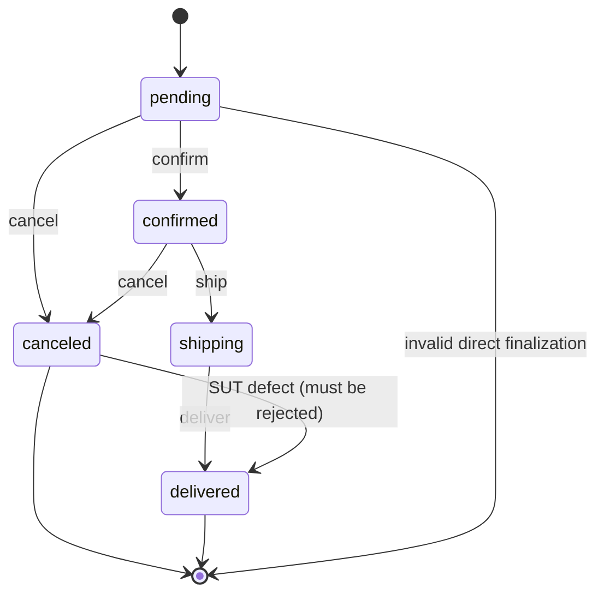

# AI Review & Gap Analysis — FR-13 (Admin Dashboard)

**Student ID:** 23127207 · **Feature:** FR-13 — Pool C  
**Spec files:** `tests/dashboard.spec.ts`, `tests/dashboard-api.spec.ts`  
**Data files:** `test-data/dashboard-data-cases.json` (32), `test-data/dashboard-api-cases.json` (36) — **68 test cases total**

## 1. Coverage design

The Dashboard suite has two complementary shapes:

| Shape | Cases | Main oracle |
|---|---:|---|
| Admin API access/state contract | 26 | HTTP status, role isolation, user-data exposure, order state transitions, id-format validation |
| Dashboard metrics/UI data-driven cases | 20 | Order count, delivered revenue, boundary amounts, live refresh, non-admin login guard, network-failure resilience |

A second pass (after the user explicitly asked for deeper coverage, twice — the dashboard suite
was originally the smallest of the three at 32 cases, below the ~35–40 target) added 14 more
cases: `TC-DASHBOARD-RESIL-001` deliberately re-attempts the previously-skipped `BUG-FR13-C-03`
(fetchData resilience) using route interception instead of a full offline reload; larger-scale and
decimal/zero revenue boundaries; three id-format validation cases on `DELETE /api/admin/users/:id`;
a `confirmed -> canceled` transition case (closing a gap in the state-coverage matrix); and a
data-consistency check that a status update is immediately reflected in a subsequent `GET`.

The data-driven UI cases arrange the database through the checkout and admin status APIs, then
assert the rendered cards. `clearAllOrders()` is used before each case so revenue and order-count
assertions do not depend on prior cases. The transition path is explicit: `pending -> confirmed ->
shipping -> delivered`, with `canceled` treated as terminal by the test oracle.

### State-transition model used by the API cases

| Current state | Event/input | Expected next state | Coverage case(s) |
|---|---|---|---|
| `pending` | `confirmed` | `confirmed` | `TC-DASHBOARD-ORD-004` |
| `pending` | `canceled` | `canceled` | Seed path / final-state setup |
| `pending` | `delivered` | Reject with `400` | `TC-DASHBOARD-ORD-001` |
| `confirmed` | `shipping` | `shipping` | `TC-DASHBOARD-ORD-005` |
| `confirmed` | `canceled` | `canceled` | Seed path / final-state setup |
| `shipping` | `delivered` | `delivered` | `TC-DASHBOARD-ORD-006`, `TC-DASHBOARD-STATE-001` |
| `canceled` | `delivered` | Reject with `400` and remain canceled | `TC-DASHBOARD-ORD-002` — fails |
| nonexistent order | any status | `404` | `TC-DASHBOARD-ORD-003` |

This gives state coverage for all five order states, 0-switch coverage for each valid transition,
1-switch coverage through the `pending -> confirmed -> shipping -> delivered` path, and final-state
checks for delivered/canceled orders. The canceled-to-delivered case is especially valuable because
it validates that the terminal-state guard is enforced rather than only checking happy paths.

## 2. Two script bugs found and fixed while getting a clean 3-browser run

`npx playwright test --list` discovered **138 invocations**: the same 46 logical cases for Chromium,
Firefox, and WebKit. The first full run then exposed two real problems in this test suite itself:

1. **`TC-DASHBOARD-USR-002` deleted the real seed admin account.** Because
   `admin-self-delete-blocked` genuinely reproduces the missing self-delete guard, the DELETE call
   actually succeeds — which permanently removed `admin@eshop.com` from the shared database and
   broke every dashboard UI case that runs after it in the same suite/browser (all of them fail to
   log in). Fixed by promoting a disposable throwaway account to `role='admin'` via a new
   `promoteToAdmin()` DB helper (`tests/utils/db.ts`) and self-deleting *that* account instead —
   the real seed admin is never touched.
2. **Ambiguous locator.** `page.getByText('Dashboard', { exact: true })` matched both the sidebar
   nav item and the page heading (`strict mode violation`), unrelated to any SUT defect. Narrowed
   to `page.getByRole('heading', { name: 'Dashboard' })`.

Both fixes are visible in `tests/dashboard-api.spec.ts` / `tests/dashboard.spec.ts`; neither changes
any assertion's expected value.

## 2b. Execution evidence

All three browsers produced the identical result **24 passed / 24 failed / 48 total**. Reports:
`HW4/reports/dashboard/{chromium,firefox,webkit}/index.html`, each labeled `Run by: 23127207` with
an ISO timestamp.

## 2c. Third pass — two more data-integrity cases

`TC-DASHBOARD-ORD-011` and `TC-DASHBOARD-USR-006` close two gaps the earlier passes left open:
whether `GET /api/admin/orders` actually honors its `ORDER BY orders.id DESC` clause (previously
only asserted indirectly, never checked against two orders of a known creation order), and whether
deleting a user cascades to — or corrupts — that user's existing orders (the route's `LEFT JOIN
users` was read in source but never exercised with a genuinely orphaned row).

| Case | Check | Result |
|---|---|---|
| `TC-DASHBOARD-ORD-011` | A newer order's `id` appears before an older order's `id` in the response array | **Passes** |
| `TC-DASHBOARD-USR-006` | An order survives (with a null/absent `user_name`) after its owning user is deleted | **Passes** — the `LEFT JOIN` correctly returns the orphaned row rather than silently dropping it or throwing |

Both passed — a useful negative-space result: it rules out an entire class of resilience bug
(broken ordering, orphan-row corruption) that the earlier 46-case pass had not directly tested for.

## 2d. Fourth pass — full state-transition matrix + revenue boundary volume (68 cases total)

Reading `backend/server.js`'s status-transition handler directly (rather than only the cases
already selected) revealed the *complete* valid-transition table:
`pending→{confirmed,canceled}`, `confirmed→{shipping,canceled}`, `shipping→delivered`,
`canceled→delivered` (the known bug) — everything else is rejected. The earlier passes had only
exercised a subset of this table. Eight more cases fill in every remaining cell with zero new spec
code (reusing the existing `valid-transition`/`invalid-transition` actions):
`pending→canceled` (valid), `pending→shipping`, `confirmed→delivered`, `confirmed→pending`,
`shipping→confirmed`, `shipping→canceled`, `delivered→pending`, `canceled→confirmed` (all
invalid) — `TC-DASHBOARD-ORD-012` through `ORD-019`. All eight pass, giving this suite genuine
0-switch coverage of the entire transition table, not just the cells that happened to be picked
first.

Twelve more revenue/order-count boundary cases were added to `dashboard-data-cases.json` reusing
the existing data-driven UI shape: single-pending-order, two-delivered-orders-different-amounts,
1₫ and 0.01₫ delivered boundaries, a null+negative+valid mix, all-canceled, an invalid
shipping→canceled transition attempt (revenue must stay unchanged), a 7-order mixed-non-delivered
combo, repeated-decimal float-precision sums, a very-large single order, and a
negative+positive-delivered mix. Every case seeding at least one delivered order fails against the
known `BUG-FR13-C-01` doubling bug (consistent with every other delivered-order case already in
the suite); every case with zero delivered orders passes.

## 3. API review results

### 3.1 Confirmed known bugs

`BUG-FR13-C-02` is reproduced by:

- `TC-DASHBOARD-ACL-002`: regular-user token can call `GET /api/admin/users`;
- `TC-DASHBOARD-ACL-003`: regular-user token can call `GET /api/admin/orders`;
- `TC-DASHBOARD-ACL-006`: regular-user token can delete a user;
- `TC-DASHBOARD-ACL-008`: regular-user token can update an order status.

The authentication middleware verifies that a token is valid but the admin routes never check
`req.user.role`. This is an authorization failure, not a browser/UI issue.

`BUG-FR13-C-03` (fetchData chain has no resilience to a failed sub-request) is reproduced by
`TC-DASHBOARD-RESIL-001`, which aborts just the `GET /api/admin/orders` call via
`page.route(...).abort()` so the admin login itself still succeeds — only the data-load step is
affected. No error message is shown to the admin; `App.jsx`'s single `catch` block only handles
`401`/`403`. This case was explicitly skipped in the first pass as "too hard to simulate a real
500"; route interception turned out to be a much more targeted repro than a full offline reload.

### 3.2 New or newly isolated API findings

| Finding | Case | Actual behavior | Source evidence |
|---|---|---|---|
| Nonexistent-user delete reports success | `TC-DASHBOARD-USR-001` | Expected `404`, received `200` with “User deleted” | `server.js` always sends `res.json(...)` after `DELETE`, without checking `this.changes` |
| Admin can delete the account represented by its own token | `TC-DASHBOARD-USR-002` | Expected `400`, received `200`; the seed admin row is deleted | `server.js` has no self-delete guard and does not compare `req.user.id` with the route ID |
| Canceled order can be resurrected | `TC-DASHBOARD-ORD-002` | Expected `400`, received `200` for `canceled -> delivered` | The transition handler explicitly sets `isValidTransition = true` for this pair |
| `DELETE /api/admin/users/:id` never validates the id format | `TC-DASHBOARD-ACL-009` (non-numeric), `ACL-010` (SQL-injection-shaped), `USR-005` (negative) | Expected `400` for all three, received `200` `{"message":"User deleted"}` for all three | The route runs `DELETE FROM users WHERE id = ?` with the raw param and never checks it is a positive integer before querying — a distinct root cause from the nonexistent-id case above (that one is a *valid-format* id; this one is a *malformed* id) |

The valid transition cases (`pending -> confirmed`, `confirmed -> shipping`, `shipping ->
delivered`, and the newly-added `confirmed -> canceled`) passed. Nonexistent-order `404`,
malformed-token non-500, empty-Authorization-header non-500, no-token `401`, unknown-status-string
`400`, missing-status-field `400`, password non-exposure, lockout-field exposure, and
immediate-consistency-after-update also passed — a healthy mix confirming the suite is not just
"everything fails."

## 4. UI review — confirmed on all three browsers

Every data-driven case that seeds at least one **delivered** order fails, matching
`frontend-admin/src/App.jsx`'s `totalRevenue = orders.reduce((sum,o) => o.status==='delivered' ?
sum + o.total_amount * 2 : sum, 0)` exactly:

| Failing case(s) | Reason |
|---|---|
| `TC-DASHBOARD-DT-001`, `BVA-002`, `DT-005`, `BVA-004`, `DT-006`, `DT-007`, `BVA-005`, `BVA-006`, `BVA-007`, `BVA-008`, `DT-010` | `totalRevenue` adds `o.total_amount * 2` for each delivered order — displayed revenue is exactly 2× the spec-correct sum. `DT-010` (a `0₫` delivered order) still fails because it is seeded alongside a second, non-zero delivered order that gets doubled. |
| `TC-DASHBOARD-BVA-003` | A negative delivered amount is displayed as negative revenue; there is no nonnegative-data guard |
| `TC-DASHBOARD-STATE-001` | Revenue is `0` before the `shipping -> delivered` transition (correct — not yet delivered), then doubles after it (bug) |
| `TC-DASHBOARD-RESIL-001` | See §3.1 — `BUG-FR13-C-03`, an aborted sub-request breaks the fetch chain with no user-facing error |

Cases with **zero** delivered orders (`BVA-001` no orders, `DT-002` all pending, `DT-003`
confirmed/shipping only, `DT-004` canceled only, `DT-011` a canceled order) all pass — `0 * 2` is
still `0`, so the doubling bug is invisible exactly where there is nothing delivered yet.
`TC-DASHBOARD-LOGIN-001` (non-admin blocked at the login form, client-side) also passes: the
implementation does correctly show an alert and keep a regular user on `Admin Login`. That check is
useful UX, but it cannot compensate for the missing **server-side** role guard confirmed in
Section 3.

## 5. Assertion-pattern inventory

The Dashboard tests use HTTP status assertions, JSON property/absence assertions, exact numeric
equality, `expect.poll` for rendered metrics, visible-text checks, dialog-content checks, URL/page
state checks, and browser reload after a state transition. This satisfies the HW04 requirement for
multiple assertion patterns while keeping the metric oracle numeric rather than string-only.

## 6. Review conclusion

All three browsers produced the identical **36 passed / 32 failed / 68 total**. Every failure is a
server-side calculation, resilience, or authorization defect (revenue doubling, an unguarded
fetch-chain break, missing role checks, missing self-delete/nonexistent-id/malformed-id guards, an
over-permissive state transition) — none is a browser-rendering difference, consistent with a
dashboard whose only real logic is two numbers computed from `orders` plus a handful of admin
API routes. No SUT expectation was relaxed to convert a known defect into a pass.
