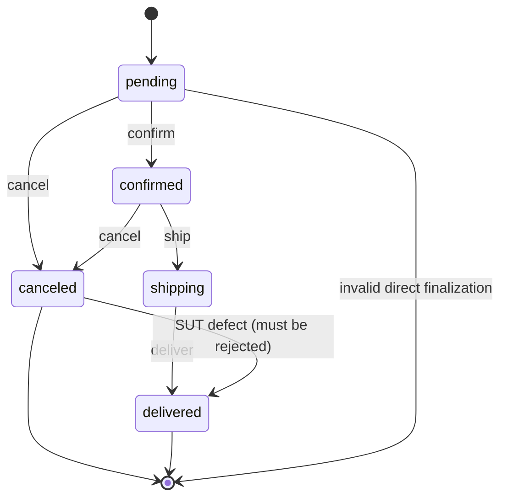

# AI Review & Gap Analysis — FR-13 (Admin Dashboard)

**Student ID:** 23127207 · **Feature:** FR-13 — Pool C  
**Spec files:** `tests/dashboard.spec.ts`, `tests/dashboard-api.spec.ts`  
**Data files:** `test-data/dashboard-data-cases.json` (15), `test-data/dashboard-api-cases.json` (17) — **32 test cases total**

## 1. Coverage design

The Dashboard suite has two complementary shapes:

| Shape | Cases | Main oracle |
|---|---:|---|
| Admin API access/state contract | 17 | HTTP status, role isolation, user-data exposure, order state transitions |
| Dashboard metrics/UI data-driven cases | 15 | Order count, delivered revenue, boundary amounts, live refresh, non-admin login guard |

The data-driven UI cases arrange the database through the checkout and admin status APIs, then
assert the rendered cards. `clearAllOrders()` is used before each case so revenue and order-count
assertions do not depend on prior cases. The transition path is explicit: `pending -> confirmed ->
shipping -> delivered`, with `canceled` treated as terminal by the test oracle.

### State-transition model used by the API cases

| Current state | Event/input | Expected next state | Coverage case(s) |
|---|---|---|---|
| `pending` | `confirmed` | `confirmed` | `TC-DASHBOARD-ORD-004` |
| `pending` | `canceled` | `canceled` | Seed path / final-state setup |
| `pending` | `delivered` | Reject with `400` | `TC-DASHBOARD-ORD-001` |
| `confirmed` | `shipping` | `shipping` | `TC-DASHBOARD-ORD-005` |
| `confirmed` | `canceled` | `canceled` | Seed path / final-state setup |
| `shipping` | `delivered` | `delivered` | `TC-DASHBOARD-ORD-006`, `TC-DASHBOARD-STATE-001` |
| `canceled` | `delivered` | Reject with `400` and remain canceled | `TC-DASHBOARD-ORD-002` — fails |
| nonexistent order | any status | `404` | `TC-DASHBOARD-ORD-003` |

This gives state coverage for all five order states, 0-switch coverage for each valid transition,
1-switch coverage through the `pending -> confirmed -> shipping -> delivered` path, and final-state
checks for delivered/canceled orders. The canceled-to-delivered case is especially valuable because
it validates that the terminal-state guard is enforced rather than only checking happy paths.

## 2. Two script bugs found and fixed while getting a clean 3-browser run

`npx playwright test --list` discovered **96 invocations**: the same 32 logical cases for Chromium,
Firefox, and WebKit. The first full run then exposed two real problems in this test suite itself:

1. **`TC-DASHBOARD-USR-002` deleted the real seed admin account.** Because
   `admin-self-delete-blocked` genuinely reproduces the missing self-delete guard, the DELETE call
   actually succeeds — which permanently removed `admin@eshop.com` from the shared database and
   broke every dashboard UI case that runs after it in the same suite/browser (all of them fail to
   log in). Fixed by promoting a disposable throwaway account to `role='admin'` via a new
   `promoteToAdmin()` DB helper (`tests/utils/db.ts`) and self-deleting *that* account instead —
   the real seed admin is never touched.
2. **Ambiguous locator.** `page.getByText('Dashboard', { exact: true })` matched both the sidebar
   nav item and the page heading (`strict mode violation`), unrelated to any SUT defect. Narrowed
   to `page.getByRole('heading', { name: 'Dashboard' })`.

Both fixes are visible in `tests/dashboard-api.spec.ts` / `tests/dashboard.spec.ts`; neither changes
any assertion's expected value.

## 2b. Execution evidence

All three browsers produced the identical result **15 passed / 17 failed / 32 total**. Reports:
`HW4/reports/dashboard/{chromium,firefox,webkit}/index.html`, each labeled `Run by: 23127207` with
an ISO timestamp.

## 3. API review results

### 3.1 Confirmed known bug

`BUG-FR13-C-02` is reproduced by:

- `TC-DASHBOARD-ACL-002`: regular-user token can call `GET /api/admin/users`;
- `TC-DASHBOARD-ACL-003`: regular-user token can call `GET /api/admin/orders`;
- `TC-DASHBOARD-ACL-006`: regular-user token can delete a user;
- `TC-DASHBOARD-ACL-008`: regular-user token can update an order status.

The authentication middleware verifies that a token is valid but the admin routes never check
`req.user.role`. This is an authorization failure, not a browser/UI issue.

### 3.2 New or newly isolated API findings

| Finding | Case | Actual behavior | Source evidence |
|---|---|---|---|
| Nonexistent-user delete reports success | `TC-DASHBOARD-USR-001` | Expected `404`, received `200` with “User deleted” | `server.js` always sends `res.json(...)` after `DELETE`, without checking `this.changes` |
| Admin can delete the account represented by its own token | `TC-DASHBOARD-USR-002` | Expected `400`, received `200`; the seed admin row is deleted | `server.js` has no self-delete guard and does not compare `req.user.id` with the route ID |
| Canceled order can be resurrected | `TC-DASHBOARD-ORD-002` | Expected `400`, received `200` for `canceled -> delivered` | The transition handler explicitly sets `isValidTransition = true` for this pair |

The valid transition cases (`pending -> confirmed`, `confirmed -> shipping`, and `shipping ->
delivered`) passed. Nonexistent-order `404`, malformed-token non-500 behavior, no-token `401`, and
password non-exposure in the admin-user list also passed.

## 4. UI review — confirmed on all three browsers

Every data-driven case that seeds at least one **delivered** order fails, matching
`frontend-admin/src/App.jsx`'s `totalRevenue = orders.reduce((sum,o) => o.status==='delivered' ?
sum + o.total_amount * 2 : sum, 0)` exactly:

| Failing case(s) | Reason |
|---|---|
| `TC-DASHBOARD-DT-001`, `BVA-002`, `DT-005`, `BVA-004`, `DT-006`, `DT-007`, `BVA-005`, `BVA-006` | `totalRevenue` adds `o.total_amount * 2` for each delivered order — displayed revenue is exactly 2× the spec-correct sum |
| `TC-DASHBOARD-BVA-003` | A negative delivered amount is displayed as negative revenue; there is no nonnegative-data guard |
| `TC-DASHBOARD-STATE-001` | Revenue is `0` before the `shipping -> delivered` transition (correct — not yet delivered), then doubles after it (bug) |

Cases with **zero** delivered orders (`BVA-001` no orders, `DT-002` all pending, `DT-003`
confirmed/shipping only, `DT-004` canceled only) all pass — `0 * 2` is still `0`, so the doubling
bug is invisible exactly where there is nothing delivered yet. `TC-DASHBOARD-LOGIN-001`
(non-admin blocked at the login form, client-side) also passes: the implementation does correctly
show an alert and keep a regular user on `Admin Login`. That check is useful UX, but it cannot
compensate for the missing **server-side** role guard confirmed in Section 3.

## 5. Assertion-pattern inventory

The Dashboard tests use HTTP status assertions, JSON property/absence assertions, exact numeric
equality, `expect.poll` for rendered metrics, visible-text checks, dialog-content checks, URL/page
state checks, and browser reload after a state transition. This satisfies the HW04 requirement for
multiple assertion patterns while keeping the metric oracle numeric rather than string-only.

## 6. Review conclusion

All three browsers produced the identical **15 passed / 17 failed / 32 total**. Every failure is a
server-side calculation or authorization defect (revenue doubling, missing role checks, missing
self-delete/nonexistent-user guards, an over-permissive state transition) — none is a
browser-rendering difference, consistent with a dashboard whose only real logic is two numbers
computed from `orders`. No SUT expectation was relaxed to convert a known defect into a pass.
