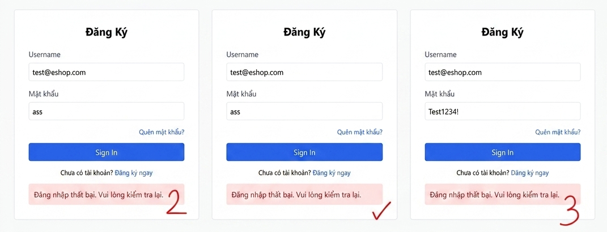

# BUG-FR02-A-01: Bộ đếm đăng nhập sai tăng thêm 2 đơn vị thay vì 1

| Tên trường (Field) | Giá trị (Value) |
| :--- | :--- |
| **No.** | 01 |
| **BugID** | `BUG-FR02-A-01` |
| **Status** | **Open** |
| **Requirement Name** | FR-02 Đăng nhập & Khóa tài khoản |
| **Summary** | Ở `API backend`, mỗi lần người dùng đăng nhập sai mật khẩu, hệ thống tăng bộ đếm thêm `2` đơn vị thay vì `1` đơn vị như đặc tả. |
| **Steps to reproduce** | 1. Đăng ký tài khoản mới. 2. Gửi 1 yêu cầu POST đăng nhập sai tới `/api/login` với tài khoản vừa tạo. 3. Thử đăng nhập bằng tài khoản khác hoặc kiểm tra trạng thái đăng nhập qua API. |
| **Severity** | Major |
| **Frequency** | Always |
| **Priority** | High |
| **Evidence (Screenshot)** |  |
| **Date** | 2026-06-23 |
| **Reporter** | Khoa |
