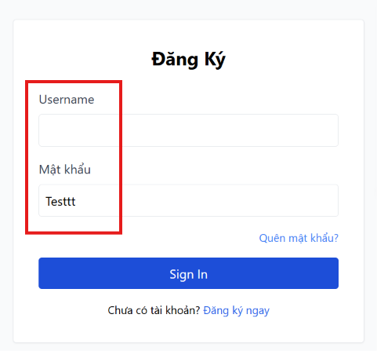

# BUG-FR02-A-08: Thiếu dấu hoa thị màu đỏ * đánh dấu trường bắt buộc

| Tên trường (Field) | Giá trị (Value) |
| :--- | :--- |
| **No.** | 08 |
| **BugID** | `BUG-FR02-A-08` |
| **Status** | **Open** |
| **Requirement Name** | FR-22 Form Requirements |
| **Summary** | Các trường bắt buộc nhập (Email và Mật khẩu) thiếu dấu hoa thị đỏ `*` cạnh nhãn label theo tiêu chuẩn thiết kế form. |
| **Steps to reproduce** | 1. Quan sát nhãn của trường Email và Mật khẩu trên form đăng nhập. |
| **Severity** | Cosmetic |
| **Frequency** | Always |
| **Priority** | Low |
| **Evidence (Screenshot)** |  |
| **Date** | 2026-06-23 |
| **Reporter** | Khoa |
