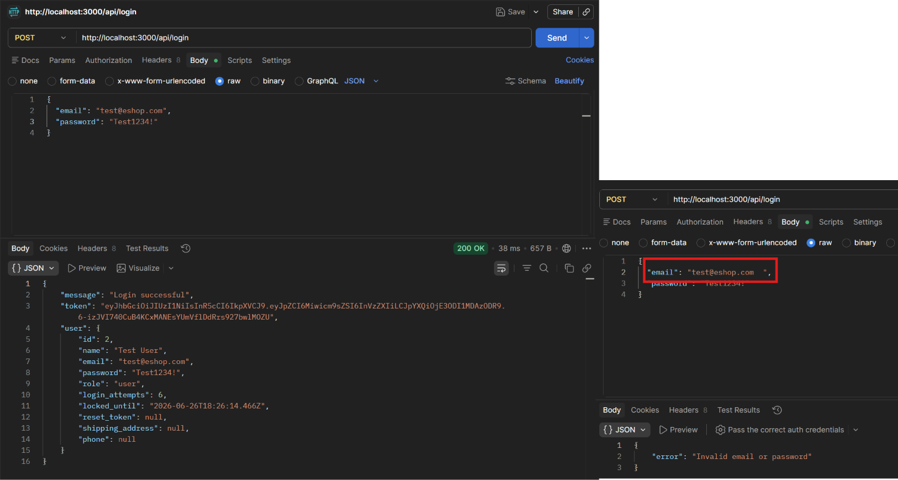

# BUG-FR02-A-09: Thiếu trim khoảng trắng của Email ở phía Backend

| Tên trường (Field) | Giá trị (Value) |
| :--- | :--- |
| **No.** | 09 |
| **BugID** | `BUG-FR02-A-09` |
| **Status** | **Open** |
| **Requirement Name** | FR-02 Đăng nhập & Khóa tài khoản |
| **Summary** | Gửi email có khoảng trắng đầu hoặc cuối chuỗi lên API `/api/login` sẽ đăng nhập thất bại do backend không trim khoảng trắng trước khi xác thực thông tin tài khoản. |
| **Steps to reproduce** | 1. Nhập email hợp lệ kèm khoảng trắng (ví dụ: ` test@eshop.com `) và mật khẩu đúng. 2. Nhấp đăng nhập và hệ thống từ chối đăng nhập. |
| **Severity** | Medium |
| **Frequency** | Always |
| **Priority** | Medium |
| **Evidence (Screenshot)** |  |
| **Date** | 2026-06-23 |
| **Reporter** | Khoa |
