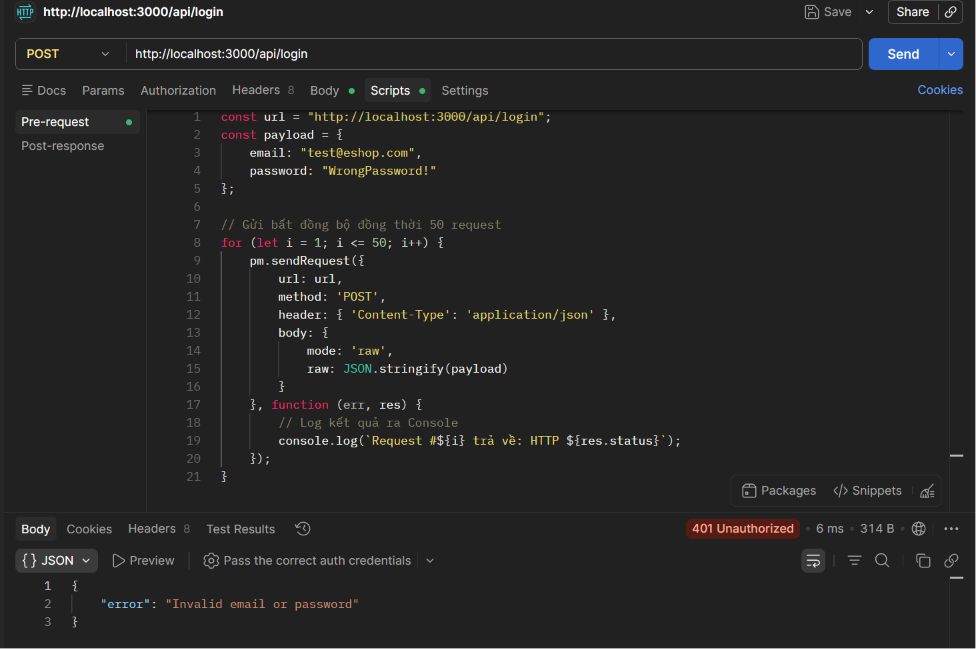

# BUG-FR02-A-10: Không tích hợp cơ chế Rate Limiting chống tấn công Brute-force

| Tên trường (Field) | Giá trị (Value) |
| :--- | :--- |
| **No.** | 10 |
| **BugID** | `BUG-FR02-A-10` |
| **Status** | **Open** |
| **Requirement Name** | FR-02 Đăng nhập & Khóa tài khoản (Bảo mật) |
| **Summary** | Hệ thống chấp nhận số lượng yêu cầu đăng nhập tốc độ cao từ một IP mà không có giới hạn, dễ bị brute force. |
| **Steps to reproduce** | 1. Gửi liên tục 15-20 request tới `/api/login` trong vòng vài giây. 2. Tất cả đều trả về mã 401 bình thường thay vì bị chặn với mã 429. |
| **Severity** | High |
| **Frequency** | Always |
| **Priority** | High |
| **Evidence (Screenshot)** |  |
| **Date** | 2026-06-23 |
| **Reporter** | Khoa |
