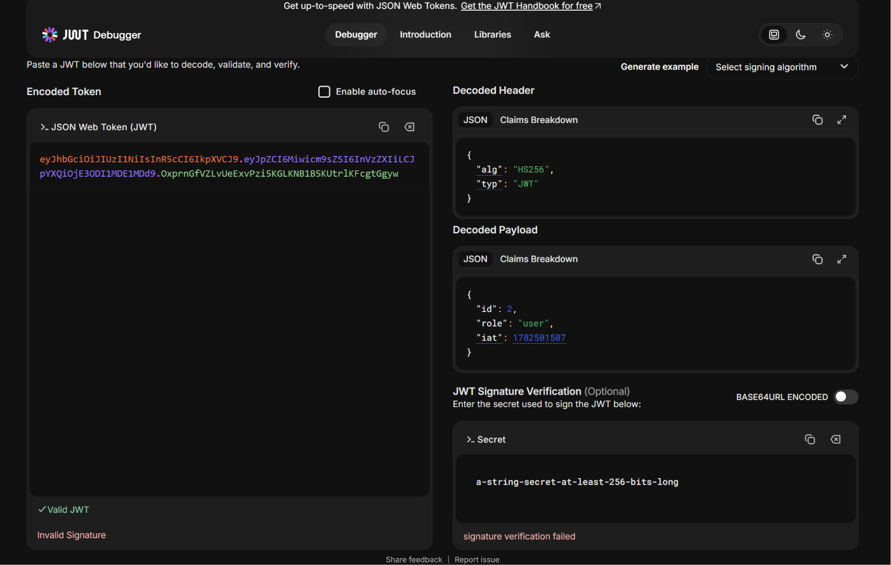

# BUG-FR02-A-13: Token JWT không có thời hạn hết hạn (vô hạn hạn)

| Tên trường (Field) | Giá trị (Value) |
| :--- | :--- |
| **No.** | 13 |
| **BugID** | `BUG-FR02-A-13` |
| **Status** | **Open** |
| **Requirement Name** | FR-02 Đăng nhập & Khóa tài khoản (Bảo mật) |
| **Summary** | Token trả về khi đăng nhập thành công không cấu hình tham số `expiresIn`, cho phép truy cập vĩnh viễn không hết hạn. |
| **Steps to reproduce** | 1. Đăng nhập thành công và lấy chuỗi Token. 2. Giải mã Token qua jwt.io và kiểm tra không tồn tại trường `exp`. |
| **Severity** | High |
| **Frequency** | Always |
| **Priority** | High |
| **Evidence (Screenshot)** |  |
| **Date** | 2026-06-23 |
| **Reporter** | Khoa |
