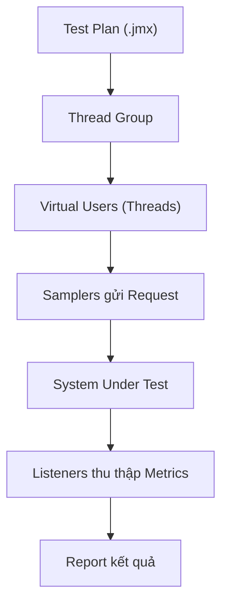
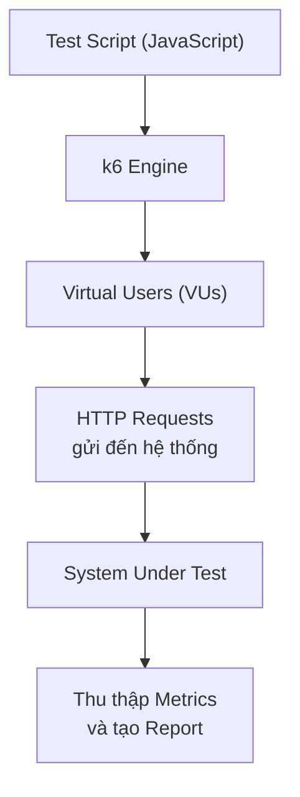

# BÁO CÁO SEMINAR PERFORMANCE TESTING TOOLS

> **Môn học:** Software Testing  
> **Chủ đề:** Performance Testing tools  
> **Hệ thống được kiểm thử:** EShop  
> **Nhóm:** Nhóm 7

---

# Mục lục

1. Tóm tắt báo cáo
2. Thông tin nhóm và phân công
3. Giới thiệu
4. Cơ sở lý thuyết Performance Testing
5. Hệ thống EShop và phạm vi kiểm thử
6. Khảo sát 15 công cụ Performance Testing
7. Sàng lọc và lập danh sách rút gọn
8. Lý do lựa chọn Apache JMeter và k6
9. Thiết kế Workload Model và kịch bản demo cho EShop
10. Apache JMeter – Performance Testing Tool
11. k6 – Performance Testing Tool
12. So sánh JMeter và k6
13. Kết quả thực nghiệm và phân tích
14. AI Usage Declaration
15. Tài liệu tham khảo

---

# 1. Tóm tắt báo cáo

Performance Testing được sử dụng để đánh giá tốc độ phản hồi, khả năng xử lý tải, độ ổn định và hành vi suy giảm của hệ thống khi số người dùng hoặc số request tăng. Nhóm khảo sát 15 công cụ gồm Apache JMeter, Silk Performer, Artillery, k6, Locust, Gatling, Loader.io, Siege, Vegeta, wrk, NeoLoad, ApacheBench, OpenText LoadRunner Professional, Tsung và Taurus.

Quá trình lựa chọn không dựa trên nhận định “công cụ nào mạnh nhất”, vì không có một công cụ tối ưu cho mọi bối cảnh. Nhóm đánh giá các công cụ theo mức độ phù hợp với EShop, khả năng mô phỏng user journey nhiều bước, chi phí tiếp cận, learning curve, khả năng tái tạo, reporting, CI/CD, hoạt động trong lớp học và khả năng kết hợp với AI.

Sau hai vòng sàng lọc, nhóm chọn **Apache JMeter** và **k6** làm hai công cụ chính. JMeter đại diện cho cách tiếp cận trực quan dựa trên Test Plan, trong đó người dùng xây dựng Thread Group, Sampler, Timer, Assertion và các thành phần cấu hình qua GUI; khi chạy tải chính thức, JMeter được thực thi bằng CLI. k6 đại diện cho cách tiếp cận test-as-code, sử dụng JavaScript để định nghĩa scenarios, executors, checks và thresholds. Hai công cụ bổ sung cho nhau và cho phép nhóm so sánh hai phương pháp xây dựng Performance Test thay vì chọn hai công cụ có cách sử dụng gần như giống nhau.

Báo cáo thiết kế các kịch bản baseline, normal load, spike và stress cho EShop. Tài liệu yêu cầu nhóm có khả năng triển khai workload bằng JMeter và k6, chạy baseline 50 VU và spike 50 lên 500 VU trong 30 giây, đồng thời thu thập p50, p95, p99 và error rate.

---

# 2. Thông tin nhóm và phân công

## 2.1. Thành viên

| MSSV     | Họ và tên            | Công cụ khảo sát                                | Trách nhiệm thực nghiệm                                                                                                                                                                                                                                          |
| -------- | -------------------- | ----------------------------------------------- | ---------------------------------------------------------------------------------------------------------------------------------------------------------------------------------------------------------------------------------------------------------------- |
| 23127271 | Võ Ngọc Bích Trâm    | JMeter, Silk Performer, Artillery               | Xây dựng kịch bản Artillery baseline/spike; chạy thử nghiệm và tạo báo cáo Artillery                                                                                                                                                                             |
| 23127207 | Đặng Đăng Khoa       | k6, Locust, Gatling                             | Xây dựng tiêu chí lựa chọn; tổng hợp khảo sát; thiết kế Workload Model; viết k6 script; AI Audit; so sánh JMeter–k6                                                                                                                                              |
| 23127458 | Phan Quốc Thịnh      | Loader.io, Siege, Vegeta                        | Tạo script k6 từ Workload Model; AI Audit; Kiểm tra Workload Distribution, Metrics phù hợp với EShop                                                                                                                                                             |
| 23127158 | Nguyễn Thanh Gia Bảo | wrk, NeoLoad, ApacheBench                       | Xây dựng JMeter Test Plan; chạy baseline/spike; xuất và tổng hợp JTL/HTML report; viết research note và Test Script Specification                                                                                                                                |
| 23127438 | Đặng Trường Nguyên   | OpenText LoadRunner Professional, Tsung, Taurus | Khảo sát ba hướng enterprise, distributed và orchestration; thực hiện smoke test trong phạm vi licence/môi trường; tổng hợp hạn chế và lý do không chọn vào cặp demo chính; xây dựng k6 script; cấu hình và chạy baseline/spike; tổng hợp báo cáo và tài liệu k6 |

---

# 3. Giới thiệu

## 3.1. Bối cảnh

Functional Testing trả lời câu hỏi hệ thống có thực hiện đúng chức năng hay không. Tuy nhiên, một chức năng có thể trả về dữ liệu chính xác nhưng phản hồi quá chậm, thất bại khi số user tăng hoặc không phục hồi sau spike. Vì vậy, chất lượng của hệ thống còn phụ thuộc vào hiệu năng và độ ổn định dưới tải.

Đối với hệ thống thương mại điện tử, hành vi người dùng thường gồm nhiều bước: xem danh sách sản phẩm, tìm kiếm, xem chi tiết, đăng nhập, thêm giỏ hàng và checkout. Tỷ lệ xuất hiện của các hành vi này không giống nhau. Một workload chỉ lặp lại một endpoint với tốc độ rất cao có thể hữu ích để benchmark endpoint đó, nhưng không đủ để đại diện cho hành vi của người dùng EShop.

## 3.2. Vấn đề nghiên cứu

Báo cáo tập trung trả lời bốn vấn đề:

1. Trong 15 công cụ đã khảo sát, công cụ nào phù hợp để mô hình hóa và chạy workload EShop?
2. Vì sao chọn JMeter và k6 thay vì chọn theo độ phổ biến hoặc cảm tính?
3. Trên cùng workload, hai cách tiếp cận GUI-oriented và test-as-code khác nhau như thế nào?

## 3.3. Mục tiêu

- Trình bày đúng các khái niệm cốt lõi của Performance Testing.
- Khảo sát 15 công cụ bằng một phương pháp nhất quán.
- Sàng lọc công cụ theo đặc điểm và giới hạn thực tế.
- Chọn JMeter và k6 bằng lập luận có thể kiểm chứng.
- Xây dựng Workload Model phản ánh hành vi EShop.
- Thực thi cùng workload trên JMeter và k6.
- Thu thập p50, p95, p99, throughput và error rate.

---

# 4. Cơ sở lý thuyết Performance Testing

Hiểu rõ các khái niệm cơ bản và phân loại trong kiểm thử hiệu năng là bước đầu tiên để xây dựng một chiến lược kiểm thử chính xác. Dưới đây là các định nghĩa, mục tiêu và phân loại chi tiết của Performance Testing.

## 4.1. Performance Testing là gì?

**Performance Testing** là một loại kiểm thử phi chức năng (non-functional testing), nhằm đánh giá hành vi và phản ứng của hệ thống dưới một khối lượng công việc hoặc lượt truy cập cụ thể. Mục tiêu cốt lõi không phải là kiểm tra xem hệ thống có _hoạt động đúng tính năng_ hay không, mà là đo lường xem hệ thống hoạt động _nhanh đến mức nào_, _ổn định ra sao_, và _chịu tải được bao nhiêu_.

## 4.2. Mục tiêu của Performance Testing

Dựa trên định nghĩa về kiểm thử hiệu năng, hoạt động này hướng đến các mục tiêu kỹ thuật và trải nghiệm cụ thể sau:

- **Đo lường thời gian phản hồi:** Xác định hệ thống mất bao lâu để xử lý và hoàn thành một yêu cầu từ người dùng.
- **Đánh giá thông lượng:** Đo số lượng giao dịch hoặc yêu cầu mà hệ thống xử lý thành công trong một đơn vị thời gian.
- **Xác định giới hạn tải:** Tìm ra ngưỡng tải tối đa mà tại đó hệ thống bắt đầu suy giảm hiệu năng hoặc gặp lỗi.
- **Phát hiện nút thắt cổ chai:** Nhận diện các thành phần gây chậm trễ trong toàn bộ kiến trúc hệ thống (CPU, bộ nhớ, cơ sở dữ liệu, băng thông mạng, v.v.).
- **Xác nhận khả năng đáp ứng SLA:** Kiểm tra xem hệ thống có đáp ứng được các cam kết về mức độ dịch vụ (Service Level Agreement) đã thỏa thuận hay không.
- **Đảm bảo trải nghiệm người dùng:** Xác minh rằng thời gian chờ đợi của người dùng cuối luôn nằm trong ngưỡng chấp nhận được.

## 4.3. Các loại Performance Testing

Để đạt được những mục tiêu trên, người ta không dùng một phương pháp duy nhất mà chia thành nhiều loại kiểm thử con. Mỗi loại được thiết kế để kiểm tra một khía cạnh cơ học riêng biệt của hệ thống dưới các mô hình tải khác nhau.

### 4.3.1. Load Testing

**Định nghĩa:** Load testing là quá trình mô phỏng lượng tải dự kiến áp lên hệ thống để đánh giá hành vi của nó dưới điều kiện làm việc bình thường và lúc cao điểm. Đây là loại hình phổ biến nhất và thường là bước khởi đầu trong quy trình kiểm thử hiệu năng.

**Mục tiêu:**

- Xác nhận hệ thống đáp ứng được yêu cầu hiệu năng ở mức tải kỳ vọng.
- Phát hiện các vấn đề hiệu năng xuất hiện khi số lượng người dùng tăng dần.
- Xác định mối quan hệ tuyến tính hoặc phi tuyến giữa mức độ tải và thời gian phản hồi.

---

### 4.3.2. Stress Testing

**Định nghĩa:** Stress testing đánh giá hành vi của hệ thống khi bị đẩy **vượt quá** giới hạn thiết kế thông thường. Mục đích không phải để chứng minh hệ thống hoạt động tốt dưới tải, mà là để tìm ra điểm gãy (breaking point) và quan sát cách hệ thống tự phục hồi.

**Mục tiêu:**

- Xác định điểm giới hạn tối đa mà hệ thống sụp đổ hoàn toàn.

* Đánh giá khả năng tự phục hồi (recovery) sau khi áp lực tải giảm xuống.
* Xác định các lỗi nghiêm trọng chỉ xảy ra dưới áp lực cao (rò rỉ bộ nhớ, deadlock, timeout, v.v.).
* Đánh giá hệ thống xử lý lỗi một cách êm ái (graceful degradation) hay crash đột ngột làm mất dữ liệu.

---

### 4.3.3. Spike Testing

**Định nghĩa:** Spike testing là một dạng đặc biệt của stress testing, trong đó lượng tải tăng **đột ngột** và **mạnh** trong khoảng thời gian rất ngắn, rồi giảm xuống ngay sau đó. Loại kiểm thử này mô phỏng các tình huống đột biến trong thực tế như sự kiện Flash Sale hoặc lỗi hệ thống mạng khiến request bị dồn ứ lại.

**Mục tiêu:**

- Đánh giá khả năng xử lý các đỉnh tải đột biến bất ngờ mà không làm gián đoạn dịch vụ.

* Kiểm tra cơ chế tự động mở rộng quy mô (auto-scaling) có phản ứng kịp thời và chính xác không.
* Đánh giá hệ thống có nhanh chóng quay lại trạng thái ổn định sau khi đỉnh tải qua đi hay không.

---

### 4.3.4. Endurance Testing / Soak Testing

**Định nghĩa:** Endurance testing (hay soak testing) đánh giá hệ thống khi chạy dưới **mức tải tiêu chuẩn** nhưng duy trì trong **thời gian dài** liên tục (nhiều giờ, nhiều ngày hoặc thậm chí hàng tuần). Mục đích là phát hiện các lỗi tích tụ theo thời gian.

**Mục tiêu:**

- Phát hiện tình trạng rò rỉ bộ nhớ (memory leak) - bộ nhớ tăng dần theo thời gian mà không được bộ thu gom rác giải phóng.

* Phát hiện rò rỉ kết nối cơ sở dữ liệu (database connection leak) - các kết nối mở ra nhưng không được đóng lại cho đến khi cạn kiệt resource pool.
* Đánh giá sự suy giảm hiệu năng dần dần do các file log quá lớn hoặc phân mảnh dữ liệu.
* Kiểm tra tính ổn định lâu dài của các thành phần bên thứ ba hoặc các tầng đệm (cache, message queue).

---

### 4.3.5. Volume Testing

**Định nghĩa:** Volume testing (còn gọi là flood testing) tập trung đánh giá hành vi của hệ thống khi phải xử lý và lưu trữ một **khối lượng dữ liệu cực lớn**. Trọng tâm ở đây không nằm ở số lượng người dùng đồng thời, mà nằm ở kích thước tệp tin hoặc số lượng bản ghi trong cơ sở dữ liệu.

**Mục tiêu:**

- Xác định xem hệ thống có bị suy giảm hiệu năng truy vấn, tìm kiếm hoặc kết xuất báo cáo khi dữ liệu phình to hay không.

* Phát hiện các lỗi tràn bộ đệm hoặc giới hạn lưu trữ vật lý của hệ thống.
* Đánh giá tính ổn định khi thực hiện migration (dịch chuyển) dữ liệu lớn từ hệ thống cũ sang mới.

---

### 4.3.6. Scalability Testing

**Định nghĩa:** Scalability testing đánh giá năng lực của hệ thống trong việc mở rộng quy mô phần cứng nhằm đáp ứng lượng tải lớn hơn. Việc mở rộng bao gồm cả chiều dọc (vertical scaling - nâng cấp CPU, RAM của server hiện tại) và chiều ngang (horizontal scaling - bổ sung thêm nhiều server vào cụm cluster).

**Mục tiêu:** - Xác định xem hiệu năng hệ thống có tăng trưởng tuyến tính với tài nguyên bổ sung hay không (ví dụ: nhân đôi cấu hình thì năng lực chịu tải có tăng gấp đôi không).

- Tìm ra điểm nghẽn kiến trúc khiến việc thêm tài nguyên phần cứng không còn mang lại hiệu quả cải thiện hiệu năng.
- Cung cấp dữ liệu thực tế để lập chiến lược tối ưu chi phí hạ tầng.

---

## 4.4. Các chỉ số đánh giá hiệu năng

Để định lượng chính xác kết quả từ các loại kiểm thử hiệu năng phía trên, các kỹ sư cần dựa vào các chỉ số đo lường chuẩn hóa. Các chỉ số này phản ánh cả góc nhìn từ phía người dùng (thời gian) lẫn góc nhìn từ phía hệ thống (tài nguyên).

### 4.4.1. Response Time

**Định nghĩa:** Response time là tổng thời gian tính từ khi client gửi một yêu cầu (request) đi cho đến khi nhận được phản hồi hoàn chỉnh (response) trả về từ phía server. Đây là chỉ số quan trọng nhất quyết định trải nghiệm người dùng cuối.

**Công thức tính toán:**

$$\text{Response Time} = \text{Network Latency (Go)} + \text{Server Processing Time} + \text{Network Latency (Return)}$$

**Tầm quan trọng:** Phản ánh trực tiếp độ trễ mà người dùng phải chịu đựng. Một hệ thống xử lý nội bộ rất nhanh nhưng mạng chậm thì response time vẫn lớn, khiến trải nghiệm người dùng bị giảm sút.

---

### 4.4.2. Latency

**Định nghĩa:** Latency là khoảng thời gian trễ trước khi quá trình truyền dữ liệu thực sự bắt đầu. Trong ngữ cảnh web, nó thường được hiểu là thời gian để byte dữ liệu đầu tiên (TTFB) truyền từ server quay trở lại đến client sau khi nhận request.

**Tầm quan trọng:** Biến số này giúp cô lập vấn đề xem sự chậm trễ nằm ở đường truyền vật lý hay ở khâu xử lý logic của máy chủ. Nó cực kỳ quan trọng đối với các ứng dụng thời gian thực như video call, giao dịch chứng khoán hoặc game online.

---

### 4.4.3. Throughput

**Định nghĩa:** Throughput là số lượng đơn vị công việc mà hệ thống tiếp nhận và xử lý thành công trong một đơn vị thời gian cố định. Nó đại diện cho năng lực tải và sức chứa tổng thể của toàn bộ kiến trúc.

**Đơn vị đo phổ biến:**

- Requests per second (req/s): Số yêu cầu trên mỗi giây.

* Transactions per second (TPS): Số giao dịch nghiệp vụ hoàn thành trên mỗi giây.
* Megabytes per second (MB/s): Tốc độ truyền tải băng thông dữ liệu.

**Tầm quan trọng:** Giúp xác định năng lực phục vụ số đông. Khi throughput đạt ngưỡng trần (saturation point), các request mới sẽ bị đẩy vào hàng đợi (queue), kéo theo response time tăng vọt một cách đột ngột.

---

### 4.4.4. Error Rate (Tỷ lệ lỗi)

**Định nghĩa:** Error rate là tỷ lệ phần trăm các yêu cầu bị lỗi (như lỗi kết nối, lỗi phản hồi HTTP 5xx) so với tổng số lượng yêu cầu được gửi lên hệ thống trong suốt phiên kiểm thử.

**Công thức tính toán:**

$$\text{Error Rate (%)} = \left( \frac{\text{Số request bị lỗi}}{\text{Tổng số request gửi đi}} \right) \times 100$$

**Tầm quan trọng:** Định lượng độ tin cậy của phần mềm dưới áp lực tải. Nếu hệ thống phản hồi cực nhanh nhưng tỷ lệ lỗi lên tới 30%, điều đó chứng tỏ hệ thống đang từ chối phục vụ hoặc bị sụp đổ cục bộ bên trong cấu trúc logic.

---

### 4.4.5. Concurrent Users (Người dùng đồng thời)

**Định nghĩa:** Concurrent users là số lượng người dùng (hoặc các Virtual Users - VU trong script) đang thực hiện các tương tác tích cực và gửi yêu cầu đến hệ thống tại cùng một thời điểm.

**Phân biệt khái niệm:** Cần phân biệt rõ với _Simultaneous Users_ (người dùng kết nối đồng thời nhưng có thể đang trong trạng thái nghỉ/đọc thông tin mà không gửi request) và _Active Sessions_ (phiên làm việc còn hiệu lực trong bộ nhớ server nhưng không phát sinh traffic). Concurrent users là tham số đầu vào cốt lõi để thiết kế kịch bản tải.

---

### 4.4.6. Resource Utilization (Mức sử dụng tài nguyên)

**Định nghĩa:** Resource Utilization đo lường mức độ tiêu thụ các tài nguyên phần cứng vật lý hoặc ảo hóa của các máy chủ thành phần (Web Server, App Server, Database Server) khi bài test hiệu năng diễn ra.

**Các chỉ số thành phần chính cần theo dõi:**

- **CPU Utilization (%):** Tỷ lệ phần trăm năng lực xử lý của vi xử lý đang bị chiếm dụng. Mức an toàn thường dưới 75-80%.

* **Memory Utilization / RAM Usage:** Lượng bộ nhớ RAM bị chiếm giữ. Nếu đồ thị RAM tăng liên tục không giảm, đó là dấu hiệu của memory leak.
* **Disk I/O (Input/Output):** Tốc độ đọc và ghi dữ liệu lên ổ đĩa. Đây thường là nút thắt cổ chai lớn nhất ở các máy chủ database do tốc độ ghi đĩa vật lý có giới hạn.
* **Network I/O:** Lượng băng thông mạng tiêu thụ ở các cổng inbound/outbound.

**Tầm quan trọng:** Chỉ số này chỉ ra nguyên nhân gốc rễ (Root Cause Analysis) của các vấn đề hiệu năng. Nó giúp đội ngũ hạ tầng biết chính xác thành phần nào đang bị vắt kiệt sức để đưa ra phương án tối ưu phần mềm hoặc nâng cấp phần cứng phù hợp.

---

### 4.4.7. Percentile (Phân vị: p50, p90, p95, p99)

**Định nghĩa:** Percentile là phương pháp thống kê toán học dùng để mô tả sự phân bố của chỉ số thời gian phản hồi, giúp loại bỏ sự sai lệch của các giá trị trung bình đơn thuần. Giá trị phân vị thứ $N$ (ký hiệu p$N$) nghĩa là có $N\%$ số lượng request có thời gian phản hồi thấp hơn hoặc bằng giá trị đó.

- **p50 (Median):** Giá trị trung vị, phản ánh thời gian phản hồi của một người dùng ở mức trung bình của hệ thống.
- **p90:** 90% số request có thời gian phản hồi bằng hoặc nhanh hơn giá trị này. Phản ánh trải nghiệm của đại đa số người dùng.
- **p95:** Ngưỡng tiêu chuẩn phổ biến nhất khi ký kết các văn bản SLA kỹ thuật.
- **p99:** Biểu thị nhóm 1% khách hàng phải chịu đựng thời gian phản hồi chậm nhất (tail latency).

**Tầm quan trọng:** Percentile phản ánh chân thực hơn nhiều so với giá trị trung bình (average). Nếu một hệ thống có 99 request phản hồi trong 10ms và 1 request phản hồi trong 10,000ms, thời gian trung bình sẽ là ~110ms. Con số này che giấu việc có 1% khách hàng phải đợi tới 10 giây. Chỉ số Percentile sẽ bộc lộ rõ ràng điểm yếu chí mạng này.

---

## 4.5. Quy trình kiểm thử Performance Testing chuẩn

Để thu thập các chỉ số đo lường trên một cách chính xác và có thể lặp lại, quy trình thực hiện kiểm thử hiệu năng cần tuân thủ theo các bước kỹ thuật chặt chẽ, từ khâu lập kế hoạch cho đến phân tích báo cáo.

### Bước 1: Xác định môi trường kiểm thử (Identify the Test Environment)

Trước khi bắt đầu, kiểm thử viên cần nắm rõ kiến trúc vật lý, kiến trúc mạng và cấu hình phần cứng của hệ thống được kiểm thử (SUT - System Under Test) cũng như công cụ tạo tải. Môi trường kiểm thử hiệu năng nên được tách biệt hoàn toàn với môi trường phát triển (Dev) hoặc kiểm thử chức năng (QC/Staging) thông thường để tránh nhiễu số liệu, và lý tưởng nhất là cấu hình phải tương đương hoặc tiệm cận với môi trường Production.

### Bước 2: Xác định các tiêu chí đánh giá hiệu năng (Identify Performance Acceptance Criteria)

Ở bước này, đội ngũ kiểm thử phải làm việc với các bên liên quan (Product Owner, Architecture, Business Analyst) để xác định các mục tiêu cụ thể hoặc các chỉ số SLA mong muốn. Các tiêu chí này bao gồm giới hạn tối đa chấp nhận được của thời gian phản hồi (Response Time), thông lượng mục tiêu (Throughput), tỷ lệ lỗi tối đa (Error Rate) và ngưỡng giới hạn tiêu thụ tài nguyên phần cứng (CPU, RAM).

### Bước 3: Lập kế hoạch và thiết kế kịch bản (Plan & Design Performance Tests)

Giai đoạn này bao gồm việc xác định các kịch bản nghiệp vụ chính mà người dùng thực tế thường xuyên thao tác (ví dụ: đăng nhập, tìm kiếm sản phẩm, thêm vào giỏ hàng, thanh toán). Từ đó, kiểm thử viên định hình mô hình tải (Workload Model), xác định số lượng người dùng ảo (VU), thiết lập tốc độ tăng tải (Ramp-up), thời gian duy trì tải tối đa (Duration) và tốc độ giảm tải (Ramp-down).

### Bước 4: Cấu hình môi trường và chuẩn bị dữ liệu (Configure the Test Environment & Data)

Chuẩn bị các công cụ tạo tải (như JMeter, Locust, K6) đặt trên các máy tạo tải (Load Generators). Đồng thời, đây là bước cực kỳ quan trọng để chuẩn bị dữ liệu kiểm thử (Test Data). Dữ liệu này cần đủ lớn và đa dạng (ví dụ: hàng vạn tài khoản khác nhau, danh mục sản phẩm phong phú) nhằm tránh các tác động tích cực giả tạo do cơ chế lưu bộ đệm (cache) của hệ thống tạo ra.

### Bước 5: Triển khai thiết kế kịch bản kiểm thử (Implement the Test Design)

Kiểm thử viên tiến hành viết mã hoặc cấu hình các kịch bản kiểm thử tự động (Test Scripts) trên công cụ đã chọn. Trong bước này, cần chèn các tham số hóa dữ liệu (Parameterization), xử lý các giá trị động được trả về từ máy chủ (Correlation như Token, Session ID) và thiết lập các điểm kiểm tra logic (Assertions) để xác định một request là thành công hay thất bại.

### Bước 6: Thực thi kiểm thử (Execute the Tests)

Chạy các kịch bản kiểm thử hiệu năng đã lập trình sẵn. Trong quá trình chạy, các kỹ sư không chỉ vận hành công cụ tạo tải mà còn phải kết hợp sử dụng các công cụ giám sát (Monitoring Tools như Prometheus, Grafana, New Relic, Datadog) để theo dõi liên tục trạng thái sức khỏe tài nguyên phần cứng, ghi nhận các hiện tượng bất thường và đảm bảo máy tạo tải không bị quá tải cục bộ.

### Bước 7: Phân tích kết quả, báo cáo và tinh chỉnh (Analyze, Tune and Retest)

Sau khi thu thập đầy đủ dữ liệu từ bài test, tiến hành hợp nhất các số liệu, đối chiếu trực tiếp với các tiêu chí chấp nhận đã đặt ra ở Bước 2 để rút ra kết luận hệ thống đạt hay không đạt. Tìm kiếm các nút thắt cổ chai, chuyển thông tin phân tích chi tiết cho đội ngũ lập trình để tối ưu hóa mã nguồn hoặc đội ngũ hệ thống cấu hình lại hạ tầng. Sau khi tinh chỉnh (Tuning), bài test hiệu năng bắt buộc phải được thực thi lại (Retest) để xác minh xem việc sửa đổi có thực sự cải thiện hiệu năng hay không.

---

## 4.6. Workload Model

Nền tảng để thực hiện chính xác Bước 3 trong quy trình trên chính là việc xây dựng một Mô hình khối lượng công việc chuẩn xác. **Workload Model** là một tài liệu hoặc cấu hình kịch bản mô phỏng chi tiết hành vi, tần suất tương tác và phân bổ luồng đi của người dùng thực tế lên hệ thống phần mềm tại một thời điểm cụ thể.

### Các thành phần cấu tạo nên một Workload Model:

- **User Distribution (Phân bổ tính năng):** Xác định tỷ lệ phần trăm người dùng thực hiện các tính năng khác nhau. Trong thực tế, không bao giờ có chuyện 100% người dùng vào hệ thống đều thực hiện chức năng thanh toán. Một mô hình thực tế sẽ phân bổ ví dụ: 60% người dùng chỉ lướt xem tin tức, 30% thực hiện tìm kiếm, và chỉ có 10% thực hiện giao dịch mua bán.
- **Load Profile (Biểu đồ phân phối tải):** Xác định hình thái tăng giảm của lượng tải theo thời gian, bao gồm:
  - **User Load:** Số lượng người dùng ảo truy cập vào hệ thống.
  - **Ramp-up period:** Thời gian tải tăng dần, đưa VU vào hệ thống từ từ để tránh gây shock hệ thống đột ngột.
  - **Steady-state period:** Thời gian duy trì tải đỉnh ổn định để quan sát hệ thống ở trạng thái bão hòa.
  - **Ramp-down period:** Thời gian tắt dần các VU khi bài test kết thúc.

### Phương pháp thu thập dữ liệu xây dựng Workload Model:

1. **Dựa trên dữ liệu lịch sử (Historical Data):** Trích xuất thông tin từ các công cụ phân tích log hệ thống, Google Analytics, hoặc chỉ số APM trên Production để tính toán số lượng request/giây cao nhất ở quá khứ.
2. **Dựa trên dự báo kinh doanh (Business Forecasts):** Đối với các hệ thống mới hoàn toàn chưa có dữ liệu lịch sử, đội ngũ kiểm thử phải dựa trên dự kiến tăng trưởng của bộ phận kinh doanh (ví dụ: hệ thống dự kiến đạt 50,000 người dùng đăng ký trong tháng đầu tiên, tỷ lệ hoạt động giờ cao điểm là 5%).

---

## 4.7. Các nguyên tắc khi thiết kế Performance Test

Việc xây dựng quy trình và mô hình tải ở trên nếu không tuân thủ các nguyên tắc thiết kế thực tế dưới đây sẽ dễ dẫn đến tình trạng sai lệch số liệu, tạo ra các kết quả kiểm thử lạc quan giả tạo hoặc bi quan quá mức.

### 4.7.1. Sử dụng workload thực tế (Realistic Workload)

**Nguyên tắc:** Mô hình tải (Workload model) phải phản ánh chính xác hành vi sử dụng thực tế của tập khách hàng, bao gồm tỷ lệ phân bổ giữa các hành động nghiệp vụ, thời gian suy nghĩ (think time) hợp lý, và nhịp độ kiểm soát (pacing).

**Tại sao quan trọng:** Xây dựng một workload sai lệch sẽ dẫn đến kết quả test vô giá trị. Nếu trong thực tế hệ thống nhận 80% traffic là các truy vấn đọc dữ liệu (GET) nhưng kịch bản test lại cấu hình 80% traffic là thao tác ghi dữ liệu (POST), kết quả thu được sẽ phản ánh sai hoàn toàn khả năng chịu tải thực tiễn của cơ sở dữ liệu.

---

### 4.7.2. Sử dụng dữ liệu kiểm thử đại diện (Representative Test Data)

**Nguyên tắc:** Toàn bộ dữ liệu đầu vào sử dụng trong quá trình kiểm thử (tài khoản đăng nhập, từ khóa tìm kiếm, ID sản phẩm) phải đủ lớn, đa dạng và được thay đổi liên tục cho mỗi VU, không sử dụng lặp đi lặp lại một tập dữ liệu nhỏ hẹp.

**Tại sao quan trọng:** Nếu tất cả các VU chạy đồng thời đều truy vấn cùng một từ khóa hoặc xem chung một mã sản phẩm, hệ thống máy chủ sẽ trả ngay kết quả từ tầng bộ đệm (Cache Hit) mà không cần thực hiện các tính toán logic hay truy vấn xuống ổ đĩa vật lý của Database (Cache Miss). Điều này tạo ra một kết quả kiểm thử đẹp đẽ nhưng giả tạo.

---

### 4.7.3. Đảm bảo phiên người dùng độc lập (Independent User Sessions)

**Nguyên tắc:** Mỗi người dùng ảo (VU) khi tham gia vào bài test phải được cấp phát một phiên làm việc (Session) hoàn toàn riêng biệt, sở hữu Cookie, Token nhận dạng, và ngữ cảnh dữ liệu độc lập.

**Tại sao quan trọng:** Khi nhiều VU dùng chung một tài khoản hoặc chia sẻ chung trạng thái, các hành động nghiệp vụ sẽ triệt tiêu hoặc xung đột lẫn nhau (ví dụ: VU này vừa thêm hàng vào giỏ thì VU kia bấm xóa sạch giỏ hàng). Điều này gây ra một tỷ lệ lỗi logic giả, đồng thời làm mất đi khả năng kiểm thử cơ chế quản lý session (Session Management) ở phía server dưới tải lớn.

---

### 4.7.4. Khởi động hệ thống (Warm-up) trước khi đo lường

**Nguyên tắc:** Luôn thiết lập một khoảng thời gian chạy khởi động hệ thống (Warm-up phase) trước khi bắt đầu ghi nhận số liệu chính thức để phân tích. Toàn bộ dữ liệu nhiễu sinh ra trong giai đoạn khởi động này phải được loại bỏ khỏi báo cáo cuối cùng.

**Tại sao quan trọng:** Kiến trúc phần mềm hiện đại phụ thuộc nhiều vào các cơ chế tối ưu động theo thời gian như biên dịch JIT (Just-In-Time Compilation), khởi tạo các bể kết nối (Connection Pooling initialization), và nạp dữ liệu nền lên cache. Nếu tính cả thời gian hệ thống đang "khởi động máy" này vào báo cáo, chỉ số response time trong vài phút đầu sẽ bị đẩy lên rất cao, dẫn tới những kết luận thiếu chính xác.

---

### 4.7.5. Đảm bảo khả năng lặp lại (Repeatability)

**Nguyên tắc:** Một bài test hiệu năng khi được thực thi nhiều lần trên cùng một môi trường, cùng một cấu hình kịch bản và cùng một tập dữ liệu đầu vào phải cho ra các kết quả tương đồng nhau (nằm trong biên độ dao động sai số thống kê cho phép, thông thường dưới 5%).

**Tại sao quan trọng:** Nếu kết quả kiểm thử biến động quá mạnh giữa các lần chạy (lần đầu response time ra 200ms, lần sau vọt lên 3000ms), số liệu đó hoàn toàn không đáng tin cậy. Nguyên nhân thường do môi trường kiểm thử bị chia sẻ với các đội ngũ khác, dữ liệu kiểm thử bị thay đổi trạng thái sau lần chạy đầu mà không được reset, hoặc do các tiến trình chạy ngầm (background cronjobs) của hệ điều hành gây nhiễu. Mỗi bài kiểm thử tiêu chuẩn nên được chạy lặp lại ít nhất 3 lần để khẳng định tính nhất quán.

---

### 4.7.6. Tránh nghẽn cổ chai phía máy tạo tải (Avoid Client-Side Bottlenecks)

**Nguyên tắc:** Máy tạo tải (Load Generator) phải được đảm bảo cấu hình phần cứng đủ mạnh để vận hành số lượng VU mong muốn mà không tự rơi vào trạng thái quá tải tài nguyên (CPU/RAM của máy test không vượt quá 80%).

**Tại sao quan trọng:** Đây là sai lầm kinh điển của các kiểm thử viên mới: cố gắng ép một chiếc laptop cấu hình yếu tạo ra 5,000 VU đồng thời. Khi máy tạo tải bị hết tài nguyên hoặc cạn kiệt cổng mạng (port exhaustion), bản thân nó không thể gửi request đi đúng tiến độ quy định trong script. Kết quả là biểu đồ response time trả về tăng vọt, nhưng nguyên nhân không phải hệ thống SUT chậm mà do máy tạo tải đang bị nghẽn. Giải pháp cho trường hợp này là áp dụng kiến trúc tạo tải phân tán (Distributed Load Generation) trên nhiều máy.

---

### 4.7.7. Nhất quán cấu hình môi trường (Environment Consistency)

**Nguyên tắc:** Giữ nguyên trạng thái cấu hình của toàn bộ hệ thống bao gồm mã nguồn, tham số cấu hình web server, phiên bản hệ quản trị cơ sở dữ liệu, và kiến trúc đường truyền mạng trong suốt các lượt chạy kiểm thử so sánh. Nếu có bất kỳ sự thay đổi nào để tối ưu, phải ghi nhận thành một phiên bản kiểm thử mới độc lập.

**Tại sao quan trọng:** Việc so sánh kết quả kiểm thử hiệu năng giữa hai lần chạy có cấu hình phần cứng khác nhau hoặc các tham số cấu hình phần mềm khác nhau để kết luận xem đoạn code nào tối ưu hơn là hoàn toàn vô nghĩa. Mọi sự so sánh chỉ có giá trị khi được đặt trên cùng một hệ quy chiếu nền tảng vững chắc.

---

### 4.7.8. Đo lường đa chỉ số, không chỉ dựa vào giá trị trung bình (Measure Multiple Metrics, Not Just Averages)

**Nguyên tắc:** Tuyệt đối không bao giờ sử dụng một con số trung bình duy nhất (Average/Mean) để đại diện cho hiệu năng của toàn bộ hệ thống. Bắt buộc phải thu thập và báo cáo đầy đủ dải phân vị thống kê (p50, p90, p95, p99) cùng với giá trị lớn nhất (Max) và nhỏ nhất (Min).

**Tại sao quan trọng:** Giá trị trung bình toán học có xu hướng làm mịn và che giấu đi các điểm dị biệt nghiêm trọng. Hãy xem xét ví dụ cụ thể sau:

| Chỉ số đo lường                    | Kịch bản A                                                | Kịch bản B                                                                                  |
| ---------------------------------- | --------------------------------------------------------- | ------------------------------------------------------------------------------------------- |
| Số lượng Request thực hiện         | 100 requests                                              | 100 requests                                                                                |
| Phân bố thời gian phản hồi thực tế | Tất cả 100 request đều phản hồi ổn định ở mức **100 ms**. | 99 request phản hồi cực nhanh ở mức **50 ms**; duy nhất 1 request bị treo mất **5,050 ms**. |
| **Giá trị Trung bình (Average)**   | **100 ms**                                                | **100 ms**                                                                                  |
| **Giá trị Phân vị thứ 99 (p99)**   | **100 ms**                                                | **5,050 ms**                                                                                |

Nhìn vào bảng so sánh, nếu chỉ báo cáo con số trung bình, cả hai kịch bản đều cho ra kết quả lý tưởng là **100 ms**. Tuy nhiên, trải nghiệm thực tế ở Kịch bản B rất tệ khi có 1% khách hàng phải chờ đợi hơn 5 giây. Chỉ có việc đo lường đa chỉ số (đặc biệt là p95 và p99) mới có thể bộc lộ chính xác các nút thắt cổ chai cục bộ này của hệ thống.

# 5. Hệ thống EShop và phạm vi kiểm thử

## 5.1. Mô tả SUT

| Thành phần        | Giá trị đã xác minh                                                 |
| ----------------- | ------------------------------------------------------------------- |
| Repository        | `https://github.com/trngnneee/eshop-sut`                            |
| Branch            | `seminar`                                                           |
| Commit            | `609b6e6821cd3241363d0087d859576674d47e1b`                          |
| Customer frontend | React `^19.2.6`, React Router `^7.15.0`, Vite `^8.0.12`             |
| Admin frontend    | React `^19.2.6`, Vite `^8.0.12`, port `5174`                        |
| Mobile frontend   | Expo `~54.0.33`, React Native `0.81.5`                              |
| Backend           | Node.js CommonJS, yêu cầu Node `20.x`, Express `^5.2.1`, JWT Bearer |
| Database          | **SQLite**, `backend/database.sqlite`, snapshot hiện tại `36 KiB`   |
| API Base URL      | `http://localhost:3000`                                             |
| Web URL           | `http://localhost:5173`                                             |
| Admin URL         | `http://localhost:5174`                                             |
| Environment       | Local source workspace; chưa có staging evidence                    |
| Service status    | Port `3000`, `5173`, `5174` đều chưa lắng nghe khi kiểm tra         |

## 5.2. Business flows

1. Product Listing.
2. Product Search.
3. Product Detail.
4. Login.
5. Add to Cart.
6. Checkout.

Endpoint và request body phải được lấy từ network log, API documentation hoặc source code thật. Báo cáo không tự tạo endpoint.

## 5.3. In Scope

- Response time và percentiles của API được chọn.
- Throughput.
- Error rate.
- Concurrent workload.
- Hành vi dưới baseline, load, spike và stress.
- Session/authentication nếu flow yêu cầu.
- So sánh JMeter và k6 trên workload tương đương.

## 5.4. Out of Scope

- Kết luận về năng lực production nếu chỉ chạy local.
- Third-party payment hoặc email service nếu không được kiểm soát.
- Mobile network performance.
- Distributed load generation nếu nhóm không triển khai.
- Capacity planning chính thức nếu không có production topology và traffic data.

## 5.5. Test Environment

| Thuộc tính           | Giá trị thực tế                                         |
| -------------------- | ------------------------------------------------------- |
| OS                   | Windows 11 Home 64-bit, build `26200`                   |
| CPU                  | Intel Core i7-1260P, 12 cores/16 logical processors     |
| RAM                  | `15.72 GiB`                                             |
| Máy phát tải         | Cùng máy với SUT                                        |
| Node hiện cài        | `v24.10.0`                                              |
| Node backend yêu cầu | `20.x`                                                  |
| npm                  | `11.6.1`                                                |
| Java                 | Eclipse Temurin OpenJDK `25.0.2+10-LTS`, 64-bit         |
| JMeter               | `CẦN ĐIỀN`                                              |
| k6                   | `[CẦN ĐIỀN]`                                            |
| Docker               | Client `29.2.1`; Docker Desktop Linux daemon không chạy |
| Database size        | `36 KiB` tại snapshot hiện tại                          |

---

# 6. Khảo sát 15 công cụ Performance Testing

Dựa trên cơ sở lý thuyết về các loại kiểm thử, các chỉ số đo lường hiệu năng và nguyên tắc thiết kế kịch bản tải đã nêu, dưới đây là phần khảo sát chi tiết 15 công cụ Performance Testing phổ biến. Mỗi công cụ sẽ được phân tích sâu về vai trò kỹ thuật, điểm phù hợp, hạn chế và kết luận sơ bộ phục vụ cho bài toán EShop.

## 6.1. Apache JMeter

Apache JMeter là công cụ của Apache dùng để xây dựng và chạy Test Plan. Tài liệu chính thức khuyến nghị dùng GUI để xây dựng/debug Test Plan và dùng CLI mode để chạy load test. CLI có thể ghi raw results và tạo HTML report. JMeter hỗ trợ nhiều loại sampler và cấu hình như HTTP Request, Header Manager, Cookie Manager, Timer, Assertion và CSV Data Set Config.

**Vai trò kỹ thuật trong hệ thống lý thuyết:**

- **Loại kiểm thử đáp ứng:** Load Testing, Stress Testing, Spike Testing, Endurance Testing và Volume Testing.
- **Áp dụng lý thuyết:** Cung cấp giao diện trực quan trực tiếp để thiết kế **Workload Model** thông qua _Thread Group_ (cấu hình Ramp-up, Duration). Hỗ trợ đắc lực nguyên tắc **Sử dụng dữ liệu đại diện** nhờ _CSV Data Set Config_ và **Đảm bảo phiên độc lập** nhờ _Cookie/Header Manager_. Cơ chế sinh HTML Report tự động cung cấp đầy đủ các góc nhìn dữ liệu từ **Response Time, Throughput, Error Rate** cho đến biểu đồ **Percentile (p50, p90, p95, p99)** chi tiết, giúp kiểm thử viên dễ dàng đối chiếu với tiêu chí SLA trong _Quy trình kiểm thử_.

**Điểm phù hợp với EShop**

- Mô hình hóa flow nhiều bước.
- Xử lý header, cookie, token và data parameterization.
- GUI dễ minh họa cho audience.
- CLI phù hợp với lần chạy chính thức.
- HTML report hỗ trợ phân tích sau test.

**Hạn chế**

- File `.jmx` dạng XML khó review hơn script thuần code.
- GUI và listener nặng có thể ảnh hưởng load generator.
- Test Plan lớn có thể khó bảo trì nếu không tổ chức tốt.

**Kết luận sơ bộ:** Ứng viên mạnh cho công cụ chính và đại diện hướng visual/Test Plan.

---

## 6.2. Silk Performer

Silk Performer là giải pháp Performance Testing hướng doanh nghiệp. Công cụ cung cấp hệ sinh thái thiết kế workload và phân tích cho nhiều môi trường, nhưng khả năng tiếp cận của nhóm phụ thuộc licence, trial và điều kiện cài đặt.

**Vai trò kỹ thuật trong hệ thống lý thuyết:**

- **Loại kiểm thử đáp ứng:** Load Testing, Stress Testing, Endurance Testing và Scalability Testing.
- **Áp dụng lý thuyết:** Đóng vai trò là một nền tảng quản lý hiệu năng ở quy mô Enterprise. Công cụ hỗ trợ thiết kế **Workload Model** phức tạp và tích hợp khả năng giám sát các chỉ số **Resource Utilization (CPU, RAM, Disk I/O)** trong những môi trường được cấu hình phù hợp. Quy mô VU thực tế, protocol entitlement và overhead của load generator vẫn phải được xác minh bằng version/licence và thực nghiệm cụ thể.

**Điểm phù hợp**

- Hướng đến workload và reporting doanh nghiệp.
- Có giá trị khảo sát để so sánh với công cụ miễn phí.

**Hạn chế trong seminar**

- Access/licence có thể làm giảm reproducibility.
- Audience khó bảo đảm có cùng môi trường.
- Phạm vi tính năng lớn hơn nhu cầu demo EShop ngắn.

**Kết luận sơ bộ:** Có năng lực mạnh nhưng không tối ưu cho activity cần mọi nhóm tái tạo dễ dàng.

---

## 6.3. Artillery

Artillery là công cụ Performance Testing theo hướng cấu hình/script, thường sử dụng YAML hoặc JavaScript để định nghĩa phases, scenarios và flow. Công cụ phù hợp với API và hệ sinh thái developer, có thể chạy từ CLI và tích hợp automation.

**Vai trò kỹ thuật trong hệ thống lý thuyết:**

- **Loại kiểm thử đáp ứng:** Load Testing, Stress Testing và Spike Testing (phù hợp nhất cho HTTP API/endpoints).
- **Áp dụng lý thuyết:** Công cụ này hiện thực hóa cấu trúc **Workload Model** thông qua file cấu hình YAML tường minh (định nghĩa các `phases` gồm `arrivalRate` và `duration`). Phục vụ tốt các chỉ số cốt lõi như **Response Time, Throughput, Error Rate** hiển thị trực tiếp trên CLI. Do cấu hình dạng khai báo văn bản, nó hỗ trợ tốt nguyên tắc **Nhất quán cấu hình môi trường** khi quản lý mã nguồn kiểm thử qua Git.

**Điểm phù hợp**

- Cấu hình tương đối dễ đọc.
- Tốt cho API và flow web.
- Thân thiện với CI/CD.
- AI có thể tạo bản nháp YAML/JavaScript.

**Hạn chế trong quyết định cặp công cụ**

- Vai trò gần với k6: đều là code/config-first, CLI và automation-friendly.
- Chọn Artillery cùng k6 tạo ít sự tương phản hơn JMeter–k6.

**Kết luận sơ bộ:** Ứng viên tốt và là backup phù hợp cho k6.

---

## 6.4. k6

k6 là công cụ Performance Testing theo hướng test-as-code. Test được viết bằng JavaScript và có thể định nghĩa scenarios, executors, checks, custom metrics và thresholds. Thresholds cho phép thể hiện tiêu chí pass/fail ở cấp tự động.

**Vai trò kỹ thuật trong hệ thống lý thuyết:**

- **Loại kiểm thử đáp ứng:** Load Testing, Stress Testing, Spike Testing, Endurance Testing và Scalability Testing.
- **Áp dụng lý thuyết:** Thể hiện tư duy _Test-as-Code_ trong _Quy trình kiểm thử_. k6 hiện thực hóa **Workload Model** thông qua các _Executors_ như `ramping-arrival-rate` và `constant-vus`. Tính năng _Thresholds_ cho phép định nghĩa acceptance criteria ngay trong code, ví dụ `http_req_duration: ['p(95)<200']`. Đây chỉ là ví dụ cú pháp; ngưỡng `200 ms` không phải SLO đã được phê duyệt cho EShop. Script vẫn phải quản lý dữ liệu và state theo VU để **đảm bảo phiên người dùng độc lập**.

**Điểm phù hợp với EShop**

- Script lưu Git và review được.
- JavaScript quen thuộc với nhóm phát triển web.
- Scenarios và executors giúp mô hình hóa workload.
- Checks phát hiện lỗi và thresholds tự động đánh giá.
- Phù hợp CI/CD.
- Rất phù hợp để minh họa AI-generated draft và human audit.

**Hạn chế**

- Yêu cầu kỹ năng lập trình.
- Không có GUI thiết kế cây như JMeter.
- Script chạy thành công không chứng minh workload đúng business behavior.

**Kết luận sơ bộ:** Ứng viên mạnh cho công cụ chính và đại diện test-as-code.

---

## 6.5. Locust

Locust cho phép mô tả user behavior bằng Python. Tài liệu chính thức nhấn mạnh khả năng viết scenario bằng code, theo dõi bằng web UI hoặc chạy headless, và có thể scale theo mô hình distributed.

**Vai trò kỹ thuật trong hệ thống lý thuyết:**

- **Loại kiểm thử đáp ứng:** Load Testing, Stress Testing, Endurance Testing và Scalability Testing.
- **Áp dụng lý thuyết:** Hỗ trợ xây dựng **Workload Model** dựa trên tư duy hướng đối tượng, nơi hành vi của người dùng được viết thành các hàm Python (`@task`), giúp mô phỏng chính xác nguyên tắc **Sử dụng workload thực tế** và **Think Time** phân phối ngẫu nhiên. Công cụ cung cấp giao diện Web UI thời gian thực để theo dõi biểu đồ tăng trưởng của **Throughput (RPS)**, **Error Rate**, và các dải **Percentile**, phục vụ tốt cho bước _Thực thi kiểm thử_ và _Phân tích kết quả_.

**Điểm phù hợp**

- Python dễ đọc với người biết ngôn ngữ này.
- Mô tả user behavior tự nhiên.
- Có web UI và distributed mode.
- Phù hợp user journey EShop.

**Lý do không chọn trong cặp cuối**

- Cùng nhóm code-first với k6.
- k6 phù hợp hơn với mục tiêu dùng JavaScript và AI-generated script của Performance Testing.
- Không phải vì Locust yếu, mà vì mức bổ sung cho JMeter thấp hơn k6 trong phạm vi này.

**Kết luận sơ bộ:** Shortlist; backup mạnh.

---

## 6.6. Gatling

Gatling theo hướng test-as-code và cung cấp concepts về simulation, scenario, protocol, injection profile và assertions. Công cụ phù hợp với mô hình workload phức tạp và automation.

**Vai trò kỹ thuật trong hệ thống lý thuyết:**

- **Loại kiểm thử đáp ứng:** Load Testing, Stress Testing, Spike Testing và Endurance Testing.
- **Áp dụng lý thuyết:** Mô hình thực thi bất đồng bộ và DSL của Gatling hỗ trợ định nghĩa _Injection Profile_ cho **Workload Model** và đặt _Assertions_ trên các chỉ số như **Response Time** và **Error Rate**. Thiết kế này có thể giảm overhead so với mô hình một thread hệ điều hành cho mỗi user, nhưng số user mà một load generator thực sự duy trì được vẫn phải đo cùng CPU/RAM/network telemetry; không được suy ra capacity chỉ từ kiến trúc.

**Điểm phù hợp**

- DSL có cấu trúc.
- Hỗ trợ scenario và injection profile.
- Reporting và automation tốt.
- Phù hợp performance engineering dài hạn.

**Lý do không chọn trong cặp cuối**

- Learning curve và môi trường runtime có thể nặng hơn cho audience trong seminar ngắn.
- Vai trò code-first trùng với k6.
- k6 trực tiếp phù hợp learning objectives và AI scripting workflow của nhóm.

**Kết luận sơ bộ:** Shortlist; phù hợp nhóm quen hệ sinh thái của Gatling.

---

## 6.7. Loader.io

Loader.io là dịch vụ cloud load testing cho web application/API endpoints. Điểm mạnh là giảm công việc thiết lập load generator local.

**Vai trò kỹ thuật trong hệ thống lý thuyết:**

- **Loại kiểm thử đáp ứng:** Load Testing và Stress Testing trên môi trường Public Internet.
- **Áp dụng lý thuyết:** Đóng vai trò giải phóng hoàn toàn gánh nặng của nguyên tắc **Tránh bottleneck phía client** bằng cách chuyển hạ tầng phát tải lên đám mây (Cloud-based Load Generation). Công cụ này tập trung đo lường các chỉ số hiệu năng cơ bản phía người dùng như **Response Time, Throughput** và **Error Rate** dưới dạng biểu đồ trực quan, giúp đẩy nhanh Bước 6 (_Thực thi_) và Bước 7 (_Phân tích_) trong _Quy trình kiểm thử_.

**Điểm phù hợp**

- Bắt đầu nhanh với endpoint có thể truy cập từ Internet.
- Hữu ích để kiểm tra nhanh dịch vụ public.

**Hạn chế với EShop seminar**

- EShop local có thể không truy cập được từ cloud.
- Phụ thuộc Internet và dịch vụ bên ngoài.
- Activity phải có phương án chạy khi mất mạng sau setup.
- Kiểm soát môi trường load generator ít trực tiếp hơn local tools.

**Kết luận sơ bộ:** Không chọn làm tool chính cho EShop local; có thể là công cụ khảo sát cloud-based.

---

## 6.8. Siege

Siege là công cụ HTTP load testing/benchmarking qua command line. Nó có thể tạo concurrent HTTP traffic và chạy danh sách URL.

**Vai trò kỹ thuật trong hệ thống lý thuyết:**

- **Loại kiểm thử đáp ứng:** Bản chất là một công cụ Benchmarking nhanh, đáp ứng cơ bản cho Load Testing ở mức thô.
- **Áp dụng lý thuyết:** Đóng vai trò thu thập nhanh chỉ số baseline trong _Quy trình kiểm thử_ ở giai đoạn đầu. Nó đo lường thô các chỉ số **Throughput (trans/sec)**, **Response Time**, **Error Rate (tổng số lỗi HTTP)** và mức độ xử lý **Concurrent Users** tối đa mà không đi sâu vào việc xây dựng cấu trúc **Workload Model** đa bước phức tạp hay tính toán sâu các dải phân vị **Percentile**.

**Điểm phù hợp**

- Nhẹ và dễ chạy cho benchmark HTTP.
- Hữu ích cho smoke benchmark hoặc endpoint-level test.

**Hạn chế**

- Không tối ưu để giảng dạy và duy trì user journey phức tạp có session, correlation và business assertions.
- Reporting và cấu trúc scenario không sâu bằng full performance testing tools.

**Kết luận sơ bộ:** Công cụ benchmark phụ; không chọn làm công cụ seminar chính.

---

## 6.9. Vegeta

Vegeta là HTTP load testing tool và Go library, được thiết kế mạnh cho workload theo constant request rate. Nó có CLI và reporting.

**Vai trò kỹ thuật trong hệ thống lý thuyết:**

- **Loại kiểm thử đáp ứng:** Load Testing và Stress Testing (chuyên biệt cho mô hình kiểm thử hướng tốc độ yêu cầu cố định).
- **Áp dụng lý thuyết:** Phù hợp với **Workload Model** dạng _Constant Request Rate_, trong đó target request rate được cấu hình độc lập với response time trong giới hạn capacity của generator. Raw result và report có thể hỗ trợ quan sát **Throughput**, **Latency/Response Time** và phân vị. Điểm bão hòa chỉ được kết luận khi request rate thực đạt target, generator còn headroom và SUT telemetry được đồng bộ.

**Điểm phù hợp**

- Kiểm soát request rate rõ.
- Binary/CLI thuận tiện.
- Hữu ích để benchmark HTTP service.

**Hạn chế**

- Không phải lựa chọn trực tiếp nhất cho user journey mua sắm nhiều bước và stateful.
- Cần thêm thiết kế nếu muốn mô phỏng nhiều flow có dependency.

**Kết luận sơ bộ:** Tốt cho rate-based HTTP testing; không được chọn vì mục tiêu của nhóm ưu tiên business journey và so sánh GUI–code.

---

## 6.10. wrk

wrk là HTTP benchmarking tool có khả năng tạo tải lớn trên một máy đa lõi. Công cụ sử dụng mô hình multi-threaded và hỗ trợ LuaJIT scripting cho request generation/response processing.

**Vai trò kỹ thuật trong hệ thống lý thuyết:**

- **Loại kiểm thử đáp ứng:** High-velocity Load Testing và Benchmarking cho các Single Endpoints.
- **Áp dụng lý thuyết:** Thiết kế multi-threaded giúp wrk tận dụng CPU đa lõi và phù hợp để nghiên cứu nguyên tắc **tránh bottleneck phía client** khi benchmark một endpoint. Công cụ báo request rate, latency statistics và errors ở mức HTTP/socket. Tuy nhiên, throughput tối đa quan sát được có thể bị giới hạn bởi chính generator, network hoặc script Lua, nên phải kèm telemetry và không được tự đồng nhất với capacity của SUT.

**Điểm phù hợp**

- Nhẹ và tạo raw HTTP load hiệu quả.
- Hữu ích khi benchmark một endpoint hoặc server HTTP.

**Hạn chế**

- Scripting và response processing có thể làm giảm mức tải phát được.
- Không trực quan cho audience và không tối ưu cho full business transaction reporting.
- Cần cẩn thận để load generator không trở thành bottleneck.

**Kết luận sơ bộ:** Tốt cho HTTP benchmark; không phải công cụ chính cho scenario EShop nhiều bước.

---

## 6.11. NeoLoad

NeoLoad là giải pháp Performance Testing thương mại hướng doanh nghiệp, tập trung vào thiết kế, chạy và phân tích load tests.

**Vai trò kỹ thuật trong hệ thống lý thuyết:**

- **Loại kiểm thử đáp ứng:** Toàn diện từ Load, Stress, Spike cho đến Endurance và Scalability Testing.
- **Áp dụng lý thuyết:** NeoLoad hỗ trợ nhiều hoạt động trong _Quy trình kiểm thử Performance_, từ thiết kế workload đến execution, result analysis và monitoring integration. Công cụ có thể liên kết chỉ số phía người dùng như **Response Time, Throughput, Percentile** với **Resource Utilization** khi monitor/agent và licence tương ứng được cấu hình. Mức độ quan sát thực tế phải được xác minh trên environment cụ thể.

**Điểm phù hợp**

- Hỗ trợ workflow enterprise và reporting.
- Có giá trị so sánh với open-source tooling.

**Hạn chế trong seminar**

- Licence/access và môi trường dùng thử có thể ảnh hưởng reproducibility.
- Audience khó bảo đảm cùng quyền truy cập.
- Không phù hợp bằng công cụ local miễn phí cho hands-on 25 phút.

**Kết luận sơ bộ:** Công cụ enterprise mạnh; không chọn vì constraints của seminar, không phải vì thiếu tính năng.

---

## 6.12. ApacheBench

ApacheBench (`ab`) là công cụ command-line để benchmark HTTP server. Nó phù hợp với việc gửi nhiều request đến một URL và đo các thống kê cơ bản.

**Vai trò kỹ thuật trong hệ thống lý thuyết:**

- **Loại kiểm thử đáp ứng:** Baseline Load Testing và Smoke Testing (kiểm thử nhanh).
- **Áp dụng lý thuyết:** Phục vụ cho bước đầu tiên trong khâu _Thực thi kiểm thử_ nhằm đo lường nhanh năng lực thô của máy chủ web trước khi tiến hành tối ưu. Công cụ này tính toán trực tiếp chỉ số **Throughput (Requests per second)** và **Response Time (ms)** ở các mức phân vị cơ bản một cách nhanh chóng, giúp thiết lập một thước đo ban đầu (Baseline) để làm hệ quy chiếu cho nguyên tắc **Nhất quán môi trường** về sau.

**Điểm phù hợp**

- Cài đặt và lệnh chạy đơn giản.
- Hữu ích để tạo baseline nhanh cho một endpoint.

**Hạn chế**

- Mô hình chủ yếu hướng single endpoint benchmark.
- Không phù hợp nhất để mô tả user journey nhiều bước, session và transaction mix EShop.

**Kết luận sơ bộ:** Dùng làm benchmark phụ hoặc sanity check; không chọn làm công cụ chính.

---

## 6.13. OpenText LoadRunner Professional

OpenText LoadRunner Professional là nền tảng Performance Testing thương mại hướng doanh nghiệp. Workflow thường gồm tạo Vuser script, thiết kế scenario trong Controller, phân phối tải qua load generators, theo dõi hệ thống và phân tích kết quả bằng Analysis. Giá trị khảo sát của công cụ nằm ở khả năng hỗ trợ nhiều loại giao thức và quy trình performance engineering quy mô lớn.

**Vai trò kỹ thuật trong hệ thống lý thuyết:**

- **Loại kiểm thử đáp ứng:** Có thể hỗ trợ Load, Stress, Spike, Endurance, Volume và Scalability Testing tùy protocol, licence, scenario và load-generator topology được triển khai.
- **Áp dụng lý thuyết:** Công cụ này chia nhỏ quy trình thành các module chuyên biệt tương ứng chặt chẽ với các bước lý thuyết: _Virtual User Generator (VuGen)_ phục vụ thiết kế **Workload Model** chi tiết (xử lý nghiêm ngặt nguyên tắc **Dữ liệu đại diện, Phiên người dùng độc lập** và cấu hình **Think Time**); _Controller_ điều phối khâu _Thực thi kiểm thử_ chuyên nghiệp; và _Analysis_ hiện thực hóa nguyên tắc **Đo lường đa chỉ số**, tổng hợp sâu các thông số từ **Response Time, Throughput, Error Rate** đến **Resource Utilization** để xác định chính xác vị trí _Nút thắt cổ chai_.

**Điểm phù hợp**

- Mô hình hóa business flow và transaction ở cấp enterprise.
- Có Controller, load generators, monitoring và analysis trong một hệ sinh thái.
- Hữu ích khi hệ thống cần protocol support hoặc governance rộng hơn HTTP API testing cơ bản.

**Hạn chế trong seminar**

- Là sản phẩm proprietary/commercial; licence, trial và quyền truy cập phải được xác minh tại thời điểm thực hiện.
- Installation và onboarding nặng hơn nhu cầu demo EShop ngắn.
- Audience khó bảo đảm có cùng licence và môi trường để tái tạo activity.
- Nếu nhóm chỉ đọc tài liệu mà chưa có quyền chạy đầy đủ, không được chấm điểm thực nghiệm ngang với công cụ đã smoke-test.

**Kết luận sơ bộ:** Đại diện tốt cho enterprise performance platform, nhưng không tối ưu cho tiêu chí access, reproducibility và hands-on trong lớp.

---

## 6.14. Tsung

Tsung là công cụ distributed load testing mã nguồn mở, được phát triển bằng Erlang. Tài liệu chính thức mô tả Tsung có thể stress nhiều giao thức, phân phối simulated users trên cluster và định nghĩa session bằng cấu hình XML. Công cụ có giá trị khi mục tiêu là tạo tải lớn hoặc nghiên cứu distributed load generation.

**Vai trò kỹ thuật trong hệ thống lý thuyết:**

- **Loại kiểm thử đáp ứng:** High-scale Load Testing, Stress Testing và Scalability Testing.
- **Áp dụng lý thuyết:** Hỗ trợ đắc lực cho nguyên tắc **Tránh bottleneck phía client** thông qua cơ chế phân tán tải (Distributed Load Generation) chạy trên cụm Cluster nhờ sức mạnh xử lý đồng thời (Concurrency) của ngôn ngữ Erlang. Về mặt kịch bản, cấu hình XML của Tsung cho phép hiện thực hóa cấu trúc **Workload Model** với các thuật toán phân phối mô phỏng sự xuất hiện của người dùng thực tế (_User Arrival Rate_), hỗ trợ đo đạc đầy đủ các chỉ số **Response Time, Latency** và **Throughput**.

**Điểm phù hợp**

- Có distributed architecture và hỗ trợ nhiều protocol.
- Có thể mô hình hóa dynamic session, think time và user-arrival behavior.
- Phù hợp để thảo luận sự khác nhau giữa single-generator và clustered load testing.

**Hạn chế trong seminar**

- XML configuration và hệ sinh thái Erlang có learning curve cao hơn JavaScript/YAML với audience hiện tại.
- Distributed capability có thể vượt quá phạm vi EShop chạy local.
- Setup cluster làm tăng rủi ro demo và thời gian chuẩn bị.
- Không tạo sự đối lập giảng dạy rõ bằng cặp JMeter GUI và k6 test-as-code.

**Kết luận sơ bộ:** Mạnh cho distributed, high-load và multi-protocol testing; không chọn làm tool chính vì scope, onboarding và classroom feasibility.

---

## 6.15. Taurus

Taurus là một automation-friendly testing framework sử dụng YAML để mô tả execution, reporting và pass/fail criteria, sau đó điều phối các executor được hỗ trợ. Taurus cần được đánh giá đúng vai trò: nó là lớp orchestration/abstraction, không phải lúc nào cũng là load generator độc lập. Vì vậy, khi Taurus chạy JMeter hoặc executor khác, năng lực phát tải cốt lõi vẫn phụ thuộc underlying engine.

**Vai trò kỹ thuật trong hệ thống lý thuyết:**

- **Loại kiểm thử đáp ứng:** Điều phối (Orchestration) tất cả các loại kiểm thử hiệu năng phụ thuộc vào Engine chạy bên dưới (như Load, Stress, Spike thông qua JMeter/Gatling).
- **Áp dụng lý thuyết:** Đóng vai trò chuẩn hóa và tự động hóa khâu _Lập kế hoạch, thiết kế kịch bản_ (Bước 3) và khâu _Thực thi kiểm thử_ (Bước 6) trong _Quy trình kiểm thử Performance_. Bằng cách chuyển đổi các Test Plan phức tạp thành cấu hình YAML đơn giản, Taurus giúp duy trì nguyên tắc **Nhất quán cấu hình môi trường** khi chạy tích hợp CI/CD. Nó chịu trách nhiệm định nghĩa các tiêu chí chấp nhận SLA thông qua module _Pass/Fail Criteria_, tự động giám sát chỉ số **Error Rate** hay **Response Time Percentile** để đưa ra quyết định dừng bài test khi hệ thống đạt ngưỡng sụp đổ.

**Điểm phù hợp**

- YAML giúp chuẩn hóa cấu hình và giảm độ phức tạp của command line.
- Có giá trị cho CI/CD, reusable configuration và orchestration.
- Có thể giúp nhóm quản lý execution/reporting thống nhất trên các engine được tài liệu chính thức hỗ trợ.

**Hạn chế trong seminar**

- Không nên tính Taurus như một load engine hoàn toàn độc lập khi so sánh raw performance.
- Kết quả và metric phụ thuộc executor bên dưới.
- Thêm một abstraction layer có thể làm audience khó phân biệt lỗi của Taurus, executor và SUT.
- Phải xác minh executor support theo phiên bản tài liệu hiện tại; không được tự khẳng định Taurus hỗ trợ k6 nếu chưa có official evidence.

**Kết luận sơ bộ:** Hữu ích cho orchestration và pipeline automation, nhưng không được chọn làm một trong hai load-testing engines chính.

---

# 7. Sàng lọc và lập danh sách rút gọn

## 7.1. Nguyên tắc sàng lọc

Việc sàng lọc không nhằm kết luận công cụ nào “tốt nhất tuyệt đối”. Mỗi công cụ được đặt đúng vai trò, sau đó đánh giá theo bối cảnh EShop dựa trên các câu hỏi sau:

- Có thể cài đặt hoặc truy cập hợp pháp, lặp lại được trong môi trường lớp học hay không?
- Có mô hình hóa được EShop journey nhiều bước, session/token, think time và test data hay không?
- Có assertion/check để phân biệt HTTP success với business success hay không?
- Có cung cấp raw result, percentiles, throughput và error information để phân tích hay không?
- Có CLI/automation và lưu cấu hình trong Git hay không?
- Có tạo ra learning value khác biệt khi ghép với một công cụ thứ hai hay không?

Một công cụ bị loại khỏi cặp demo chính không có nghĩa công cụ đó yếu. Loader.io, enterprise platforms, distributed tools, endpoint benchmarks và orchestration frameworks giải quyết các bài toán khác với full EShop journey chạy local.

## 7.2. Kết quả so sánh

| STT | Công cụ                                                                     | Chức năng chính                                                                                                                             | Giá và licence                                                                                                                                                          | Ngôn ngữ script/cấu hình                                                                         | Điểm mạnh                                                                                                                 | Điểm yếu                                                                                                                                    | Hỗ trợ AI                                                                                                                                                                                            |
| --: | --------------------------------------------------------------------------- | ------------------------------------------------------------------------------------------------------------------------------------------- | ----------------------------------------------------------------------------------------------------------------------------------------------------------------------- | ------------------------------------------------------------------------------------------------ | ------------------------------------------------------------------------------------------------------------------------- | ------------------------------------------------------------------------------------------------------------------------------------------- | ---------------------------------------------------------------------------------------------------------------------------------------------------------------------------------------------------- |
|   1 | **Apache JMeter**                                                           | Load, stress, spike, endurance test; kiểm thử HTTP, API, JDBC, FTP, JMS, TCP và nhiều protocol khác.                                        | **Miễn phí, mã nguồn mở**, Apache License 2.0.                                                                                                                          | GUI; file `.jmx` dạng XML; Groovy và Java cho xử lý nâng cao.                                    | GUI trực quan; nhiều protocol; plugin phong phú; parameterization, correlation, assertion; tạo HTML report.               | `.jmx` khó code review; GUI tiêu tốn RAM/CPU; Test Plan lớn khó bảo trì; không mô phỏng browser rendering đầy đủ.                           | **Không có AI native trong bản chuẩn.** Có thể dùng ChatGPT, Claude hoặc Copilot để tạo Groovy, audit `.jmx`, phân tích lỗi và đề xuất workload.                                                     |
|   2 | **Silk Performer**                                                          | Thiết kế workload doanh nghiệp, record/replay, kiểm thử web, database, ERP/CRM, Java và .NET; phân tích performance và resource monitoring. | **Thương mại**; giá phụ thuộc licence, số Virtual Users và protocol; cần liên hệ OpenText hoặc nhà phân phối.                                                           | BDL – Benchmark Description Language; hỗ trợ Java Framework và một số ngôn ngữ .NET tùy licence. | Protocol doanh nghiệp rộng; recorder mạnh; workload và reporting chuyên sâu; hỗ trợ monitoring.                           | Licence phức tạp; chi phí cao; cài đặt và onboarding nặng; khó bảo đảm mọi thành viên lớp có cùng môi trường.                               | Chưa có bằng chứng rõ về GenAI native trong tài liệu Silk Performer hiện hành; chủ yếu sử dụng AI bên ngoài để hỗ trợ viết hoặc audit BDL.                                                           |
|   3 | **Artillery**                                                               | Load test HTTP, GraphQL, WebSocket, Socket.IO và browser flow bằng Playwright; chạy local, cloud hoặc distributed.                          | CLI/engine **mã nguồn mở, miễn phí**; Artillery Cloud có tài khoản miễn phí và các gói trả phí.                                                                         | YAML, JavaScript và TypeScript; sử dụng hệ sinh thái Node.js.                                    | Cấu hình dễ đọc; phù hợp API; hỗ trợ Playwright; dễ tích hợp CI/CD; có thể dùng module Node.js.                           | Debug flow phức tạp khó hơn GUI; cloud features có thể phát sinh phí; cần lập trình khi có correlation nâng cao.                            | Được thiết kế để làm việc với coding agents như Claude Code và Codex; AI có thể tạo, sửa và audit YAML/JavaScript, nhưng business realism vẫn phải được con người kiểm tra.                          |
|   4 | **k6**                                                                      | Load, stress, spike, soak và browser testing; hỗ trợ scenarios, executors, checks, thresholds và custom metrics.                            | k6 OSS **miễn phí**. Grafana Cloud k6 có Free tier 500 VU-hours/tháng; Pro có platform fee khoảng **19 USD/tháng** và tính thêm từ **0,15 USD/VU-hour**. (Grafana Labs) | JavaScript; TypeScript có thể sử dụng thông qua quá trình build/transpile.                       | Test-as-code; nhẹ; dễ quản lý bằng Git; thresholds hỗ trợ CI/CD gate; scenarios linh hoạt; output dễ phân tích.           | Cần kỹ năng coding; OSS không có GUI thiết kế cây; không tự giám sát CPU/RAM của SUT; script chạy được chưa chắc workload đúng.             | k6 OSS không tự sinh workload bằng AI. Có thể dùng ChatGPT/Claude tạo script từ HAR hoặc log và audit; các dịch vụ trong hệ sinh thái Grafana có AI Assistant nhưng không thay thế human validation. |
|   5 | **Locust**                                                                  | Mô phỏng user behavior, load/stress/endurance test; chạy bằng Web UI, headless hoặc distributed workers.                                    | **Miễn phí, mã nguồn mở.**                                                                                                                                              | Python.                                                                                          | Hành vi người dùng được mô tả tự nhiên bằng code; Web UI dễ theo dõi; distributed mode; dễ mở rộng sang protocol khác.    | Hiệu năng phụ thuộc code Python và client được chọn; business checks phải tự xây dựng; cần quản lý worker khi chạy phân tán.                | Không có AI native. AI bên ngoài có thể tạo `locustfile.py`, sinh test data, phân tích lỗi và audit task distribution.                                                                               |
|   6 | **Gatling**                                                                 | Code-driven load testing; xây dựng simulation, scenario, injection profile, checks và assertions; hỗ trợ CI/CD.                             | **Community Edition miễn phí, mã nguồn mở**; Enterprise Edition là sản phẩm trả phí, cần đăng ký trial hoặc liên hệ báo giá. (Gatling)                                  | Java, Kotlin, Scala, JavaScript và TypeScript.                                                   | Engine hiệu quả; DSL có cấu trúc; HTML report; hỗ trợ workload phức tạp; code review thuận lợi.                           | Learning curve cao hơn với người chưa quen JVM/DSL; setup dự án phức tạp hơn công cụ CLI đơn giản; Enterprise có chi phí.                   | Có AI converter để chuyển VuGen script sang Gatling và một số công cụ tư vấn workload/SLO; AI feature phụ thuộc phiên bản hoặc nền tảng. (Gatling)                                                   |
|   7 | **Loader.io**                                                               | Cloud load testing cho website và API public; tạo hàng nghìn concurrent connections mà không cần tự cài load generator.                     | Có **Free plan**; Pro hiện khoảng **99,95 USD/tháng**. (Loader.io)                                                                                                      | Cấu hình trên Web UI và API; không yêu cầu ngôn ngữ script đầy đủ.                               | Bắt đầu nhanh; không làm nghẽn laptop của tester; biểu đồ trực quan; phù hợp endpoint public.                             | Phải verify domain; không thuận lợi cho EShop chỉ chạy localhost; phụ thuộc Internet và dịch vụ cloud; scenario nhiều bước bị hạn chế.      | Không có AI native được công bố; AI bên ngoài chỉ hỗ trợ thiết kế workload hoặc phân tích kết quả thủ công.                                                                                          |
|   8 | **Siege**                                                                   | HTTP/HTTPS regression testing, stress testing và benchmarking bằng nhiều simulated users hoặc danh sách URL.                                | **Miễn phí, mã nguồn mở.**                                                                                                                                              | CLI, file cấu hình `.siegerc` và danh sách URL; không có ngôn ngữ script chuyên dụng.            | Nhẹ; cài đặt và chạy nhanh; phù hợp smoke test và benchmark HTTP đơn giản.                                                | Hạn chế với correlation, transaction nhiều bước, business assertion và reporting chuyên sâu; chủ yếu phù hợp Unix/Linux.                    | Không có AI native; chỉ có thể sử dụng AI ngoài để tạo command, URL list hoặc giải thích kết quả.                                                                                                    |
|   9 | **Vegeta**                                                                  | HTTP load testing theo constant request rate; hỗ trợ raw result, latency report và distributed execution cơ bản.                            | **Miễn phí, mã nguồn mở**, MIT License.                                                                                                                                 | CLI; target dạng text/JSON; có thể sử dụng như thư viện Go.                                      | Kiểm soát request rate rõ; binary nhẹ; reporting tốt; hỗ trợ tránh coordinated omission; phù hợp benchmark API.           | Khó mô hình hóa user journey stateful; correlation và transaction mix cần tự xây dựng; thiên về endpoint/rate testing.                      | Không có AI native. AI có thể hỗ trợ tạo target file, command hoặc phân tích raw report.                                                                                                             |
|  10 | **wrk**                                                                     | HTTP benchmarking tốc độ cao trên máy đa lõi; tạo lượng request lớn đến một hoặc một số endpoint.                                           | **Miễn phí, mã nguồn mở.**                                                                                                                                              | CLI và LuaJIT cho request generation, response processing và custom reporting.                   | Tạo throughput lớn với ít tài nguyên; phù hợp benchmark web server; tận dụng CPU đa lõi tốt.                              | Không phù hợp business journey dài; Lua scripting khó với người mới; ít business assertion; chủ yếu hỗ trợ HTTP benchmark.                  | Không có AI native; AI ngoài có thể tạo Lua script và hỗ trợ phân tích latency/throughput.                                                                                                           |
|  11 | **NeoLoad**                                                                 | Enterprise performance testing từ API đến browser; codeless/as-code design, cloud load generation, monitoring, CI/CD và result analysis.    | **Sản phẩm thương mại**; có free trial, giá chính thức theo báo giá của Tricentis. (Tricentis)                                                                          | GUI/no-code; CLI, API và as-code; hỗ trợ JavaScript cho một số custom action tùy phiên bản.      | Dễ record và maintain flow; enterprise scalability; reporting và APM integration mạnh; hỗ trợ protocol và RealBrowser.    | Chi phí cao; cần tài khoản/licence; hệ sinh thái phức tạp; khó tái tạo đồng nhất trong hoạt động lớp học.                                   | **Có AI native mạnh:** AI Chat, Agentic Performance Testing, MCP và Augmented Analysis để chạy, phân tích và tạo báo cáo bằng ngôn ngữ tự nhiên. (Tricentis)                                         |
|  12 | **ApacheBench – ab**                                                        | Benchmark HTTP server bằng tổng số request, concurrency, response time và requests per second.                                              | **Miễn phí**, đi kèm Apache HTTP Server, sử dụng Apache License.                                                                                                        | CLI; không có ngôn ngữ script chuyên dụng.                                                       | Cực kỳ đơn giản; chạy nhanh; phù hợp baseline hoặc sanity check một endpoint.                                             | Single-endpoint oriented; hỗ trợ HTTP scenario hạn chế; không thích hợp correlation, session và user journey EShop.                         | Không có AI native; AI chỉ hỗ trợ tạo command hoặc giải thích output.                                                                                                                                |
|  13 | **OpenText LoadRunner Professional / Professional Performance Engineering** | Enterprise load testing với VuGen, Controller, load generators, monitoring và Analysis; hỗ trợ hơn 180 protocol và công nghệ.               | **Thương mại**, báo giá theo protocol và số VU; có free trial. Một số phiên bản có Community/POC licence giới hạn nhưng phải kiểm tra điều khoản hiện hành.             | C, Java, JavaScript/DevWeb và ngôn ngữ khác tùy protocol.                                        | Protocol coverage rất rộng; correlation và recorder mạnh; monitoring/analysis chuyên sâu; phù hợp hệ thống legacy và ERP. | Cài đặt nặng; licence phức tạp và đắt; learning curve cao; không phù hợp activity cần mọi sinh viên tự cài nhanh.                           | **Có AI native:** Performance Engineering Aviator hỗ trợ viết, sửa và giải thích script; AI-driven analysis, MCP và hỗ trợ kiểm thử LLM. (videos.opentext.com)                                       |
|  14 | **Tsung**                                                                   | Distributed load testing cho HTTP, WebDAV, SOAP, PostgreSQL, MySQL, AMQP, MQTT, LDAP và XMPP.                                               | **Miễn phí, mã nguồn mở**, GNU GPL v2.                                                                                                                                  | Scenario bằng XML; công cụ được xây dựng bằng Erlang; có thể mở rộng bằng Erlang.                | Distributed architecture; hỗ trợ nhiều protocol; tạo nhiều lightweight users; phù hợp scalability testing.                | XML dài và khó bảo trì; hệ sinh thái Erlang ít quen thuộc; tài liệu và UX kém thân thiện hơn công cụ hiện đại; setup cluster tốn thời gian. | Không có AI native; AI ngoài có thể tạo hoặc audit XML nhưng phải kiểm tra schema và session logic thủ công.                                                                                         |
|  15 | **Taurus**                                                                  | Framework orchestration để chạy JMeter, Gatling, Selenium và các executor khác; chuẩn hóa execution, reporting và pass/fail criteria.       | **Miễn phí, mã nguồn mở.**                                                                                                                                              | YAML hoặc JSON; framework được phát triển bằng Python và cho phép mở rộng bằng Python.           | Cấu hình ngắn gọn; dễ tích hợp CI/CD; tái sử dụng workload; đơn giản hóa JMeter command và reporting.                     | Không phải load engine độc lập; hiệu năng và metric phụ thuộc executor; thêm abstraction layer làm troubleshooting phức tạp hơn.            | Không có GenAI native. AI có thể tạo YAML, acceptance criteria và audit cấu hình; vẫn phải kiểm tra executor và metric mapping.                                                                      |

## 7.3. Kết quả phân nhóm sau Desk Research

| Nhóm                     | Công cụ                                          | Trạng thái trong seminar                             | Lý do chính                                                                                         |
| ------------------------ | ------------------------------------------------ | ---------------------------------------------------- | --------------------------------------------------------------------------------------------------- |
| Main candidates          | Apache JMeter, k6                                | Chọn vào cặp triển khai chính, có điều kiện          | Cùng đáp ứng EShop journey nhưng đại diện hai workflow khác nhau: visual Test Plan và test-as-code. |
| Shortlist/counterfactual | Artillery, Locust, Gatling                       | Giữ làm ứng viên đối chứng hoặc backup               | Có khả năng scenario/workload tốt, nhưng vai trò code-first trùng nhiều hơn với k6.                 |
| Enterprise references    | Silk Performer, NeoLoad, LoadRunner Professional | Survey/deep-dive nếu có licence và lab phù hợp       | Năng lực rộng nhưng access, onboarding và reproducibility trong lớp chưa được chứng minh.           |
| Cloud service            | Loader.io                                        | Supporting/survey-only cho SUT hiện tại              | EShop local không trực tiếp phù hợp với cloud generator và host verification.                       |
| Endpoint benchmarks      | Siege, Vegeta, wrk, ApacheBench                  | Dùng cho sanity check hoặc single-endpoint benchmark | Không thay thế stateful business journey nếu chưa có harness, correlation và business checks.       |
| Distributed testing      | Tsung                                            | Survey-only trong phạm vi hiện tại                   | Distributed generation chỉ cần thiết khi single generator được chứng minh là bottleneck.            |
| Orchestration            | Taurus                                           | Supporting framework                                 | Phải ghi rõ executor; không tính Taurus như một load engine độc lập khi nó gọi JMeter/Gatling.      |

## 7.4. Shortlist và quyết định chuyển vòng

| Công cụ       | EShop journey | Local/reproducible          | Assertion/gate                   | Learning value        | Quyết định            |
| ------------- | ------------- | --------------------------- | -------------------------------- | --------------------- | --------------------- |
| Apache JMeter | Phù hợp       | Phù hợp                     | Phù hợp; CI gate cần thiết kế rõ | Visual/Test Plan      | **Main candidate**    |
| k6            | Phù hợp       | Phù hợp                     | Checks + thresholds              | Test-as-code/AI audit | **Main candidate**    |
| Artillery     | Phù hợp       | Phù hợp                     | Expect/ensure                    | Config-as-code        | Counterfactual/backup |
| Locust        | Phù hợp       | Phù hợp                     | Cần code policy rõ               | Python user behavior  | Counterfactual/backup |
| Gatling       | Phù hợp       | Phù hợp khi pin SDK/runtime | Checks/assertions                | Structured DSL        | Counterfactual/backup |

**Quyết định Desk Research:** chọn Apache JMeter và k6 làm cặp triển khai **provisional**. Quyết định chỉ được xác nhận sau khi hai công cụ chạy cùng functional contract, Workload Model và evidence requirements; ít nhất một shortlist alternative nên hoàn thành smoke test để kiểm soát selection bias.

---

# 8. Lý do lựa chọn Apache JMeter và k6

Phần lựa chọn được rút gọn thành **hai lý do chính**, tránh lặp lại kết luận “công cụ phổ biến” mà không gắn với mục tiêu seminar.

## 8.1. Lý do 1 — Phù hợp trực tiếp với EShop và mục tiêu của seminar

Nhóm thiết kế Workload Model, triển khai bằng JMeter `.jmx` và k6 JavaScript, thu thập percentiles/error rate và minh họa AI-generated scenario được human-audit. Cả JMeter lẫn k6 đều có thể biểu diễn cùng endpoint, transaction mix, think time, duration, test data, success contract và threshold policy của EShop. Đây là điều kiện để so sánh có ý nghĩa và không quy nhầm khác biệt workload thành khác biệt công cụ.

Hai công cụ chỉ được xác nhận là phù hợp sau khi:

- Cùng vượt qua positive và negative functional controls.
- Cùng thực thi workload tương đương trên một SUT commit và dataset.
- Raw results, process exit, generator/SUT telemetry và cấu hình đều được lưu.
- Metric được đối chiếu theo cùng request/transaction name và cùng success policy.

## 8.2. Lý do 2 — Hai workflow bổ sung nhau và tạo giá trị AI audit

JMeter và k6 cùng có thể triển khai EShop workload, nhưng giúp người đọc quan sát hai cách tiếp cận khác nhau. JMeter đại diện traditional visual/Test Plan; k6 đại diện test-as-code, Git workflow và automation. Sự tương phản này phù hợp với mục tiêu seminar hơn việc chọn hai công cụ code-first gần giống nhau.

| Apache JMeter                      | k6                                    |
| ---------------------------------- | ------------------------------------- |
| GUI để xây dựng/debug Test Plan    | JavaScript test-as-code               |
| Cấu trúc cây trực quan             | Script thuận tiện cho Git/code review |
| Thành phần Sampler/Timer/Assertion | Scenarios/Executors/Checks/Thresholds |
| HTML report sau CLI run            | CLI output và automated thresholds    |
| Tốt để dạy cấu trúc test           | Tốt cho automation/CI/CD              |
| File `.jmx` XML                    | File `.js` dễ audit bởi người và AI   |

JMeter plan do nhóm xây dựng và giải thích thủ công đóng vai trò implementation đối chiếu. Với k6, requirement/HAR/log đã sanitize có thể được dùng để tạo JavaScript draft, sau đó con người phải kiểm tra endpoint, token correlation, data uniqueness, think time, checks, thresholds và stop conditions trước khi chạy. Vì vậy, AI được dùng để tăng tốc soạn thảo và review, không thay thế tester và không tạo ra số liệu performance.

---

# 9. Thiết kế Workload Model và kịch bản demo cho EShop

## 9.1. Objective

Mục tiêu của Workload Model là mô phỏng hành vi người dùng trên hệ thống EShop để đánh giá hiệu năng của ứng dụng dưới các mức tải khác nhau. Các bài kiểm thử được sử dụng để đo thời gian phản hồi (Response Time), thông lượng (Throughput), tỷ lệ lỗi (Error Rate) và khả năng duy trì ổn định của hệ thống trong điều kiện tải thông thường cũng như khi xảy ra lưu lượng truy cập đột biến.

## 9.2. Transaction Distribution

Workload được xây dựng dựa trên hành vi phổ biến của người dùng trên một hệ thống thương mại điện tử, trong đó phần lớn lưu lượng tập trung vào các thao tác xem và tìm kiếm sản phẩm, còn các thao tác giao dịch chiếm tỷ lệ nhỏ hơn.

| Transaction            |    Tỷ lệ |
| ---------------------- | -------: |
| Browse/Search Products |      60% |
| View Product Details   |      25% |
| Add to Cart            |      10% |
| Checkout Flow          |       5% |
| **Tổng**               | **100%** |

### Lý do lựa chọn

- Người dùng chủ yếu truy cập để tìm kiếm hoặc duyệt sản phẩm.
- Một phần người dùng sẽ xem chi tiết sản phẩm trước khi quyết định mua.
- Chỉ một tỷ lệ nhỏ người dùng thêm sản phẩm vào giỏ hàng.
- Checkout là bước cuối của quy trình mua hàng nên có tần suất thấp nhất.
- Phân bố này giúp mô phỏng tương đối sát hành vi của người dùng trên một website thương mại điện tử và tránh tạo quá nhiều yêu cầu giao dịch không thực tế.

## 9.3. Test Data

Dữ liệu sử dụng trong quá trình kiểm thử bao gồm:

- Sử dụng **một tài khoản kiểm thử duy nhất** cho tất cả các Virtual Users (VUs).
- Mỗi Virtual User thực hiện đăng nhập để nhận JWT trước khi gửi các yêu cầu đến hệ thống.
- Các Product ID được lựa chọn từ danh sách sản phẩm hợp lệ của hệ thống.
- Dữ liệu sử dụng trong quá trình Checkout là dữ liệu hợp lệ theo yêu cầu của hệ thống.

### Lý do sử dụng một tài khoản kiểm thử

Trong quá trình khảo sát hệ thống, nhóm nhận thấy nhiều phiên đăng nhập đồng thời bằng cùng một tài khoản không chia sẻ dữ liệu giỏ hàng. Cụ thể, khi đăng nhập cùng một tài khoản trên hai trình duyệt khác nhau, việc thêm sản phẩm vào giỏ hàng ở một phiên không làm thay đổi nội dung giỏ hàng của phiên còn lại.

Ngoài ra, kết quả thực nghiệm cho thấy số lượng đơn hàng được tạo tương ứng với số lượng yêu cầu Checkout thành công trong quá trình kiểm thử, không xuất hiện hiện tượng xung đột hoặc mất dữ liệu giữa các Virtual Users. Do đó, việc sử dụng một tài khoản kiểm thử duy nhất được xem là phù hợp với phạm vi và mục tiêu của bài kiểm thử hiệu năng.

## 9.4. Transaction Scenarios

### Browse/Search Products (60%)

Mô phỏng người dùng truy cập danh sách sản phẩm hoặc tìm kiếm sản phẩm.
Các bước:

1. Virtual User gửi request lấy danh sách sản phẩm.
2. Có thể tìm kiếm với các từ khóa:
   - iPhone
   - Samsung
   - MacBook
   - AirPods
3. Kiểm tra response trả về danh sách sản phẩm hợp lệ.

API:

```
GET /api/products
GET /api/products?search={keyword}
```

Validation:

- HTTP status code = 200.
- Response phải trả về một product array.

Mục tiêu:

- Đánh giá hiệu năng của thao tác đọc dữ liệu.
- Đây là transaction có tần suất cao nhất trong workload.

### View Product Detail (25%)

Mô phỏng người dùng xem thông tin chi tiết sản phẩm.
Các bước:

1. Chọn một sản phẩm từ danh sách sản phẩm.
2. Gửi request lấy thông tin chi tiết.
3. Kiểm tra dữ liệu trả về.

API:

```
GET /api/products/{id}
```

Validation:

- HTTP status code = 200.
- Product ID trả về đúng với sản phẩm được yêu cầu.
  Mục tiêu:
- Đánh giá khả năng truy xuất dữ liệu chi tiết.

### Add To Cart (10%)

Mô phỏng người dùng thêm sản phẩm vào giỏ hàng.
Các bước:

1. Sử dụng JWT token nhận được từ bước login.
2. Chọn sản phẩm hợp lệ.
3. Gửi request thêm sản phẩm vào cart.
4. Kiểm tra kết quả.

API:

```
POST /api/cart
```

Validation:

- HTTP status code = 200.
- Response message bằng `"Added to cart"`.
  Mục tiêu:
- Đánh giá thao tác ghi dữ liệu.
- Kiểm tra khả năng xử lý request có authentication.

### Checkout Flow (5%)

Mô phỏng người dùng hoàn tất quá trình mua hàng.
Các bước:

1. User đã đăng nhập.
2. Sử dụng JWT token.
3. Gửi thông tin thanh toán.
4. Hệ thống tạo order.

API:

```
POST /api/checkout
```

Validation:

- HTTP status code = 200.
- Response trả về order ID.

Mục tiêu:

- Đánh giá khả năng xử lý transaction cuối cùng trong quy trình mua hàng.

---

## 9.5. Test Profiles

### Baseline Test (Load Test)

- **Concurrent Users:** 50 Virtual Users (VUs).
- **Ramp-up:** 1 phút.
- **Steady State:** 3 phút.
- **Ramp-down:** 1 phút.

**Mục tiêu**

- Thiết lập mức hiệu năng cơ sở của hệ thống.
- Đo Response Time (p50, p95, p99).
- Thu thập Throughput và Error Rate.
- Quan sát mức sử dụng tài nguyên hệ thống trong điều kiện tải bình thường.

### Spike Test

- **Concurrent Users:** tăng từ 50 lên 500 Virtual Users.
- **Ramp-up:** 30 giây.
- **Steady State:** 1 phút.
- **Ramp-down:** 30 giây.

**Mục tiêu**

- Đánh giá khả năng chịu tải khi lượng truy cập tăng đột ngột.
- Kiểm tra hệ thống có xảy ra lỗi, nghẽn cơ sở dữ liệu hoặc mất khả năng phục vụ hay không.
- Quan sát khả năng phục hồi của hệ thống sau khi lưu lượng giảm.

## 9.5. Performance Metrics

Trong mỗi lần thực thi kiểm thử sẽ thu thập các chỉ số sau:

- **Response Time:** Average, Median (p50), p95 và p99.
- **Throughput:** Requests per Second (RPS).
- **Error Rate:** Tỷ lệ các request thất bại (HTTP 4xx, HTTP 5xx hoặc timeout).

## 9.6. Performance Thresholds

Trong quá trình kiểm thử, hiệu năng hệ thống được đánh giá dựa trên các threshold nhằm xác định khả năng đáp ứng yêu cầu về tốc độ, độ ổn định và tính đúng đắn của các chức năng nghiệp vụ.

| Metric                | Threshold | Ý nghĩa                                                                                                            |
| --------------------- | --------- | ------------------------------------------------------------------------------------------------------------------ |
| Error Rate            | < 5%      | Đảm bảo số lượng request thất bại (HTTP lỗi, timeout) ở mức thấp và hệ thống hoạt động ổn định.                    |
| Response Time (p95)   | < 1000 ms | Đảm bảo 95% request có thời gian phản hồi dưới 1 giây, đáp ứng yêu cầu trải nghiệm người dùng.                     |
| Check Success Rate    | > 95%     | Đảm bảo các kiểm tra trong test script như HTTP status, dữ liệu trả về và validation đều đạt tỷ lệ thành công cao. |
| Business Success Rate | > 95%     | Đảm bảo các nghiệp vụ chính của hệ thống (Browse, View Detail, Add to Cart, Checkout) được thực hiện thành công.   |

Các threshold trên được sử dụng làm tiêu chí đánh giá kết quả kiểm thử, giúp xác định hệ thống có đáp ứng yêu cầu hiệu năng trong điều kiện tải được mô phỏng hay không.

---

# 10. Apache JMeter – Performance Testing Tool

## 10.1. Giới thiệu

Apache JMeter là một công cụ **load testing và performance testing mã nguồn mở** được phát triển bởi Apache Software Foundation. JMeter được xây dựng bằng Java và được sử dụng rộng rãi để đánh giá hiệu năng, độ ổn định và khả năng chịu tải của các hệ thống phần mềm.

Ban đầu, JMeter được phát triển nhằm kiểm thử hiệu năng cho Apache Tomcat, nhưng sau đó đã mở rộng để hỗ trợ nhiều loại hệ thống khác nhau như:

- Web Application.
- REST/SOAP API.
- Database thông qua JDBC.
- Messaging System.
- Các dịch vụ TCP, FTP, LDAP.

JMeter hoạt động dựa trên mô hình mô phỏng nhiều người dùng ảo (**Virtual Users / Threads**) gửi request đồng thời đến hệ thống cần kiểm thử. Công cụ này cung cấp giao diện GUI trực quan giúp xây dựng test plan bằng cách kéo thả các thành phần, đồng thời hỗ trợ chạy bằng command line để thực hiện các bài kiểm thử tải lớn.

Các đặc điểm chính của JMeter:

| Thành phần          | Mô tả                                                  |
| ------------------- | ------------------------------------------------------ |
| Nhà phát triển      | Apache Software Foundation                             |
| Loại giấy phép      | Open-source, miễn phí                                  |
| Ngôn ngữ nền tảng   | Java                                                   |
| Phương thức sử dụng | GUI và Command Line                                    |
| Mục đích chính      | Mô phỏng người dùng đồng thời và đo hiệu năng hệ thống |

---

## 10.2. Chức năng chính của JMeter

### Mô phỏng người dùng đồng thời (Virtual Users)

JMeter sử dụng **Thread Group** để tạo ra các người dùng ảo. Mỗi thread đại diện cho một người dùng thực hiện các thao tác trên hệ thống.

Người kiểm thử có thể cấu hình:

- Số lượng users.
- Thời gian tăng tải (Ramp-up period).
- Số lần lặp lại (Loop count).
- Thời gian chạy test.

Ví dụ:

- 100 users truy cập website cùng lúc.
- Tăng từ 0 lên 100 users trong 60 giây.
- Duy trì tải trong 10 phút.

### Xây dựng kịch bản kiểm thử bằng Test Plan

JMeter sử dụng cấu trúc **Test Plan** để mô tả hành vi của người dùng.

Một Test Plan thường bao gồm:

| Thành phần   | Chức năng                             |
| ------------ | ------------------------------------- |
| Thread Group | Quản lý Virtual Users                 |
| Sampler      | Gửi request đến hệ thống              |
| Controller   | Điều khiển luồng thực thi             |
| Timer        | Mô phỏng thời gian chờ của người dùng |
| Assertion    | Kiểm tra kết quả trả về               |
| Listener     | Thu thập và hiển thị kết quả          |

Ví dụ với hệ thống thương mại điện tử:

```
Login
  ↓
Search Product
  ↓
View Product Detail
  ↓
Add To Cart
  ↓
Checkout
```

Các bước này được mô phỏng bằng các HTTP Request Sampler trong JMeter.

### Gửi request đến nhiều loại hệ thống

JMeter hỗ trợ nhiều giao thức khác nhau:

- HTTP/HTTPS.
- REST API.
- SOAP Web Service.
- JDBC Database.
- FTP.
- LDAP.
- TCP.
- JMS Messaging.

Điều này giúp JMeter có thể kiểm thử không chỉ web application mà còn các hệ thống backend phức tạp.

### Kiểm tra tính đúng đắn của response

Ngoài việc đo tốc độ, JMeter có thể kiểm tra response thông qua Assertion.

Ví dụ:

- HTTP status code phải là 200.
- Response phải chứa dữ liệu mong muốn.
- Kiểm tra nội dung JSON trả về.

Điều này giúp đảm bảo hệ thống vừa **nhanh** vừa **hoạt động chính xác**.

### Thu thập và xuất báo cáo

JMeter cung cấp nhiều Listener để phân tích kết quả:

| Báo cáo               | Mục đích                                        |
| --------------------- | ----------------------------------------------- |
| Summary Report        | Tổng quan kết quả kiểm thử                      |
| Aggregate Report      | Phân tích response time, throughput, error rate |
| View Results Tree     | Debug request/response                          |
| HTML Dashboard Report | Báo cáo trực quan dạng web                      |

Các dữ liệu kết quả có thể lưu dưới dạng file `.jtl` để phân tích sau khi chạy test.

---

## 10.3. Nguyên lý hoạt động

JMeter hoạt động theo mô hình:



Quy trình hoạt động gồm các bước:

**Bước 1: Tạo Test Plan**

Người kiểm thử xây dựng một file `.jmx` chứa:

- Cấu hình số lượng người dùng.
- Các request cần gửi.
- Luồng xử lý nghiệp vụ.
- Các điều kiện kiểm tra.

File `.jmx` đóng vai trò là kịch bản kiểm thử của JMeter.

**Bước 2: Khởi tạo Virtual Users**

JMeter tạo các thread dựa trên cấu hình trong Thread Group.

Mỗi thread hoạt động như một người dùng thật:

1. Thực hiện các bước trong Test Plan.
2. Gửi request đến server.
3. Nhận response.
4. Kiểm tra kết quả.
5. Lặp lại theo cấu hình.

**Bước 3: Thu thập dữ liệu hiệu năng**

Trong quá trình chạy, JMeter ghi nhận các thông số:

- Response Time.
- Throughput.
- Error Rate.
- Latency.
- Số lượng request thành công/thất bại.

Sau khi hoàn thành, các dữ liệu này được sử dụng để đánh giá khả năng chịu tải của hệ thống.

---

## 10.4. Điểm mạnh và hạn chế

### Điểm mạnh

- **Giao diện trực quan**
  JMeter cung cấp GUI giúp người dùng xây dựng test plan bằng thao tác kéo thả mà không cần viết code.

  Điều này phù hợp với:
  - Người mới học performance testing.
  - Tester không chuyên lập trình.

- **Hỗ trợ nhiều giao thức**
  Không chỉ hỗ trợ HTTP, JMeter còn có thể kiểm thử:
  - Database.
  - FTP.
  - JMS.
  - LDAP.
  - TCP services.
    Điều này giúp JMeter phù hợp với nhiều loại hệ thống doanh nghiệp.
- **Miễn phí và mã nguồn mở**
  JMeter hoàn toàn miễn phí, có cộng đồng lớn và nhiều tài liệu hướng dẫn.
- **Khả năng mở rộng cao**
  JMeter hỗ trợ:
  - Plugin mở rộng.
  - Script nâng cao bằng Groovy/BeanShell.
  - Distributed testing với nhiều máy tạo tải.
- **Báo cáo phong phú**
  JMeter cung cấp nhiều dạng báo cáo giúp phân tích:
  - Response time.
  - Throughput.
  - Error rate.
  - Percentile.

### Hạn chế

- **Tiêu tốn tài nguyên khi chạy GUI:**
  GUI mode sử dụng nhiều CPU và RAM, do đó không phù hợp khi chạy các bài test có lượng tải lớn.
  Trong thực tế nên sử dụng:

  ```bash
  jmeter -n
  ```

  để chạy ở chế độ Non-GUI.

- **Test plan dạng XML khó chỉnh sửa thủ công**
  File `.jmx` được lưu dưới dạng XML.
  Với các test plan lớn:
  - Khó đọc trực tiếp.
  - Khó chỉnh sửa bằng tay.
  - Dễ xảy ra lỗi cấu trúc.

- **Độ phức tạp tăng khi xây dựng kịch bản nâng cao**

  Các tính năng như:
  - Correlation.
  - Parameterization.
  - Distributed testing.

  yêu cầu người dùng có kiến thức sâu hơn về JMeter.

- **Không mô phỏng trình duyệt đầy đủ**

  JMeter chủ yếu kiểm thử ở tầng request/protocol.

  Nó không đánh giá được:
  - Thời gian render giao diện.
  - JavaScript execution.
  - Trải nghiệm thực tế trên trình duyệt.

---

## 10.5. Các thành phần quan trọng trong JMeter

Một bài kiểm thử trong JMeter được xây dựng dưới dạng **Test Plan (.jmx)**, bao gồm nhiều thành phần kết hợp để mô phỏng hành vi người dùng, gửi request và thu thập kết quả.

Cấu trúc cơ bản:

```text
Test Plan
   |
   └── Thread Group
          |
          ├── Sampler
          ├── Config Element
          ├── Timer
          ├── Assertion
          └── Listener
```

### Test Plan

**Test Plan** là thành phần gốc chứa toàn bộ cấu hình của bài kiểm thử, bao gồm số lượng người dùng, các request, luồng thực thi và cách lưu kết quả. Test Plan được lưu dưới dạng file `.jmx`.

### Thread Group

**Thread Group** dùng để tạo và quản lý các Virtual Users (threads) trong JMeter.
Các thông số chính:

- **Number of Threads:** số lượng người dùng ảo.
- **Ramp-up Period:** thời gian tạo người dùng.
- **Loop Count:** số lần lặp lại kịch bản.

### Sampler

**Sampler** chịu trách nhiệm gửi request đến hệ thống cần kiểm thử.
Một số Sampler phổ biến:

- HTTP Request: kiểm thử Web/API.
- JDBC Request: kiểm thử Database.
- FTP/JMS/TCP Request: kiểm thử các dịch vụ khác.

### Config Element

**Config Element** cung cấp các cấu hình và dữ liệu dùng chung cho request.
Ví dụ:

- HTTP Request Defaults: cấu hình server mặc định.
- HTTP Header Manager: thêm header như Authorization token.
- CSV Data Set Config: đọc dữ liệu test từ file CSV.

### Controller

**Controller** điều khiển luồng thực thi của Test Plan.

Ví dụ:

- Loop Controller: lặp lại một nhóm hành động.
- If Controller: chạy theo điều kiện.
- Throughput Controller: điều chỉnh tỷ lệ thực hiện hành động.

### Timer

**Timer** mô phỏng thời gian chờ của người dùng thật (**Think Time**) giữa các thao tác, giúp tạo tải thực tế hơn thay vì gửi request liên tục.

### Assertion

**Assertion** dùng để kiểm tra tính chính xác của response.
Ví dụ:

- Kiểm tra HTTP status code.
- Kiểm tra nội dung JSON trả về.
- Xác nhận dữ liệu nghiệp vụ.

### Listener

**Listener** thu thập và hiển thị kết quả kiểm thử.
Một số Listener thường dùng:

- Summary Report.
- Aggregate Report.
- View Results Tree.
- HTML Dashboard Report.

Các kết quả được phân tích gồm:

- Response Time.
- Throughput.
- Error Rate.
- Percentile.

---

## 10.6. Hướng dẫn tải

### Yêu cầu hệ thống

Trước khi cài đặt JMeter cần chuẩn bị:

| Thành phần       | Yêu cầu                 |
| ---------------- | ----------------------- |
| Operating System | Windows / Linux / macOS |
| Java             | JDK 8 trở lên           |
| RAM              | Tối thiểu 4GB           |
| Disk             | Khoảng 200MB            |

JMeter yêu cầu Java Runtime Environment để hoạt động.

---

### Cài đặt JMeter

#### Bước 1: Cài đặt Java

Kiểm tra Java:

```bash
java -version
```

Nếu chưa có Java, cài đặt JDK và cấu hình biến môi trường:

```
JAVA_HOME
PATH
```

#### Bước 2: Tải và giải nén Apache JMeter

Tải phiên bản mới nhất của Apache JMeter từ trang chính thức của Apache.
Sau khi tải:

- Giải nén file `.zip` (Windows) hoặc `.tgz` (Linux/macOS).

- Chọn thư mục cài đặt mong muốn.

Ví dụ trên Windows:

```

C:\apache-jmeter-5.6.3

```

JMeter không yêu cầu quá trình cài đặt phức tạp, chỉ cần giải nén là có thể sử dụng.

#### Bước 3: Thêm JMeter vào biến môi trường PATH

Việc thêm JMeter vào **PATH** giúp có thể chạy lệnh `jmeter` từ bất kỳ thư mục nào trong Command Prompt hoặc Terminal.

**Windows**

1. Mở:

```
System Properties
→ Advanced
→ Environment Variables
```

2. Trong phần **System Variables**, chọn:

```
Path → Edit → New
```

3. Thêm đường dẫn thư mục `bin` của JMeter:

```
C:\apache-jmeter-5.6.3\bin
```

4. Nhấn **OK** để lưu thay đổi.
   **Linux/macOS**
   Thêm đường dẫn JMeter vào file cấu hình shell:
   Ví dụ:

```bash
export PATH=$PATH:/opt/apache-jmeter-5.6.3/bin
```

Sau đó reload:

```bash
source ~/.bashrc
```

hoặc:

```bash
source ~/.zshrc
```

#### Bước 4: Kiểm tra cài đặt

Mở terminal mới và chạy:

```bash
jmeter -v
```

Nếu cấu hình thành công, JMeter sẽ hiển thị thông tin phiên bản.
Ví dụ:

```
Apache JMeter 5.6.3
```

---

## 10.7. Hướng dẫn sử dụng cơ bản

### Bước 1: Tạo Test Plan

Mở JMeter:

```
File → New Test Plan
```

Lưu file:

```
example_test.jmx
```

---

### Bước 2: Thêm Thread Group

Chọn:

```
Test Plan
    → Add
    → Threads
    → Thread Group
```

Cấu hình:

- Number of Threads: số lượng user.
- Ramp-up Period: thời gian tăng tải.
- Loop Count: số lần lặp.

---

### Bước 3: Thêm HTTP Request

Thêm Sampler:

```
Thread Group
    → Add
    → Sampler
    → HTTP Request
```

Cấu hình:

- Server address.
- HTTP method.
- Endpoint.
- Request parameters.

---

### Bước 4: Thêm Listener

Ví dụ:

```
Thread Group
    → Add
    → Listener
    → Aggregate Report
```

Listener giúp xem kết quả sau khi chạy.

---

### Bước 5: Chạy kiểm thử

Có thể chạy bằng GUI:

```
Run → Start
```

Hoặc chạy bằng command line:

```bash
jmeter -n \
-t test_plan.jmx \
-l result.jtl \
-e \
-o report
```

Trong đó:

| Tham số | Ý nghĩa              |
| ------- | -------------------- |
| -n      | Chạy Non-GUI mode    |
| -t      | File Test Plan       |
| -l      | File lưu kết quả     |
| -e      | Tạo HTML Report      |
| -o      | Thư mục chứa báo cáo |

---

# 11. k6 – Performance Testing Tool

## 11.1. Giới thiệu

k6 là một công cụ load testing và performance testing mã nguồn mở được phát triển bởi Grafana Labs, dùng để đánh giá hiệu năng, khả năng chịu tải và độ ổn định của các hệ thống phần mềm như Web Application, REST API, Microservices và các dịch vụ backend.

Khác với các công cụ kiểm thử hiệu năng truyền thống sử dụng giao diện kéo thả, k6 áp dụng mô hình **Testing as Code**, trong đó toàn bộ kịch bản kiểm thử được viết bằng JavaScript (ES6). Các script này mô phỏng nhiều người dùng ảo (Virtual Users - VUs) thực hiện các hành động giống người dùng thật và gửi request đến hệ thống cần kiểm thử.

k6 được lựa chọn trong dự án nhờ khả năng tạo tải lớn với mức tiêu thụ tài nguyên thấp, dễ tích hợp vào quy trình CI/CD và cho phép quản lý test script bằng Git như các đoạn mã nguồn thông thường.

---

## 11.2. Chức năng chính của k6

k6 cung cấp các chức năng chính phục vụ quá trình kiểm thử hiệu năng như sau:

### Tạo và quản lý Virtual Users (VUs)

k6 cho phép mô phỏng số lượng lớn người dùng đồng thời thông qua Virtual Users. Người kiểm thử có thể cấu hình số lượng người dùng, thời gian chạy và cách tăng giảm tải thông qua các giai đoạn (**stages**).

Ví dụ:

- Ramp-up: tăng dần số lượng người dùng.
- Steady state: duy trì lượng tải ổn định.
- Ramp-down: giảm tải sau khi hoàn thành kiểm thử.

### Mô phỏng hành vi người dùng

Các hành động của người dùng được mô tả bằng JavaScript trong test script. Một kịch bản có thể bao gồm nhiều thao tác như:

- Gửi HTTP GET/POST request.
- Đăng nhập và sử dụng authentication token.
- Truy vấn dữ liệu.
- Thêm dữ liệu mới.
- Thực hiện các luồng nghiệp vụ như mua hàng hoặc thanh toán.

Điều này giúp mô phỏng gần với hành vi thực tế của người dùng trên hệ thống.

### Kiểm tra và đánh giá kết quả

k6 hỗ trợ kiểm tra response thông qua hàm `check()`, giúp xác định request có thực hiện đúng hay không.

Ví dụ:

- Kiểm tra HTTP status code.
- Kiểm tra dữ liệu trả về.
- Kiểm tra trạng thái nghiệp vụ.

Ngoài ra, k6 hỗ trợ thiết lập **thresholds** để xác định tiêu chí đạt hoặc không đạt của bài kiểm thử.
Ví dụ:

- 95% request phải có response time nhỏ hơn 1 giây.
- Tỷ lệ lỗi phải nhỏ hơn 5%.

### Thu thập và xuất báo cáo

Trong quá trình chạy, k6 thu thập nhiều loại dữ liệu như:
| Metric | Ý nghĩa |
| ------------- | ------------------------------------- |
| Response Time | Thời gian xử lý request |
| Throughput | Số lượng request xử lý mỗi giây |
| Error Rate | Tỷ lệ request thất bại |
| Virtual Users | Số lượng người dùng ảo đang hoạt động |
| Iterations | Số vòng lặp hoàn thành |

Kết quả có thể được xuất ra dạng JSON, HTML hoặc tích hợp với Grafana để theo dõi trực quan.

---

## 11.3. Nguyên lý hoạt động

k6 hoạt động dựa trên mô hình **Load Generator $\rightarrow$ Virtual Users $\rightarrow$ System Under Test**.

### Quy trình hoạt động gồm các bước chính:



**Bước 1: Load test script**
Người kiểm thử xây dựng file JavaScript chứa cấu hình số lượng Virtual Users, thời gian chạy, các request cần gửi và các điều kiện kiểm tra kết quả (checks/thresholds).
**Bước 2: Tạo Virtual Users**
k6 Engine đọc cấu hình trong script và tạo các Virtual Users tương ứng. Mỗi Virtual User hoạt động như một luồng độc lập: thực hiện hành động được định nghĩa, gửi request đến hệ thống, nhận response, kiểm tra kết quả và lặp lại trong suốt thời gian kiểm thử.
**Bước 3: Thu thập và phân tích dữ liệu**
Trong quá trình chạy, k6 ghi nhận liên tục các thông số hiệu năng như thời gian phản hồi, số request thành công/thất bại, tốc độ xử lý của hệ thống và khả năng duy trì khi số lượng người dùng tăng cao. Sau khi hoàn thành, k6 so sánh kết quả với các threshold đã định nghĩa và đưa ra trạng thái Pass/Fail.

---

## 11.4. Điểm mạnh và hạn chế

### Điểm mạnh

- **Hiệu năng cao:** k6 được xây dựng bằng ngôn ngữ Go nên có khả năng tạo lượng lớn Virtual Users với mức tiêu thụ CPU và RAM thấp hơn nhiều so với các công cụ truyền thống chạy trên nền tảng Java.
- **Testing as Code:** Test script được viết bằng JavaScript giúp mã nguồn dễ đọc, dễ chỉnh sửa, quản lý phiên bản dễ dàng bằng Git và tích hợp mượt mà vào pipeline CI/CD.
- **Cấu hình linh hoạt:** k6 hỗ trợ đầy đủ các loại kiểm thử hiệu năng bao gồm Load Testing, Stress Testing, Spike Testing, Smoke Testing và Endurance Testing.
- **Hỗ trợ tự động hóa:** Tính năng thiết lập Threshold giúp chuyển đổi performance testing thành một bước kiểm tra tự động (gate) trong quy trình phát triển phần mềm.

### Hạn chế

- **Không có giao diện GUI:** Phiên bản open-source của k6 chủ yếu hoạt động thông qua giao diện dòng lệnh (CLI). Người dùng cần có kiến thức lập trình JavaScript cơ bản để xây dựng test script.
- **Không mô phỏng trình duyệt đầy đủ:** k6 tập trung chủ yếu vào kiểm thử tầng giao thức HTTP/API, không phù hợp để đo các yếu tố liên quan đến giao diện người dùng (UI) như thời gian render trang, tương tác DOM hay hiệu ứng trên trình duyệt.
- **Không tự theo dõi tài nguyên hệ thống:** k6 không trực tiếp đo lượng tài nguyên tiêu thụ của server (CPU, RAM, Database usage). Các thông số này cần kết hợp thêm các công cụ monitoring chuyên dụng bên ngoài như Prometheus và Grafana.

---

## 11.5. Hướng dẫn tải và sử dụng

### Cài đặt k6

k6 hỗ trợ nhiều hệ điều hành như Windows, Linux và macOS.

### Windows

Có thể cài đặt bằng Chocolatey:

```bash
choco install k6
```

### macOS

Sử dụng Homebrew:

```bash
brew install k6
```

### Kiểm tra cài đặt

Sau khi cài đặt, kiểm tra phiên bản:

```bash
k6 version
```

Nếu hiển thị thông tin phiên bản, quá trình cài đặt đã thành công.

---

## 11.6. Hướng dẫn chạy một bài kiểm thử cơ bản

### Bước 1: Tạo file test script

Ví dụ file `test.js`:

```javascript
import http from "k6/http";
export default function () {
  http.get("https://example.com");
}
```

### Bước 2: Chạy kiểm thử

Sử dụng câu lệnh:

```bash
k6 run test.js
```

k6 sẽ bắt đầu tạo Virtual Users và gửi request theo kịch bản đã định nghĩa.

### Bước 3: Xem kết quả

Sau khi hoàn thành, k6 hiển thị các thông số:

- Tổng số request.
- Response time.
- Error rate.
- Số lượng Virtual Users.
- Tỷ lệ kiểm tra thành công.

Ngoài ra, kết quả có thể được xuất thành file báo cáo để phục vụ việc phân tích:

```bash
k6 run --summary-export=result.json test.js
```

# 12. So sánh JMeter và k6

## So sánh workflow

| Khía cạnh         | JMeter                                   | k6                              |
| ----------------- | ---------------------------------------- | ------------------------------- |
| Thiết kế ban đầu  | GUI/Test Plan dễ quan sát                | JavaScript cần coding           |
| Review thay đổi   | XML diff có thể khó đọc                  | Code diff rõ hơn                |
| Debug             | GUI, View Results Tree ở tải thấp        | Console/log/checks              |
| Load execution    | CLI                                      | CLI                             |
| Pass/fail tự động | Cần cấu hình/assertions/plugins/pipeline | Thresholds tích hợp rõ          |
| Reporting         | HTML dashboard và raw JTL                | Summary/raw output/integrations |
| CI/CD             | Có thể tích hợp                          | Developer-oriented, thuận tiện  |
| AI generation     | XML khó audit hơn                        | JavaScript thuận tiện hơn       |
| Giá trị giảng dạy | Cấu trúc test trực quan                  | Minh họa test-as-code           |

---

## 13. Kết quả thực nghiệm và phân tích

Hai công cụ k6 và Apache JMeter được sử dụng để đánh giá hiệu năng của hệ thống EShop dưới hai loại tải: tải hoạt động bình thường (Baseline Test) và tải tăng đột biến (Spike Test). Kết quả được đánh giá dựa trên các tiêu chí gồm Error Rate, Response Time (p95), Check Success Rate và Business Success Rate.

## 13.1. Kết quả Baseline Test

Baseline test mô phỏng điều kiện hoạt động bình thường của hệ thống với số lượng người dùng ổn định. Mục tiêu của bài test là đánh giá khả năng xử lý request, độ trễ phản hồi và tính ổn định của các chức năng chính trong EShop.

### Kết quả k6

| Metric                |      Result |
| --------------------- | ----------: |
| Total requests        |      12,036 |
| Throughput            | 40.04 req/s |
| Average response time |     1.09 ms |
| p95 latency           |     3.80 ms |
| p99 latency           |     4.65 ms |
| Error rate            |       0.00% |
| Check success rate    |        100% |

Kết quả cho thấy hệ thống hoạt động ổn định ở mức tải 50 VUs. Toàn bộ request đều được xử lý thành công, không xảy ra lỗi HTTP hoặc iteration bị gián đoạn. Giá trị p95 latency đạt 3.80 ms, thấp hơn nhiều so với threshold 1000 ms, cho thấy khả năng phản hồi nhanh của backend trong điều kiện tải bình thường.

### Kết quả JMeter

| Label               |  Samples | Average (ms) | Median (ms) | 90% Line (ms) | 95% Line (ms) | 99% Line (ms) | Min (ms) | Max (ms) |      Error | Throughput (req/s) |
| ------------------- | -------: | -----------: | ----------: | ------------: | ------------: | ------------: | -------: | -------: | ---------: | -----------------: |
| Login               |     3277 |            2 |           2 |             3 |             3 |             5 |        1 |       37 |     0.000% |              18.32 |
| Search Product      |      933 |            1 |           1 |             2 |             2 |             3 |        0 |        5 |     0.000% |               5.25 |
| Get Product List    |     1831 |            1 |           1 |             2 |             2 |             3 |        0 |        4 |     0.000% |              10.41 |
| View Product Detail |      805 |            1 |           1 |             2 |             2 |             3 |        0 |        6 |     0.000% |               4.63 |
| Add Product to Cart |      482 |            1 |           2 |             2 |             2 |             3 |        1 |        3 |     0.000% |               2.78 |
| Checkout            |      158 |            6 |           6 |             9 |             9 |             9 |        4 |       18 |     0.000% |               0.94 |
| **TOTAL**           | **7486** |        **1** |       **2** |         **3** |         **3** |         **8** |    **0** |   **37** | **0.000%** |          **41.84** |

Kết quả JMeter cho thấy tất cả các API đều có thời gian phản hồi thấp. Chức năng Checkout có độ trễ cao nhất với p95 đạt 9 ms do phải thực hiện nhiều bước xử lý nghiệp vụ hơn so với các request đọc dữ liệu. Tuy nhiên, giá trị này vẫn thấp hơn nhiều so với threshold 1000 ms.

Tỷ lệ lỗi của toàn bộ request là 0.00%, chứng minh các chức năng chính như đăng nhập, tìm kiếm sản phẩm, thêm vào giỏ hàng và thanh toán đều hoạt động ổn định trong điều kiện tải thông thường.

## 13.2. Kết quả Spike Test

Spike test được thực hiện nhằm đánh giá khả năng chịu tải khi số lượng người dùng tăng đột biến trong thời gian ngắn. Kịch bản mô phỏng lượng truy cập tăng từ 50 VUs lên 500 VUs nhằm kiểm tra khả năng mở rộng và tính ổn định của hệ thống.

### Kết quả k6

| Metric                |       Result |
| --------------------- | -----------: |
| Total requests        |       45,943 |
| Throughput            | 378.43 req/s |
| Average response time |      1.15 ms |
| p95 latency           |      3.73 ms |
| p99 latency           |      5.95 ms |
| Error rate            |        0.00% |
| Check success rate    |         100% |

Khi tải tăng lên 500 VUs, hệ thống vẫn duy trì hiệu năng ổn định. Không ghi nhận request thất bại, timeout hoặc lỗi liên quan đến database. Response time chỉ tăng nhẹ so với baseline, cho thấy hệ thống vẫn có khả năng đáp ứng tốt khi lưu lượng truy cập tăng cao.

### Kết quả JMeter

| Label               |   Samples | Average (ms) | Median (ms) | 90% Line (ms) | 95% Line (ms) | 99% Line (ms) | Min (ms) | Max (ms) |      Error | Throughput (req/s) |
| ------------------- | --------: | -----------: | ----------: | ------------: | ------------: | ------------: | -------: | -------: | ---------: | -----------------: |
| Login               |     35688 |          289 |         337 |           395 |           422 |           490 |        3 |      600 |     0.000% |             590.58 |
| Get Product List    |     19423 |          285 |         334 |           386 |           415 |           479 |        2 |      565 |     0.000% |             322.06 |
| Search Product      |     10689 |          286 |         335 |           389 |           416 |           478 |        2 |      566 |     0.000% |             177.24 |
| View Product Detail |      8777 |          286 |         335 |           383 |           416 |           479 |        1 |      606 |     0.000% |             145.63 |
| Add Product to Cart |      5265 |          136 |         142 |           211 |           226 |           270 |        1 |      357 |     0.000% |              87.78 |
| Checkout            |      1731 |          299 |         347 |           403 |           432 |           511 |        8 |      564 |     0.000% |              28.73 |
| **TOTAL**           | **81573** |      **277** |     **330** |       **388** |       **417** |       **482** |    **1** |  **606** | **0.000%** |        **1349.90** |

Trong điều kiện spike load, JMeter ghi nhận tổng cộng 81,573 request với throughput đạt 1,349.90 request/s. So với baseline, thời gian phản hồi tăng lên do số lượng request đồng thời lớn hơn, tuy nhiên p95 latency tổng thể chỉ đạt 417 ms, vẫn thấp hơn giới hạn 1000 ms trong threshold.

Các chức năng quan trọng như Login, Product Listing, Add to Cart và Checkout đều duy trì tỷ lệ lỗi 0.00%. Điều này cho thấy hệ thống không bị quá tải hoặc mất ổn định khi phải xử lý lượng truy cập tăng cao trong thời gian ngắn.

## 13.3. Đánh giá theo Performance Thresholds

Kết quả của cả hai công cụ được đối chiếu với các threshold đã đề ra:

| Metric                | Threshold | Baseline Result             | Spike Result                  | Evaluation |
| --------------------- | --------- | --------------------------- | ----------------------------- | ---------- |
| Error Rate            | < 5%      | 0.00%                       | 0.00%                         | Pass       |
| Response Time (p95)   | < 1000 ms | 3.80 ms (k6), 3 ms (JMeter) | 3.73 ms (k6), 417 ms (JMeter) | Pass       |
| Check Success Rate    | > 95%     | 100%                        | 100%                          | Pass       |
| Business Success Rate | > 95%     | 100%                        | 100%                          | Pass       |

Tất cả các tiêu chí đánh giá đều đạt yêu cầu trong cả hai kịch bản kiểm thử. Hệ thống duy trì tỷ lệ lỗi bằng 0%, thời gian phản hồi nằm trong giới hạn cho phép và các nghiệp vụ chính đều được thực hiện thành công.

## 13.4. Link Video Demo

- **K6**: https://youtu.be/tLjm4ABHjFU
- **Apache JMeter**: https://youtu.be/b52hxFGeTrU

## 13.5. Nhận xét tổng quan

Qua kết quả thực nghiệm, EShop thể hiện khả năng xử lý tốt trong cả điều kiện tải bình thường và tải tăng đột biến.

- Trong baseline test, hệ thống có độ trễ thấp và xử lý ổn định với tỷ lệ lỗi 0%.
- Trong spike test, mặc dù số lượng request tăng mạnh, hệ thống vẫn duy trì response time trong giới hạn cho phép và không xảy ra lỗi.
- Kết quả từ k6 và JMeter có sự khác biệt về throughput và latency do cách mô phỏng tải và cơ chế đo lường khác nhau, tuy nhiên cả hai đều cho cùng một kết luận rằng hệ thống đáp ứng tốt yêu cầu hiệu năng.
- Các threshold về tốc độ, độ ổn định và khả năng thực hiện nghiệp vụ đều được đảm bảo.

Tuy nhiên, các thử nghiệm hiện tại được thực hiện trong môi trường local nên chưa phản ánh đầy đủ điều kiện production. Các yếu tố như CPU, RAM, database lock, network latency và khả năng mở rộng của server cần được theo dõi thêm trong các bài kiểm thử quy mô lớn hơn.

---

# 14. AI Usage Declaration

| AI Tool         | Ngày giờ            | Mục đích                                         | Input                                | Output                | Human verification                                 |
| --------------- | ------------------- | ------------------------------------------------ | ------------------------------------ | --------------------- | -------------------------------------------------- |
| ChatGPT         | 7/15/2026 01:18 AM  | Xây dựng outline/report và câu hỏi phản biện     | Course documents + danh sách 15 tool | Draft Markdown        | Cross-check với Seminar Guide,và official docs     |
| Claude Sonnet 5 | 07/11/2026 06:12 PM | Sinh k6 draft                                    | Workload Model                       | k6 script             | Verify endpoint, session, data, checks, thresholds |
| Claude Sonnet 5 | 07/15/2026 01:58 AM | Sửa file cấu hình XML cho test plan trong JMeter | File XML của test plan đã tạo        | File XML đã chỉnh sửa | Verify endpoint, cấu trúc test plan sau khi sửa    |

## Cam kết

- Không đưa secret/token/password thật vào AI.
- Không trích dẫn AI thay tài liệu chính thức.
- Không copy AI output chưa chỉnh sửa.
- Lưu prompt, output và correction evidence.
- Không dùng AI để tạo số liệu performance, screenshot hoặc audience feedback giả.

---

# 15. Tài liệu tham khảo

## 15.1. Tài liệu chính thức Performance Testing

1. International Software Testing Qualifications Board (ISTQB). (2022). _Standard glossary of terms used in software testing_ (Version 3.7). [https://www.ctqb.org/en/downloads/istqb.html?cid=33119&file=files%2Fcontent%2Fctqb%2Fdownloads%2Fistqb%2FGlossary-terms-version-3.7.pdf](https://www.ctqb.org/en/downloads/istqb.html?cid=33119&file=files%2Fcontent%2Fctqb%2Fdownloads%2Fistqb%2FGlossary-terms-version-3.7.pdf)

2. Meier, J. D., Farre, C., Bansode, P., Barber, S., & Rea, D. (2007). _Performance Testing Guidance for Web Applications_. Microsoft patterns & practices. [https://learn.microsoft.com/en-us/previous-versions/msp-n-p/bb924356(v=pandp.10)](<https://learn.microsoft.com/en-us/previous-versions/msp-n-p/bb924356(v=pandp.10)>)

## 15.2. Tài liệu chính thức của công cụ

1. Apache JMeter – Getting Started: <https://jmeter.apache.org/usermanual/get-started.html>
2. Apache JMeter – Best Practices: <https://jmeter.apache.org/usermanual/best-practices.html>
3. Grafana k6 – Scenarios: <https://grafana.com/docs/k6/latest/using-k6/scenarios/>
4. Grafana k6 – Checks: <https://grafana.com/docs/k6/latest/using-k6/checks/>
5. Grafana k6 – Thresholds: <https://grafana.com/docs/k6/latest/using-k6/thresholds/>
6. Locust Documentation: <https://docs.locust.io/en/stable/what-is-locust.html>
7. Gatling Concepts: <https://docs.gatling.io/concepts/>
8. Artillery Documentation: <https://www.artillery.io/docs>
9. Silk Performer Documentation: <https://www.microfocus.com/documentation/silk-performer/>
10. Tricentis NeoLoad: <https://www.tricentis.com/products/performance-testing-neoload>
11. Loader.io: <https://loader.io/>
12. wrk Repository: <https://github.com/wg/wrk>
13. Vegeta Repository: <https://github.com/tsenart/vegeta>
14. Siege GitHub: <https://github.com/JoeDog/siege.git>
15. ApacheBench: <https://httpd.apache.org/docs/2.4/programs/ab.html>
16. OpenText LoadRunner Professional: <https://www.opentext.com/products/loadrunner-professional>
17. Tsung Documentation: <https://tsung.readthedocs.io/en/latest/>
18. Taurus Documentation: <https://gettaurus.org/docs/Index/>
19. Microsoft - Performance Testing Guidance for Web Applications: <https://learn.microsoft.com/en-us/previous-versions/msp-n-p/bb924375(v=pandp.10)>
20. Viblo - Tìm hiểu về Performance Testing trong kiểm thử tự động: <https://viblo.asia/p/tim-hieu-ve-performance-testing-trong-kiem-thu-tu-dong-LzD5dx2Y5jY>

---
