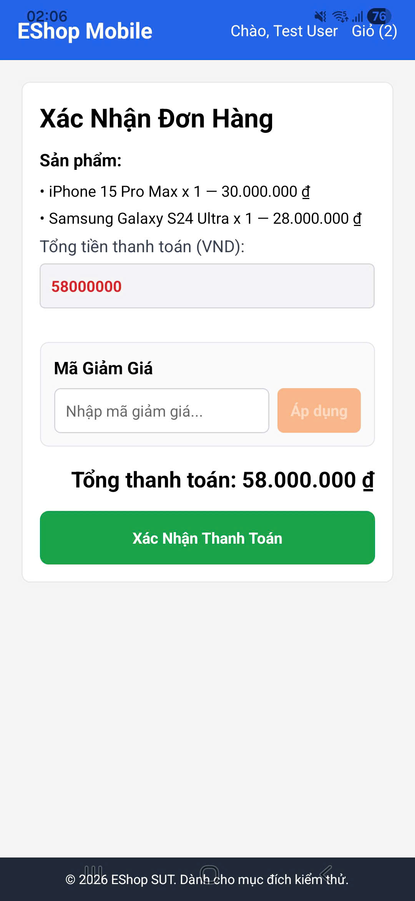

# BUG-FR21-D-01: Giao dịch Checkout thiếu thuộc tính địa chỉ giao hàng gửi lên API

| Tên trường (Field) | Giá trị (Value) |
| :--- | :--- |
| **No.** | 02 |
| **BugID** | `BUG-FR21-D-01` |
| **Status** | **Open** |
| **Requirement Name** | Mobile Cart & Checkout |
| **Summary** | Khi thực hiện đặt hàng trên ứng dụng di động, thông tin địa chỉ giao hàng không được gửi kèm theo đơn hàng, dẫn đến đơn hàng mới được tạo trên hệ thống bị bỏ trống trường địa chỉ giao hàng. |
| **Steps to reproduce** | 1. Đăng nhập vào ứng dụng di động và thiết lập địa chỉ giao hàng trong hồ sơ cá nhân. 2. Thêm sản phẩm vào giỏ hàng và tiến hành thanh toán. 3. Tại màn hình Checkout, bấm 'Xác nhận thanh toán'. 4. Kiểm tra thông tin đơn hàng vừa tạo trên hệ thống: địa chỉ giao hàng của đơn hàng bị để trống. |
| **Severity** | Major |
| **Frequency** | Always |
| **Priority** | High |
| **Evidence (Screenshot)** |  |
| **Date** | 2026-06-29 |
| **Reporter** | Khoa |
