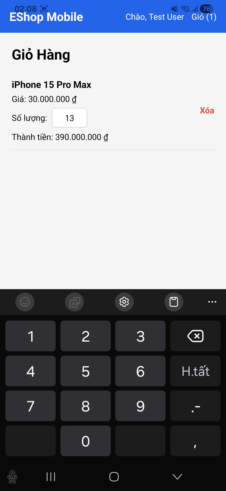

# BUG-FR21-D-02: Nhập số lượng trực tiếp trong giỏ hàng bị cộng thêm 1 đơn vị

| Tên trường (Field) | Giá trị (Value) |
| :--- | :--- |
| **No.** | 03 |
| **BugID** | `BUG-FR21-D-02` |
| **Status** | **Open** |
| **Requirement Name** | Mobile Cart & Checkout |
| **Summary** | Giao diện giỏ hàng trên ứng dụng di động tự động tăng số lượng sản phẩm thêm 1 đơn vị so với số lượng người dùng thực tế nhập trực tiếp vào ô số lượng. |
| **Steps to reproduce** | 1. Đăng nhập vào ứng dụng di động. 2. Thêm 1 sản phẩm vào giỏ hàng. 3. Mở giỏ hàng, tại ô nhập số lượng, nhập trực tiếp số lượng là 2. 4. Quan sát số hiển thị thực tế trên ô nhập liệu (sẽ bị nhảy thành 3). |
| **Severity** | Major |
| **Frequency** | Always |
| **Priority** | High |
| **Evidence (Screenshot)** |  |
| **Date** | 2026-06-29 |
| **Reporter** | Khoa |
