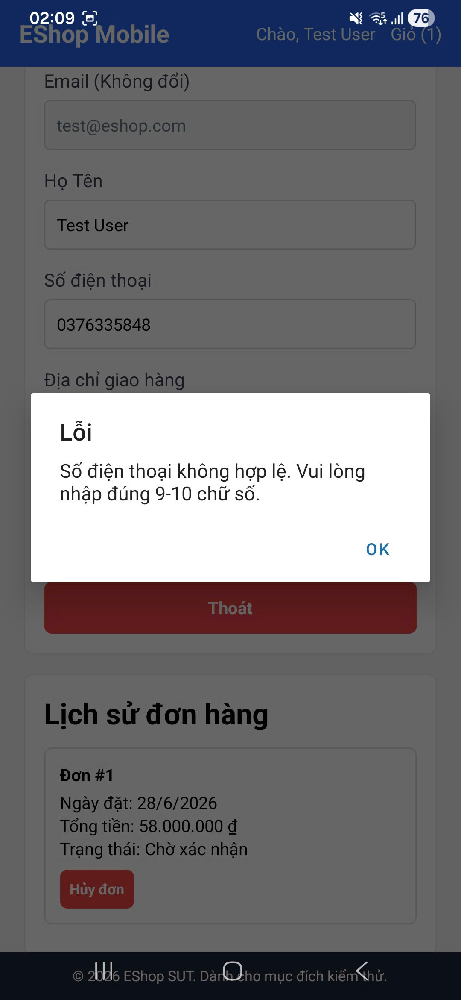

# BUG-FR21-D-03: Hồ sơ mobile không chấp nhận số điện thoại bắt đầu bằng số 0

| Tên trường (Field) | Giá trị (Value) |
| :--- | :--- |
| **No.** | 04 |
| **BugID** | `BUG-FR21-D-03` |
| **Status** | **Open** |
| **Requirement Name** | Mobile Cart & Checkout |
| **Summary** | Tại phần cập nhật hồ sơ cá nhân trên ứng dụng di động, hệ thống không chấp nhận số điện thoại bắt đầu bằng chữ số 0, dẫn đến việc từ chối các số điện thoại hợp lệ tại Việt Nam (luôn bắt đầu bằng số 0) và báo lỗi định dạng. |
| **Steps to reproduce** | 1. Đăng nhập vào ứng dụng di động và vào trang Profile. 2. Nhập số điện thoại hợp lệ ở Việt Nam (ví dụ: 0912345678) vào ô Số điện thoại. 3. Nhấn nút 'Cập nhật'. 4. Quan sát thông báo lỗi. |
| **Severity** | Medium |
| **Frequency** | Always |
| **Priority** | High |
| **Evidence (Screenshot)** |  |
| **Date** | 2026-06-29 |
| **Reporter** | Khoa |
