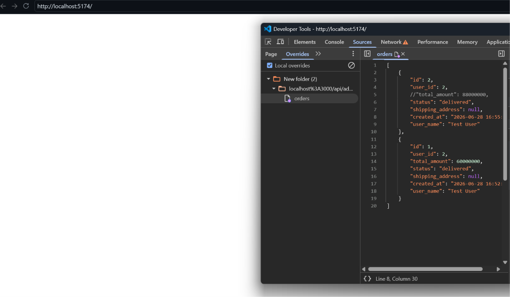

# BUG-FR21-D-04: API `/api/checkout` thiếu kiểm định tính toàn vẹn của đơn giá (Price Tampering)

| Tên trường (Field) | Giá trị (Value) |
| :--- | :--- |
| **No.** | 05 |
| **BugID** | `BUG-FR21-D-04` |
| **Status** | **Open** |
| **Requirement Name** | Mobile Cart & Checkout |
| **Summary** | API thanh toán (`POST /api/checkout`) chấp nhận trực tiếp tổng số tiền (`total_amount`) do người dùng truyền lên mà không kiểm tra đối sánh giá trị thực tế của các mặt hàng, cho phép người dùng thay đổi giá trị đơn hàng tùy ý (Price Tampering). |
| **Steps to reproduce** | 1. Đăng nhập và thêm sản phẩm có giá trị cao (ví dụ: 30,000,000 ₫) vào giỏ hàng. 2. Nhấn thanh toán trên giao diện ứng dụng. 3. Sử dụng công cụ chặn request (như Proxy/Burp Suite) để bắt và can thiệp request thanh toán (`POST /api/checkout`). 4. Sửa giá trị tổng số tiền (`total_amount`) trong nội dung request thành 1,000 ₫ và gửi lên hệ thống. 5. Quan sát phản hồi: hệ thống báo thanh toán thành công. 6. Kiểm tra thông tin đơn hàng trên hệ thống: đơn hàng được ghi nhận thành công với tổng số tiền thanh toán là 1,000 ₫. |
| **Severity** | Critical |
| **Frequency** | Always |
| **Priority** | High |
| **Evidence (Screenshot)** |  |
| **Date** | 2026-06-29 |
| **Reporter** | Khoa |
