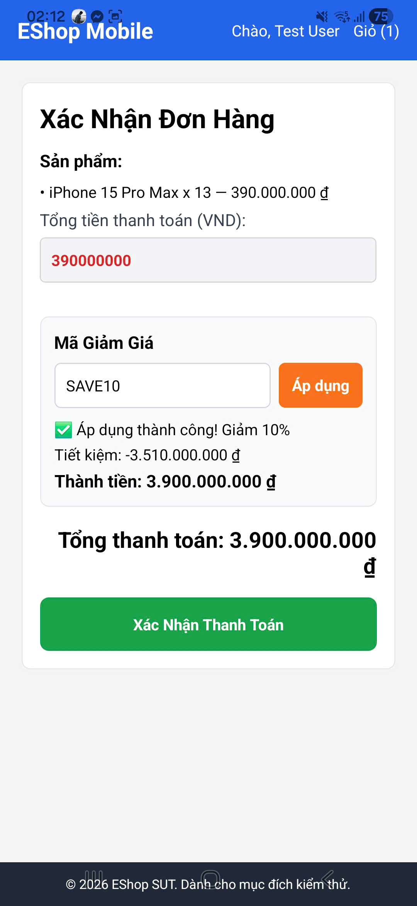

# BUG-FR21-D-06: API áp dụng mã giảm giá tính sai số tiền giảm giá phần trăm (percent)

| Tên trường (Field) | Giá trị (Value) |
| :--- | :--- |
| **No.** | 07 |
| **BugID** | `BUG-FR21-D-06` |
| **Status** | **Open** |
| **Requirement Name** | Mobile Cart & Checkout |
| **Summary** | Khi áp dụng mã giảm giá theo tỷ lệ phần trăm (percent), hệ thống tính sai số tiền giảm giá bằng cách lấy tổng số tiền nhân với phần trăm còn lại (1 - tỷ lệ giảm giá) thay vì tỷ lệ giảm giá. Ví dụ: mã giảm giá 10% được tính thành giảm giá 90% của đơn hàng. |
| **Steps to reproduce** | 1. Đăng nhập vào ứng dụng. 2. Thêm sản phẩm trị giá 350,000 ₫ vào giỏ hàng và tiến hành thanh toán. 3. Áp dụng mã giảm giá "SAVE10" (giảm 10%). 4. Quan sát số tiền giảm giá hiển thị trên giao diện (hệ thống hiển thị số tiền được giảm là 315,000 ₫ thay vì 35,000 ₫). |
| **Severity** | Critical |
| **Frequency** | Always |
| **Priority** | High |
| **Evidence (Screenshot)** |  |
| **Date** | 2026-06-29 |
| **Reporter** | Khoa |
