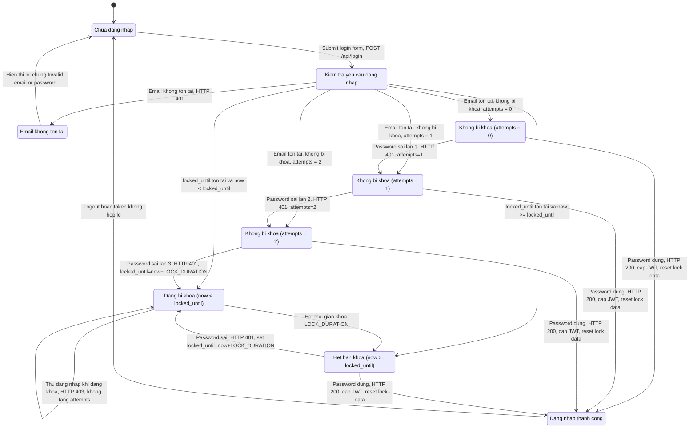

# 06 - State Diagram: FR02 - Dang nhap va Khoa tai khoan

## State Diagram

## Transition Notes

| From state | Event / guard | Action | Next state |
|---|---|---|---|
| `Guest` | User submit login form | Call `POST /api/login` | `Checking` |
| `Checking` | Email does not exist | Return `401 Invalid email or password` | `Guest` |
| `Checking` | Account is locked and `now < locked_until` | Return `403`, do not check password, do not increase attempts | `Locked` |
| `A0` | Wrong password | Increase `login_attempts` to `1`, return `401` | `A1` |
| `A1` | Wrong password | Increase `login_attempts` to `2`, return `401` | `A2` |
| `A2` | Wrong password | Increase `login_attempts` to `3`, set `locked_until = now + LOCK_DURATION`, return `401` | `Locked` |
| `A0`, `A1`, `A2` | Correct password | Return JWT, reset `login_attempts = 0`, reset `locked_until = NULL` | `Authenticated` |
| `Locked` | Login attempt before expiry | Return `403`, keep lock state | `Locked` |
| `Locked` | Lock duration expires | Allow next login request to be evaluated | `LockExpired` |
| `LockExpired` | Correct password | Return JWT and clear lock data | `Authenticated` |
| `LockExpired` | Wrong password | Reject and lock account again | `Locked` |

## Assumptions

- `LOCK_DURATION = 180 seconds` according to `decision-table/tests/test-design/FR02/01-requirement-analysis.md` and `backend/server.js`.
- Some BVA test cases in `BVA&EP/tests/test-cases/login` describe `LOCK_DURATION = 30 seconds`. If your report follows that BVA version, replace `LOCK_DURATION` in the diagram with `30 seconds`.
- The diagram above follows the expected specification: each wrong password increases `login_attempts` by `1`, so the account is locked on the third consecutive failed login.
- Current source code has known bug `BUG-FR02-001`: `login_attempts` is increased by `2`. With the bug, the actual transitions become `A0 --> A2` after the first wrong password and `A1 --> Locked` after the next wrong password.
