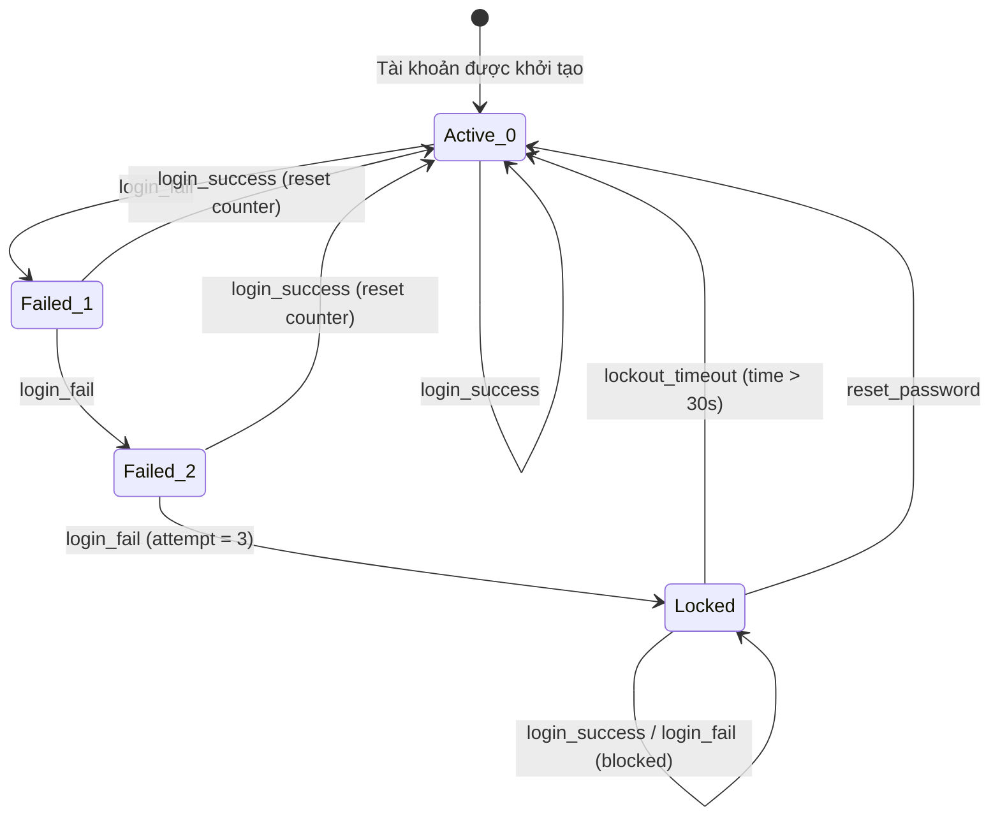

# Test Design Analysis: FR02 – Login and Account Lockout (State Transition Testing)

Tài liệu phân tích thiết kế kịch bản kiểm thử theo kỹ thuật chuyển trạng thái (State Transition Testing) cho tính năng Đăng nhập và Khóa tài khoản (FR02) trong hệ thống EShop.

---

## 1. Xác Định Trạng Thái & Sự Kiện (States & Events)

### 1.1. Các Trạng Trạng Thái (States) của Tài khoản:
1. **`Active (0 attempts)`**: Tài khoản hoạt động bình thường, chưa có lần thử sai nào trong chuỗi liên tiếp (Trạng thái mặc định).
2. **`Failed 1st`**: Tài khoản có 1 lần đăng nhập sai liên tiếp.
3. **`Failed 2nd`**: Tài khoản có 2 lần đăng nhập sai liên tiếp.
4. **`Locked`**: Tài khoản bị khóa tạm thời sau 3 lần đăng nhập sai liên tiếp.

### 1.2. Các Sự Kiện Kích Hoạt Chuyển Trạng Thái (Events):
* **`login_success`**: Đăng nhập với đúng email và mật khẩu.
* **`login_fail`**: Đăng nhập với email/mật khẩu sai.
* **`lockout_timeout`**: Thời gian khóa kết thúc (Quy định đặc tả là 30 giây trong môi trường thử nghiệm).
* **`reset_password`**: Khôi phục mật khẩu thành công bằng cách đặt lại mật khẩu mới.

---

## 2. Bảng Chuyển Trạng Thái (State Transition Table)

| Trạng thái hiện tại (Current State) | Sự kiện (Event) | Trạng thái tiếp theo (Expected Next State) | Tính hợp lệ (Validity) | Hành động / Kết quả mong đợi |
| :--- | :--- | :--- | :--- | :--- |
| **`Active (0 attempts)`** | `login_success` | **`Active (0 attempts)`** | Hợp lệ | Đăng nhập thành công, nhận JWT, chuyển về Home. |
| **`Active (0 attempts)`** | `login_fail` | **`Failed 1st`** | Hợp lệ | Đăng nhập thất bại, tăng bộ đếm lên 1, báo lỗi. |
| **`Failed 1st`** | `login_success` | **`Active (0 attempts)`** | Hợp lệ | Đăng nhập thành công, reset bộ đếm về 0, chuyển về Home. |
| **`Failed 1st`** | `login_fail` | **`Failed 2nd`** | Hợp lệ | Đăng nhập thất bại, tăng bộ đếm lên 2, báo lỗi. |
| **`Failed 2nd`** | `login_success` | **`Active (0 attempts)`** | Hợp lệ | Đăng nhập thành công, reset bộ đếm về 0, chuyển về Home. |
| **`Failed 2nd`** | `login_fail` | **`Locked`** | Hợp lệ | Đăng nhập thất bại lần 3, khóa tài khoản 30s, báo lỗi tài khoản bị khóa. |
| **`Locked`** | `login_success` | **`Locked`** | Không hợp lệ | Đăng nhập bị chặn, báo lỗi tài khoản đang bị khóa. |
| **`Locked`** | `login_fail` | **`Locked`** | Không hợp lệ | Đăng nhập bị chặn, báo lỗi tài khoản đang bị khóa. |
| **`Locked`** | `lockout_timeout` | **`Active (0 attempts)`** | Hợp lệ | Hết thời gian khóa, tự động mở khóa, reset bộ đếm về 0. |
| **`Locked`** | `reset_password` | **`Active (0 attempts)`** | Hợp lệ | Reset mật khẩu thành công, tự động mở khóa, reset bộ đếm về 0. |

---

## 3. Sơ Đồ Chuyển Trạng Thái (State Transition Diagram)

---

## 4. Phân Tích Độ Bao Phủ Kiểm Thử (Coverage Analysis)

Chúng ta thiết kế kịch bản đảm bảo bao phủ đầy đủ các tiêu chí kiểm thử chuyển trạng thái:

### 4.1. Bao phủ Trạng thái (States Coverage)
Phải viếng thăm tất cả 4 trạng thái:
* **`Active (0 attempts)`**: Bao phủ trong TC-FR02-ST-001.
* **`Failed 1st`**: Bao phủ trong TC-FR02-ST-002.
* **`Failed 2nd`**: Bao phủ trong TC-FR02-ST-003.
* **`Locked`**: Bao phủ trong TC-FR02-ST-004.

### 4.2. Bao phủ Chuyển đổi (Transitions Coverage - 0-switch)
Phải thực thi tất cả các chuyển đổi hợp lệ trong bảng chuyển trạng thái ít nhất 1 lần:
* Chuyển đổi 1: `Active` -> `Active` (TC-FR02-ST-001)
* Chuyển đổi 2: `Active` -> `Failed 1st` (TC-FR02-ST-002)
* Chuyển đổi 3: `Failed 1st` -> `Active` (TC-FR02-ST-002)
* Chuyển đổi 4: `Failed 1st` -> `Failed 2nd` (TC-FR02-ST-003)
* Chuyển đổi 5: `Failed 2nd` -> `Active` (TC-FR02-ST-003)
* Chuyển đổi 6: `Failed 2nd` -> `Locked` (TC-FR02-ST-004)
* Chuyển đổi 7: `Locked` -> `Active` (TC-FR02-ST-005)
* Chuyển đổi 8: `Locked` -> `Active` (TC-FR02-ST-006)

### 4.3. Bao phủ Chuỗi Chuyển đổi (n-Switch Coverage - 1-switch)
Kiểm thử các chuỗi gồm 2 chuyển đổi liên tiếp (cặp chuyển đổi):
* Chuỗi 1 (2 lần đăng nhập sai): `Active` -> Failed 1st -> Failed 2nd (Bao phủ bởi TC-FR02-ST-003)
* Chuỗi 2 (Nhập sai lần 2 rồi khóa): Failed 1st -> Failed 2nd -> Locked (Bao phủ bởi TC-FR02-ST-004)
* Chuỗi 3 (Khóa rồi chờ mở khóa): Failed 2nd -> Locked -> lockout_timeout -> Active (Bao phủ bởi TC-FR02-ST-005)
* Chuỗi 4 (Khóa rồi reset pass): Failed 2nd -> Locked -> reset_password -> Active (Bao phủ bởi TC-FR02-ST-006)

### 4.4. Kiểm thử Tích hợp Đầu-Cuối (End-to-End Test Paths)
* **TC-FR02-ST-009 (E2E Path)**: Chuỗi hành trình đầy đủ của một người dùng:
  `Active` -> Failed 1st -> Failed 2nd -> Locked -> lockout_timeout -> Active -> login_success -> Active (Đăng nhập sai 3 lần liên tiếp bị khóa -> chờ hết thời gian khóa -> đăng nhập thành công bằng mật khẩu đúng).

### 4.5. Kiểm thử Trạng thái Kết thúc (Final State Verification)
Kiểm chứng tính đóng của trạng thái `Locked` để đảm bảo hệ thống chặn đứng mọi hành vi đăng nhập trái phép trong thời gian khóa:
* **TC-FR02-ST-007**: Tại trạng thái `Locked`, thực hiện `login_success` (nhập đúng mật khẩu) -> trạng thái vẫn là `Locked` (hệ thống báo lỗi tài khoản bị khóa, chặn đăng nhập).
* **TC-FR02-ST-008**: Tại trạng thái `Locked`, thực hiện `login_fail` (nhập sai mật khẩu) -> trạng thái vẫn là `Locked` (hệ thống báo lỗi tài khoản bị khóa, chặn đăng nhập).
