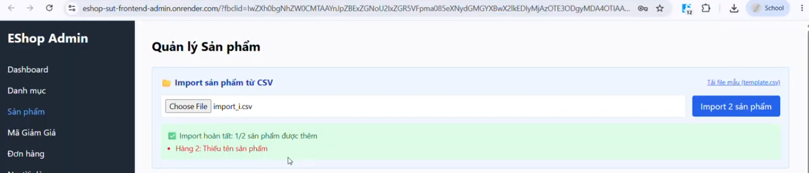
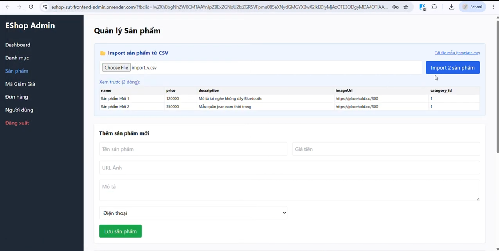

# Báo Cáo Lỗi Giao Diện & Trải Nghiệm Người Dùng (GUI & Usability Bug Report)

Tài liệu này tổng hợp toàn bộ các lỗi phát hiện được trong quá trình thực hiện kiểm thử GUI Checklist (Task 1) và Đánh giá Usability (Task 2) đối với các chức năng FR-04: Personal profile management, FR-11: Order history view (user), và FR-19: User management (admin). Tất cả lỗi được phát hiện phải được log lên GitHub Issues của dự án và đính kèm liên kết kiểm chứng ở dưới.

---

## 1. Tóm Tắt Kết Quả Phát Hiện Lỗi

- **Tổng số lỗi phát hiện:** 16 (bao gồm 9 lỗi GUI và 7 lỗi Usability)
- **Phân loại theo mức độ nghiêm trọng (Severity):**
  - **Nghiêm trọng / Chặn (Critical/Blocker):** 0
  - **Trung bình / Lớn (Medium/Major):** 4 (2 GUI + 2 Usability)
  - **Thấp / Thẩm mỹ (Low/Minor):** 12 (7 GUI + 5 Usability)

---

## 2. Danh Sách Lỗi Chi Tiết (Bug Details)

### 2.1. Nhóm Lỗi Giao Diện Người Dùng (GUI Bugs)

#### BUG-01: Form cập nhật thông tin cá nhân thiếu dấu sao đỏ (*) bắt buộc ở trường "Họ Tên"
- **Mô tả lỗi:** Theo thiết kế chuẩn của form, trường nhập liệu bắt buộc phải có chỉ báo trực quan là dấu sao đỏ (`*`). Tuy nhiên, trường "Họ Tên" là trường bắt buộc (nếu để trống hệ thống sẽ báo lỗi và không cho cập nhật) nhưng nhãn (label) của nó không hiển thị dấu sao đỏ, dễ làm người dùng nhầm lẫn đây là trường tùy chọn.
- **Các bước tái hiện (Steps to Reproduce):**
  1. Đăng nhập cổng người dùng bằng tài khoản `test@eshop.com` / `Test1234!`.
  2. Bấm vào tên người dùng ở góc trên bên phải để vào trang Hồ sơ cá nhân (`http://localhost:5173/profile`).
  3. Quan sát nhãn của trường "Họ Tên".
- **Kết quả thực tế (Actual Result):** Nhãn chỉ hiển thị chữ "Họ Tên" mà không có dấu sao đỏ `*` bên cạnh.
- **Kết quả mong đợi (Expected Result):** Nhãn hiển thị dạng "Họ Tên *" hoặc có ký tự màu đỏ biểu thị đây là trường bắt buộc nhập.
- **Mức độ nghiêm trọng (Severity):** Low/Minor (Lỗi hiển thị thẩm mỹ / Trải nghiệm hướng dẫn người dùng).
- **Nền tảng phát hiện:** Trình duyệt Chrome / Edge trên Windows 11.
- **Link GitHub Issue:** `https://github.com/trngnneee/eshop-sut/issues/301`
- **Ảnh chụp màn hình lỗi (Có chứa email pqthinh231@clc.fitus.edu.vn watermark):**
  

---

#### BUG-02: Ràng buộc Regex số điện thoại tại form cập nhật hồ sơ chặn các số điện thoại bắt đầu bằng '0'
- **Mô tả lỗi:** Biểu mẫu cập nhật hồ sơ cá nhân có kiểm tra tính hợp lệ của trường Số điện thoại bắt buộc số điện thoại phải bắt đầu bằng chữ số khác 0, vô tình loại bỏ tất cả số điện thoại Việt Nam hợp lệ bắt đầu bằng chữ số `0` (ví dụ: `0987654321`), dẫn đến người dùng không thể lưu số điện thoại của mình.
- **Các bước tái hiện (Steps to Reproduce):**
  1. Đăng nhập cổng người dùng bằng tài khoản `test@eshop.com` / `Test1234!`.
  2. Bấm vào tên người dùng ở góc trên bên phải để vào trang Hồ sơ cá nhân (`http://localhost:5173/profile`).
  3. Nhập số điện thoại `0987654321` vào trường "Số điện thoại".
  4. Bấm nút "Cập nhật".
- **Kết quả thực tế (Actual Result):** Hiển thị hộp thoại cảnh báo (alert): "Số điện thoại không hợp lệ. Vui lòng nhập đúng 9-10 chữ số." và ngăn không gửi yêu cầu lưu lên backend.
- **Kết quả mong đợi (Expected Result):** Cho phép nhập và lưu số điện thoại Việt Nam hợp lệ bắt đầu bằng số `0` (regex nên là `/^0[0-9]{8,9}$/` hoặc `/^[0-9]{9,10}$/`).
- **Mức độ nghiêm trọng (Severity):** Medium/Major (Lỗi chức năng quan trọng làm người dùng thực tế không thể khai báo số điện thoại liên lạc của họ).
- **Nền tảng phát hiện:** Trình duyệt Chrome / Edge trên Windows 11.
- **Link GitHub Issue:** `https://github.com/trngnneee/eshop-sut/issues/302`
- **Ảnh chụp màn hình lỗi (Có chứa email pqthinh231@clc.fitus.edu.vn watermark):**
  

---

#### BUG-03: Thông báo lỗi nhập liệu Số điện thoại hiển thị qua alert() thay vì thông báo lỗi dưới chân trường nhập
- **Mô tả lỗi:** Khi người dùng nhập sai định dạng số điện thoại, thông báo lỗi chỉ xuất hiện dưới dạng một popup cảnh báo mặc định của trình duyệt. Điều này làm gián đoạn trải nghiệm người dùng (phải click OK để đóng popup) thay vì hiển thị thông điệp cảnh báo màu đỏ ngay dưới trường nhập liệu.
- **Các bước tái hiện (Steps to Reproduce):**
  1. Vào trang Hồ sơ cá nhân (`http://localhost:5173/profile`).
  2. Nhập số điện thoại không đúng định dạng (VD: chứa chữ cái hoặc bắt đầu bằng số 0 do lỗi BUG-02).
  3. Nhấn "Cập nhật".
- **Kết quả thực tế (Actual Result):** Trình duyệt bật lên hộp thoại `alert()` hiển thị thông báo lỗi.
- **Kết quả mong đợi (Expected Result):** Thông báo lỗi hiển thị động bằng văn bản màu đỏ (inline error message) ngay dưới chân của trường "Số điện thoại" để giữ tính nhất quán giao diện và thân thiện với trải nghiệm.
- **Mức độ nghiêm trọng (Severity):** Low/Minor (Ảnh hưởng đến độ tiện dụng và chuẩn thiết kế biểu mẫu).
- **Nền tảng phát hiện:** Trình duyệt Chrome / Edge trên Windows 11.
- **Link GitHub Issue:** `https://github.com/trngnneee/eshop-sut/issues/303`
- **Ảnh chụp màn hình lỗi (Có chứa email pqthinh231@clc.fitus.edu.vn watermark):**
  

---

#### BUG-04: Nút điều hướng "Hồ sơ" không được làm nổi bật / khác với các trang khác khi người dùng đang hoạt động tại trang Hồ sơ
- **Mô tả lỗi:** Khi truy cập vào trang cá nhân (`/profile`), nút điều hướng đại diện cho tài khoản của người dùng ("Chào, [Tên]") trên thanh menu không thay đổi trạng thái active (ví dụ: in đậm, thay đổi màu sắc hoặc có gạch chân) để người dùng định vị được họ đang ở đâu.
- **Các bước tái hiện (Steps to Reproduce):**
  1. Đăng nhập và truy cập trang Hồ sơ cá nhân (`http://localhost:5173/profile`).
  2. Quan sát nút điều hướng "Chào, Test User" ở góc trên bên phải thanh menu và đối chiếu với nút "Trang chủ" hoặc "Giỏ hàng".
- **Kết quả thực tế (Actual Result):** Nút "Chào, Test User" không thay đổi giao diện, hoàn toàn giống với lúc đang ở trang chủ `/`.
- **Kết quả mong đợi (Expected Result):** Nút điều hướng active phải hiển thị trạng thái nổi bật (highlight) hoặc đổi màu nền/chữ để chỉ ra phân hệ đang hoạt động.
- **Mức độ nghiêm trọng (Severity):** Low/Minor (Lỗi nhất quán điều hướng).
- **Nền tảng phát hiện:** Trình duyệt Chrome / Edge trên Windows 11.
- **Link GitHub Issue:** `https://github.com/trngnneee/eshop-sut/issues/304`
- **Ảnh chụp màn hình lỗi (Có chứa email pqthinh231@clc.fitus.edu.vn watermark):**
  

---

#### BUG-05: Tiêu đề tab trình duyệt không thay đổi linh hoạt theo phân hệ trang (luôn giữ mặc định)
- **Mô tả lỗi:** Tiêu đề của tab trình duyệt (Browser Tab Title) luôn giữ nguyên là "frontend-web" cho phân hệ khách hàng và "frontend-admin" cho phân hệ Admin, thay vì cập nhật linh hoạt theo từng trang cụ thể (ví dụ: "Hồ sơ cá nhân", "Quản lý người dùng",...).
- **Các bước tái hiện (Steps to Reproduce):**
  1. Mở trang Hồ sơ cá nhân hoặc trang quản lý Admin.
  2. Quan sát tiêu đề hiển thị trên tab của trình duyệt.
- **Kết quả thực tế (Actual Result):** Tiêu đề tab luôn hiển thị cố định "frontend-web" hoặc "frontend-admin".
- **Kết quả mong đợi (Expected Result):** Tiêu đề phải được cập nhật động tương ứng với nội dung trang hiện tại (ví dụ: "Hồ sơ cá nhân | EShop" hoặc "Quản lý người dùng | Admin EShop").
- **Mức độ nghiêm trọng (Severity):** Low/Minor (Thiếu chuyên nghiệp trong chuẩn giao diện web).
- **Nền tảng phát hiện:** Trình duyệt Chrome / Edge trên Windows 11.
- **Link GitHub Issue:** `https://github.com/trngnneee/eshop-sut/issues/305`
- **Ảnh chụp màn hình lỗi (Có chứa email pqthinh231@clc.fitus.edu.vn watermark):**
  

---

#### BUG-06: Trang quản lý người dùng của Admin không hiển thị thông báo trạng thái trống (Empty State) khi không có dữ liệu
- **Mô tả lỗi:** Khi danh sách người dùng trong cơ sở dữ liệu trống, bảng danh sách người dùng của Admin chỉ hiển thị phần tiêu đề bảng (header) và một khoảng trắng trống trơn bên dưới, không có thông điệp hướng dẫn hay chỉ báo trạng thái trống (Empty State).
- **Các bước tái hiện (Steps to Reproduce):**
  1. Đăng nhập Admin và vào tab "Người dùng".
  2. Giả lập cơ sở dữ liệu không có tài khoản người dùng nào (hoặc xóa hết người dùng phụ).
- **Kết quả thực tế (Actual Result):** Giao diện hiển thị bảng trống không có nội dung, không có bất kỳ dòng chữ thông báo nào.
- **Kết quả mong đợi (Expected Result):** Hiển thị dòng thông báo trực quan ở giữa bảng: "Không tìm thấy người dùng nào" hoặc "Danh sách người dùng trống" kèm theo icon phù hợp.
- **Mức độ nghiêm trọng (Severity):** Low/Minor (Thiếu phản hồi trạng thái dữ liệu).
- **Nền tảng phát hiện:** Trình duyệt Chrome / Edge trên Windows 11.
- **Link GitHub Issue:** `https://github.com/trngnneee/eshop-sut/issues/306`
- **Ảnh chụp màn hình lỗi (Có chứa email pqthinh231@clc.fitus.edu.vn watermark):**
  

---

#### BUG-07: Thiếu hiệu ứng làm nổi bật hàng (row hover highlight) khi di chuột qua các bảng dữ liệu
- **Mô tả lỗi:** Các bảng dữ liệu (bảng Lịch sử đơn hàng ở Profile và bảng Danh sách người dùng ở Admin) không có hiệu ứng thay đổi màu nền nhẹ (hover color) của hàng khi người dùng di chuột qua, gây khó khăn cho việc đối chiếu thông tin theo dòng ngang.
- **Các bước tái hiện (Steps to Reproduce):**
  1. Truy cập bảng Lịch sử đơn hàng (User) hoặc bảng danh sách Người dùng (Admin).
  2. Rê chuột qua các dòng dữ liệu trong bảng.
- **Kết quả thực tế (Actual Result):** Hàng dữ liệu giữ nguyên màu sắc, không có phản hồi thị giác nào khi rê chuột qua.
- **Kết quả mong đợi (Expected Result):** Hàng được rê chuột qua phải đổi màu nền nhẹ (ví dụ: xám nhạt hoặc xanh nhạt) để người dùng dễ theo dõi thông tin dòng ngang.
- **Mức độ nghiêm trọng (Severity):** Low/Minor (Thiếu phản hồi thị giác tương tác).
- **Nền tảng phát hiện:** Trình duyệt Chrome / Edge trên Windows 11.
- **Link GitHub Issue:** `https://github.com/trngnneee/eshop-sut/issues/307`
- **Ảnh chụp màn hình lỗi (Có chứa email pqthinh231@clc.fitus.edu.vn watermark):**
  

---

#### BUG-08: Thiếu chỉ báo tải dữ liệu (loading indicator) khi bảng Lịch sử đơn hàng đang tải thông tin
- **Mô tả lỗi:** Trong khoảng thời gian hệ thống thực hiện gọi API để lấy danh sách đơn hàng từ server, bảng lịch sử đơn hàng hiển thị trạng thái trống trơn mà không có vòng xoay tải dữ liệu (loading spinner) hay thông báo "Đang tải...", làm người dùng tưởng rằng họ không có đơn hàng nào trước khi dữ liệu kịp render.
- **Các bước tái hiện (Steps to Reproduce):**
  1. Đăng nhập tài khoản khách hàng có nhiều đơn hàng.
  2. Vào trang Profile và quan sát bảng đơn hàng ngay khi trang vừa tải (hoặc giả lập mạng chậm).
- **Kết quả thực tế (Actual Result):** Bảng trống trơn không có thông tin gì trong 0.5s - 1s đầu trước khi đơn hàng xuất hiện.
- **Kết quả mong đợi (Expected Result):** Phải có spinner hoặc chữ "Đang tải dữ liệu đơn hàng..." để thông báo cho người dùng biết hệ thống đang xử lý.
- **Mức độ nghiêm trọng (Severity):** Low/Minor (Trải nghiệm phản hồi người dùng chậm).
- **Nền tảng phát hiện:** Trình duyệt Chrome / Edge trên Windows 11.
- **Link GitHub Issue:** `https://github.com/trngnneee/eshop-sut/issues/308`
- **Ảnh chụp màn hình lỗi (Có chứa email pqthinh231@clc.fitus.edu.vn watermark):**
  

---

#### BUG-09: Trang Admin xóa tài khoản người dùng trực tiếp mà không có hộp thoại xác nhận (Confirm Dialog)
- **Mô tả lỗi:** Tại trang quản lý người dùng của Admin, khi nhấn nút "Xóa" bên cạnh tài khoản người dùng, hệ thống lập tức gửi yêu cầu API DELETE và xóa người dùng khỏi cơ sở dữ liệu mà không có cảnh báo hay xác nhận.
- **Các bước tái hiện (Steps to Reproduce):**
  1. Đăng nhập Admin (`admin@eshop.com` / `Admin123!`) tại `http://localhost:5174/`.
  2. Chọn tab "Người dùng" trên thanh sidebar để xem danh sách.
  3. Nhấn vào nút "Xóa" tại hàng của một người dùng bất kỳ.
- **Kết quả thực tế (Actual Result):** Người dùng bị xóa ngay lập tức khỏi bảng danh sách.
- **Kết quả mong đợi (Expected Result):** Phải hiển thị hộp thoại xác nhận (Confirm Dialog) để xác thực hành động xóa tài khoản.
- **Mức độ nghiêm trọng (Severity):** Medium (Rủi ro mất dữ liệu người dùng do click nhầm).
- **Nền tảng phát hiện:** Trình duyệt Chrome / Edge trên Windows 11.
- **Link GitHub Issue:** `https://github.com/trngnneee/eshop-sut/issues/309`
- **Ảnh chụp màn hình lỗi (Có chứa email pqthinh231@clc.fitus.edu.vn watermark):**
  

---

### 2.2. Nhóm Lỗi Trải Nghiệm Người Dùng (Usability Bugs)

#### BUG-10: Chức năng Import CSV không thực hiện rollback giao dịch khi có dòng dữ liệu bị lỗi (Không đảm bảo tính nguyên tử)
- **Mô tả lỗi:** Khi người dùng thực hiện nhập dữ liệu từ tệp CSV có lỗi (`import_i.csv` thiếu trường tên sản phẩm ở dòng 2), hệ thống vẫn chèn sản phẩm ở dòng 1 (hợp lệ) vào danh sách sản phẩm và chỉ bỏ qua dòng 2. Theo quy định nghiệp vụ, import phải là all-or-nothing (rollback toàn bộ nếu có bất cứ dòng nào lỗi) để bảo vệ tính toàn vẹn dữ liệu.
- **Các bước tái hiện (Steps to Reproduce):**
  1. Đăng nhập Admin (`admin@eshop.com` / `Admin123!`) tại `http://localhost:5174/`.
  2. Vào trang Quản lý sản phẩm, chọn upload file chứa dòng lỗi `import_i.csv`.
  3. Nhấn nút "Import sản phẩm".
  4. Kéo xuống danh sách sản phẩm bên dưới để kiểm tra.
- **Kết quả thực tế (Actual Result):** Dòng sản phẩm hợp lệ thứ nhất vẫn được thêm vào danh sách hiển thị, hệ thống không rollback giao dịch.
- **Kết quả mong đợi (Expected Result):** Hệ thống phải rollback toàn bộ giao dịch và hiển thị thông báo lỗi, không thêm bất kỳ sản phẩm nào từ file CSV nếu có bất kỳ dòng nào bị lỗi.
- **Mức độ nghiêm trọng (Severity):** Medium/Major (Vi phạm tính toàn vẹn dữ liệu và đặc tả nghiệp vụ rollback).
- **Nền tảng phát hiện:** Trình duyệt Chrome / Edge trên Windows 11.
- **Link GitHub Issue:** `https://github.com/trngnneee/eshop-sut/issues/310`
- **Minh chứng:** [Link Drive Video Session 1](https://drive.google.com/file/d/1_eDBRoShbDevvvGxupqKQ7pgHaDXcCv6/view?usp=drive_link)

---

#### BUG-11: Hộp cảnh báo kết quả import hiển thị mâu thuẫn trực quan (Chữ báo lỗi màu đỏ nằm trong khung thông báo thành công màu xanh lá)
- **Mô tả lỗi:** Khi import file CSV có chứa dòng lỗi (`import_i.csv`), hệ thống phản hồi bằng một hộp thông báo màu xanh lá (vốn biểu thị sự thành công) nhưng bên trong lại liệt kê chi tiết dòng lỗi bằng chữ màu đỏ. Điều này làm người dùng cực kỳ bối rối về trạng thái thực tế của tác vụ.
- **Các bước tái hiện (Steps to Reproduce):**
  1. Đăng nhập Admin và vào mục Quản lý sản phẩm.
  2. Upload file `import_i.csv` và bấm "Import sản phẩm".
- **Kết quả thực tế (Actual Result):** Hộp thông báo có màu nền xanh lá (success) nhưng hiển thị dòng lỗi màu đỏ "Hàng 2: Thiếu tên sản phẩm" bên trong.
- **Kết quả mong đợi (Expected Result):** Khi có lỗi xảy ra hoặc tác vụ chạy không trọn vẹn, hệ thống phải hiển thị hộp thông báo màu đỏ (danger/error alert) để nhất quán về mặt thị giác và cảnh báo đúng trạng thái cho người dùng.
- **Mức độ nghiêm trọng (Severity):** Medium/Major (Gây hiểu nhầm nghiêm trọng về trạng thái hệ thống).
- **Nền tảng phát hiện:** Trình duyệt Chrome / Edge trên Windows 11.
- **Link GitHub Issue:** `https://github.com/trngnneee/eshop-sut/issues/311`
- **Ảnh chụp màn hình lỗi (Có chứa email pqthinh231@clc.fitus.edu.vn watermark):**
  

---

#### BUG-12: Vị trí khu vực Import sản phẩm từ CSV chưa đủ nổi bật, gây khó tìm đối với người dùng mới
- **Mô tả lỗi:** Vùng điều khiển chức năng "Import sản phẩm từ CSV" được xếp ở vị trí khuất và kích thước nhỏ trên trang Quản lý sản phẩm, khiến người dùng mới/đối tượng non-IT gặp khó khăn và mất nhiều thời gian tìm kiếm nút chức năng để bắt đầu tác vụ.
- **Các bước tái hiện (Steps to Reproduce):**
  1. Đăng nhập Admin và chuyển sang trang Quản lý sản phẩm.
  2. Cố gắng tìm khu vực upload file CSV để nhập sản phẩm.
- **Kết quả thực tế (Actual Result):** Vị trí nút và vùng upload nằm lẫn lộn với thanh tìm kiếm và bộ lọc sản phẩm, không có tiêu đề phân biệt rõ ràng.
- **Kết quả mong đợi (Expected Result):** Khu vực Import CSV cần được đóng khung riêng biệt, có nhãn rõ ràng hoặc đặt tại góc trên cùng với phong cách thiết kế nổi bật để người dùng dễ định vị.
- **Mức độ nghiêm trọng (Severity):** Low/Minor (Lỗi thiết kế bố cục làm giảm tính tiện dụng).
- **Nền tảng phát hiện:** Trình duyệt Chrome / Edge trên Windows 11.
- **Link GitHub Issue:** `https://github.com/trngnneee/eshop-sut/issues/312`
- **Ảnh chụp màn hình lỗi (Có chứa email pqthinh231@clc.fitus.edu.vn watermark):**
  

---

#### BUG-13: Giao diện Import CSV thiếu nút xóa/hủy file đã chọn hoặc kết quả import cũ
- **Mô tả lỗi:** Sau khi thực hiện upload file lỗi hoặc khi hệ thống hiển thị thông báo lỗi import, trên giao diện hoàn toàn không có nút đóng (close `x`), nút xóa (clear) hoặc nút hủy (cancel) kết quả hiển thị đó để đưa giao diện về trạng thái ban đầu, gây bất tiện trong trải nghiệm.
- **Các bước tái hiện (Steps to Reproduce):**
  1. Thực hiện upload và import file lỗi `import_i.csv`.
  2. Cố gắng dọn dẹp hoặc xóa thông báo lỗi để chuẩn bị thực hiện lần import tiếp theo.
- **Kết quả thực tế (Actual Result):** Không có phần tử giao diện nào hỗ trợ xóa thông báo lỗi hoặc hủy file đã chọn. Người dùng buộc phải upload đè file mới lên.
- **Kết quả mong đợi (Expected Result):** Cần có nút đóng hộp thông báo lỗi (nút `x`) và nút "Hủy" hoặc "Xóa" file đã chọn bên cạnh tên file.
- **Mức độ nghiêm trọng (Severity):** Low/Minor (Ảnh hưởng đến độ tiện dụng của giao diện).
- **Nền tảng phát hiện:** Trình duyệt Chrome / Edge trên Windows 11.
- **Link GitHub Issue:** `https://github.com/trngnneee/eshop-sut/issues/313`
- **Ảnh chụp màn hình lỗi (Có chứa email pqthinh231@clc.fitus.edu.vn watermark):**
  

---

#### BUG-14: Kích thước phông chữ hiển thị trong bảng xem trước (preview table) quá nhỏ, gây khó đọc
- **Mô tả lỗi:** Khi upload file CSV lên, dữ liệu xem trước được hiển thị trong bảng Preview Table nhưng cỡ chữ của các dòng dữ liệu rất nhỏ, gây mỏi mắt và khó khăn cho người dùng khi đối chiếu nhanh thông tin trước khi nhấn Import.
- **Các bước tái hiện (Steps to Reproduce):**
  1. Upload file CSV bất kỳ lên vùng Import sản phẩm.
  2. Quan sát bảng dữ liệu xem trước hiển thị ngay bên dưới.
- **Kết quả thực tế (Actual Result):** Cỡ chữ trong bảng xem trước nhỏ hơn đáng kể so với cỡ chữ tiêu chuẩn của trang web.
- **Kết quả mong đợi (Expected Result):** Cỡ chữ trong bảng xem trước phải đồng nhất với cỡ chữ của bảng danh sách sản phẩm chính để đảm bảo khả năng đọc tốt.
- **Mức độ nghiêm trọng (Severity):** Low/Minor (Trải nghiệm hiển thị / Khả năng tiếp cận).
- **Nền tảng phát hiện:** Trình duyệt Chrome / Edge trên Windows 11.
- **Link GitHub Issue:** `https://github.com/trngnneee/eshop-sut/issues/314`
- **Ảnh chụp màn hình lỗi (Có chứa email pqthinh231@clc.fitus.edu.vn watermark):**
  

---

#### BUG-15: Bảng xem trước CSV ở trạng thái Read-only, không cho phép chỉnh sửa nhanh các ô dữ liệu bị lỗi
- **Mô tả lỗi:** Khi người dùng xem trước và thấy có dòng bị thiếu thông tin hoặc sai định dạng, họ không thể nhấp chuột vào ô đó để chỉnh sửa nhanh tại chỗ mà bắt buộc phải mở file CSV trên máy tính để sửa rồi tải lên lại, gây mất thời gian.
- **Các bước tái hiện (Steps to Reproduce):**
  1. Upload file `import_i.csv` chứa dòng lỗi.
  2. Cố gắng nhấp đúp hoặc gõ vào ô bị thiếu tên sản phẩm trên bảng xem trước.
- **Kết quả thực tế (Actual Result):** Bảng xem trước là tĩnh (Read-only), không phản hồi tương tác sửa đổi.
- **Kết quả mong đợi (Expected Result):** Hệ thống nên hỗ trợ tính năng chỉnh sửa nhanh (inline editing) trên bảng xem trước để người dùng bổ sung các thông tin bị thiếu trước khi import chính thức.
- **Mức độ nghiêm trọng (Severity):** Low/Minor (Thiếu tính năng hỗ trợ phục hồi lỗi nhanh).
- **Nền tảng phát hiện:** Trình duyệt Chrome / Edge trên Windows 11.
- **Link GitHub Issue:** `https://github.com/trngnneee/eshop-sut/issues/315`
- **Ảnh chụp màn hình lỗi (Có chứa email pqthinh231@clc.fitus.edu.vn watermark):**
  

---