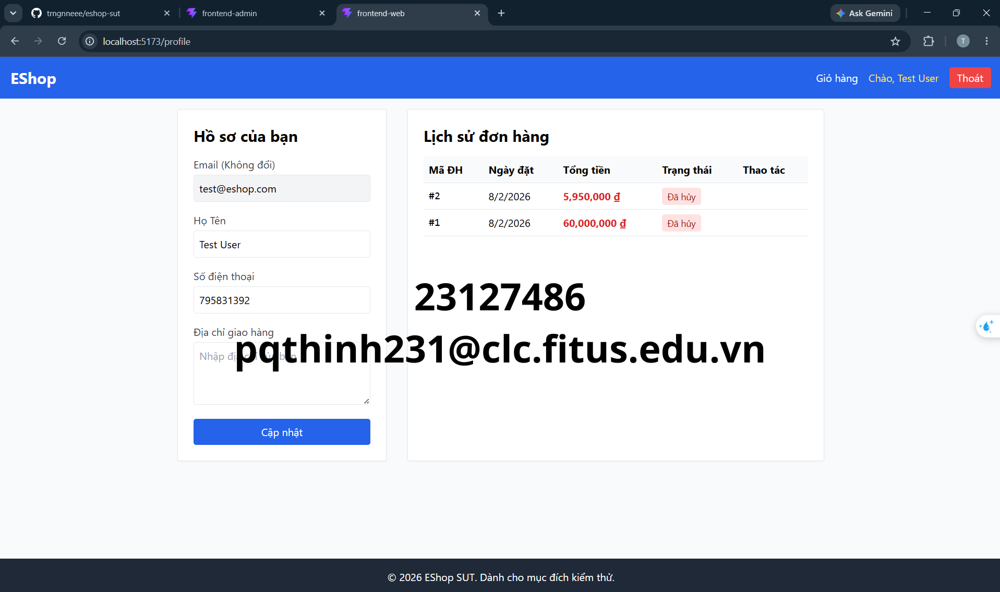
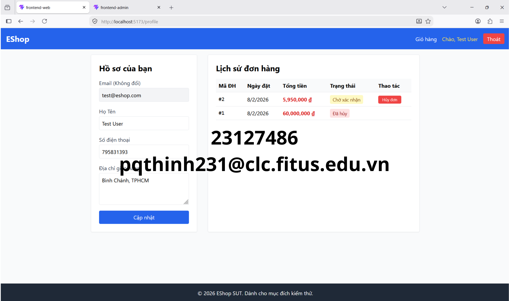
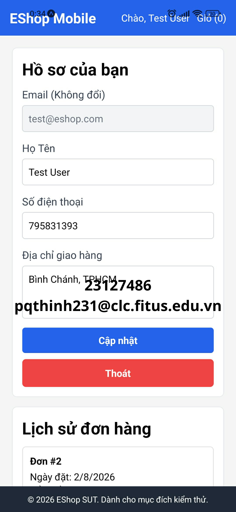
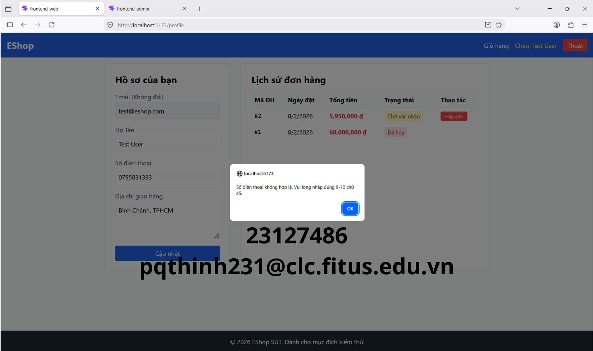
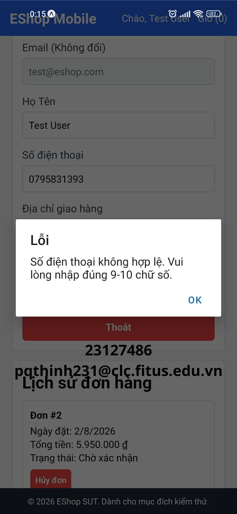
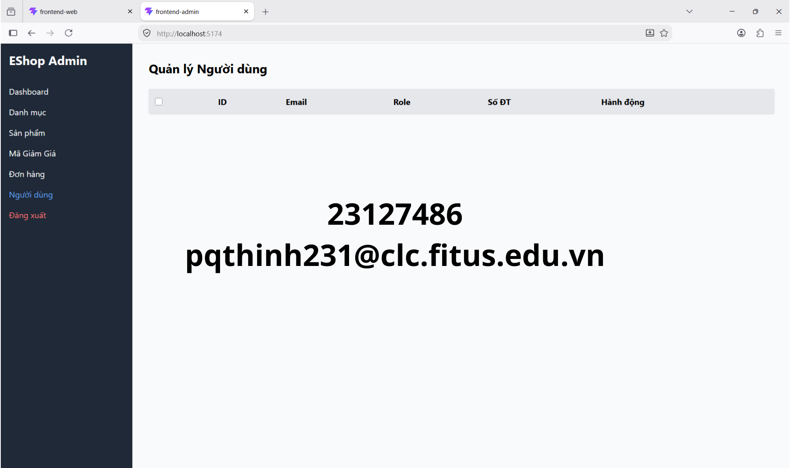
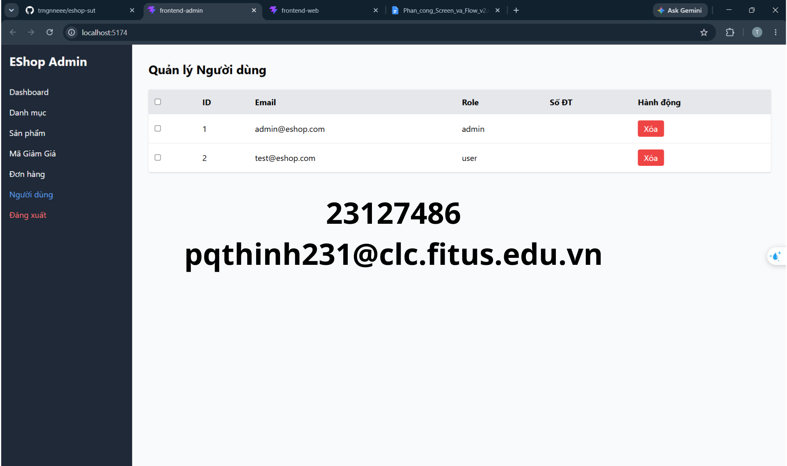
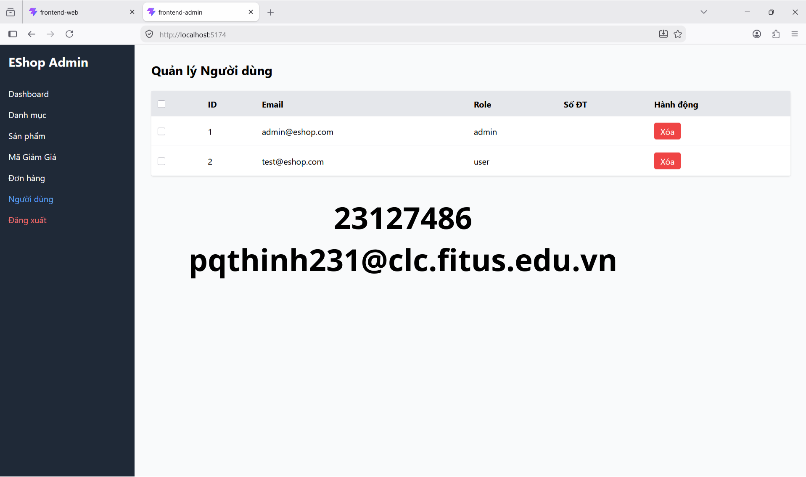

# Minh Chứng Kiểm Thử Đa Trình Duyệt / Đa Nền Tảng (Cross-Browser & Cross-Platform Evidence)

Tài liệu này tổng hợp các ảnh chụp màn hình kiểm thử đa trình duyệt/đa nền tảng trên hệ thống SUT EShop (Task 3) cho các lỗi phát hiện ở Task 1 (GUI Checklist).

---

## 1. Danh Sách Các Nền Tảng Kiểm Thử (Platforms Used)

Sinh viên thực hiện kiểm thử trên các nền tảng sau:

1. **Nền tảng 1 (Web - Google Chrome):**
   - Hệ điều hành: Windows 11
   - Trình duyệt & Phiên bản: Google Chrome v127
   - Công cụ sử dụng: Trình duyệt máy tính thực tế (chạy cục bộ)
2. **Nền tảng 2 (Web - Mozilla Firefox):**
   - Hệ điều hành: Windows 11
   - Trình duyệt & Phiên bản: Mozilla Firefox v127
   - Công cụ sử dụng: Trình duyệt máy tính thực tế (chạy cục bộ)
3. **Nền tảng 3 (Mobile - Expo Go):**
   - Thiết bị: Điện thoại di động thực tế / Giả lập chạy ứng dụng di động qua Expo Go.
   - Công cụ sử dụng: Ứng dụng di động Expo Go kết nối với máy chủ phát triển cục bộ.

---

## 2. Ảnh Chụp Màn Hình Minh Chứng Theo Từng Lỗi (Screenshots by Bugs with Watermark)

*LƯU Ý QUAN TRỌNG: Mọi ảnh chụp màn hình dưới đây hiển thị rõ thông tin xác thực bao gồm: Địa chỉ URL localhost của SUT hoặc màn hình ứng dụng di động, thông tin hệ điều hành/trình duyệt, và có chèn chìm (overlay watermark) dạng text: **pqthinh231@clc.fitus.edu.vn** để chứng minh tính trung thực.*

### 2.1. BUG-01: Form cập nhật thông tin cá nhân thiếu dấu sao đỏ (*) bắt buộc ở trường "Họ Tên"

- **Chrome (Desktop):**
  
- **Firefox (Desktop):**
  
- **Expo Go (Mobile):**
  

---

### 2.2. BUG-02: Ràng buộc Regex số điện thoại tại form cập nhật hồ sơ chặn các số điện thoại bắt đầu bằng '0'

- **Chrome (Desktop):**
  
- **Firefox (Desktop):**
  
- **Expo Go (Mobile):**
  

---

### 2.3. BUG-03: Thông báo lỗi nhập liệu Số điện thoại hiển thị qua alert() thay vì thông báo lỗi dưới chân trường nhập

- **Chrome (Desktop):**
  
- **Firefox (Desktop):**
  
- **Expo Go (Mobile):**
  

---

### 2.4. BUG-04: Nút điều hướng "Hồ sơ" không được làm nổi bật / khác với các trang khác khi người dùng đang hoạt động tại trang Hồ sơ

- **Chrome (Desktop):**
  
- **Firefox (Desktop):**
  
- **Expo Go (Mobile):**
  

---

### 2.5. BUG-05: Tiêu đề tab trình duyệt không thay đổi linh hoạt theo phân hệ trang (luôn giữ mặc định)

- **Chrome (Desktop):**
  
- **Firefox (Desktop):**
  
- **Expo Go (Mobile):**
  *N/A - Không áp dụng trên Mobile/Expo Go vì ứng dụng di động chạy độc lập không có tiêu đề tab trình duyệt.*

---

### 2.6. BUG-06: Trang quản lý người dùng của Admin không hiển thị thông báo trạng thái trống (Empty State) khi không có dữ liệu

- **Chrome (Desktop):**
  
- **Firefox (Desktop):**
  
- **Expo Go (Mobile):**
  *N/A - Chức năng quản lý người dùng của Admin không hỗ trợ trên ứng dụng di động (Expo Go).*

---

### 2.7. BUG-07: Thiếu hiệu ứng làm nổi bật hàng (row hover highlight) khi di chuột qua các bảng dữ liệu

- **Chrome (Desktop):**
  
- **Firefox (Desktop):**
  
- **Expo Go (Mobile):**
  *N/A - Không có hành vi hover (di chuột) trên màn hình cảm ứng di động, đồng thời trang quản lý đơn hàng/người dùng của Admin không có trên Expo Go.*

---

### 2.8. BUG-08: Thiếu chỉ báo tải dữ liệu (loading indicator) khi bảng Lịch sử đơn hàng đang tải thông tin

- **Chrome (Desktop):**
  
- **Firefox (Desktop):**
  
- **Expo Go (Mobile):**
  *N/A - Không được chụp trên Expo Go cho phần tải dữ liệu lịch sử đơn hàng.*

---

### 2.9. BUG-09: Trang Admin xóa tài khoản người dùng trực tiếp mà không có hộp thoại xác nhận (Confirm Dialog)

- **Chrome (Desktop):**
  
- **Firefox (Desktop):**
  
- **Expo Go (Mobile):**
  *N/A - Chức năng Admin không hỗ trợ trên ứng dụng di động (Expo Go).*

---

## 3. Nhật Ký Ghi Nhận Lỗi Đa Nền Tảng (Cross-Platform Specific Findings)

*Ghi lại bất kỳ lỗi nào chỉ xảy ra trên một trình duyệt hoặc nền tảng cụ thể mà không xuất hiện trên các nền tảng khác.*

- **Lỗi tương thích 1 (Tiêu đề Tab):** Tiêu đề tab trình duyệt (BUG-05) luôn hiển thị cố định "frontend-web" hoặc "frontend-admin" thay vì hiển thị động ("Hồ sơ cá nhân", "Quản trị"). Lỗi này xảy ra đồng thời trên cả Google Chrome và Mozilla Firefox Desktop. Trên nền tảng Expo Go (Mobile App), do tính chất ứng dụng di động, không xuất hiện khái niệm tab trình duyệt nên lỗi này không được ghi nhận trên mobile.
- **Lỗi tương thích 2 (Trải nghiệm Admin & Hover):** Các lỗi liên quan đến quản trị viên (BUG-06, BUG-09) và lỗi thiếu hiệu ứng hover highlight (BUG-07) chỉ xuất hiện trên các nền tảng Web Desktop (Chrome, Firefox). Trên ứng dụng di động Expo Go, do không hỗ trợ phân hệ Admin cho người dùng thông thường và không hỗ trợ sự kiện hover bằng chuột trên màn hình cảm ứng, các lỗi này không tồn tại và được đánh dấu là Không áp dụng (N/A).
- **Lỗi tương thích 3 (Nhất quán lỗi Form):** Các lỗi giao diện biểu mẫu (Form) như thiếu dấu sao bắt buộc ở trường Họ tên (BUG-01), lỗi chặn số điện thoại bắt đầu bằng số 0 (BUG-02) và hộp thoại alert báo lỗi định dạng SĐT (BUG-03) xuất hiện đồng bộ trên cả 3 nền tảng (Chrome, Firefox và Expo Go), cho thấy đây là lỗi chung từ cấu trúc logic biểu mẫu của hệ thống SUT.
