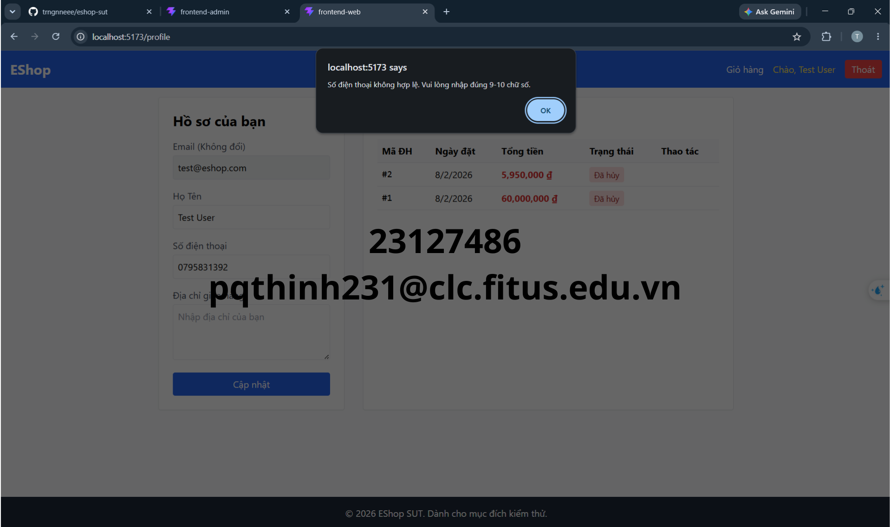

## Found by GUI Checklist Item / Usability Testing Session

IA-03-10: Tiêu đề của tab trình duyệt thay đổi tương ứng theo phân hệ (ví dụ: "Profile" hoặc "Admin Dashboard").

## Requirement liên quan

FR-04: Personal profile management & FR-19: User management (admin) (tham khảo các fr trong [2026.HW03.GUI Usability_En.md](../../requirements/2026.HW03.GUI%20Usability_En.md) )

## Severity / Priority

- **Severity**: Minor
- **Priority**: P2

## Environment

- **OS**: Windows 11
- **Browser**: Chrome (Mặc định)

## Steps to reproduce

1. Mở trang Hồ sơ cá nhân hoặc trang quản lý Admin.
2. Quan sát tiêu đề hiển thị trên tab của trình duyệt.

## Expected result

Tiêu đề phải được cập nhật động tương ứng với nội dung trang hiện tại (ví dụ: "Hồ sơ cá nhân | EShop" hoặc "Quản lý người dùng | Admin EShop").

## Actual result

Tiêu đề tab luôn hiển thị cố định "frontend-web" hoặc "frontend-admin".

## Evidence

