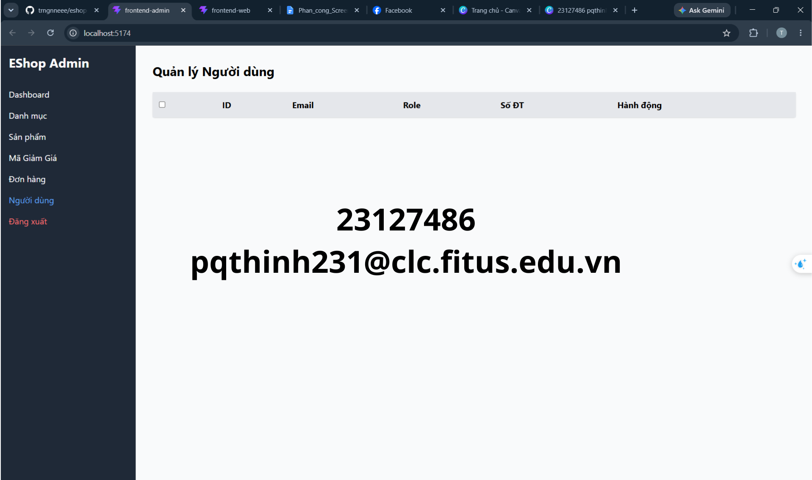

## Found by GUI Checklist Item / Usability Testing Session

IA-04-04: Xử lý trạng thái trống (Empty State): Khi danh sách người dùng trống, hiển thị thông báo thay thế phù hợp.

## Requirement liên quan

FR-19: User management (admin) (tham khảo các fr trong [2026.HW03.GUI Usability_En.md](../../requirements/2026.HW03.GUI%20Usability_En.md) )

## Severity / Priority

- **Severity**: Minor
- **Priority**: P2

## Environment

- **OS**: Windows 11
- **Browser**: Chrome (Mặc định)

## Steps to reproduce

1. Đăng nhập Admin và vào tab "Người dùng".
2. Giả lập cơ sở dữ liệu không có tài khoản người dùng nào (hoặc xóa hết người dùng phụ).

## Expected result

Hiển thị dòng thông báo trực quan ở giữa bảng: "Không tìm thấy người dùng nào" hoặc "Danh sách người dùng trống" kèm theo icon phù hợp.

## Actual result

Giao diện hiển thị bảng trống không có nội dung, không có bất kỳ dòng chữ thông báo nào.

## Evidence

