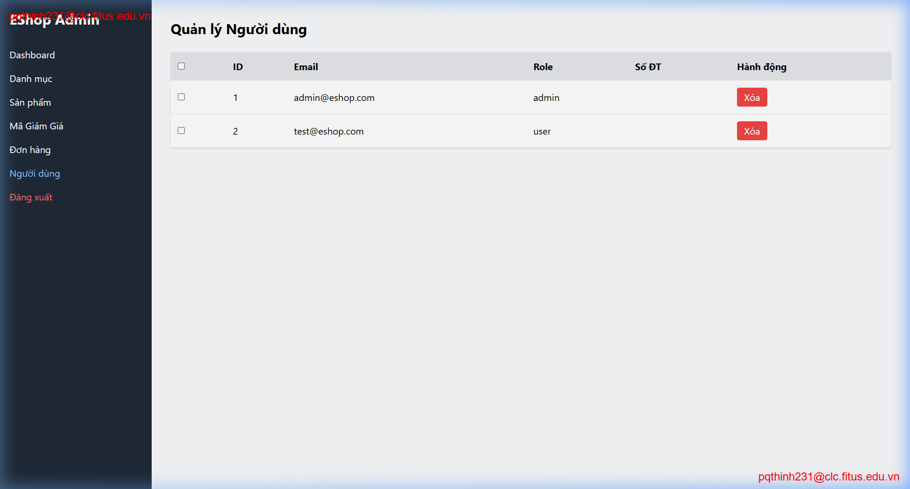

## Found by GUI Checklist Item / Usability Testing Session

Usability Testing Session - Task "Import CSV"

## Requirement liên quan

FR-16: Product import from CSV (tham khảo các fr trong [2026.HW03.GUI Usability_En.md](../../requirements/2026.HW03.GUI%20Usability_En.md) )

## Severity / Priority

- **Severity**: Minor
- **Priority**: P2

## Environment

- **OS**: Windows 11
- **Browser**: Chrome (Mặc định)

## Steps to reproduce

1. Upload file `import_i.csv` chứa dòng lỗi.
2. Cố gắng nhấp đúp hoặc gõ vào ô bị thiếu tên sản phẩm trên bảng xem trước.

## Expected result

Hệ thống nên hỗ trợ tính năng chỉnh sửa nhanh (inline editing) trên bảng xem trước để người dùng bổ sung các thông tin bị thiếu trước khi import chính thức.

## Actual result

Bảng xem trước là tĩnh (Read-only), không phản hồi tương tác sửa đổi.

## Evidence

- Video minh chứng (Session 5 - Trương Lý Khải): [Link Drive Video Session 5](https://drive.google.com/file/d/13LPt6ndcqLb8iYGL18GO2cGp5EN0PVoh/view?usp=drive_link)
