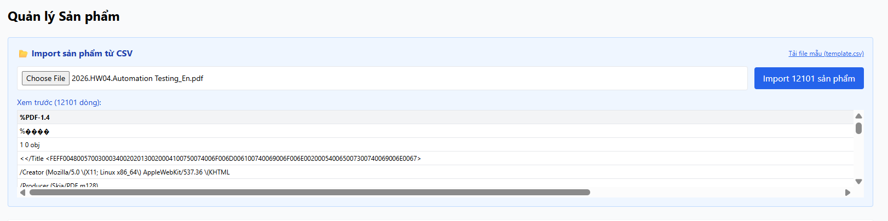

# [BUG][Admin] Import sản phẩm từ CSV không kiểm tra định dạng file

## Found by Test Case

GUI-026

## Requirement liên quan

FR-16

## Severity / Priority

Major / P2

## Environment

- **OS**: Windows 11 (Local Dev)
- **Browser**: Microsoft Edge (Chromium)
- **URL**: http://localhost:5174/ (Tab Sản phẩm, phần Import CSV)
- **Build/Commit**: Latest

## Steps to reproduce

1. Đăng nhập Admin và chọn tab "Sản phẩm".
2. Trong phần "Import sản phẩm từ CSV", bấm nút chọn file.
3. Thử chọn một file không phải định dạng CSV (ví dụ: `.txt`, `.xlsx`, `.png`).
4. Quan sát xem ứng dụng có kiểm tra định dạng hay hiển thị thông báo lỗi không.

## Expected result

- Trường hợp người dùng tải lên file sai định dạng, hệ thống phải chặn và hiển thị thông báo lỗi rõ ràng theo đặc tả FR-16.

## Actual result

- Không kiểm tra định dạng file ở frontend, cho phép chọn bất kỳ file nào mà không thông báo lỗi.

## Evidence

## Link Github Issue
https://github.com/trngnneee/eshop-sut/issues/257#issue-5023027969
