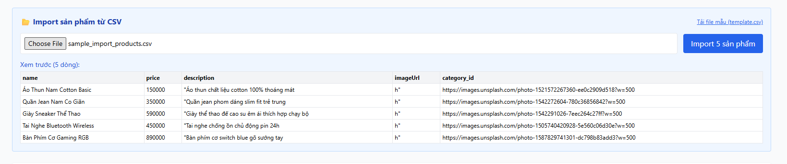

# [BUG][Admin] Phân tích CSV sai khi trường nội dung có chứa dấu phẩy trong dấu ngoặc kép

## Found by Test Case

GUI-030

## Requirement liên quan

FR-16

## Severity / Priority

Major / P1

## Environment

- **OS**: Windows 11 (Local Dev)
- **Browser**: Microsoft Edge (Chromium)
- **URL**: http://localhost:5174/ (Tab Sản phẩm, phần Import CSV)
- **Build/Commit**: Latest

## Steps to reproduce

1. Chuẩn bị file CSV có trường mô tả chứa dấu phẩy được bọc trong dấu nháy kép (ví dụ: `Áo Thun,150000,"Áo thun 100% cotton, thoáng mát",http://image.url,1`).
2. Đăng nhập Admin, vào tab "Sản phẩm" và chọn file CSV này để import.
3. Xem thông tin hiển thị tại bảng "Xem trước" (Preview CSV) và dữ liệu import vào hệ thống.

## Expected result

- Bộ phân tích (parser) CSV phải xử lý đúng trường dữ liệu có chứa dấu phẩy bên trong dấu ngoặc kép `""` theo chuẩn RFC 4180, giữ nguyên cấu trúc cột sản phẩm (Tên, Giá, Mô tả, URL ảnh, ID danh mục).

## Actual result

- Không parse đúng khi có dấu phẩy trong nội dung.

## Evidence

## Link Github Issue
https://github.com/trngnneee/eshop-sut/issues/258#issue-5023067965
