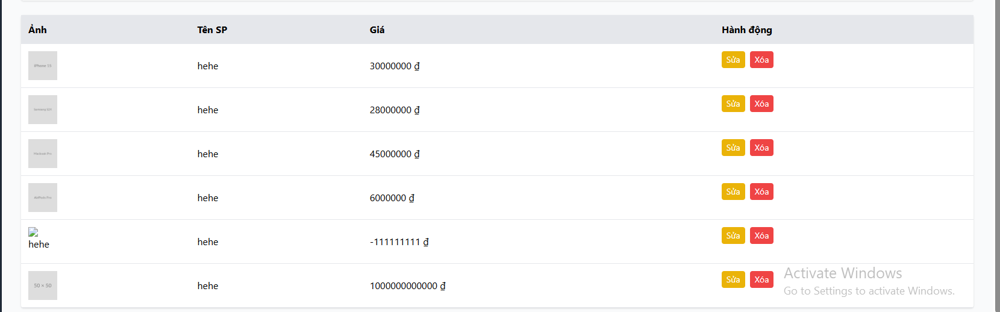

# [BUG][Admin] Khi sửa một sản phẩm, danh sách admin cập nhật đè tên của tất cả sản phẩm khác

## Found by Test Case

GUI-045

## Requirement liên quan

FR-15, FR-22

## Severity / Priority

Critical / P0

## Environment

- **OS**: Windows (Local Dev)
- **Browser**: Microsoft Edge Headless (Chromium)
- **URL**: http://localhost:5174/ (Tab Quản lý Sản phẩm)
- **Build/Commit**: Latest

## Steps to reproduce

1. Đăng nhập vào trang Admin (`http://localhost:5174/`) với tài khoản admin mặc định (`admin@eshop.com` / `admin123`).
2. Chọn tab "Sản phẩm".
3. Nhấp chọn nút "Sửa" ở một sản phẩm bất kỳ. Dữ liệu sản phẩm sẽ được điền vào form.
4. Thay đổi tên sản phẩm trong form và bấm "Lưu sản phẩm".
5. Xem lại danh sách sản phẩm hiển thị trong bảng.

## Expected result

- Chỉ có sản phẩm vừa được sửa là thay đổi tên trong bảng quản lý và cơ sở dữ liệu. Các sản phẩm khác trong danh sách phải giữ nguyên thông tin ban đầu.

## Actual result

- Sản phẩm bị lỗi : Tên sản phẩm của toàn bộ danh sách sản phẩm trong Admin bị đè thành tên của sản phẩm được chọn sửa.

## Evidence

## Link Github Issue
https://github.com/trngnneee/eshop-sut/issues/263#issue-5023337891