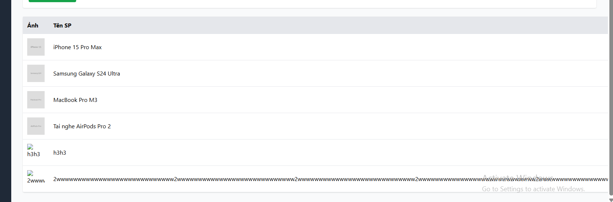

# [BUG][Admin] Form Admin không kiểm tra độ dài Tên sản phẩm và hiển thị lỗi bằng alert

## Found by Test Case

GUI-021

## Requirement liên quan

FR-15, FR-22

## Severity / Priority

Major / P2

## Environment

- **OS**: Windows 11 (Local Dev)
- **Browser**: Microsoft Edge (Chromium)
- **URL**: http://localhost:5174/ (Tab Sản phẩm)
- **Build/Commit**: Latest

## Steps to reproduce

1. Đăng nhập Admin và chọn tab "Sản phẩm".
2. Nhập chuỗi văn bản dài vượt quá 255 ký tự vào ô "Tên sản phẩm".
3. Điền các trường thông tin khác và bấm "Lưu sản phẩm".
4. Thử kích hoạt một lỗi từ backend (ví dụ: mất kết nối hoặc sai định dạng) và quan sát cách hiển thị thông báo lỗi.

## Expected result

- Trường "Tên sản phẩm" phải chặn nhập vượt quá 255 ký tự (dùng `maxLength="255"` hoặc kiểm tra độ dài ở client).
- Thông báo lỗi khi submit thất bại phải hiển thị dạng văn bản thông báo (inline text) gần ô nhập hoặc bên dưới nút submit theo đặc tả FR-22, thay vì dùng `alert()`.

## Actual result

- Ô "Tên sản phẩm" không có thuộc tính `maxLength`, cho phép người dùng nhập thoải mái chuỗi vượt quá 255 ký tự.
- Khi gửi form bị lỗi, ứng dụng hiển thị popup `alert()` mặc định của trình duyệt thay vì hiển thị thông báo lỗi ngay trên form.

## Evidence

## Link Github Issue
https://github.com/trngnneee/eshop-sut/issues/253#issue-5022826056