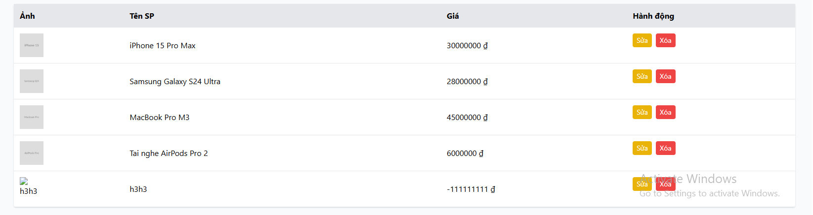

# [BUG][Admin] Form Admin cho phép lưu Giá sản phẩm rỗng, 0 hoặc số âm mà không chặn ở giao diện

## Found by Test Case

GUI-022

## Requirement liên quan

FR-15, FR-22

## Severity / Priority

Major / P1

## Environment

- **OS**: Windows 11 (Local Dev)
- **Browser**: Microsoft Edge (Chromium)
- **URL**: http://localhost:5174/ (Tab Sản phẩm)
- **Build/Commit**: Latest

## Steps to reproduce

1. Đăng nhập Admin và chọn tab "Sản phẩm".
2. Nhập Tên sản phẩm vào form.
3. Để trống ô "Giá tiền", hoặc nhập `0`, hoặc nhập số âm (ví dụ: `-50000`).
4. Bấm "Lưu sản phẩm" và quan sát phản hồi của ứng dụng.

## Expected result

- Ô nhập "Giá tiền" phải là trường bắt buộc, chặn nhập hoặc thông báo lỗi khi giá trị rỗng, bằng 0 hoặc là số âm theo đặc tả FR-15.

## Actual result

- Ô "Giá tiền" không chặn nhập hoặc thông báo lỗi khi giá trị rỗng, 0 hoặc số âm mà không có bất kỳ kiểm tra chặn nào ở giao diện frontend.

## Evidence

## Link Github Issue
https://github.com/trngnneee/eshop-sut/issues/254#issue-5022869267
