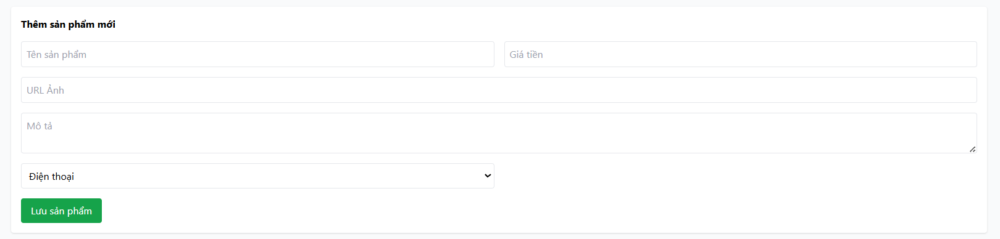

# [BUG][Admin] Form thêm/sửa sản phẩm không đánh dấu ký tự (*) cho các trường bắt buộc

## Found by Test Case

GUI-020

## Requirement liên quan

FR-15, FR-22

## Severity / Priority

Major / P2

## Environment

- **OS**: Windows 11 (Local Dev)
- **Browser**: Microsoft Edge (Chromium)
- **URL**: http://localhost:5174/ (Tab Sản phẩm)
- **Build/Commit**: HW03 SUT Frontend Admin

## Steps to reproduce

1. Đăng nhập Admin và chọn tab "Sản phẩm".
2. Nhìn vào form thêm/sửa sản phẩm mới.
3. Kiểm tra nhãn (label) hoặc vị trí nhập của các trường bắt buộc như Tên sản phẩm, Giá, Danh mục.

## Expected result

- Các trường nhập bắt buộc (Tên sản phẩm, Giá, Danh mục) phải được đánh dấu rõ ràng bằng ký tự hình sao đỏ `*` cạnh nhãn theo đặc tả FR-15 và tiêu chuẩn FR-22.

## Actual result

- Form thêm/sửa sản phẩm trong Admin không hiển thị ký tự đánh dấu `*` trên bất kỳ trường nhập bắt buộc nào, khiến người dùng không nhận biết được các trường bắt buộc trước khi bấm Submit.

## Evidence

## Link Github Issue
https://github.com/trngnneee/eshop-sut/issues/251#issue-5022634145