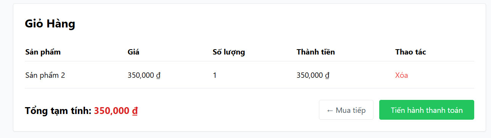

# [BUG][Storefront] Trang Giỏ hàng thiếu điều khiển tăng/giảm (+/-) và không cho phép chỉnh sửa số lượng sản phẩm

## Found by Test Case

GUI-018, GUI-019

## Requirement liên quan

FR-07

## Severity / Priority

Major / P2

## Environment

- **OS**: Windows 11 (Local Dev)
- **Browser**: Microsoft Edge / Google Chrome (Chromium)
- **URL**: http://localhost:5173/cart
- **Build/Commit**: Latest

## Steps to reproduce

1. Đăng nhập hoặc mở ứng dụng EShop Storefront (`http://localhost:5173`).
2. Chọn sản phẩm bất kỳ và bấm "Thêm vào giỏ hàng".
3. Mở trang Giỏ hàng tại địa chỉ `http://localhost:5173/cart`.
4. Quan sát cột "Số lượng" và thử tương tác/chỉnh sửa số lượng sản phẩm trong bảng giỏ hàng.

## Expected result

- Theo đặc tả FR-07 (Shopping Cart trong file `README.md`), bảng giỏ hàng phải hiển thị cột **Số lượng** có các nút điều khiển tăng/giảm (`+` / `-`) hoặc ô input cho phép điều chỉnh số lượng sản phẩm trực tiếp.
- Giao diện phải kiểm soát giới hạn: không cho phép giảm số lượng về 0 hoặc số âm trực tiếp trong giỏ hàng; việc xóa sản phẩm bắt buộc phải thực hiện qua nút "Xóa" kèm Hộp thoại xác nhận.

## Actual result

- Cột "Số lượng" trên giao diện trang Giỏ hàng chỉ hiển thị văn bản tĩnh (ví dụ: `1`), hoàn toàn không có nút điều khiển `+` / `-` hay ô input cho phép chỉnh sửa số lượng trực tiếp.
- Do thiếu hoàn toàn các điều khiển chỉnh sửa số lượng, trang giỏ hàng không có bất kỳ cơ chế kiểm tra/ràng buộc giới hạn số lượng hợp lệ nào. Người dùng muốn thay đổi số lượng buộc phải xóa toàn bộ dòng sản phẩm và quay lại trang chi tiết sản phẩm để chọn lại từ đầu.

## Evidence

## Link Github Issue
https://github.com/trngnneee/eshop-sut/issues/283#issue-5043350584

