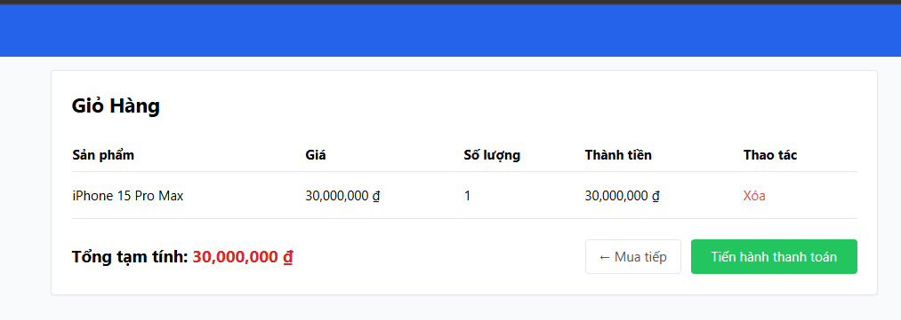

# [BUG][Cart] Nhãn tổng tiền hiển thị "Tổng tạm tính" thay vì "Tổng cộng"

## Found by Test Case

GUI-008

## Requirement liên quan

FR-07

## Severity / Priority

Minor / P2

## Environment

- **OS**: Windows 11 (Local Dev)
- **Browser**: Microsoft Edge (Chromium)
- **URL**: http://localhost:5173/cart
- **Build/Commit**: Latest

## Steps to reproduce

1. Thêm ít nhất một sản phẩm vào giỏ hàng.
2. Mở trang Giỏ hàng (`http://localhost:5173/cart`).
3. Nhìn vào khu vực tổng tiền ở phía dưới bảng giỏ hàng.

## Expected result

Nhãn hiển thị là **"Tổng cộng"** theo đặc tả FR-07.

## Actual result

Nhãn hiển thị là **"Tổng tạm tính"** — sai với đặc tả yêu cầu.

## Evidence

## Link Github Issue
https://github.com/trngnneee/eshop-sut/issues/249#issue-5022518359