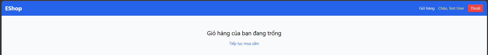

# [BUG][Cart] Giao diện giỏ hàng trống chỉ hiển thị chữ thô, thiếu hình minh họa hoặc icon trực quan

## Found by Test Case

GUI-049

## Requirement liên quan

FR-07, FR-24

## Severity / Priority

Minor / P2

## Environment

- **OS**: Windows 11 (Local Dev)
- **Browser**: Microsoft Edge (Chromium)
- **URL**: http://localhost:5173/cart
- **Build/Commit**: Latest

## Steps to reproduce

1. Đảm bảo giỏ hàng trống (hoặc xóa toàn bộ sản phẩm trong giỏ hàng).
2. Truy cập vào trang Giỏ hàng (`http://localhost:5173/cart`).
3. Quan sát giao diện hiển thị ở trạng thái giỏ hàng trống.

## Expected result

- Khi giỏ hàng trống, giao diện cần hiển thị hình minh họa (empty cart illustration) hoặc icon giỏ hàng trực quan, kèm thông báo thân thiện và nút "Tiếp tục mua sắm" thiết kế rõ ràng theo đặc tả FR-07 và tiêu chuẩn UI FR-24.

## Actual result

- Trang chỉ hiển thị duy nhất một thẻ chữ thô `<h2>Giỏ hàng của bạn đang trống</h2>` cùng liên kết văn bản đơn sơ, không có hình minh họa, icon hay thành phần giao diện trực quan hỗ trợ trải nghiệm người dùng.

## Evidence

## Link Github Issue
https://github.com/trngnneee/eshop-sut/issues/262#issue-5023316279
