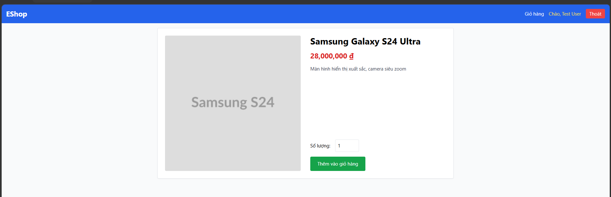
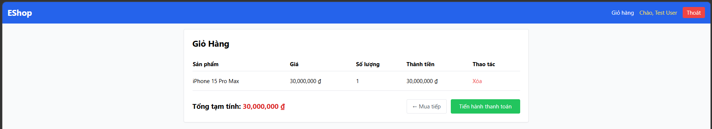

# [BUG][Web] Thiếu breadcrumb điều hướng trên trang chi tiết sản phẩm và trang giỏ hàng

## Found by Test Case

GUI-028, GUI-032

## Requirement liên quan

FR-23

## Severity / Priority

Minor / P2

## Environment

- **OS**: Windows (Local Dev)
- **Browser**: Microsoft Edge (Chromium)
- **URL**: http://localhost:5173/product/1, http://localhost:5173/cart
- **Build/Commit**: Latest

## Steps to reproduce

1. Mở trang chi tiết sản phẩm (`http://localhost:5173/product/1`).
2. Kiểm tra xem có thanh breadcrumb điều hướng (ví dụ: `Trang chủ > Sản phẩm > Tên sản phẩm`) không.
3. Mở trang giỏ hàng (`http://localhost:5173/cart`).
4. Kiểm tra xem có breadcrumb và navbar highlight đúng tab "Giỏ hàng" không.

## Expected result

- Trang chi tiết sản phẩm: có breadcrumb từ Home đến tên sản phẩm theo FR-23.
- Trang giỏ hàng: có breadcrumb điều hướng theo FR-23.

## Actual result

- Cả hai trang đều không có breadcrumb điều hướng.
- Người dùng không biết họ đang ở đâu trong cấu trúc trang web mà không cần nhìn vào URL.

## Evidence

## Link Github Issue
https://github.com/trngnneee/eshop-sut/issues/259#issue-5023121557
