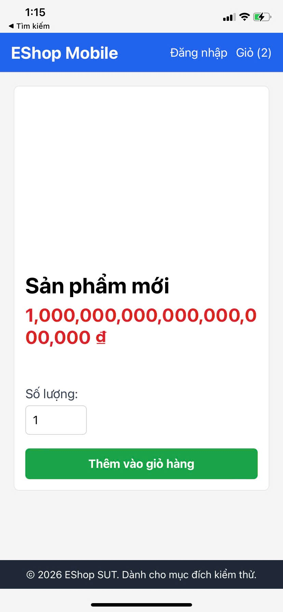

# [BUG][Cross-Platform][Mobile] Ảnh sản phẩm trên Expo Go không có alt text mô tả tên sản phẩm

## Found by Test Case

GUI-003

## Requirement liên quan

FR-24

## Severity / Priority

Minor / P3

## Environment

- **OS**: Android / Expo Go
- **Browser**: Mobile (Expo Go)
- **URL**: Product Detail screen
- **Build/Commit**: Latest

## Steps to reproduce

1. Mở màn hình Chi tiết sản phẩm trên Mobile (Expo Go).
2. Quan sát ảnh sản phẩm ở phần đầu trang.

## Expected result

Ảnh sản phẩm phải có alt text mô tả đúng tên sản phẩm theo FR-24, không để alt rỗng.

## Actual result

Ảnh sản phẩm trên Mobile có alt="" và không có mô tả tên sản phẩm.

## Evidence

## Link Github Issue
https://github.com/trngnneee/eshop-sut/issues/300#issue-5044037312