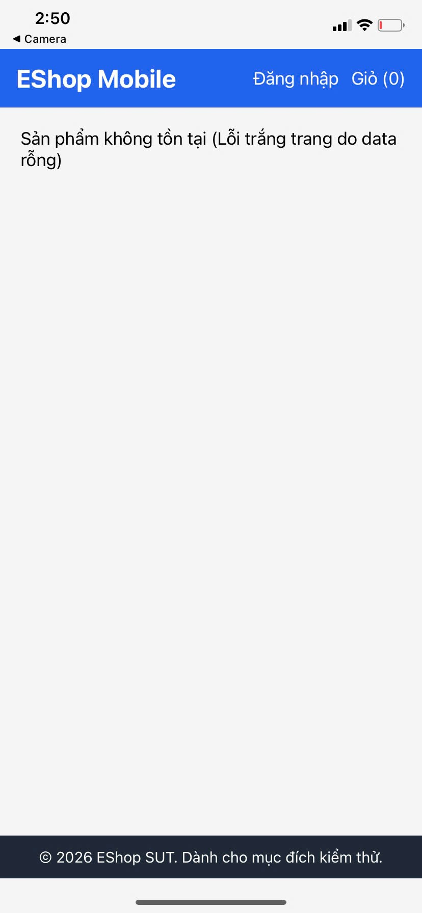

# [BUG][Mobile] Khi API sản phẩm lỗi, màn hình hiển thị lỗi thô và không có nút Thử lại

## Found by Test Case

GUI-056

## Requirement liên quan

FR-24

## Severity / Priority

Major / P2

## Environment

- **OS**: Windows 11 (Local Dev)
- **Device**: Expo Go / Android Emulator
- **URL**: Màn hình chi tiết sản phẩm (Mobile App)
- **Build/Commit**: Latest

## Steps to reproduce

1. Khởi chạy ứng dụng Mobile (Expo Go).
2. Ngắt kết nối backend hoặc truy cập sản phẩm với ID không tồn tại.
3. Mở màn hình chi tiết sản phẩm khi API trả về lỗi hoặc mất kết nối.
4. Quan sát giao diện hiển thị khi có lỗi.

## Expected result

- Khi API product detail lỗi hoặc mất kết nối, màn hình Mobile phải hiển thị thông báo lỗi thân thiện (ví dụ: "Không tải được sản phẩm") kèm nút **Thử lại** và đường quay về Home/Danh sách sản phẩm, theo tiêu chuẩn FR-24.

## Actual result

- Màn hình Mobile hiển thị chuỗi debug thô **"(Lỗi trắng trang do data rỗng)"** — đây là nội dung lỗi dành cho nhà phát triển bị lộ ra ngoài giao diện người dùng.
- Không có nút Thử lại (Retry) hay đường quay về trang chủ, khiến người dùng bị mắc kẹt ở màn hình lỗi.

## Evidence

## Link Github Issue
https://github.com/trngnneee/eshop-sut/issues/264#issue-5023458287
