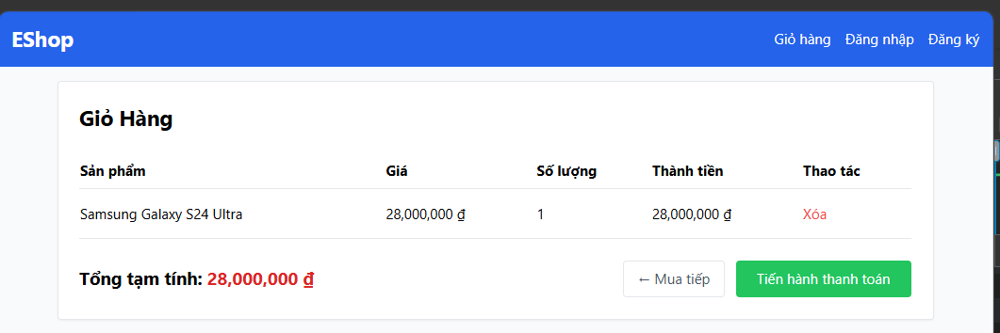

# [BUG][Storefront] Badge số lượng trên navbar không cập nhật ngay sau khi thêm sản phẩm vào giỏ

## Found by Test Case

GUI-030

## Requirement liên quan

FR-07

## Severity / Priority

Major / P2

## Environment

- **OS**: Windows 11 (Local Dev)
- **Browser**: Microsoft Edge (Chromium)
- **URL**: http://localhost:5173/product/1
- **Build/Commit**: Latest

## Steps to reproduce

1. Mở trang chi tiết sản phẩm.
2. Thêm một sản phẩm vào giỏ hàng.
3. Quan sát badge số lượng trên navbar.

## Expected result

Badge số lượng trên navbar cập nhật ngay sau khi thêm sản phẩm vào giỏ.

## Actual result

Badge trên navbar không đổi ngay sau thao tác thêm sản phẩm.

## Evidence

## Link Github Issue
https://github.com/trngnneee/eshop-sut/issues/299#issue-5044027191