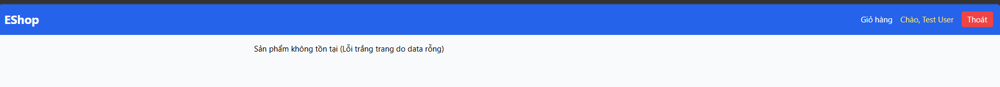

# [BUG][Storefront] Khi sản phẩm không tồn tại, UI hiển thị chuỗi debug thô thay vì thông báo lỗi thân thiện

## Found by Test Case

GUI-039

## Requirement liên quan

FR-24

## Severity / Priority

Major / P1

## Environment

- **OS**: Windows 11 (Local Dev)
- **Browser**: Microsoft Edge (Chromium)
- **URL**: http://localhost:5173/product/999
- **Build/Commit**: Latest

## Steps to reproduce

1. Truy cập URL sản phẩm không tồn tại: `http://localhost:5173/product/999`.
2. Quan sát thông báo hiển thị trên màn hình.

## Expected result

- Trang hiển thị thông điệp lỗi thân thiện: "Sản phẩm không tồn tại" hoặc "Không tìm thấy sản phẩm", kèm theo nút quay lại trang chủ.
- Không được lộ thông tin debug kỹ thuật ra phía người dùng.

## Actual result

- Trang hiển thị đúng nghĩa đen: **"Sản phẩm không tồn tại (Lỗi trắng trang do data rỗng)"** — đây là chuỗi debug dành cho lập trình viên, bị lộ ra ngoài giao diện người dùng.

## Evidence

## Link Github Issue
https://github.com/trngnneee/eshop-sut/issues/260#issue-5023142810
