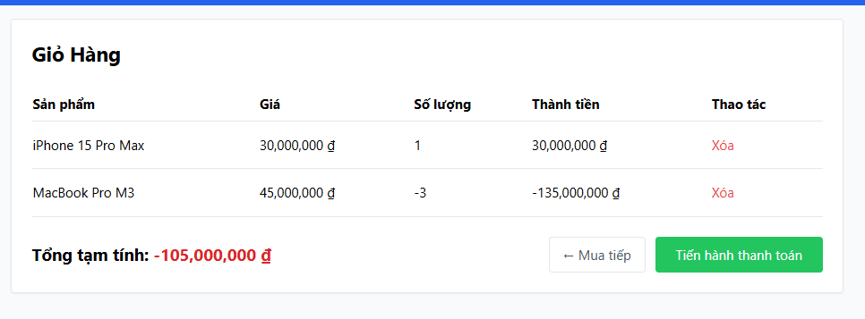

# [BUG][Storefront] Ô số lượng chi tiết sản phẩm không chặn giá trị âm, thập phân hoặc chữ

## Found by Test Case

GUI-014, GUI-015, GUI-041

## Requirement liên quan

FR-06

## Severity / Priority

Major / P1

## Environment

- **OS**: Windows 11 (Local Dev)
- **Browser**: Microsoft Edge Headless (Chromium)
- **URL**: http://localhost:5173/product/1
- **Build/Commit**: Latest

## Steps to reproduce

1. Mở trang chi tiết sản phẩm bất kỳ trên trình duyệt tại `http://localhost:5173/product/1`.
2. Trong ô nhập "Số lượng", nhập số âm (ví dụ: `-5`) hoặc số thập phân (ví dụ: `1.5`) hoặc ký tự chữ.
3. Bấm nút "Thêm vào giỏ hàng" (ở lần đầu tiên cần bấm 2 lần do lỗi logic).
4. Mở trang Giỏ hàng (`http://localhost:5173/cart`).

## Expected result

- Ô số lượng chỉ cho phép nhập số nguyên dương (tối thiểu là 1).
- Trình duyệt/giao diện phải chặn không cho submit hoặc hiển thị thông báo lỗi trực quan (ví dụ: "Số lượng phải là số nguyên dương từ 1 trở lên") khi người dùng nhập sai định dạng.

## Actual result

- Giao diện không có cơ chế chặn hoặc kiểm tra validation trên trường nhập số lượng.
- Cho phép người dùng thêm sản phẩm có số lượng âm, NaN hoặc số thập phân vào giỏ hàng, dẫn đến làm sai lệch toàn bộ phép tính tổng tiền giỏ hàng (Tổng tạm tính hiển thị giá trị âm hoặc NaN).

## Evidence

## Link Github Issue
https://github.com/trngnneee/eshop-sut/issues/250#issue-5022592477