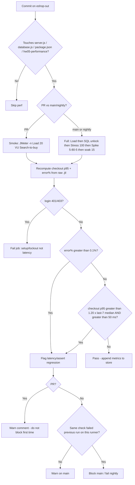

# P13 — Continuous performance testing for eshop-sut (Search-to-buy)

**Gate:** P13 only (G9.6). Not a generic Jenkins/Gatling essay.  
**SUT:** `Repo/eshop-sut` · workflow **23127271 Search-to-buy** · artifacts already in `SoftwareTesting-HW/HW5/23127271/`.  
**CI tool:** `jmeter -n` on the existing `.jmx` files. **k6 is optional later**, not required.  
**Human check (2026-08-16):** seven P13 bullets present; soak seed matches P11 (`7.27` rps, checkout p95 `23`, first/last 20% `20`/`24`, memory UNKNOWN). Fixes: include `hw05-performance/**` + lockfile in the filter; do not pretend `_recompute_jtl.py` already takes `$SHA.jtl`.

---

## Initial baseline (this homework’s soak — seed the store)

From graded `logs/23127271_Soak_20260814.jtl` (P10/P11 linear percentile, think-time **in** wall-clock rps):

| Metric | Value | Notes |
|--------|-------|--------|
| Offered load | **15 VU**, think 1–3 s, ~12.5 min (span **748.3 s**) | Clone of Load, not Spike |
| Wall-clock RPS | **7.27 req/s** | 5439 samples |
| Overall p95 `elapsed` | **18 ms** | |
| Checkout p95 | **23 ms** (first-20% **20 ms**, last-20% **24 ms**) | Drift, not a climb |
| `success=false` / non-2xx | **0% / 0%** | |
| login 401/403 | **0** | |
| Node memory start→end | **UNKNOWN** | Not read off Task Manager; do not invent |

**Companion Load baseline** (same host class `DESKTOP-TCVI3HT`, loopback): checkout p95 **22 ms**, overall p95 **19 ms**, **9.60 rps**, error% **0**, 20 VU.

Store per commit: `checkout_p95_ms`, `overall_p95_ms`, `error_pct_success`, `error_pct_non2xx`, `login_401_403`, `rps_wall`, `n`, `git_sha`, `runner_class`. **Do not store JMeter HTML Total `pct2`** as the official p95 (P11: Stress HTML Total **455** vs raw **476**).

---

## 1. Path filter (what is a “perf-relevant” commit)

Watch **`eshop-sut`**, not the homework markdown.

**Run** (any of these change):

| Path | Why Search-to-buy cares |
|------|-------------------------|
| `backend/server.js` | login / search `LIKE` / detail / cart / checkout |
| `backend/database.js` | seed, `users`/`products`/`orders` schema, DROP on init |
| `backend/package.json` / `package-lock.json` | `sqlite3`, `jsonwebtoken`, Express |
| `hw05-performance/**` | Public `.jmx` / CSV / register script — a plan change is a perf change |
| `backend/database.sqlite` only if committed (usually gitignored) | skip if ignored |

There is **no** `backend/routes/` tree in this SUT — handlers live in `server.js`. Filter that directory if it appears later.

**Skip:** `*.md`, `frontend/**`, `hw04-automation/**`, screenshots, this HW5 `docs/` folder.

GitHub Actions sketch: `paths: [backend/server.js, backend/database.js, backend/package.json, backend/package-lock.json, hw05-performance/**]`.

---

## 2. Tiers

| Tier | When | What | Wall time (this laptop, as measured) |
|------|------|------|--------------------------------------|
| **Skip** | Filter miss | Nothing | 0 |
| **Smoke** | Qualifying **PR** | `23127271_Load_20260814.jmx` only (20 VU, 520 s) + `generate-tram-users.js --register` | ~**9 min** JMeter + seed |
| **Full** | **main** merge **or nightly** | Load → SQL unlock → Stress 100 → unlock → Spike 5→80→5 → soak 15 | ~**9 + 5.5 + 3 + 12.5 ≈ 30 min** + resets |

Smoke must keep Search-to-buy **assertions** (`$.token`, `$[0].id`, `$.name` not `{}`, `Added to cart`, `$.orderId`). A 200-only smoke would miss the `200 {}` quirk.

**Not on every PR:** Stress 100 VU / Spike Ultimate TG — they need `jpgc-casutg`, 100 CSV users, and they **measure the knee**, not merge hygiene. P12: do not add Redis/HPA jobs.

Preflight in CI (same as P09): start `node server.js`, register `tram01`–`tram100` **once per job** (email is not UNIQUE — do not double-register). `reset-lockout.sql` between Stress and Spike **without** restarting Node (`initDatabase()` DROP).

---

## 3. Regression rule (concrete)

**Same runner class** (label e.g. `linux-sqlite-loopback` vs `windows-laptop`). Never mix this homework’s laptop numbers with GitHub-hosted Ubuntu without a **new** 7-run baseline.

After each green run, append metrics. Rolling baseline = **median of last 7 green runs** of that **tier + runner_class**. Until 7 exist, use the homework seed:

| Compare (smoke / soak-like) | Seed | Flag if |
|-----------------------------|------|---------|
| Checkout p95 | **23 ms** (soak) / **22 ms** (Load) | **> 1.20 ×** rolling median **and** still **> 50 ms** (P10 Load gate) |
| Error% (`success=false`) | **0** | **> 0.1%** (P10 Load threshold) |
| login 401/403 | **0** | **any** on smoke/Load → **setup/lockout**, fail the job as *data*, not as “SUT slow” |

**AND** is required for a **latency** regression: p95 **+20% vs last-7 median** **and** checkout p95 **above 50 ms**. A 22→27 ms wiggle on a noisy runner is **not** a flag. 22→80 ms is.

**Full suite extra (nightly / main), not smoke:**

| Check | Seed from this run | Flag |
|-------|--------------------|------|
| Stress checkout p95 | **534 ms** | **< 10×** smoke checkout p95 (knee disappeared — plan/think-time/VU drift) **or** error% **> 1%** |
| Spike recover checkout p95 | **24 ms** | **≥ 2×** Load checkout p95 (~44 ms) after threads back at 5 |
| Soak last-20% / first-20% checkout p95 | 24 / 20 | **≥ 2×** (P10 soak gate) |
| Soak RPS | **7.27** | **< 0.80 ×** rolling soak rps (offered load collapsed) |

Do **not** gate Spike on **whole-run** p95 (381 ms is a blend — P11).

---

## 4. Policy: warn on PR, block on main if it repeats

**Pick:** **warn on PR (non-blocking comment + `perf-regression` label); block merge to `main` only if the same check fails on two consecutive qualifying runs** (the PR run and the first `main`/nightly replay, or two nightlies).

**Why:** this SUT’s p95 is **laptop- and think-time-sensitive** (Load 22 ms vs Stress 534 ms is concurrency, not a bug). A hard block on the first noisy CI minute would train people to ignore red. Two hits on the **same runner_class** filters one-off GC/JMeter noise. Setup 401/403 still **fails the job immediately** (not a “soft warn”) because that is register/lockout, not variance.

---

## 5. Tooling

```text
# smoke (PR), from test-plans/, SUT already up + registered
jmeter -n -t 23127271_Load_20260814.jmx \
  -l $SHA-load.jtl -e -o report_load_$SHA/
# Official p95 = linear percentile of column elapsed (same formula as
# docs/_recompute_jtl.py). That homework script hardcodes logs/*.jtl names;
# CI must point it at $SHA-load.jtl (or a one-file wrapper). Do not gate on
# HTML statistics.json Total pct2.
```

Full nightly: P09 command block (`Load` / `Stress` / `Spike` / `Soak` `.jmx`). Persist `.jtl` as CI artifacts.

**k6:** optional later for a **sub-minute** PR probe with the same five paths + checks. Do **not** require it for this homework; do **not** mix k6 JSON with JMeter `.jtl` into one baseline (skill: analyse separately).

---

## 6. Flow



---

## 7. Trade-offs (this repo, these plans)

**CI minutes.** Smoke ≈ **9 min**/qualifying PR. Full ≈ **30 min** plus Node seed. Path filter avoids paying that on README edits. Cost of *not* running: a one-line change to `POST /api/checkout` (`server.js` L297) or fire-and-forget login `UPDATE` (L47) only shows up as checkout/login p95 — the exact labels this workflow measures.

**False alarms.** Shared GitHub runners will **not** reproduce 22 ms checkout; +20% of 22 ms is 4 ms of noise. That is why the rule also requires **p95 > 50 ms** and **runner_class**. HTML Total p95 must not be the gate (P11 mismatch). Spike whole-run p95 must not be the gate.

**Plan maintenance.** Frozen paths: `POST /api/login`, `GET /api/products?search=`, `GET /api/products/{id}`, `POST /api/cart`, `POST /api/checkout`. If someone adds `GET /api/categories` or coupon to “make coverage look bigger,” the job is no longer Trâm’s workflow (P00 vs Khoa/Thịnh). CSV must keep **name-substring** keywords (`iPhone`, not `Laptop`). `--register` must stay **once per seed**. Ultimate Thread Group plugin must be on the **full** runner image or Spike silently becomes a flat group.

**P12:** CI should **not** install Redis or WAL as a “fix” when a flag fires; the first question is “did checkout `INSERT` or login sqlite queue get slower?”

**Stop condition met.** Next gate is P14 (AI critique paragraph).
