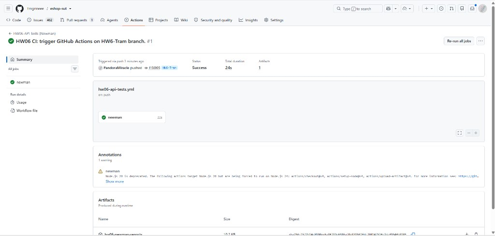
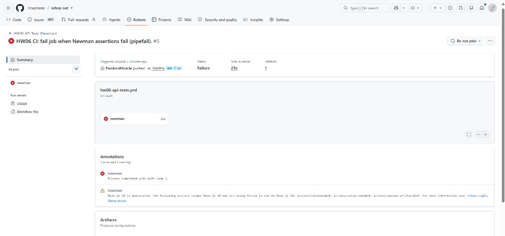

# HW06 — CI/CD report (GitHub Actions + Newman)

**Student:** 23127271  
**Repository:** [trngnneee/eshop-sut](https://github.com/trngnneee/eshop-sut)  
**Workflow:** `.github/workflows/hw06-api-tests.yml`  
**Collection:** `hw06/23127271/postman/eshop-hw06.postman_collection.json`

---

## 1. Overview

Newman runs in **GitHub Actions** on `ubuntu-latest` against the EShop SUT (`backend/`, Node 20). The pipeline starts the API on `http://localhost:3000`, executes the **CI demo folder** (2 requests), uploads HTML/log artifacts, and fails the job if Newman exit code ≠ 0.

The main HW06 suite (**280 TC / ~343 requests**) uses observe-only scripts and is run **locally** (`reports/newman-report.html`). CI uses a dedicated folder with **strict assertions** for clear pass/fail homework evidence.

**No secrets required.** `X-Student-Id: 23127271` is injected via collection pre-request script. **No `-e` environment file** in CI (collection variables only).

---

## 2. Pipeline configuration

| Item | Value |
|------|--------|
| **Trigger** | `push` to `HW6-Tram` (paths: `hw06/23127271/**`, `backend/**`, workflow file) + `workflow_dispatch` |
| **Runner** | `ubuntu-latest`, timeout 15 min |
| **Node** | 20.x |
| **Backend** | `backend/` → `npm ci` → `npm start` (background) |
| **Health check** | `curl` loop on `${BASE_URL}/api/products` up to 60s |
| **Newman** | `npm install -g newman newman-reporter-htmlextra` |
| **Folder run** | `--folder "CI — HW06 pipeline demo"` (fast: 2 requests) |
| **Reports** | `hw06/23127271/reports/newman-ci-report.html`, `newman-ci.log` |
| **Artifacts** | Uploaded on completion (`always()`) |
| **Fail job** | Newman exit code ≠ 0 |

### Newman command (CI)

```bash
newman run hw06/23127271/postman/eshop-hw06.postman_collection.json \
  --folder "CI — HW06 pipeline demo" \
  -r cli,htmlextra \
  --reporter-htmlextra-export hw06/23127271/reports/newman-ci-report.html \
  --timeout-request 30000
```

### CI demo folder logic

| Request | Assertion |
|---------|-----------|
| `Pass — login 200` | Always expects HTTP 200 |
| `Fail demo — intentional` | If `ciFailDemo=true` → expects 404 (**INTENTIONAL CI FAIL DEMO**); else expects 200 |

Collection variable `ciFailDemo`: `false` (pass run) / `true` (fail demo run).

---

## 3. Run A — ALL PASS

| Field | Value |
|-------|--------|
| **Commit SHA** | `f156995` (workflow trigger); CI demo pass state from `53ff765` (`ciFailDemo=false`) |
| **Commit message** | `HW06 CI: trigger GitHub Actions on HW6-Tram branch.` |
| **GitHub Actions URL** | https://github.com/trngnneee/eshop-sut/actions/runs/32681951866 |
| **Screenshot** | `evidence/cicd/run-pass.png` |
| **Expected result** | 2 requests, 2 assertions, **0 failed** |
| **ciFailDemo** | `false` |



---

## 4. Run B — ONE FAIL (homework demo)

| Field | Value |
|-------|--------|
| **Commit SHA** | `2d779e4` (`ciFailDemo=true`) |
| **Commit message** | `HW06 CI: demo one failing test case for pipeline report` |
| **GitHub Actions URL** | https://github.com/trngnneee/eshop-sut/actions/runs/32682633159 |
| **Screenshot** | `evidence/cicd/run-fail.png` |
| **Expected result** | 2 requests, 2 assertions, **1 failed** — `INTENTIONAL CI FAIL DEMO` |
| **ciFailDemo** | `true` |



> Job fails red after workflow `set -o pipefail` fix (`38b091b`); Newman log on run `32682519811` already showed 1 assertion failure before pipefix.

> Revert `ciFailDemo` to `false` after capturing screenshots (optional Commit 3).

---

## 5. Relation to full HW06 suite

| Run | Scope | Report |
|-----|--------|--------|
| **CI (GitHub Actions)** | Folder `CI — HW06 pipeline demo` — 2 requests | `reports/newman-ci-report.html` |
| **Local full suite** | Setup + 280 TC (~343 requests) | `reports/newman-report.html` |
| **Data-driven (local)** | Folder `99 — Data-driven Runner (CSV)` + CSV | See `docs/data-driven-runner.md` |

Manual bug triage of the full local run: `docs/newman-execution-summary.md` (8 product bugs; observe-only scripts → 0 automated Newman failures on full collection).

---

## 6. Troubleshooting

| Issue | Fix |
|-------|-----|
| Newman uses empty tokens | **Do not** pass `-e postman/eshop-hw06.postman_environment.json` in CI |
| Backend not ready | Ensure `curl` health loop passes; check `backend/` logs in Actions |
| All 280 TC pass in CI but bugs exist | Full suite uses observe-only scripts; use local run + manual oracle |
| `X-Student-Id` missing | Set in collection pre-request; `studentId=23127271` in collection variables |
| Fail demo stuck on | Set `ciFailDemo` back to `false` in collection JSON |

---

## Local commands (prepare commits — do not push unless ready)

```bash
cd Repo/eshop-sut

# Commit 1 — PASS (ciFailDemo=false)
git add .github/workflows/hw06-api-tests.yml \
  hw06/23127271/postman/eshop-hw06.postman_collection.json \
  hw06/23127271/postman/runner-data-profile-phone.csv \
  hw06/23127271/scripts/append_ci_demo.py \
  hw06/23127271/scripts/append_data_driven_runner.py \
  hw06/23127271/scripts/set_ci_fail_demo.py \
  hw06/23127271/docs/cicd-report.md \
  hw06/23127271/docs/data-driven-runner.md \
  hw06/23127271/docs/execution-artifacts.md \
  hw06/23127271/README.md \
  hw06/23127271/evidence/cicd/
git commit -m "HW06 CI: add GitHub Actions Newman pipeline (all tests pass)"
git push origin main

# Commit 2 — FAIL demo
python hw06/23127271/scripts/set_ci_fail_demo.py true
git add hw06/23127271/postman/eshop-hw06.postman_collection.json
git commit -m "HW06 CI: demo one failing test case for pipeline report"
git push origin main

# Commit 3 — revert (optional, after screenshots)
python hw06/23127271/scripts/set_ci_fail_demo.py false
git add hw06/23127271/postman/eshop-hw06.postman_collection.json
git commit -m "HW06 CI: revert fail demo flag after pipeline screenshots"
git push origin main
```
