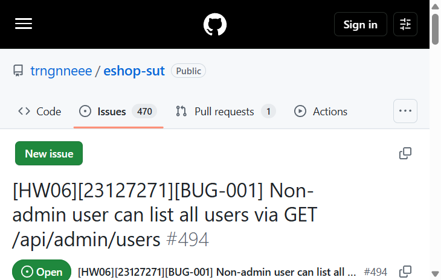
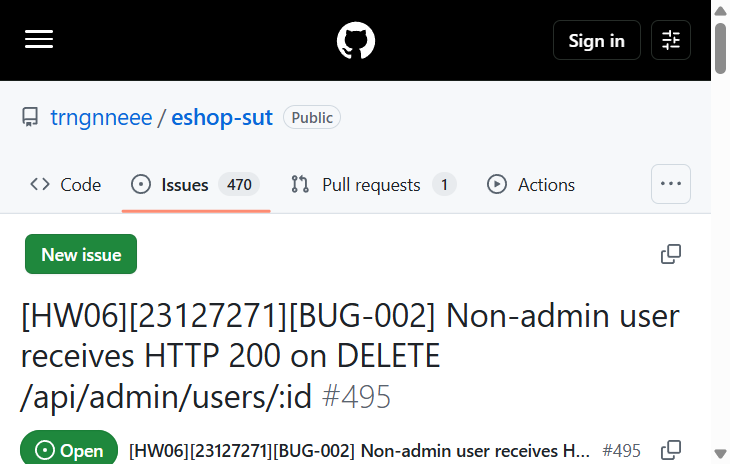
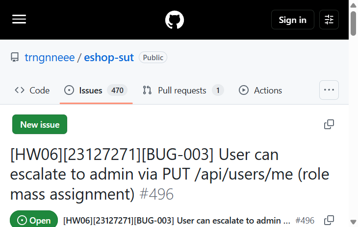
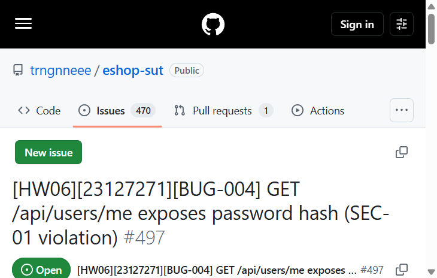
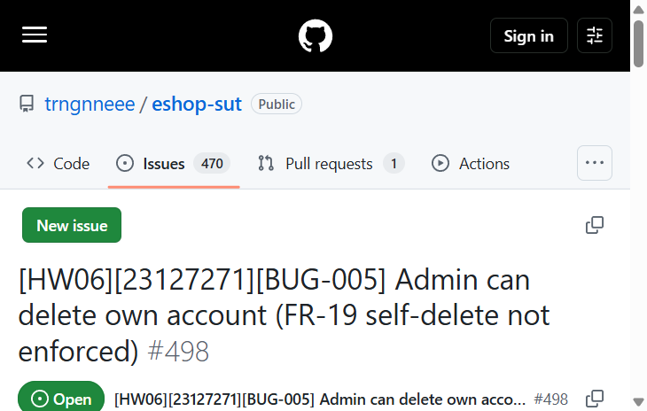
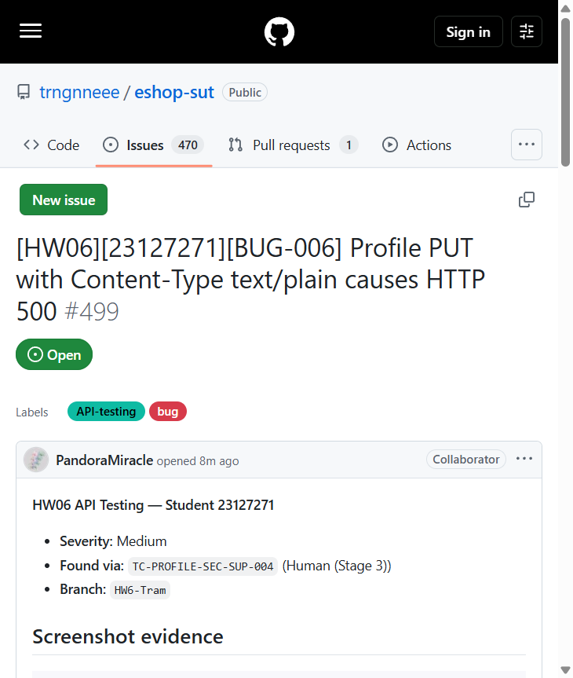
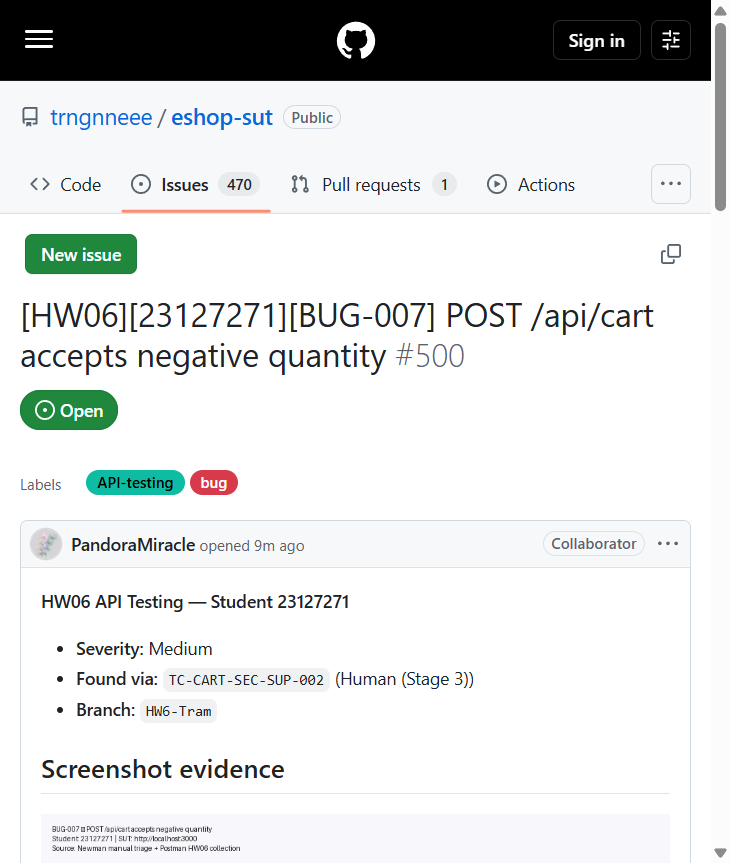
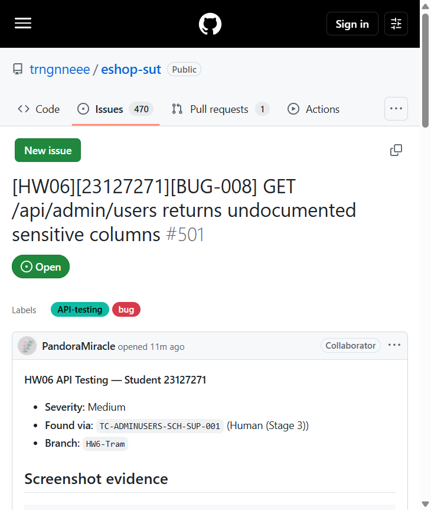

# GitHub Issues — HW06 (23127271)

https://github.com/trngnneee/eshop-sut/issues

Screenshots of each GitHub Issue page (for Moodle / report): `evidence/bugs/BUG-00N-github-issue.png`

| Bug | Issue | Screenshot |
|-----|-------|------------|
| BUG-001 | [#494](https://github.com/trngnneee/eshop-sut/issues/494) | [BUG-001-github-issue.png](../evidence/bugs/BUG-001-github-issue.png) |
| BUG-002 | [#495](https://github.com/trngnneee/eshop-sut/issues/495) | [BUG-002-github-issue.png](../evidence/bugs/BUG-002-github-issue.png) |
| BUG-003 | [#496](https://github.com/trngnneee/eshop-sut/issues/496) | [BUG-003-github-issue.png](../evidence/bugs/BUG-003-github-issue.png) |
| BUG-004 | [#497](https://github.com/trngnneee/eshop-sut/issues/497) | [BUG-004-github-issue.png](../evidence/bugs/BUG-004-github-issue.png) |
| BUG-005 | [#498](https://github.com/trngnneee/eshop-sut/issues/498) | [BUG-005-github-issue.png](../evidence/bugs/BUG-005-github-issue.png) |
| BUG-006 | [#499](https://github.com/trngnneee/eshop-sut/issues/499) | [BUG-006-github-issue.png](../evidence/bugs/BUG-006-github-issue.png) |
| BUG-007 | [#500](https://github.com/trngnneee/eshop-sut/issues/500) | [BUG-007-github-issue.png](../evidence/bugs/BUG-007-github-issue.png) |
| BUG-008 | [#501](https://github.com/trngnneee/eshop-sut/issues/501) | [BUG-008-github-issue.png](../evidence/bugs/BUG-008-github-issue.png) |

