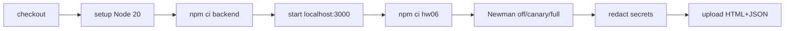

# HW06 CI/CD report

## Pipeline



Workflow: [`.github/workflows/hw06-newman-api-test.yml`](../../.github/workflows/hw06-newman-api-test.yml). Pipeline cài dependency bằng lockfile, đợi `/api/products`, chạy cùng Postman collection như local, redaction password/JWT rồi upload HTML/JSON kể cả khi Newman fail.

## Strict modes

- `off`: chỉ chạy assertion quan sát/oracle-safe; dùng làm green smoke run.
- `canary`: bật thêm đúng strict assertion của `TC-API-LOGIN-018`; phải đỏ khi D-LOGIN-01 còn tồn tại.
- `full`: bật toàn bộ strict probe; dùng để khảo sát defect, không phải required branch gate của cặp run này.

## GitHub Actions evidence

| Mode | Commit SHA | Run | Requests | Assertions | Failed | Kết luận | Screenshot |
| :--- | :--- | :--- | ---: | ---: | ---: | :--- | :--- |
| `off` | `4bf4e5f812b02ca4adf2a0cb811b3a4edbad5bb0` | [Actions #32230928127](https://github.com/trngnneee/eshop-sut/actions/runs/32230928127) | 19 | 18 | 0 | **SUCCESS** — toàn bộ job xanh | [`04-ci-pass.png`](../evidence/screenshots/04-ci-pass.png) |
| `canary` | `03f36993b7766d79d605ee3e334201762bfc5f80` | [Actions #32231020920](https://github.com/trngnneee/eshop-sut/actions/runs/32231020920) | 19 | 19 | 1 | **FAILURE theo thiết kế** — chỉ `TC-API-LOGIN-018` fail | [`05-ci-fail.png`](../evidence/screenshots/05-ci-fail.png) |

Nguồn số liệu: `gh run view` và Newman CLI log của chính hai run trên. Run xanh hoàn tất job `api-test` trong 18 giây. Ở run canary, các bước checkout, cài dependency, khởi động SUT, redaction và upload artifact đều thành công; Newman kết thúc exit code 1 vì đúng một assertion:

```text
[SPEC] TC-API-LOGIN-018 - correct login after two failures
expected response to have status code 200 but got 403
assertions: 19 executed, 1 failed
```

Expected `200` được giữ theo oracle. `403` là actual của bug D-LOGIN-01: bộ đếm sai tăng hai lần cho mỗi lần đăng nhập thất bại, làm tài khoản khóa sớm.

## Các run hạ tầng bị loại

Hai run [#32230292930](https://github.com/trngnneee/eshop-sut/actions/runs/32230292930) và [#32230485958](https://github.com/trngnneee/eshop-sut/actions/runs/32230485958) đỏ trước khi Newman chạy do backend lockfile thiếu/không hợp lệ. Chúng không được dùng làm bằng chứng “đỏ theo thiết kế”. Lockfile sau đó được tái sinh bằng npm 10 và được xác nhận bằng `npm ci` trước run xanh #32230928127.

## Human-only evidence

Hai URL/SHA external đã có thật. `04-ci-pass.png` và `05-ci-fail.png` do người học tự chụp từ hai trang Actions tương ứng: run `#3` hiển thị `Success` với job `api-test` 18s, run `#4` hiển thị `Failure` với job `api-test` 16s. Agent không tạo, sửa hoặc mô phỏng screenshot.
