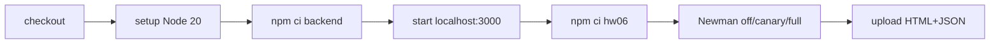

# HW06 CI/CD report

## Pipeline

Workflow: [`.github/workflows/hw06-newman-api-test.yml`](../../.github/workflows/hw06-newman-api-test.yml). It installs backend dependencies, waits for `/api/products`, starts the SUT, installs Newman and uploads reports even on failure.

## Strict modes

- `off`: only observed/oracle-safe assertions; used as green smoke run.
- `canary`: strict one-case gate `TC-API-LOGIN-018`; expected red while D-LOGIN-01 exists.
- `full`: all strict probes; exposes all currently known defects.

## Local evidence (the same collection and runner used by CI)

| Mode/report | Requests | Assertions | Failed | External Actions link | Screenshot |
| :--- | ---: | ---: | ---: | :--- | :--- |
| off — `00-off-suite` | 19 | 18 | 0 | Chưa có — HUMAN | Chưa có — HUMAN |
| canary — `00-canary-suite` | 19 | 19 | 1 | Chưa có — HUMAN | Chưa có — HUMAN |

Không ghi SHA/link GitHub Actions khi chưa có run external thật. Sau khi push, người học điền hai URL/SHA và chụp `04-ci-pass.png`, `05-ci-fail.png`.
