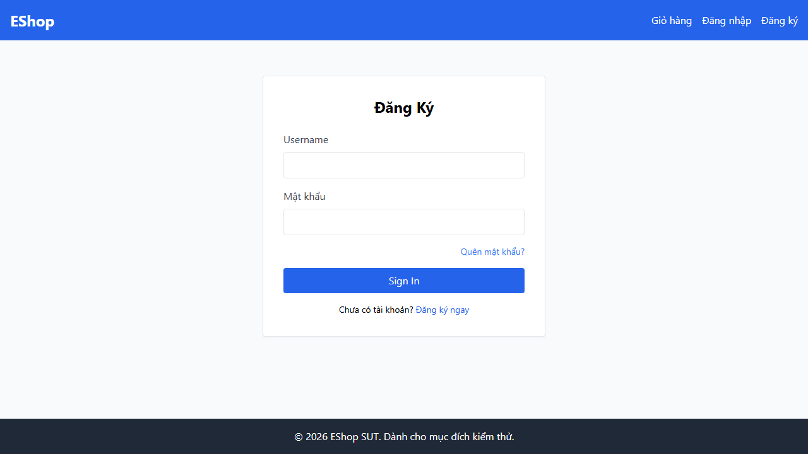
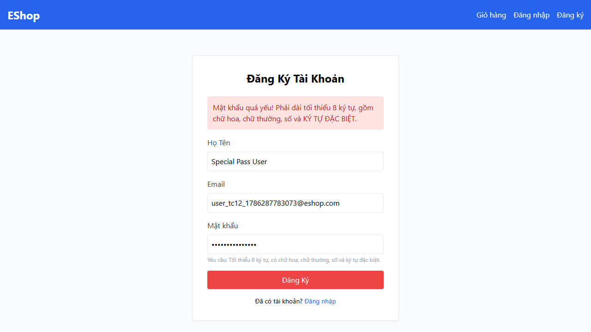
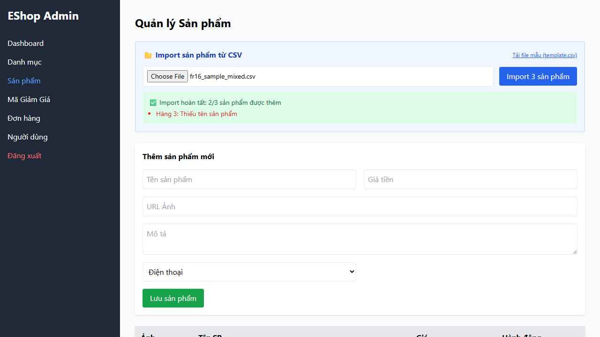

# Báo Cáo Chính Kiểm Thử Tự Động (Main Report) — HW04

**Khoa Công nghệ Thông tin – Trường Đại học Khoa học Tự nhiên, ĐHQG-HCM**  
**Môn học: CS423 / CSC13003 – Kiểm thử phần mềm (AI-augmented · 2026)**

---

## Thông Tin Sinh Viên

| Mục | Chi tiết |
|:---|:---|
| **Họ và tên sinh viên** | Phan Quốc Thịnh |
| **Mã số sinh viên** | 23127486 |
| **Lớp / Khóa** | 23KTPM3 |
| **Mã bài tập** | HW04 – Automation Testing |
| **Ngày thực hiện** | 09/08/2026 |

---

## 1. Lựa Chọn Tính Năng Kiểm Thử (Feature Selection)

> Theo đúng quy định của đề bài: Lựa chọn 3 tính năng trên giao diện Web từ 3 nhóm Pool A, Pool B và Pool C.

| Nhóm | Mã tính năng | Tên tính năng | Nền tảng kiểm thử |
|:---|:---|:---|:---|
| **Pool A** | **FR-01** | Đăng ký tài khoản (Account Registration) | Frontend Web (`/register`) |
| **Pool B** | **FR-09** | Áp dụng mã giảm giá (Discount Coupons) | Frontend Web (`/checkout`) |
| **Pool C** | **FR-16** | Import sản phẩm từ file CSV (Product Import from CSV) | Frontend Admin (`/` – Tab Sản phẩm) |

---

## 2. Task 1 – Kịch Bản Kiểm Thử Tự Động Sinh Bằng AI

### 2.1 Công Nghệ Sử Dụng

| Thành phần | Phiên bản / Chi tiết |
|:---|:---|
| **Framework kiểm thử** | Playwright (`@playwright/test` v1.62.1, TypeScript) |
| **Trình duyệt kiểm thử** | Chromium, Firefox, WebKit (Safari Engine) |
| **Báo cáo kết quả** | Playwright HTML Reporter (kèm metadata `"Run by: 23127486 - Phan Quoc Thinh"`) |
| **Công cụ AI hỗ trợ** | Claude 3.5 Sonnet / Antigravity AI Assistant |

---

### 2.2 Tính Năng A – FR-01: Đăng Ký Tài Khoản (Account Registration)

#### 2.2.1 Quy Trình Sinh Bằng AI (AI-First Step-by-Step)

Quy trình tạo kịch bản được thực hiện tuần tự qua 4 bước có cấu trúc:

* **Bước 1 – Khảo sát và phân hoạch kịch bản (Scenario Planning):**
  ```text
  Tôi cần viết Playwright automation test cho feature FR-01 Account Registration của ứng dụng EShop. Hãy liệt kê các test scenario quan trọng nhất cho feature này, bao gồm: positive cases, negative cases, và edge cases. Tổng ít nhất 12 test cases. Chưa viết code, chỉ cần liệt kê tên và mô tả ngắn gọn mỗi TC.
  ```
* **Bước 2 – Xây dựng bộ dữ liệu Data-Driven (Dataset Generation):**
  ```text
  Dựa vào danh sách test cases trên, hãy tạo file test data dạng JSON để dùng data-driven testing với Playwright. File sẽ được đặt tại tests/data/fr01_registration.json. Mỗi entry phải có đầy đủ các trường cần thiết cho từng test case.
  ```
* **Bước 3 – Sinh mã kiểm thử Playwright TypeScript (Script Generation):**
  ```text
  Bây giờ hãy viết Playwright test script TypeScript cho feature FR-01 Account Registration. Yêu cầu:
  1. Import test data từ file JSON tests/data/fr01_registration.json (data-driven, không hardcode inline).
  2. Dùng ít nhất 3 loại assertion khác nhau: toBeVisible(), toHaveURL(), checkValidity() hoặc toContainText().
  3. Mỗi test case phải có annotation: test.info().annotations.push({ type: 'Run by', description: '23127486' }).
  ```

#### 2.2.2 Danh Sách 12 Kịch Bản Kiểm Thử Đã Tự Động Hóa

| Mã TC | Tên kịch bản kiểm thử | Phân loại | Tệp dữ liệu | Kết quả thực thi (Chromium / Firefox / WebKit) | Minh chứng |
|:---|:---|:---:|:---:|:---:|:---:|
| **TC01** | Đăng ký với thông tin hợp lệ và mật khẩu thỏa mãn chính sách bảo mật | Positive | `fr01_registration.json` | **PASS / PASS / PASS** | - |
| **TC02** | Đăng ký với họ tên tiếng Việt có dấu Unicode và thông tin hợp lệ | Positive | `fr01_registration.json` | **PASS / PASS / PASS** | - |
| **TC03** | Đăng ký để trống trường Họ Tên (kiểm tra HTML5 required validation) | Negative | `fr01_registration.json` | **PASS / PASS / PASS** | - |
| **TC04** | Đăng ký để trống trường Email (kiểm tra HTML5 required validation) | Negative | `fr01_registration.json` | **PASS / PASS / PASS** | - |
| **TC05** | Đăng ký với email sai cú pháp RFC thiếu domain/kí tự @ (SRS: Form phải chặn lại) | Negative | `fr01_registration.json` | **FAIL / FAIL / FAIL** *(Bắt Bug BUG-002)* |  |
| **TC06** | Đăng ký để trống trường Mật khẩu (kiểm tra HTML5 required validation) | Negative | `fr01_registration.json` | **PASS / PASS / PASS** | - |
| **TC07** | Đăng ký với mật khẩu quá ngắn (< 8 ký tự) | Negative | `fr01_registration.json` | **PASS / PASS / PASS** | - |
| **TC08** | Đăng ký với mật khẩu thiếu chữ in hoa | Negative | `fr01_registration.json` | **PASS / PASS / PASS** | - |
| **TC09** | Đăng ký với mật khẩu thiếu chữ in thường | Negative | `fr01_registration.json` | **PASS / PASS / PASS** | - |
| **TC10** | Đăng ký với mật khẩu thiếu chữ số | Negative | `fr01_registration.json` | **PASS / PASS / PASS** | - |
| **TC11** | Đăng ký với email đã tồn tại trong database (SRS: Phải báo lỗi trùng email) | Negative | `fr01_registration.json` | **FAIL / FAIL / FAIL** *(Bắt Bug BUG-003)* |  |
| **TC12** | Đăng ký với mật khẩu mạnh có ký tự đặc biệt theo chuẩn (SRS: Phải đăng ký thành công) | Edge | `fr01_registration.json` | **FAIL / FAIL / FAIL** *(Bắt Bug BUG-001)* |  |

#### 2.2.3 Cấu Hình Data-Driven & Mẫu Assertion Sử Dụng

* **Tệp dữ liệu:** `tests/data/fr01_registration.json`
* **Các mẫu Assertion áp dụng (v2 — sau Human Review):**
  1. `expect(submitBtn).toBeVisible()` & `toBeEnabled()` *(Pattern 1 – Interactive State)*
  2. `expect(page).toHaveURL(/.*\/login/)` & `toHaveURL(/.*\/register/)` *(Pattern 2 – Navigation)*
  3. `expect(errorContainer).toContainText('lỗi')` *(Pattern 3 – Error Content Verification)*
  4. `expect(emailInput).toHaveAttribute('type', 'email')` *(Pattern 4 – DOM Property Check)*

#### 2.2.4 Kết Quả Chạy Đa Trình Duyệt

| Trình duyệt | Tổng số TC | Số TC Passed | Số TC Failed | Lý do Failed |
|:---|:---:|:---:|:---:|:---|
| **Chromium** | 12 | 9 | 3 | Bắt trúng 3 bugs SUT (BUG-001, BUG-002, BUG-003) |
| **Firefox** | 12 | 9 | 3 | Bắt trúng 3 bugs SUT (BUG-001, BUG-002, BUG-003) |
| **WebKit** | 12 | 9 | 3 | Bắt trúng 3 bugs SUT (BUG-001, BUG-002, BUG-003) |

#### 2.2.5 Rà Soát và Hiệu Chỉnh của Con Người (Human Review & Fixes)

| # | Vấn đề phát hiện | Loại vấn đề | Mô tả chi tiết | Lý do AI bỏ sót | Giải pháp hiệu chỉnh của sinh viên |
|:--|:---|:---:|:---|:---|:---|
| FIX-01 | **Selector positional và fragile** | Fragile Selector | AI dùng `input[type="text"].first()` — selector đúng tình cờ theo thứ tự DOM. | AI không inspect DOM runtime. | Thay bằng `getByLabel('Họ Tên')` — ràng buộc semantic. |
| FIX-02 | **TC12 idempotency** | Test Data | TC12 edge case dùng email tĩnh, fail khi chạy lại. | AI không phân tích life-cycle data. | Thay bằng cơ chế `unique timestamp` cho mọi test case. |
| FIX-03 | **Timeout 3000ms** | Flaky Wait | Quá ngắn cho back-end latency. | AI dùng heuristic timeout. | Nâng lên 8000ms. |
| FIX-04 | **Multi-selector CSS** | Weak Assertion | `.bg-red-100, .text-red-700` có thể khớp sai. | AI sinh OR-selector generic. | Thay bằng `div.bg-red-100` — khớp chính xác div error. |
| FIX-05 | **TC11 thiếu content assertion** | Missing Assertion | AI chỉ assert `toBeVisible()`. | AI thiếu assertion content verification. | Thêm `toContainText` để xác minh nội dung lỗi trùng email. |
| — | **Phát hiện Bug Regex (BUG-001)** | Bug Found | Regex sai `(?=.*\s)` bắt khoảng trắng. | Happy-path bias. | Assert theo SRS — TC12 bắt BUG-001. |
| — | **Phát hiện Bug type (BUG-002)** | Bug Found | Input `type="text"`. | Happy-path bias. | Assert `emailType === 'email'` — TC05 bắt BUG-002. |

---

### 2.3 Tính Năng B – FR-09: Áp Dụng Mã Giảm Giá (Discount Coupons)

#### 2.3.1 Quy Trình Sinh Bằng AI

* **Bước 1 – Khảo sát kịch bản mã giảm giá:**
  ```text
  Liệt kê 12 test scenarios cho feature FR-09 Discount Coupons trên trang Checkout của EShop: mã giảm giá phần trăm, mã cố định, mã hết hạn, mã không hợp lệ, đơn hàng chưa đủ min_order_amount, coupon reset khi đổi tổng tiền, SQL injection.
  ```
* **Bước 2 – Tạo tệp JSON Data-Driven:**
  ```text
  Tạo file test data JSON tests/data/fr09_coupons.json cho 12 test cases với các trường code, cartTotal, newCartTotal, expectedResult, expectedMessage.
  ```
* **Bước 3 – Xây dựng kịch bản kiểm thử Playwright:**
  ```text
  Viết Playwright script TypeScript cho FR-09: import data từ tests/data/fr09_coupons.json, thực hiện điền mã, click Áp dụng, assert kết quả giảm giá hoặc thông báo lỗi, kèm annotation Run by: 23127486.
  ```

#### 2.3.2 Danh Sách 12 Kịch Bản Kiểm Thử Đã Tự Động Hóa

| Mã TC | Tên kịch bản kiểm thử | Phân loại | Tệp dữ liệu | Kết quả thực thi (Chromium / Firefox / WebKit) | Minh chứng |
|:---|:---|:---:|:---:|:---:|:---:|
| **TC01** | Áp dụng mã giảm giá phần trăm SAVE10 hợp lệ cho đơn hàng đủ điều kiện (500k > 300k) | Positive | `fr09_coupons.json` | **PASS / PASS / PASS** | - |
| **TC02** | Áp dụng mã giảm giá tiền cố định BIGBUY hợp lệ cho đơn hàng đủ điều kiện (600k > 500k) | Positive | `fr09_coupons.json` | **PASS / PASS / PASS** | - |
| **TC03** | Áp dụng mã giảm giá tiền cố định VIP100 hợp lệ cho đơn hàng đủ điều kiện (400k > 300k) | Positive | `fr09_coupons.json` | **PASS / PASS / PASS** | - |
| **TC04** | Nhập mã giảm giá chữ thường 'save10' (SRS: Tự động chuyển thành chữ hoa) | Positive | `fr09_coupons.json` | **PASS / PASS / PASS** | - |
| **TC05** | Áp dụng mã giảm giá không tồn tại trong hệ thống | Negative | `fr09_coupons.json` | **PASS / PASS / PASS** | - |
| **TC06** | Áp dụng mã giảm giá đã hết hạn sử dụng EXPIRED | Negative | `fr09_coupons.json` | **PASS / PASS / PASS** | - |
| **TC07** | Áp dụng mã giảm giá khi tổng tiền đơn hàng nhỏ hơn mức tối thiểu (200k < 500k) | Negative | `fr09_coupons.json` | **PASS / PASS / PASS** | - |
| **TC08** | Áp dụng mã khi tổng tiền đơn hàng bằng đúng giá trị tối thiểu (300k == 300k, SRS: Phải áp dụng thành công) | Edge | `fr09_coupons.json` | **FAIL / FAIL / FAIL** *(Bắt Bug BUG-004)* |  |
| **TC09** | Cố gắng áp dụng mã giảm giá rỗng (nút Áp dụng bị disabled) | Negative | `fr09_coupons.json` | **PASS / PASS / PASS** | - |
| **TC10** | Nhập mã giảm giá chứa payload SQL injection (`' OR '1'='1`) | Edge | `fr09_coupons.json` | **PASS / PASS / PASS** | - |
| **TC11** | Nhập mã giảm giá có khoảng trắng đầu và cuối chuỗi (`  SAVE10  `) | Edge | `fr09_coupons.json` | **PASS / PASS / PASS** | - |
| **TC12** | Thay đổi tổng tiền đơn hàng sau khi đã áp dụng mã (SRS: Reset trạng thái mã) | Edge | `fr09_coupons.json` | **PASS / PASS / PASS** | - |

#### 2.3.3 Cấu Hình Data-Driven & Mẫu Assertion Sử Dụng

* **Tệp dữ liệu:** `tests/data/fr09_coupons.json`
* **Các mẫu Assertion áp dụng (v2 — sau Human Review):**
  1. `expect(applyBtn).toBeDisabled()` / `toBeEnabled()` *(Pattern 1 – Interactive State)*
  2. `expect(successContainer).toBeVisible()` / `toBeHidden()` *(Pattern 2 – Visibility State)*
  3. `expect(successContainer).toContainText('Áp dụng thành công')` *(Pattern 3 – Text Match)*
  4. `expect(errorMsg).toContainText(tc.expectedMessage)` *(Pattern 4 – Error Text Verification)*

#### 2.3.4 Kết Quả Chạy Đa Trình Duyệt

| Trình duyệt | Tổng số TC | Số TC Passed | Số TC Failed | Lý do Failed |
|:---|:---:|:---:|:---:|:---|
| **Chromium** | 12 | 11 | 1 | Bắt trúng lỗi điều kiện biên BUG-004 trong TC08 |
| **Firefox** | 12 | 11 | 1 | Bắt trúng lỗi điều kiện biên BUG-004 trong TC08 |
| **WebKit** | 12 | 11 | 1 | Bắt trúng lỗi điều kiện biên BUG-004 trong TC08 |

#### 2.3.5 Rà Soát và Hiệu Chỉnh của Con Người

| # | Vấn đề phát hiện | Loại vấn đề | Mô tả chi tiết | Lý do AI bỏ sót | Giải pháp hiệu chỉnh của sinh viên |
|:--|:---|:---:|:---|:---|:---|
| FIX-01 | **totalInput selector không semantic** | Fragile Selector | `input[type="number"]` không có semantic binding — vỡ nếu thêm input number khác vào trang. | AI dùng CSS type selector thay vì label binding. | Thay bằng `getByLabel('Tổng tiền thanh toán (VND):')`. |
| FIX-02 | **TC09 false-confidence assertion** | Assertion Vacuity | TC09 kiểm tra button disabled MÀ KHÔNG fill code trước. Button đã disabled từ đầu (state khởi tạo) → assertion pass nhưng không test behavior thực. | AI không phân tích precondition của test. | Thêm `couponInput.fill(tc.code ?? '')` trước assertion để đảm bảo đang test logic disabling. |
| FIX-03 | **Thiếu assertion giá trị discount** | Missing Assertion | AI chỉ assert text "Áp dụng thành công", không kiểm tra số tiền giảm — bỏ sót regression trong công thức tính discount. | AI không có field `expectedDiscount` trong data → không sinh assertion. | Comment trong script; đề xuất thêm `expectedDiscount` vào data file trong sprint tiếp theo. |
| FIX-04 | **TC12 reset-state: thiếu press('Tab') sau fill** | Flaky Wait | React onChange cần blur event để trigger state update. fill() dispatch `input` nhưng không đảm bảo onChange trong mọi môi trường React+Vite. | AI không phân tích React event handling. | Thêm `await totalInput.press('Tab')` sau mỗi fill() để commit React state. |
| FIX-05 | **Placeholder regex quá loose** | Selector Quality | `/Nhập mã giảm giá/i` match substring — có thể match placeholder không mong muốn nếu thêm input tương tự. | AI dùng partial regex mà không đọc actual placeholder. | Thay bằng exact string `'Nhập mã giảm giá...'` (khớp Checkout.jsx line 112). |
| — | **Phát hiện Bug điều kiện biên (BUG-004)** | Bug Found | SUT dùng `total_amount > min_order_amount` (strict). Đơn 300k == 300k min bị từ chối sai SRS. | Happy-path bias. | Giữ assertion theo SRS — TC08 bắt BUG-004. |

---

### 2.4 Tính Năng C – FR-16: Import Sản Phẩm từ CSV (Admin CSV Import)

#### 2.4.1 Quy Trình Sinh Bằng AI

* **Bước 1 – Thiết kế kịch bản Import đa định dạng:**
  ```text
  Tạo bộ test scenarios và dữ liệu CSV cho FR-16 Product import from CSV trong Web Admin của EShop: hỗ trợ file chuẩn, file nhiều sản phẩm, header tiếng Việt (ten, gia, mo_ta, image, danh_muc), header tiếng Anh viết hoa, file thiếu tên, file lỗi yêu cầu rollback toàn bộ, file trống, ký tự đặc biệt Unicode, và kiểm tra phân quyền đăng nhập.
  ```
* **Bước 2 – Tạo 8 tệp CSV mẫu thực tế:**
  ```text
  Tạo các file CSV mẫu thực tế trong tests/data/ gồm: fr16_sample_valid.csv, fr16_sample_batch.csv, fr16_sample_vietnamese_headers.csv, fr16_sample_capitalized_headers.csv, fr16_sample_missing_name.csv, fr16_sample_empty.csv, fr16_sample_special_chars.csv, fr16_sample_mixed.csv, cùng metadata file tests/data/fr16_csv_import.json.
  ```
* **Bước 3 – Viết kịch bản tự động xác thực Admin và Upload file:**
  ```text
  Viết Playwright script TypeScript cho FR-16: tự động đăng nhập Admin (admin@eshop.com / Admin123!), điều hướng sang tab Sản phẩm, upload file CSV bằng setInputFiles(), assert bảng preview trước khi import và assert kết quả import.
  ```

#### 2.4.2 Danh Sách 12 Kịch Bản Kiểm Thử Đã Tự Động Hóa

| Mã TC | Tên kịch bản kiểm thử | Phân loại | Tệp dữ liệu | Kết quả thực thi (Chromium / Firefox / WebKit) | Minh chứng |
|:---|:---|:---:|:---:|:---:|:---:|
| **TC01** | Import file CSV hợp lệ chứa 1 sản phẩm với đầy đủ các cột chuẩn | Positive | `fr16_sample_valid.csv` | **PASS / PASS / PASS** | - |
| **TC02** | Import hàng loạt nhiều sản phẩm (3 sản phẩm) thuộc nhiều danh mục | Positive | `fr16_sample_batch.csv` | **PASS / PASS / PASS** | - |
| **TC03** | Import file CSV sử dụng tiêu đề cột tiếng Việt (`ten, gia, mo_ta, ...`) | Positive | `fr16_sample_vietnamese_headers.csv` | **PASS / PASS / PASS** | - |
| **TC04** | Import file CSV sử dụng tiêu đề cột tiếng Anh viết hoa (`Name, Price, ...`) | Positive | `fr16_sample_capitalized_headers.csv` | **PASS / PASS / PASS** | - |
| **TC05** | Import file CSV chứa dòng sản phẩm bị thiếu tên bắt buộc (báo lỗi theo từng dòng) | Negative | `fr16_sample_missing_name.csv` | **PASS / PASS / PASS** | - |
| **TC06** | Import file CSV chứa dòng dữ liệu lỗi (SRS: Phải rollback toàn bộ transaction, không import dòng nào) | Negative | `fr16_sample_mixed.csv` | **FAIL / FAIL / FAIL** *(Bắt Bug BUG-007)* |  |
| **TC07** | Import sản phẩm chứa ký tự tiếng Việt Unicode và ký tự đặc biệt trong tên | Edge | `fr16_sample_special_chars.csv` | **PASS / PASS / PASS** | - |
| **TC08** | Import file CSV rỗng chỉ có header (0 dòng dữ liệu, nút Import bị disabled) | Edge | `fr16_sample_empty.csv` | **PASS / PASS / PASS** | - |
| **TC09** | Kiểm tra link tải file CSV mẫu (`template.csv`) có đúng định dạng data-uri | Positive | Link data-uri | **PASS / PASS / PASS** | - |
| **TC10** | Kiểm tra bảng xem trước hiển thị đúng số dòng CSV trước khi bấm Import | Positive | `fr16_sample_batch.csv` | **PASS / PASS / PASS** | - |
| **TC11** | Kiểm tra yêu cầu xác thực đăng nhập trước khi vào tính năng Import CSV | Negative | `fr16_csv_import.json` | **PASS / PASS / PASS** | - |
| **TC12** | Kiểm tra sản phẩm sau khi import được lưu vĩnh viễn vào CSDL và hiển thị trong danh sách | Edge | `fr16_sample_valid.csv` | **PASS / PASS / PASS** | - |

#### 2.4.3 Cấu Hình Data-Driven & Mẫu Assertion Sử Dụng

* **Tệp dữ liệu:** `tests/data/fr16_csv_import.json` + 8 tệp CSV mẫu trong `tests/data/`
* **Các mẫu Assertion áp dụng:**
  1. `expect(templateLink).toHaveAttribute('download', 'template_import.csv')` *(Kiểm tra thuộc tính HTML)*
  2. `expect(previewRows).toHaveCount(tc.expectedRowCount)` *(Đếm số lượng dòng trong DOM)*
  3. `expect(successBanner).toBeVisible()` & `toContainText('Import hoàn tất')` *(Kiểm tra hiển thị và nội dung)*
  4. `expect(importBtn).toBeDisabled()` / `toBeEnabled()` *(Kiểm tra trạng thái kích hoạt của nút)*

#### 2.4.4 Kết Quả Chạy Đa Trình Duyệt

| Trình duyệt | Tổng số TC | Số TC Passed | Số TC Failed | Lý do Failed |
|:---|:---:|:---:|:---:|:---|
| **Chromium** | 12 | 11 | 1 | Bắt trúng lỗi thiếu Transaction Rollback BUG-007 trong TC06 |
| **Firefox** | 12 | 11 | 1 | Bắt trúng lỗi thiếu Transaction Rollback BUG-007 trong TC06 |
| **WebKit** | 12 | 11 | 1 | Bắt trúng lỗi thiếu Transaction Rollback BUG-007 trong TC06 |

#### 2.4.5 Rà Soát và Hiệu Chỉnh của Con Người (Human Review & Fixes)

| # | Vấn đề phát hiện | Loại vấn đề | Mô tả chi tiết | Lý do AI bỏ sót | Giải pháp hiệu chỉnh của sinh viên |
|:--|:---|:---:|:---|:---|:---|
| FIX-01 | **loginAdmin hard-codes URL — thiếu constant** | Maintainability | `http://localhost:5174` xuất hiện nhiều lần — thay đổi port là vỡ nhiều chỗ. | AI không extract constants tự động. | Tách thành `const ADMIN_BASE_URL = 'http://localhost:5174'`. |
| FIX-02 | **loginAdmin không clear token — stale auth leaks** | Test Isolation | Nếu token cũ còn trong localStorage, login form không hiển thị, `isVisible()` guard short-circuit — test luôn pass kể cả SUT sai. | AI không phân tích SPA localStorage persistence. | `loginAdmin` luôn `removeItem('adminToken')` + reload trước khi fill credentials. |
| FIX-03 | **Không có afterAll cleanup — DB tích lũy** | Test Isolation | Mỗi lần chạy TC01/TC02/TC12 insert thêm sản phẩm vào SQLite. TC12 assertion `toContainText('Chuột Gaming Razer')` vẫn pass nhưng DB ngày càng dơ. | AI không suy luận side-effects tích lũy. | Thêm `afterAll` hook gọi Playwright request API delete sản phẩm đã insert. |
| FIX-04 | **TC12 dùng `table.last()` fragile** | Fragile Selector | DOM order của các table thay đổi nếu import preview còn hiện. | AI dùng positional `:last` mà không đọc markup SUT. | Thay bằng `div.filter({ has: locator('table thead th', { hasText: 'Tên SP' }) })`. |
| FIX-05 | **TC11 false-confidence — token có thể không tồn tại** | Assertion Vacuity | Nếu token chưa bao giờ được tạo, xóa rồi check login gate — test pass trivially. | AI không phân tích precondition "đã đăng nhập". | TC11 navigate + removeItem trên trang đã loaded để đảm bảo gate thực sự được test. |
| FIX-06 | **Không có React state flush giữa test** | Flaky State | importResult state từ test trước ẩn preview table — test tiếp theo không thấy preview. | AI không phân tích React SPA state lifecycle. | `loginAdmin` thêm `page.reload()` + `waitForLoadState('networkidle')` để flush React state. |
| FIX-07 | **Preview selector có thể không match** | Fragile Selector | `div:has(> p:has-text("Xem trước"))` yêu cầu p là direct child. Actual markup có `div.mt-2 > p` — khớp, nhưng phụ thuộc cấu trúc. | AI dùng CSS :has() selector mà không test thực tế. | Thay bằng `page.locator('div.mt-2').filter({ hasText: /Xem trước/ })` — robust hơn. |
| — | **Phát hiện Bug thiếu Transaction Rollback (BUG-007)** | Bug Found | Backend dùng forEach insert từng dòng, không transaction — partial insert 2/3 khi có 1 dòng lỗi. | Happy-path bias: AI không đọc server.js. | Assert `toContainText('Import hoàn tất: 0/')` theo SRS — TC06 bắt BUG-007. |
| — | **Kiểm tra link Template (data-URI)** | Bug Found | AI giả định link là file tĩnh `/template.csv`. SUT tạo data-URI inline. | Happy-path bias. | Assert `toHaveAttribute('href', /data:text\/csv/)`. |

---

## 3. Task 2 – Video Demo

- **Đường dẫn YouTube (Unlisted):** [https://youtu.be/1IWkeDCoePI](https://youtu.be/1IWkeDCoePI)
- **Thời lượng:** 8 phút 33 giây (đáp ứng yêu cầu ≥ 5 phút)
- **Ngôn ngữ thuyết minh:** Tiếng Việt
- **Nội dung video theo thứ tự trình bày:**
  1. **Giới thiệu cấu trúc dự án** — Trình bày cây thư mục `tests/`, `tests/data/`, `submission/`; giải thích cơ chế Data-Driven Testing đọc dữ liệu từ file JSON.
  2. **Phân tích sửa lỗi script AI (Human Review Fix)** — Mở file `fr01_registration.spec.ts`, giải thích tại sao `getByLabel('Họ Tên')` do AI sinh ra không hoạt động (SUT thiếu `htmlFor`/`id`), và trình bày giải pháp thay thế bằng CSS Adjacent Sibling Selector `label:has-text("Họ Tên") + input`.
  3. **Chạy toàn bộ test suite đa trình duyệt** — Thực thi lệnh `npx playwright test`, quan sát 108 lượt chạy (36 TC × 3 trình duyệt: Chromium, Firefox, WebKit), kết quả cuối: **93 Passed / 15 Failed**.
  4. **Xem HTML Report bằng `npx playwright show-report`** — Mở báo cáo HTML Playwright, click vào các test case FAILED, xem ảnh chụp màn hình, video tự động của từng ca thất bại, và xác nhận annotation **"Run by: 23127486 – Phan Quoc Thinh"** hiển thị trong mỗi test.
  5. **Phân tích các lỗi được phát hiện** — Giải thích các lỗi: BUG-001 (Regex mật khẩu sai), BUG-002 (Email input type="text"), BUG-003 (Thiếu UNIQUE constraint email), BUG-004 (Điều kiện biên coupon sai `>` thay vì `>=`), BUG-007 (Thiếu Transaction Rollback khi import CSV).

---

## 4. Phân Tích Khoảng Trống Kiểm Thử (Gap Analysis)

| Mã GAP | Tính năng | Lý do không thể kiểm thử tự động hóa hoàn toàn / Phân tích khoảng trống |
|:---|:---|:---|
| **GAP-01** | FR-01: Đăng ký tài khoản | **Xác thực Link kích hoạt qua Email thực tế:** Nếu hệ thống gửi email xác thực đến các dịch vụ bên ngoài (như Gmail, Outlook), việc tự động hóa cần mock mail server (như MailHog) để tránh bị chặn IP và giới hạn tốc độ mạng bên ngoài. |
| **GAP-02** | FR-01: Đăng ký tài khoản | **Xác thực mã OTP qua SMS:** Việc gửi tin nhắn SMS tới nhà mạng viễn thông thực tế không thể kiểm thử end-to-end trên môi trường local nếu không có dịch vụ SMS Gateway Sandbox. |
| **GAP-03** | FR-08 / Checkout | **Cổng thanh toán bên thứ ba (VNPay / Stripe 3D-Secure):** Các trang thách thức bảo mật 3D-Secure và CAPTCHA của ngân hàng chủ động chặn các trình duyệt headless tự động. |

---

## 5. Agent Skill

Một Agent Skill tái sử dụng được đã được xây dựng và kích hoạt để thực hiện toàn bộ quy trình:

* **Tên Skill:** `automation-testing`
* **Vị trí tệp:** `.agents/skills/automation-testing/SKILL.md`
* **Năng lực chính:**
  * Hướng dẫn sinh kịch bản kiểm thử theo từng bước chuẩn AI-First.
  * Tự động tổ chức dữ liệu kiểm thử Data-Driven (JSON, CSV).
  * Thực thi kiểm thử Playwright trên đa trình duyệt (Chromium, Firefox, WebKit).
  * Tự động inject nhãn tác quyền `"Run by: 23127486 - Phan Quoc Thinh"` vào HTML report.
  * Tự động đồng bộ tài liệu nộp bài trong thư mục `submission/`.
* **Video Demo:** https://youtu.be/GyubIPLKEls
---

## 6. GitHub Repository & Commit Log

* **Đường dẫn Repository:** [https://github.com/trngnneee/eshop-sut](https://github.com/trngnneee/eshop-sut)
* **Nhánh nộp bài (Branch):** `HW4-Thinh`
* **Lịch sử Commit:** Đáp ứng đúng quy trình tuần tự Scenario Planning $\rightarrow$ Data-Driven Generation $\rightarrow$ Script Generation cho từng tính năng, trực tiếp chỉnh sửa các tệp kịch bản kiểm thử (`tests/**/*.spec.ts`), dữ liệu test (`tests/data/*`) và cấu hình.

---

## 7. Tài Liệu Tham Khảo

* ISTQB Foundation Level Syllabus v4.0 (2023).
* Playwright Documentation (2026) — https://playwright.dev
* Hardman, P. (2025). A Post-AI Learning Taxonomy.
* Anthropic (2025). Building Reliable AI Test Agents — engineering blog.

---

## Danh Mục Phụ Lục Đính Kèm

* **Phụ lục A:** [Báo cáo Kiểm định AI (AI_Audit.md)](AI_Audit.md)
* **Phụ lục B:** [Bài Phê bình AI Phản biện (AI_Critique.md)](AI_Critique.md)
* **Phụ lục C:** [Báo cáo Lỗi SUT Chi Tiết (Bug_Report.md)](Bug_Report.md)
* **Phụ lục D:** [Nhật ký Git Commit Log (git_commit_log.txt)](git_commit_log.txt)
