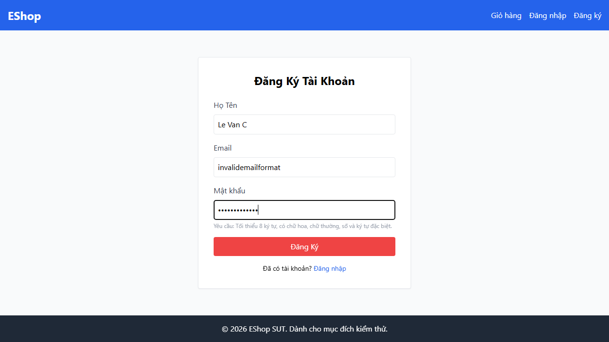

---

name: Bug Report
about: Mẫu báo cáo lỗi khi thực hiện test case thất bại
title: '[BUG][FR01][Automation] Input Email trong form đăng ký dùng type=''text'' thay vì type=''email'''
labels: ['type: bug', 'found-by: test-case']

---

## Found by Test Case

TC05 - Đăng ký với email sai cú pháp RFC thiếu domain/kí tự @

## Requirement liên quan

FR-01

## Severity / Priority

Medium / Medium

## Environment

- **OS**: Windows11
- **Browser**: Chrome, Firefox, Webkit

## Steps to reproduce

1. Mở trang Đăng ký (`/register`).
2. Nhập một email không đúng định dạng RFC (ví dụ: `invalidemailformat`).
3. Điền các trường thông tin bắt buộc khác.
4. Nhấn nút "Đăng ký".

## Expected result

Trình duyệt chặn form submit lại và hiển thị lỗi HTML5 validation báo hiệu email không hợp lệ (vì `<input>` phải có `type="email"`).

## Actual result

`<input>` được định dạng là `type="text"`, do đó trình duyệt không tự động kiểm tra định dạng email và cho phép gửi chuỗi không đúng định dạng lên server.

## Evidence

