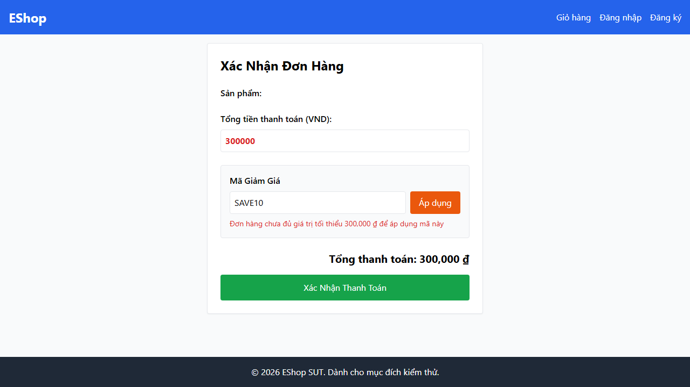

---

name: Bug Report
about: Mẫu báo cáo lỗi khi thực hiện test case thất bại
title: '[BUG][FR09][Automation] Logic áp dụng coupon yêu cầu total_amount > min_order_amount thay vì >='
labels: ['type: bug', 'found-by: test-case']

---

## Found by Test Case

TC08 - Áp dụng mã khi tổng tiền đơn hàng bằng đúng giá trị tối thiểu

## Requirement liên quan

FR-09

## Severity / Priority

Major / High

## Environment

- **OS**: Windows11
- **Browser**: Chrome, Firefox, Webkit

## Steps to reproduce

1. Khởi tạo một đơn hàng với tổng tiền thanh toán đúng bằng mức yêu cầu tối thiểu của một mã giảm giá (ví dụ: tổng tiền 300.000 ₫ đối với mã yêu cầu tối thiểu 300.000 ₫).
2. Nhập mã giảm giá đó.
3. Nhấn "Áp dụng".

## Expected result

Hệ thống áp dụng mã giảm giá thành công vì tổng tiền đã đạt (bằng) giá trị tối thiểu của mã.

## Actual result

Hệ thống từ chối áp dụng mã giảm giá và báo lỗi: *"Đơn hàng chưa đủ giá trị tối thiểu..."* do backend sử dụng điều kiện `>` thay vì `>=` để kiểm tra `total_amount > coupon.min_order_amount`.

## Evidence

