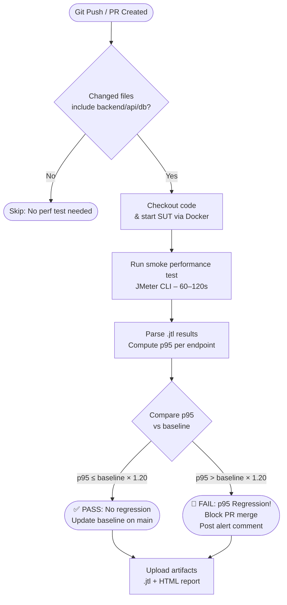

# HW05 – Continuous Performance Testing Proposal Skill

**Student:** Phan Quốc Thịnh | **MSSV:** 23127486  
**Submissions dir:** `c:\Users\Public\Projects\Testing_HCMUS\HW5\eshop-sut\submissions\`

> **Task 3 Goal (G9.6 – Disrupt):** Propose a continuous performance-testing
> model that watches the SUT's commits, decides whether to run performance
> tests, and flags p95 regressions. Include a flowchart and a discussion of
> trade-offs (cost, false alarms).

---

## Step 1 — Research Context

Before generating the proposal, gather context:

1. Read the SUT's repository structure to understand:
   - Which CI/CD platform is used (GitHub Actions, GitLab CI, etc.)
   - The backend tech stack (language, database, framework)
   - How the application is started (Docker, npm, etc.)

2. The proposal must reference the SUT's actual tech stack and CI/CD
   capabilities — not a generic template.

---

## Step 2 — Design the Continuous Performance Testing Model

Design a pipeline with the following components:

### 2.1 Trigger Logic — "Should We Run?"

Not every commit needs a full performance test (expensive). The pipeline must
decide intelligently:

**Run performance tests when ANY of these is true:**
- Commit modifies files in: `backend/`, `api/`, `db/migrations/`, `Dockerfile`
- Commit message contains: `[perf]`, `[regression]`
- It is a PR targeting `main` / `master` branch
- Scheduled run (e.g., nightly on `main`)

**Skip performance tests when:**
- Only frontend/docs/test files changed
- Commit message contains `[skip-perf]`

Implement this as a GitHub Actions condition (or equivalent).

### 2.2 Test Execution — Smoke Performance Test

For CI pipelines, use a **smoke performance test** (not full Load/Stress/Spike)
to keep execution time under 5 minutes:
- Low thread count (5–10 users)
- Short duration (60–120 seconds)
- Same end-to-end workflow as the full test plans
- Run with JMeter in CLI mode (headless): 
  `jmeter -n -t testplan.jmx -l results.jtl -e -o html_report/`

### 2.3 Baseline Management

Maintain a **performance baseline** stored in the repository or a persistent
store:
- After a passing run on `main`, store the p95 response time per endpoint
  as the new baseline
- Compare each new run's p95 against the stored baseline

### 2.4 Regression Detection — p95 Threshold

Flag a regression if:
```
new_p95 > baseline_p95 × (1 + regression_threshold)
```
Where `regression_threshold` is configurable (e.g., 0.20 = 20% degradation).

Send alerts via:
- GitHub Actions job failure (blocks merge)
- PR comment with a metrics table
- Optional: Slack/email webhook

### 2.5 Reporting

After each run:
- Upload the `.jtl` file and HTML report as GitHub Actions artifacts
- Post a summary comment on the PR with key metrics (avg, p95, error rate)
- Update a `performance_history.json` or similar file for trend tracking

---

## Step 3 — Generate the Mermaid Flowchart

Create the following Mermaid diagram for inclusion in `Report.md`:



Embed this diagram directly in `Report.md` Section 6.2 using a Mermaid
fenced code block.

---

## Step 4 — Write the Trade-off Discussion

Write a discussion covering the following points in `Report.md` Section 6.3:

### Cost vs. Coverage
| Approach | Cost | Coverage | Recommendation |
|:---------|:-----|:---------|:---------------|
| Run on every commit | High (CI minutes, infra) | Maximum | ❌ Too expensive |
| Run on backend changes only | Medium | Good | ✅ Recommended |
| Run nightly on `main` only | Low | Minimal | ⚠️ Misses regressions in PRs |
| Run only on release branches | Very low | Very low | ❌ Too late to catch issues |

### False Alarm Trade-offs
| Issue | Description | Mitigation |
|:------|:------------|:-----------|
| **False positives** | Slow CI runner, DB not warmed up, shared environment → higher p95 than real | Use dedicated test environment; warm up before measuring |
| **False negatives** | Smoke test load too low to reveal real bottlenecks | Periodically run full Load/Stress tests in nightly pipeline |
| **Flaky baselines** | Baseline set on a slow commit accidentally | Use rolling average of last N passing runs |
| **Threshold too tight** | Any tiny variance fails the check | Use relative threshold (20%) not absolute (fixed ms) |

### EShop-Specific Considerations
- SQLite has limited concurrency — local CI runner may not reflect production
  behavior with a real database.
- The smoke test should warm the SQLite WAL before measuring to avoid
  cold-start bias.
- If the SUT is containerized, ensure the Docker startup time is excluded
  from the measured response times.

---

## Step 5 — Update Report.md (Task 3)

Update `Report.md` Section 6 with all content from Steps 2–4:

- **Section 6.1** — Proposal Overview (2–3 paragraph narrative)
- **Section 6.2** — Flow Chart (Mermaid diagram)
- **Section 6.3** — Trade-off Discussion (tables + narrative)

Also update `Report.md` Section 8 (Conclusion) with 2–3 sentences referencing
the continuous testing proposal.

---

## Step 6 — Update AI_Audit.md

If AI was used to help draft any part of this proposal, record the
interaction in `AI_Audit.md`. See the `hw5-ai-audit-update` skill.

---

## Validation

- [ ] Report.md Section 6.1 — Proposal narrative written
- [ ] Report.md Section 6.2 — Mermaid flowchart embedded and renders correctly
- [ ] Report.md Section 6.3 — Trade-off tables and discussion complete
- [ ] Report.md Section 8 — Conclusion references the proposal
- [ ] AI_Audit.md updated if AI was used
