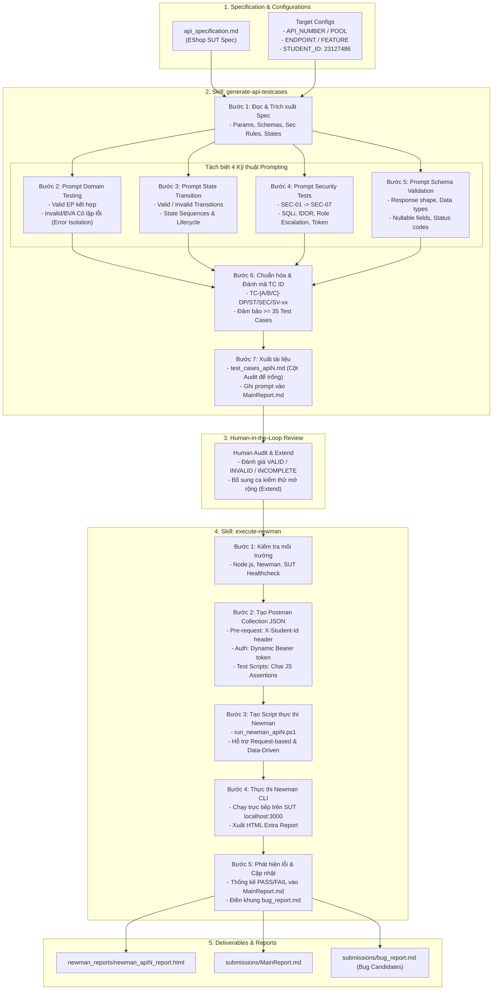

# Agent Skill – AI-driven API Test Generator

**Sinh viên:** Phan Quốc Thịnh – 23127486 – 23KTPM3  
**Học phần:** Kiểm thử Phần mềm (CS423 / CSC13003) – AI-augmented (2026)  
**Bloom-AI Level:** G9.5 (Create)

---

## 1. Mô tả Kiến trúc và Luồng Xử lý

Hệ thống **AI-driven API Test Generator** cho EShop SUT được thiết kế dạng pipeline hai giai đoạn liên kết chặt chẽ thông qua hai Agent Skills chính:

1. **Skill `generate-api-testcases` (Giai đoạn Sinh Test Cases):**
   - **Đầu vào:** `api_specification.md` và các tham số endpoint (`API_NUMBER`, `POOL`, `FEATURE`, `ENDPOINT`).
   - **Phân tích đặc tả (Spec Analysis):** Trích xuất parameters, types, response schema, security rules (SEC-01 đến SEC-07), và state model (FR-10).
   - **4 Kỹ thuật Prompting chuyên biệt:**
     - *Domain Testing (EP & BVA):* Phân vùng tương đương (Valid/Invalid) và phân tích biên 2-point/3-point. Áp dụng nguyên tắc **Cô lập lỗi (Error Isolation)**: Mỗi ca kiểm thử biên/lỗi chỉ chứa duy nhất 1 biến sai, tất cả biến còn lại giữ giá trị hợp lệ đại diện.
     - *State Transition & Lifecycle:* Bao phủ chuỗi trạng thái hợp lệ, chuyển đổi bất hợp lệ (Invalid transition / N-switch), và vòng đời CRUD.
     - *Security Testing:* Sinh ca kiểm thử cho SQL Injection, IDOR, Role Escalation, Missing/Invalid Authorization, Token Expired, Rate Limiting.
     - *Schema Validation:* Kiểm tra response shape, field presence, kiểu dữ liệu, và nullable fields.
   - **Chuẩn hóa & Xuất Markdown:** Đánh mã định danh chuẩn (`TC-[A/B/C]-[DP/ST/SEC/SV]-xx`), đảm bảo tổng số lượng $\ge 35$ TC, để trống cột Audit cho con người đánh giá và ghi nhận prompt vào `MainReport.md`.

2. **Skill `execute-newman` (Giai đoạn Chuyển đổi & Thực thi):**
   - **Đầu vào:** File kịch bản `test_cases_apiN.md` (đã qua Audit & Extend), `STUDENT_ID` (23127486), `BASE_URL` (`http://localhost:3000`).
   - **Chuyển đổi Postman Collection JSON:** Tự động chuyển đổi các test case markdown thành file JSON Postman Collection (v2.1.0) và Environment JSON. Tự động gắn pre-request script chèn header bắt buộc `X-Student-Id: {{studentId}}`, cấu hình xác thực Bearer token động, và sinh assertion test scripts (`pm.test`, `pm.response`).
   - **Sinh script điều phối Newman:** Tạo script PowerShell (`run_newman_api[N].ps1` / `run_newman_datadriven.ps1`) chạy Newman CLI kèm export HTML (`newman-reporter-htmlextra`).
   - **Thực thi và Phân tích kết quả:** Chạy kiểm thử trực tiếp trên EShop SUT, thống kê tỷ lệ PASS/FAIL, cập nhật báo cáo `MainReport.md`, và tự động trích xuất các ca FAIL để tạo khung báo cáo lỗi `bug_report.md`.

---

## 2. Sơ đồ Thiết kế Hệ thống (System Architecture Diagram)

> 💡 **Sơ đồ kiến trúc luồng dữ liệu (Mermaid Flowchart)** thể hiện chi tiết mối quan hệ giữa `generate-api-testcases` và `execute-newman`:



---

## 3. Pseudocode Thiết kế Chi tiết

Hệ thống được triển khai bằng thuật toán định hướng Agent (Agentic Workflow) chia làm hai hàm điều phối chính tương ứng với hai skills:

### 3.1. Pseudocode: `generate_api_testcases`

```pseudocode
FUNCTION generate_api_testcases(api_number, pool, feature, endpoint, spec_file_path):
    # Bước 1: Đọc và phân tích API Specification
    spec_content = read_file(spec_file_path)
    spec_data = extract_endpoint_details(spec_content, endpoint)
    # spec_data chứa: path, method, params, body_schema, response_schema, auth_level, state_machine
    
    test_cases_list = []
    prompts_record = {}

    # Bước 2: Sinh Domain Partition & Boundary Value Test Cases (Prompt riêng biệt)
    dp_prompt = build_domain_partition_prompt(
        endpoint=endpoint,
        params=spec_data.params,
        body_schema=spec_data.body_schema,
        rules="Apply Valid EP combination, and Single-Fault Error Isolation for Invalid EP and BVA 2/3-point."
    )
    dp_raw_output = AI_MODEL.generate(dp_prompt)
    dp_tcs = parse_markdown_table_to_tc(dp_raw_output, type="DP")
    prompts_record["DP"] = { "prompt": dp_prompt, "count": len(dp_tcs) }
    test_cases_list.extend(dp_tcs)

    # Bước 3: Sinh State Transition & Lifecycle Test Cases (Prompt riêng biệt)
    st_prompt = build_state_transition_prompt(
        endpoint=endpoint,
        feature=feature,
        state_rules=spec_data.state_machine,
        rules="Cover valid happy path, invalid transitions (terminal state / wrong sequence), and resource lifecycle."
    )
    st_raw_output = AI_MODEL.generate(st_prompt)
    st_tcs = parse_markdown_table_to_tc(st_raw_output, type="ST")
    prompts_record["ST"] = { "prompt": st_prompt, "count": len(st_tcs) }
    test_cases_list.extend(st_tcs)

    # Bước 4: Sinh Security Test Cases (Prompt riêng biệt)
    sec_prompt = build_security_prompt(
        endpoint=endpoint,
        auth_level=spec_data.auth_level,
        rules="Cover SEC-01 to SEC-07: SQLi, IDOR, Role Escalation, Missing Auth, Expired Token, Rate Limiting."
    )
    sec_raw_output = AI_MODEL.generate(sec_prompt)
    sec_tcs = parse_markdown_table_to_tc(sec_raw_output, type="SEC")
    prompts_record["SEC"] = { "prompt": sec_prompt, "count": len(sec_tcs) }
    test_cases_list.extend(sec_tcs)

    # Bước 5: Sinh Schema Validation Test Cases (Prompt riêng biệt)
    sv_prompt = build_schema_validation_prompt(
        endpoint=endpoint,
        response_schema=spec_data.response_schema,
        rules="Validate presence of required fields, field data types, nullable handling, and HTTP status codes."
    )
    sv_raw_output = AI_MODEL.generate(sv_prompt)
    sv_tcs = parse_markdown_table_to_tc(sv_raw_output, type="SV")
    prompts_record["SV"] = { "prompt": sv_prompt, "count": len(sv_tcs) }
    test_cases_list.extend(sv_tcs)

    # Bước 6: Tổng hợp và chuẩn hóa định danh TC ID
    idx_dp = idx_st = idx_sec = idx_sv = 1
    FOR tc IN test_cases_list:
        IF tc.type == "DP":
            tc.id = FORMAT("TC-%s-DP-%02d", pool, idx_dp); idx_dp += 1
        ELSE IF tc.type == "ST":
            tc.id = FORMAT("TC-%s-ST-%02d", pool, idx_st); idx_st += 1
        ELSE IF tc.type == "SEC":
            tc.id = FORMAT("TC-%s-SEC-%02d", pool, idx_sec); idx_sec += 1
        ELSE IF tc.type == "SV":
            tc.id = FORMAT("TC-%s-SV-%02d", pool, idx_sv); idx_sv += 1
        tc.audit = "" # Để trống cột Audit cho Human Review

    ASSERT len(test_cases_list) >= 35, "Tổng số lượng Test Cases phải đạt tối thiểu 35"

    # Bước 7: Xuất ra file Markdown và cập nhật Báo cáo
    write_test_cases_markdown(
        filepath=FORMAT("submissions/test_cases_api%d.md", api_number),
        test_cases=test_cases_list
    )
    update_main_report_generation_section(
        filepath="submissions/MainReport.md",
        api_number=api_number,
        prompts=prompts_record,
        total_count=len(test_cases_list)
    )
    RETURN test_cases_list
```

### 3.2. Pseudocode: `execute_newman`

```pseudocode
FUNCTION execute_newman(api_number, student_id, base_url, tc_file_path):
    # Bước 1: Kiểm tra môi trường và tính sẵn sàng của SUT
    check_command_installed("newman")
    check_command_installed("newman-reporter-htmlextra")
    sut_status = HTTP_GET(FORMAT("%s/api/products", base_url))
    ASSERT sut_status.code == 200, "SUT Backend server chưa khởi chạy!"

    # Bước 2: Tạo Postman Collection JSON từ Test Cases Markdown
    reviewed_tcs = read_audited_test_cases(tc_file_path)
    collection_json = {
        "info": {
            "name": FORMAT("HW06 – API %d – Collection", api_number),
            "schema": "https://schema.getpostman.com/json/collection/v2.1.0/collection.json"
        },
        "variable": [
            { "key": "baseUrl", "value": base_url },
            { "key": "studentId", "value": student_id },
            { "key": "token", "value": "" },
            { "key": "adminToken", "value": "" }
        ],
        "item": []
    }

    # Thêm request Login chuẩn bị token (nếu cần auth)
    collection_json.item.append(create_auth_login_item())

    # Chuyển đổi từng TC thành Postman Item với Headers và Chai JS Assertions
    FOR tc IN reviewed_tcs:
        item = {
            "name": FORMAT("%s – %s", tc.id, tc.description),
            "request": {
                "method": tc.method,
                "header": [
                    { "key": "Content-Type", "value": "application/json" },
                    { "key": "X-Student-Id", "value": "{{studentId}}" }
                ],
                "body": { "mode": "raw", "raw": JSON_STRINGIFY(tc.input_payload) },
                "url": { "raw": "{{baseUrl}}" + tc.endpoint_path }
            },
            "event": [{
                "listen": "test",
                "script": {
                    "exec": build_chai_assertions(tc.expected_status, tc.expected_schema)
                }
            }]
        }
        IF tc.requires_auth:
            item.request.header.append({ "key": "Authorization", "value": "Bearer {{token}}" })
        
        collection_json.item.append(item)

    collection_path = FORMAT("postman/hw06_api%d_collection.json", api_number)
    write_json_file(collection_path, collection_json)

    # Bước 3: Tạo và chạy Script thực thi Newman
    report_html = FORMAT("newman_reports/newman_api%d_report.html", api_number)
    newman_cmd = FORMAT(
        "newman run %s --environment postman/hw06_environment.json --env-var studentId=%s --env-var baseUrl=%s --reporters cli,htmlextra --reporter-htmlextra-export %s",
        collection_path, student_id, base_url, report_html
    )
    
    # Bước 4: Thực thi và thu thập thống kê
    exec_result = RUN_SHELL_COMMAND(newman_cmd)
    pass_count = exec_result.passed_tests
    fail_count = exec_result.failed_tests
    failed_items = exec_result.failed_assertions_list

    # Bước 5: Cập nhật kết quả vào tài liệu và phát hiện Bug candidates
    update_execute_section_in_tc_file(tc_file_path, pass_count, fail_count, report_html)
    update_main_report_execute_section("submissions/MainReport.md", api_number, pass_count, fail_count, report_html)
    
    FOR fail IN failed_items:
        IF is_actual_sut_bug(fail):
            append_to_bug_report(
                filepath="submissions/bug_report.md",
                bug_id=FORMAT("BUG-API%d-%02d", api_number, fail.index),
                description=fail.description,
                endpoint=fail.endpoint,
                actual_vs_expected=fail.diff,
                severity=fail.severity
            )
            
    RETURN { "passed": pass_count, "failed": fail_count, "report": report_html }
```

---

## 4. Bảng Hiện thực Hóa Kỹ thuật (Implementation Details)

Hệ thống được hiện thực hóa trực tiếp trong repository bài nộp HW6 với các thành phần cụ thể sau:

| Thành phần | File / Thư mục trong Repo | Công nghệ & Công cụ | Vai trò & Trách nhiệm |
|:---|:---|:---|:---|
| **Skill Definition: Generate** | [`.agents/skills/generate-api-testcases/SKILL.md`](.agents/skills/generate-api-testcases/SKILL.md) | Agent Skill YAML / Markdown Instructions | Điều phối AI thực hiện tuần tự 4 kỹ thuật prompt cô lập lỗi, sinh $\ge 35$ TC |
| **Skill Definition: Execute** | [`.agents/skills/execute-newman/SKILL.md`](.agents/skills/execute-newman/SKILL.md) | Agent Skill YAML / Markdown Instructions | Quy định chuẩn chuyển đổi Postman Collection, chèn `X-Student-Id`, chạy Newman CLI |
| **AI LLM Core** | Antigravity AI Subagent Engine | Claude Sonnet 4.6 & Gemini 3.7 Flash | Thực thi logic reasoning, trích xuất spec, sinh payload & assertions |
| **Postman Collections** | `postman/hw06_api1_collection.json`<br>`postman/hw06_api2_collection.json`<br>`postman/hw06_api3_collection.json` | Postman Collection Schema v2.1.0 | Lưu trữ toàn bộ kịch bản kiểm thử dạng REST API request items kèm test scripts |
| **Postman Environment** | `postman/hw06_environment.json` | Postman Environment JSON | Quản lý biến tập trung: `baseUrl`, `studentId` (23127486), `token`, `adminToken` |
| **Data-Driven Files** | `postman/data_driven/api1_data.json`<br>`postman/data_driven/api2_data.json`<br>`postman/data_driven/api3_data.json` | JSON Data Files (Iterations) | Phục vụ Data-Driven Testing với Newman CLI (`--iteration-data`) |
| **CLI Test Runner** | `run_newman_all.ps1`<br>`run_newman_datadriven.ps1` | PowerShell Core + Newman v6.2.2 | Tự động hóa kích hoạt toàn bộ test suites và xuất HTML Extra reports |
| **Reporting Engine** | `newman_reports/*.html` | `newman-reporter-htmlextra` | Báo cáo trực quan chi tiết từng request, response payload, headers, status |
| **Bug Tracking Hub** | [`submissions/bug_report.md`](bug_report.md) | Markdown Bug Report Template | Ghi nhận các ca FAIL có nguy cơ là lỗi của SUT để tạo GitHub Issues |

---

## 5. Minh họa Thực thi (Demo Walkthrough)

- **Video Demo (YouTube):** [https://youtu.be/cyVliBtOv4E](https://youtu.be/cyVliBtOv4E)
- **Quy trình chạy mẫu thực tế:**
  1. Kích hoạt Agent Skill `generate-api-testcases` cho API 1 (`POST /api/register`):
     - Agent đọc `api_specification.md`, thực thi 4 prompt riêng biệt.
     - Sinh 38 Test Cases vào `submissions/test_cases_api1.md` (Domain: 12, State: 9, Security: 10, Schema: 7).
  2. Con người thực hiện Audit (đánh giá VALID/INVALID/INCOMPLETE) và bổ sung Extend test cases.
  3. Kích hoạt Agent Skill `execute-newman`:
     - Chuyển đổi thành `postman/hw06_api1_collection.json` và `postman/hw06_api1_datadriven_collection.json`.
     - Chạy script PowerShell:
       ```powershell
       powershell -ExecutionPolicy Bypass -File .\run_newman_api1.ps1
       ```
     - Sinh báo cáo `newman_reports/newman_api1_report.html` (PASS: 36, FAIL: 2).
     - Tự động ghi nhận 2 bug candidates (Lỗi chấp nhận email không hợp lệ và lỗi mã hóa mật khẩu) vào `submissions/bug_report.md`.

---

## 6. Đánh giá Ưu điểm và Hạn chế

### 6.1. Ưu điểm (Strengths)
1. **Tuân thủ chặt chẽ nguyên tắc Cô lập lỗi (Single-Fault Error Isolation):** Nhờ chia tách prompt riêng biệt cho từng kỹ thuật, các ca kiểm thử Invalid/BVA không bị nhiễu nhiều lỗi cùng lúc, giúp việc khoanh vùng bug của SUT cực kỳ chính xác.
2. **Khép kín quy trình từ Đặc tả đến Thực thi (End-to-End Pipeline):** Tự động hóa hoàn toàn từ bước đọc Markdown Spec, phân tích logic, sinh mã định danh, chuyển đổi Postman Collection đến kích hoạt Newman và xuất báo cáo HTML.
3. **Đảm bảo tính trung thực (Human-in-the-loop & No Hallucination):** Phân định rõ ràng vai trò: AI chỉ sinh test case và khung mẫu; con người chịu trách nhiệm Audit và Extend; Newman CLI chạy thực tế trên server Node.js SQLite để xác nhận PASS/FAIL thật sự.
4. **Chuẩn hóa tích hợp CI/CD:** Toàn bộ collections và scripts được thiết kế tương thích hoàn hảo với GitHub Actions workflow (`.github/workflows/api-tests.yml`).

### 6.2. Hạn chế và Hướng cải tiến (Limitations & Future Work)
1. **Phụ thuộc vào chất lượng API Specification ban đầu:** Nếu file đặc tả `api_specification.md` thiếu thông tin về ràng buộc regex hoặc trạng thái ngầm định, AI có thể sinh các ca kiểm thử giả định chưa sát với cài đặt backend.
2. **Khả năng tự động phân biệt Bug thực sự vs Sai lệch Test Script:** Khi Newman báo FAIL, hệ thống hiện tại chỉ đánh dấu là "Bug candidate", vẫn cần kỹ sư kiểm thử đối chiếu lại mã nguồn backend (`backend/routes/...`) để xác định là lỗi hệ thống hay do assertion mong đợi sai.
